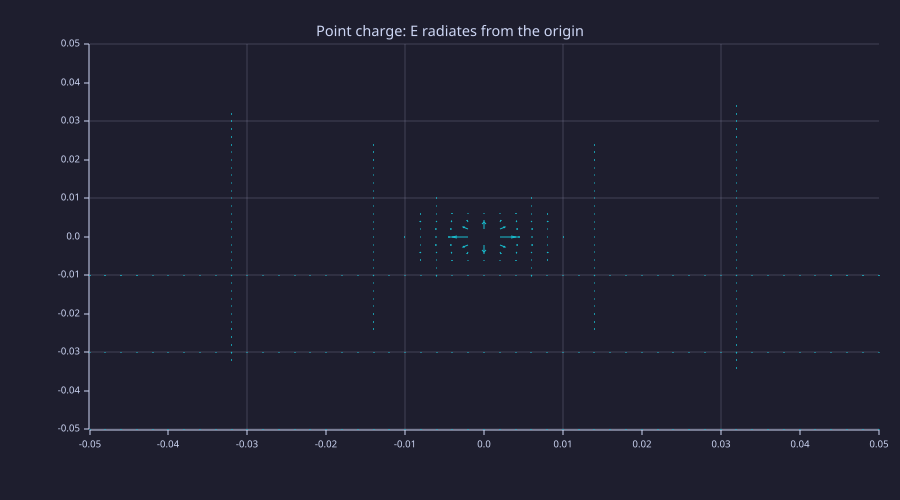
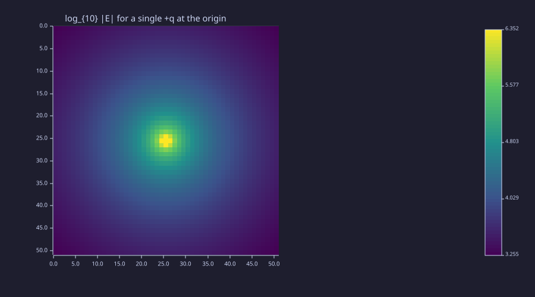
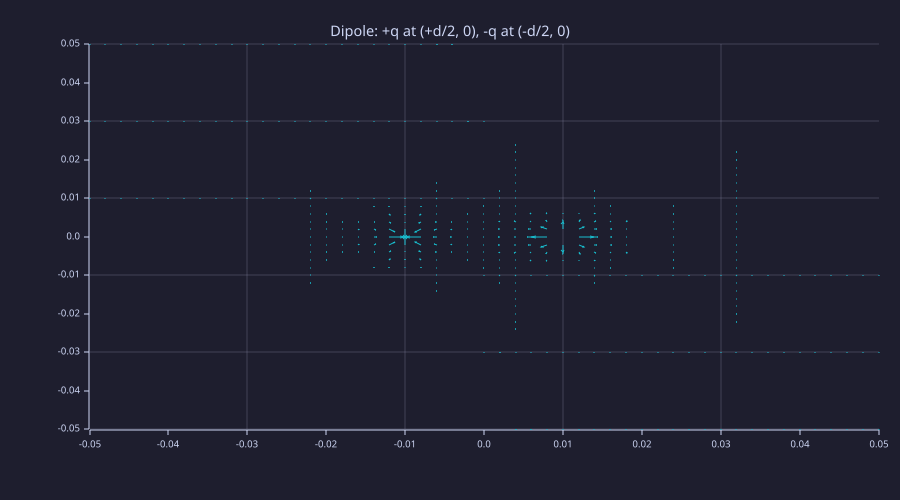
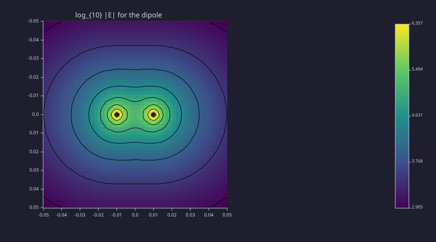
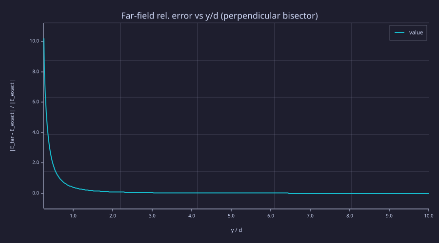
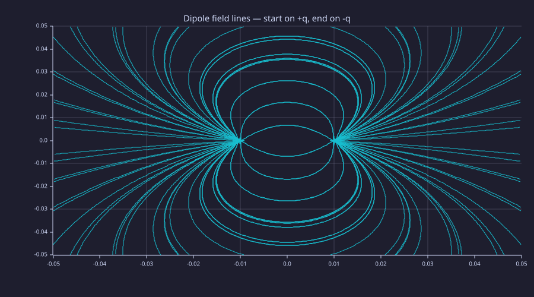
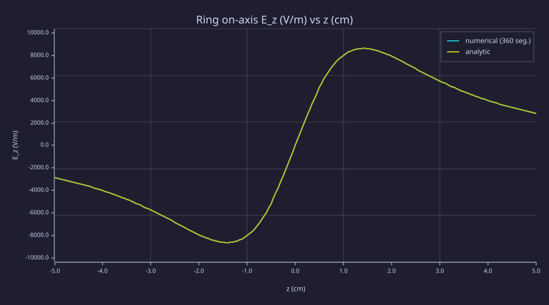

<!-- Generated by rustlab-notebook — do not edit directly. -->

# Lesson 02: Electrostatics & Coulomb's Law

The first physics lesson. The electric field is defined operationally — drop a tiny test charge, measure the force per unit charge — and Coulomb's inverse-square law tells us how a stationary charge produces it. Everything else in static electricity is *superposition*: the field of $N$ charges is the sum of $N$ single-charge fields. We compute that sum on a grid, look at what comes out, and meet our first far-field approximation along the way.

## Learning Objectives

- Compute $\vec E$ from an arbitrary set of point charges by direct superposition on a grid
- Visualize fields as quiver plots, log-magnitude heatmaps, and streamlines
- Derive and verify the dipole far-field formula $\vec E_{\rm dip} \propto (3(\vec p\cdot\hat r)\hat r - \vec p)/r^3$
- Use symmetry to reduce a continuous charge distribution (a ring) to a 1-D integral

## Background

Lesson 01 (gradient, divergence, curl, meshgrid). Coordinates and superposition in 3-D space. The notion of a vector field as something defined at every point.

## Coulomb's Law and Superposition

A point charge $q$ at position $\vec r_0$ produces the field

$$\vec E(\vec r) = \frac{1}{4\pi\varepsilon_0}\,\frac{q\,(\vec r - \vec r_0)}{\,|\vec r - \vec r_0|^3\,},\qquad k_e \equiv \frac{1}{4\pi\varepsilon_0} \approx 8.9875\times10^{9}\,\text{N}\cdot\text{m}^2/\text{C}^2.$$

The field of $N$ charges is the sum of $N$ such terms — there is no nonlinear interaction:

$$\vec E(\vec r) = k_e\sum_{i=1}^{N}\frac{q_i\,(\vec r - \vec r_i)}{\,|\vec r - \vec r_i|^3\,}.$$

This is *the* defining computation of electrostatics. Every analytic result (Gauss's law, the potential, multipole expansions) and every numerical solver (FDFD, FDTD) is a smarter way of evaluating an integral that is, fundamentally, this sum.

**Units.** SI throughout: charges in coulombs (C), positions in metres (m), $\vec E$ in volts per metre (V/m). For the rest of this lesson we use $q = 1$ nC and characteristic length $d = 2$ cm — domestic-scale numbers that put $|\vec E|$ in the thousands of V/m, well clear of the $10^{-12}$ noise floor of double precision.

## Setting Up the Grid

### Theory

A 51×51 grid spanning $[-5\,\text{cm},\,5\,\text{cm}]^2$ at spacing $\Delta = 2$ mm comfortably resolves the field around a $\pm q$ pair separated by $d = 2$ cm. Charges sitting on grid lines produce a singular cell each — we add a tiny floor ($10^{-12}\ \text{m}^2$) to $r^2$ before raising it to the $3/2$ power so divisions stay finite, and the singular cell ends up with a huge but finite value that quiver and `imagesc` simply clip visually.

### Example — A 51×51 grid spanning ±5 cm

```rustlab
ke    = 8.9875e9;             % N·m²/C²
q     = 1e-9;                 % 1 nC
d     = 0.02;                 % 2 cm dipole separation
L     = 0.05;                 % half-domain (m)
N     = 51;
xs    = linspace(-L, L, N);
ys    = linspace(-L, L, N);
[X, Y] = meshgrid(xs, ys);
dx    = xs(2) - xs(1);
print(dx)                     % 0.002 m
print(size(X))                % [51, 51]
```

<!-- rustlab:output-start -->
```text
0.0020000000000000018
[1×2]  51.000000  51.000000
```

<!-- rustlab:output-end -->

The origin is at index $(26, 26)$; the points $(\pm d/2, 0)$ are at columns $21$ and $31$ on row $26$.

## A Single Point Charge

### Theory

Place $q$ at the origin and evaluate $\vec E = k_e q\,\vec r/|\vec r|^3$ on every grid cell. The field points radially outward with magnitude $|\vec E| = k_e q/r^2$. At $r = 1$ cm — index $(26, 31)$ on our grid — the analytic value is $k_e q/r^2 = 8.9875\times10^{9}\cdot 10^{-9}/(0.01)^2 = 89{,}875$ V/m.

### Example — Numerical $\vec E$ at sample points

The `1e-12` m² floor added to $r^2$ keeps the origin cell finite. Outside that one pixel it perturbs the field by a relative $\sim 1.5\times10^{-12}/r^2$ — about $1.5\times10^{-8}$ at $r = 1$ cm — nothing to do with stencil error since this is an explicit closed-form evaluation, not finite differences.

```rustlab
Rx = X;
Ry = Y;
r3 = (Rx .^ 2 + Ry .^ 2 + 1e-12) .^ 1.5;

Ex_pt = ke * q * Rx ./ r3;
Ey_pt = ke * q * Ry ./ r3;

% Matrix `./` in rustlab keeps a complex storage type with imag part at
% float-precision noise level (~1e-11 relative). Wrap scalar prints with
% real() to suppress that noise; plotting calls handle complex matrices natively.
print(real(Ex_pt(26, 31)))    % at (x=0.01, y=0):    ≈ 89875 V/m
print(real(Ey_pt(26, 31)))    % ≈ 0  by symmetry
print(real(Ex_pt(31, 26)))    % at (x=0, y=0.01):    ≈ 0
print(real(Ey_pt(31, 26)))    % ≈ 89875 V/m
```

<!-- rustlab:output-start -->
```text
89874.99865187514
0
0
89874.99865187514
```

<!-- rustlab:output-end -->

### Example — Quiver of the radial field

Arrows point outward from the singular center; lengths fall off like $1/r^2$. The auto-scale is dominated by the large near-origin values, so far-out arrows look short — that is correct, not a bug.

```rustlab
clf;
quiver(X, Y, Ex_pt, Ey_pt, "Point charge:  E radiates from the origin")
```

<!-- rustlab:output-start -->


<!-- rustlab:output-end -->

### Example — log$_{10}|\vec E|$ heatmap

A linear heatmap is dominated by the singular pixel; in log space the falloff is visible as concentric rings.

```rustlab
clf;
Emag = sqrt(Ex_pt .* Ex_pt + Ey_pt .* Ey_pt);
imagesc(log10(Emag), "viridis");
title("log_{10} |E|  for a single +q at the origin")
```

<!-- rustlab:output-start -->


<!-- rustlab:output-end -->

## The Electric Dipole — Direct Superposition

### Theory

Place $+q$ at $(+d/2, 0)$ and $-q$ at $(-d/2, 0)$. The dipole moment $\vec p = q\,d\,\hat x$ has magnitude $p = qd = 10^{-9} \cdot 0.02 = 2\times10^{-11}$ C·m. Add the two single-charge fields cell-by-cell. Two symmetries follow immediately:

- On the $y$-axis (the perpendicular bisector), $E_y = 0$ — vertical components from the two charges cancel.
- On the $x$-axis between the charges, $E_y = 0$ — both charges sit on this axis.

At the midpoint $(0, 0)$ both charges push a positive test charge the *same* way, along $-\hat x$; the field is $\vec E(0,0) = -8 k_e q / d^2\,\hat x \approx -179{,}750$ V/m for our numbers.

### Example — Build $E_x$, $E_y$ from a charges table

Holding charges in a small `[q, x, y]` table makes it trivial to extend to quadrupoles, lines, or rings later in the lesson.

```rustlab
charges = [  q,  d/2, 0;
            -q, -d/2, 0 ];

Ex = zeros(size(X));
Ey = zeros(size(X));
for k = 1:2
  qk = charges(k, 1);
  xk = charges(k, 2);
  yk = charges(k, 3);
  rx = X - xk;
  ry = Y - yk;
  r3 = (rx .^ 2 + ry .^ 2 + 1e-12) .^ 1.5;
  Ex += ke * qk * rx ./ r3;
  Ey += ke * qk * ry ./ r3;
end

print(real(Ex(26, 26)))       % midpoint:  ≈ -179750 V/m
print(real(Ey(26, 26)))       % ≈ 0
print(real(Ey(36, 26)))       % on y-axis at y=0.02: ≈ 0
```

<!-- rustlab:output-start -->
```text
-179749.99730375005
0
0
```

<!-- rustlab:output-end -->

### Example — Quiver of the dipole field

Arrows curve from $+q$ to $-q$ — the canonical dipole shape.

```rustlab
clf;
quiver(X, Y, Ex, Ey, "Dipole:  +q at (+d/2, 0),  -q at (-d/2, 0)")
```

<!-- rustlab:output-start -->


<!-- rustlab:output-end -->

### Example — log$_{10}|\vec E|$ heatmap with contours

Two bright cores at the charges, a dark ring along the perpendicular bisector where the components partially cancel, and a smooth $1/r^3$ falloff everywhere else.

```rustlab
clf;
hold on;
Emag_dip = sqrt(Ex .* Ex + Ey .* Ey);
imagesc(log10(Emag_dip), "viridis");
contour(X, Y, log10(Emag_dip), 8, "k");
title("log_{10} |E|  for the dipole");
hold off;
```

<!-- rustlab:output-start -->


<!-- rustlab:output-end -->

## The Far-Field Dipole Formula

### Theory

For $r \gg d$ the two single-charge $1/r^2$ fields cancel to leading order; what survives is a $1/r^3$ tail with a specific angular shape. The cleanest route is through the potential. With $+q$ at $+\tfrac{d}{2}\hat x$ and $-q$ at $-\tfrac{d}{2}\hat x$, the distances from the two charges to a field point at $(r, \theta)$ — with $r$ measured from the dipole centre and $\theta$ from the $x$-axis — are $r_\pm \approx r \mp \tfrac{d}{2}\cos\theta$ to first order in $d/r$. Hence

$$V = k_e q\left(\frac{1}{r_+} - \frac{1}{r_-}\right) \approx k_e q\,\frac{r_- - r_+}{r^2} = \frac{k_e\,q d\cos\theta}{r^2} = \frac{k_e\,\vec p\cdot\hat r}{r^2},\qquad \vec p = q d\,\hat x.$$

Taking $\vec E = -\nabla V$ of this $1/r^2$ potential then gives

$$\boxed{\vec E_{\rm dip}(\vec r) = \frac{1}{4\pi\varepsilon_0}\,\frac{3(\vec p\cdot\hat r)\hat r - \vec p}{r^3}.}$$

For $\vec p = p\,\hat x$ in the plane this reads

$$E_x^{\rm dip} = k_e\,p\,\frac{2x^2 - y^2}{r^5},\qquad E_y^{\rm dip} = k_e\,p\,\frac{3xy}{r^5}.$$

This is the prototype for *every* multipole expansion in the rest of the course. The same template — leading exact behavior + leading correction in a small parameter — drives radiation theory in Lesson 12 and antenna analysis in Lesson 13.

### Example — Far-field formula on the same grid

```rustlab
p   = q * d;                  % 2e-11 C·m
r2  = X .^ 2 + Y .^ 2 + 1e-12;
r5  = r2 .^ 2.5;
Exd = ke * p * (2 * X .^ 2 - Y .^ 2) ./ r5;
Eyd = ke * p * (3 * X .* Y)            ./ r5;

print(real(Exd(26, 36)))      % at (0.02, 0):  ≈ 44937 V/m  (= 2 k_e p / x³)
print(real(Eyd(26, 36)))      % ≈ 0  on the dipole axis
```

<!-- rustlab:output-start -->
```text
44937.49971914061
0
```

<!-- rustlab:output-end -->

### Example — Exact vs far-field along the perpendicular bisector

Walk along $y$ at $x = 0$ (the perpendicular bisector, where the formulas are easiest to compare) and plot the relative error of $E_x^{\rm dip}$ against the exact superposition. The error falls like $(d/r)^2$ — the next term in the multipole expansion.

```rustlab
clf;
ys_line = linspace(0.005, 0.20, 400);
Ex_exact = -2 * ke * q * (d / 2) ./ ((ys_line .^ 2 + (d / 2) ^ 2) .^ 1.5);
Ex_far   = -ke * p ./ (ys_line .^ 3);
rel_err  = abs(Ex_far - Ex_exact) ./ abs(Ex_exact);
plot(ys_line / d, rel_err, "Far-field rel. error vs y/d  (perpendicular bisector)");
xlabel("y / d");
ylabel("|E_far - E_exact| / |E_exact|")
```

<!-- rustlab:output-start -->


<!-- rustlab:output-end -->

At $y/d = 5$ the error is already $\approx 1.5\%$; at $y/d = 10$ it has fallen to $\sim 0.4$ % — the multipole expansion's leading correction goes like $(d/r)^2$, so doubling the distance shrinks the error fourfold.

## Field Lines via Streamlines

### Theory

A *field line* is a curve everywhere tangent to $\vec E$. Two rules: lines start on positive charges and end on negative ones (or run to infinity), and the line density is proportional to $|\vec E|$. `streamplot` integrates the differential equation $d\vec r/ds = \vec E(\vec r)/|\vec E|$ from a grid of seed points using RK4; the result is a clean visual of the dipole's bipolar topology. One caveat: because the seed points are uniformly spaced, the density of *plotted* lines does not encode $|\vec E|$ — only an ideal field-line diagram has that property (a 3-D property that no flat 2-D drawing of a 3-D field can encode exactly — and streamplot's uniform seeding doesn't try).

### Example — Streamlines of the dipole

```rustlab
clf;
streamplot(X, Y, Ex, Ey, "Dipole field lines  —  start on +q, end on -q")
```

<!-- rustlab:output-start -->


<!-- rustlab:output-end -->

## A Ring of Charge — Symmetry as a Tool

### Theory

A ring of total charge $Q$ and radius $R$ in the $xy$-plane, centered at the origin, produces (on its symmetry axis) a field with only a $z$-component:

$$E_z(z) = \frac{1}{4\pi\varepsilon_0}\,\frac{Q\,z}{(z^2 + R^2)^{3/2}}.$$

The transverse components vanish by symmetry — every infinitesimal $dq$ on one side of the ring is matched by an equal $dq$ on the diametrically opposite side. The on-axis maximum sits at $z = R/\sqrt 2$, where $|E_z|$ peaks at $k_e Q/(R^2\,\sqrt 2\,(3/2)^{3/2}) \approx k_e Q/(2.598\,R^2)$. With $Q = 1$ nC and $R = 2$ cm that is $\approx 8{,}648$ V/m.

### Example — Numerical integration around the ring

Discretize the ring into $N_\phi$ segments at $\phi_k = 2\pi k/N_\phi$. Each carries $dq = Q/N_\phi$ at $(R\cos\phi_k, R\sin\phi_k, 0)$. For an axial test point $(0,0,z)$ the segment-to-test displacement is $(-R\cos\phi_k, -R\sin\phi_k, z)$; only the $z$-components survive the sum.

```rustlab
R     = 0.02;
Q     = 1e-9;
Nseg  = 360;
phi   = linspace(0, 2 * pi, Nseg + 1);
phi   = phi(1 : Nseg);
zs    = linspace(-0.05, 0.05, 201);

Ez_num     = zeros(length(zs));
seg_charge = Q / Nseg;
for k = 1:Nseg
  xk = R * cos(phi(k));
  yk = R * sin(phi(k));
  rseg3 = (xk * xk + yk * yk + zs .^ 2) .^ 1.5;
  Ez_num += ke * seg_charge * zs ./ rseg3;
end

Ez_ana = ke * Q * zs ./ ((R * R + zs .^ 2) .^ 1.5);

err = max(abs(Ez_num - Ez_ana));
print(err)                    % ≈ 1e-10 V/m (machine precision — exact for any Nseg on-axis; segment count matters only off-axis, cf. Ex. 4)
```

<!-- rustlab:output-start -->
```text
0.0000000000836735125631094
```

<!-- rustlab:output-end -->

### Example — Axial $E_z$ vs $z$

Numerical and analytic curves overlay to plotting precision. The two extrema sit at $z = \pm R/\sqrt 2 \approx \pm 1.41$ cm.

```rustlab
clf;
hold on;
plot(zs * 100, Ez_num, "Ring on-axis E_z  (V/m)  vs z (cm)");
plot(zs * 100, Ez_ana);
hold off;
xlabel("z (cm)");
ylabel("E_z (V/m)");
legend("numerical (360 seg.)", "analytic")
```

<!-- rustlab:output-start -->


<!-- rustlab:output-end -->

## Standalone Scripts

Three rustlab scripts in `lessons/02-electrostatics-coulomb/` reproduce the above as standalone programs:

| Script | What it computes |
|---|---|
| `point_charges.rlab` | Dipole and quadrupole quiver + log-magnitude heatmaps |
| `dipole_field.rlab` | Exact superposition vs the far-field formula; relative error vs $r/d$ |
| `ring_of_charge.rlab` | Numerical Coulomb integral around a charged ring; closed-form check |

Run all three with `make lesson-02` from the repo root, or one at a time via `rustlab run lessons/02-electrostatics-coulomb/<name>.rlab`. SVGs land next to each script and are gitignored.

## Expected Numerical Outputs Summary

| Variable | Expected Value |
|---|---|
| `dx` | `0.002` (m) |
| `size(X)` | `[51, 51]` |
| `Ex_pt(26, 31)` | ≈ 89875 V/m  (at $r = 1$ cm: $k_e q/r^2$) |
| `Ey_pt(26, 31)` | ≈ 0 |
| `Ex(26, 26)` (dipole midpoint) | ≈ −179750 V/m |
| `Ey(26, 26)` | ≈ 0 |
| `Exd(26, 36)` (far-field on axis) | ≈ 44937 V/m |
| `Eyd(26, 36)` | ≈ 0 |
| `err` (ring numerical–analytic max) | ≈ 1e-10 V/m (machine precision — exact for any $N_{\rm seg}$ on-axis; segment count matters only off-axis, cf. Exercise 4) |

## Exercises

1. **Quadrupole.** Add four charges to the `charges` table — $+q$ at $(\pm d, 0)$ and $-q$ at $(0, \pm d)$ — and re-plot the quiver and log-magnitude heatmap. Sketch the field lines you expect *before* running streamplot, then confirm.
2. **Far-field along the dipole axis.** Repeat the relative-error plot along the dipole axis ($y = 0$, $x > d/2$) instead of the perpendicular bisector. The leading correction has the same $(d/r)^2$ scaling but a different prefactor — recover it from the truncated multipole expansion.
3. **Line of charge.** Replace the ring with a finite line $-L/2 \le x' \le L/2$ at $y = 0$, $z = 0$, total charge $Q$. Compute $E_z$ on the perpendicular axis $(0, 0, z)$ by 1-D quadrature. Check the limits: $L \to 0$ should reproduce a point charge; $L \to \infty$ should give the infinite-line result $E_\rho = \lambda/(2\pi\varepsilon_0\rho)$ from Gauss's law (Lesson 03).
4. **Ring with off-axis test point.** Compute $\vec E$ at a point in the ring's plane but outside the ring, e.g. $(2R, 0, 0)$. The transverse components no longer cancel — get them right by numerical integration and compare to a perturbative expansion in $R/r$.
5. **Energy in the dipole.** Compute the electrostatic energy $U = \tfrac12\varepsilon_0\int|\vec E|^2\,dV$ on the grid (use `trapz` twice). Then refine the grid at fixed $d$ and confirm $U$ grows without bound — the cells nearest each charge carry an unphysical *self-energy* that diverges with resolution, a Lesson 03 reminder that point charges have infinite field energy. For a sharper exercise, isolate the *interaction* energy — the cross term $\varepsilon_0\iint\vec E_1\cdot\vec E_2\,dA$ of the two single-charge fields, with the cells within a few $\Delta$ of each charge masked out to suppress the divergent self-energy — and confirm it converges to $-k_e q^2/d^2$ (in J/m: the in-plane slice of the 3-D $-k_e q^2/d$ interaction law), negative and growing in magnitude as $d$ shrinks.

## What's next

Lesson 03 introduces *Gauss's law* — the integral statement that the total flux of $\vec E$ through any closed surface equals the enclosed charge over $\varepsilon_0$ — and its differential form $\nabla\cdot\vec E = \rho/\varepsilon_0$. Symmetry then collapses the multi-charge sum we struggled with here into one-line analytic expressions for spherical, cylindrical, and planar charge distributions. Along the way we introduce the *electric potential* $V$, a scalar field whose gradient gives back $\vec E = -\nabla V$, and verify it numerically with the Lesson 01 `gradient` operator.
