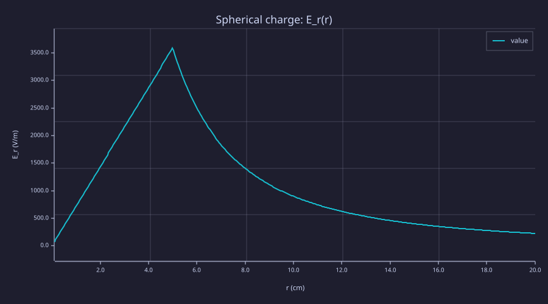
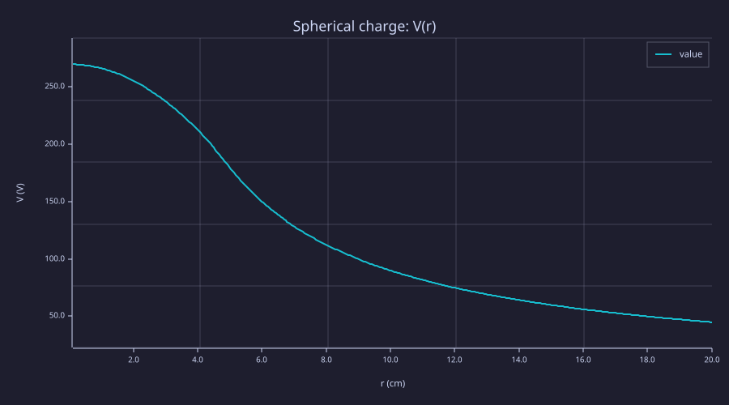
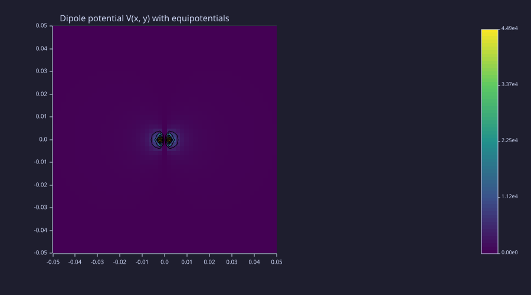
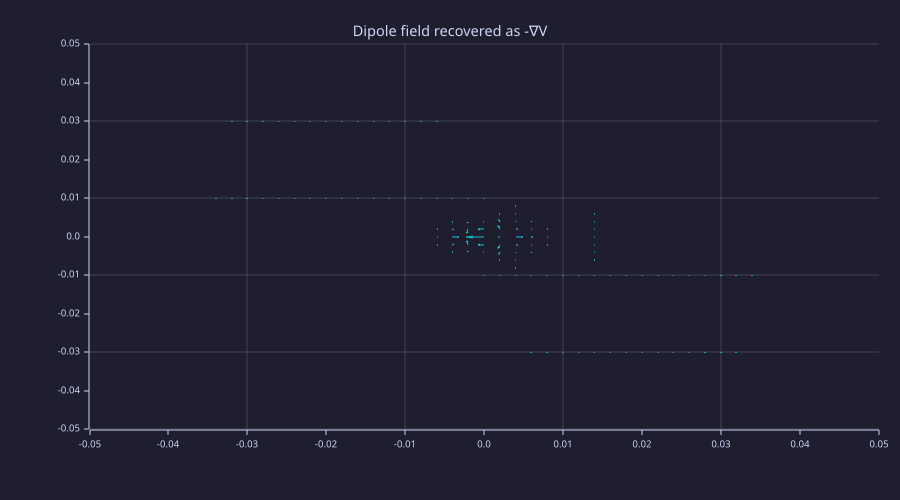
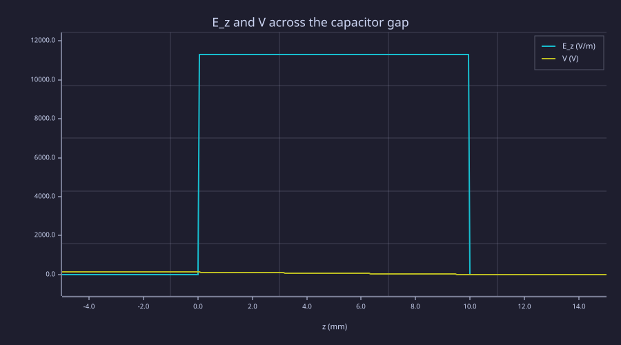

<!-- Generated by rustlab-notebook — do not edit directly. -->

# Lesson 03: Gauss's Law & Electric Potential

Lesson 02 added charges one by one. Most real distributions have so many charges that direct summation is hopeless — but they often have *symmetry*, and Gauss's law turns symmetry into a one-line answer. The same lesson introduces the *electric potential* $V$, a scalar field whose gradient gives back $\vec E$. Replacing a vector calculation with a scalar one is the single biggest simplification in static electromagnetism.

## Learning Objectives

- State Gauss's law in both integral $\oint\vec E\cdot d\vec A = Q_{\rm enc}/\varepsilon_0$ and differential $\nabla\cdot\vec E = \rho/\varepsilon_0$ forms
- Use spherical, cylindrical, and planar symmetry to derive $\vec E$ from charge distributions in closed form
- Compute $V(\vec r) = (4\pi\varepsilon_0)^{-1}\!\sum_i q_i/|\vec r - \vec r_i|$ on a grid and recover $\vec E = -\nabla V$ numerically
- Plot equipotential contours overlaid on the field, and recognize that field lines cross equipotentials at right angles

## Background

Lessons 01 (gradient, divergence) and 02 (superposition, dipole). Familiarity with surface and volume integrals.

## Gauss's Law and the Electric Potential

Three statements that together replace the multi-charge sum from Lesson 02 with much simpler computations whenever the charge distribution has any symmetry.

**Integral form.** For any closed surface $\partial V$,

$$\oint_{\partial V}\vec E\cdot d\vec A = \frac{Q_{\rm enc}}{\varepsilon_0}.$$

The total flux of $\vec E$ through a closed surface equals the charge inside divided by $\varepsilon_0$. This is Lesson 01's divergence theorem applied to Coulomb's law.

**Differential form.** In any region where $\rho$ is well-defined,

$$\nabla\cdot\vec E = \frac{\rho}{\varepsilon_0}.$$

Field lines begin on positive charge density and end on negative — exactly the geometric content of Lesson 01's "divergence as source density."

**Electric potential.** Because $\nabla\times\vec E = 0$ in electrostatics, $\vec E$ is the gradient of a scalar:

$$V(\vec r) = \frac{1}{4\pi\varepsilon_0}\sum_i\frac{q_i}{|\vec r - \vec r_i|},\qquad \vec E(\vec r) = -\nabla V(\vec r).$$

The integration constant is fixed by the convention $V(\infty) = 0$ for localized charges. Equipotential surfaces are level sets of $V$; field lines are perpendicular to them.

**Why a scalar wins.** $V$ has one component, satisfies a single Poisson equation $\nabla^2 V = -\rho/\varepsilon_0$, and superposes by ordinary addition. Solving for $V$ and differentiating is almost always easier than solving for $\vec E$ directly — Lessons 05–06 build the entire static-PDE machinery around exactly this swap.

## Uniform Spherical Charge

### Theory

Take a ball of radius $R$ with uniform volume charge density $\rho_0$, total charge $Q = \tfrac{4}{3}\pi R^3\rho_0$. Spherical symmetry forces $\vec E = E_r(r)\hat r$ — only the radial component can be nonzero, and it depends only on $r$. Pick a Gaussian sphere of radius $r$ centered on the ball:

$$\oint\vec E\cdot d\vec A = E_r(r)\cdot 4\pi r^2 = \frac{Q_{\rm enc}(r)}{\varepsilon_0}.$$

Inside ($r < R$), $Q_{\rm enc}(r) = Q\,(r/R)^3$; outside, $Q_{\rm enc} = Q$. So

$$E_r(r) = \begin{cases}\dfrac{k_e Q\,r}{R^3} & r \le R \\[6pt] \dfrac{k_e Q}{r^2} & r \ge R \end{cases}$$

with $k_e = 1/(4\pi\varepsilon_0)$. The field grows *linearly* inside the ball — the only way the divergence theorem can match a uniform interior $\rho$ — and falls off as $1/r^2$ outside, indistinguishable from a point charge at the center.

Integrating $-\nabla V = \vec E$ outward from infinity:

$$V(r) = \begin{cases}\dfrac{k_e Q}{2 R^3}\bigl(3R^2 - r^2\bigr) & r \le R \\[6pt] \dfrac{k_e Q}{r} & r \ge R \end{cases}$$

Both branches agree at $r = R$ ($V = k_e Q/R$); $V$ is everywhere continuous, and so is $E_r$ — which is general: a finite volume charge density never produces a discontinuity in $E$.

### Example — $E_r(r)$ across the surface

Compute the analytic $E_r$ on a 1-D radial grid spanning inside and outside, then plot. The kink at $r = R$ is the signature of the boundary between charged and empty space.

```rustlab
ke    = 8.9875e9;
R     = 0.05;                 % sphere radius (m)
Q     = 1e-9;                 % total charge (C)
rs    = linspace(0.001, 0.20, 400);
inside  = rs <= R;
outside = rs >  R;

Er = zeros(length(rs));
for k = 1:length(rs)
  if rs(k) <= R
    Er(k) = ke * Q * rs(k) / (R * R * R);
  else
    Er(k) = ke * Q / (rs(k) * rs(k));
  end
end

print(Er(1))                            % ≈ 71.9 V/m  (linear in r near origin)
print(Er(argmin(abs(rs - R))))          % at r ≈ R:  ≈ 3586 V/m  (closed form 3595)
```

```text
71.89999999999999
3586.1701754385963
```

```rustlab
clf;
plot(rs * 100, Er, "Spherical charge: E_r(r)");
xlabel("r (cm)");
ylabel("E_r (V/m)")
```



### Example — $V(r)$ across the surface

Same grid, both potential branches:

```rustlab
V_r = zeros(length(rs));
for k = 1:length(rs)
  if rs(k) <= R
    V_r(k) = ke * Q * (3 * R * R - rs(k) * rs(k)) / (2 * R * R * R);
  else
    V_r(k) = ke * Q / rs(k);
  end
end

print(V_r(1))                 % at r ≈ 0:  V = 3 k_e Q / (2R)
print(ke * Q / R)             % surface value:  k_e Q / R
```

```text
269.58905
179.75
```

```rustlab
clf;
plot(rs * 100, V_r, "Spherical charge: V(r)");
xlabel("r (cm)");
ylabel("V (V)")
```



The interior parabola joins the exterior $1/r$ branch smoothly — both the value and the slope $-E_r$ are continuous at $r = R$.

## The Dipole Potential

### Theory

For a dipole $\vec p = q d\,\hat x$ in vacuum the potential is one scalar function

$$V_{\rm dip}(\vec r) = \frac{1}{4\pi\varepsilon_0}\frac{\vec p\cdot\hat r}{r^2} = \frac{k_e p\,\cos\theta}{r^2},$$

or in 2-D Cartesian coordinates

$$V_{\rm dip}(x, y) = \frac{k_e\,p\,x}{(x^2 + y^2)^{3/2}}.$$

Differentiating and using $\vec E = -\nabla V$ recovers the far-field formula from Lesson 02:

$$E_x = k_e p\,\frac{2x^2 - y^2}{r^5},\qquad E_y = k_e p\,\frac{3xy}{r^5}.$$

A scalar PDE, a vector field for free.

### Example — Dipole $V$ heatmap with equipotential contours

Reuse Lesson 02's grid. Equipotentials of a dipole are the classic "figure-eight rings" — closed loops surrounding each charge, separated by the perpendicular bisector $V = 0$.

```rustlab
ke    = 8.9875e9;
q     = 1e-9;
d     = 0.02;
p     = q * d;
L     = 0.05;
N     = 51;
xs    = linspace(-L, L, N);
ys    = linspace(-L, L, N);
[X, Y] = meshgrid(xs, ys);

r2  = X .^ 2 + Y .^ 2 + 1e-12;
r3  = r2 .^ 1.5;
V   = ke * p * X ./ r3;

% Bounded by ~ k_e p / dx² ≈ 45 V on this grid — no clip needed.
clf;
hold on;
imagesc(V, "viridis");
contour(X, Y, V, 12, "k");
title("Dipole potential V(x, y)  with equipotentials");
hold off;
```



### Example — $\vec E = -\nabla V$ matches direct superposition

Compute $-\nabla V$ via Lesson 01's `gradient` and plot it as a quiver overlay. It should reproduce the dipole field of Lesson 02 — same arrows, derived from a scalar potential rather than a vector sum. This is the numerical analogue of the analytic proof above.

```rustlab
dx = xs(2) - xs(1);
dy = ys(2) - ys(1);
[Vx, Vy] = gradient(V, dx, dy);
Ex_from_V = -Vx;
Ey_from_V = -Vy;

% Pick a clean test cell on the perpendicular bisector at y = 0.04 m
% (avoids the near-singular column).  Analytic far-field:  E_x = -k_e p / y³.
print(real(Ex_from_V(46, 26)))    % ≈ -2798 V/m  (analytic = -2808.59;  ~0.4% stencil error)
print(real(Ey_from_V(46, 26)))    % ≈ 0  by symmetry
```

```text
-2798.094338301234
-0
```

```rustlab
clf;
quiver(X, Y, Ex_from_V, Ey_from_V, "Dipole field recovered as -∇V")
```



The quiver is visually identical to Lesson 02's direct-superposition plot — and now we have a *scalar* recipe (compute $V$, take $-\nabla V$) that scales to $10^4$ charges as cheaply as to two.

## Parallel-Plate Capacitor in 1D

### Theory

Two large parallel plates carry surface charge densities $\pm\sigma$, separated by gap $d$. Far from the edges the field has only a $z$-component and is uniform between the plates: a Gaussian pillbox straddling one plate gives

$$E_z = \frac{\sigma}{\varepsilon_0},\qquad 0 < z < d,$$

with $E = 0$ outside (both plates' fields cancel there). The potential drops linearly across the gap:

$$V(z) = V_0\Bigl(1 - \frac{z}{d}\Bigr),\qquad V_0 = E_z\,d = \frac{\sigma d}{\varepsilon_0}.$$

The capacitance follows from $Q = CV_0$ with $Q = \sigma A$:

$$\boxed{\,C = \frac{\varepsilon_0\,A}{d}.\,}$$

This is the simplest device-level result in all of electrostatics — and the model that every other capacitor (coax, microstrip, fringe-corrected plates) refines. Lesson 05 will solve the same geometry with the finite-element machinery to recover the same $C$ inclusive of fringing.

### Example — Field, potential, and $C$ for a 1 cm × (10×10) cm² capacitor

```rustlab
eps0 = 8.8541878128e-12;       % F/m
A    = 0.01;                   % 100 cm² plate
d    = 0.01;                   % 1 cm gap
Q    = 1e-9;                   % 1 nC on the +plate

sigma = Q / A;                 % surface charge density (C/m²)
E_in  = sigma / eps0;          % uniform field between plates (V/m)
V0    = E_in * d;              % voltage across (V)
C     = eps0 * A / d;          % capacitance (F)

print(sigma)                   % 1e-7 C/m²
print(E_in)                    % ≈ 11293 V/m
print(V0)                      % ≈ 113 V
print(C)                       % ≈ 8.854e-12 F = 8.854 pF
print(Q / V0)                  % independent check:  Q/V = C
```

```text
0.00000010000000000000001
11294.090673730192
112.94090673730193
0.0000000000088541878128
0.000000000008854187812799999
```

### Example — Plot $E_z(z)$ and $V(z)$ across the gap

The field is a hard step (zero outside, uniform inside, zero outside again); the potential is a continuous piecewise-linear ramp.

```rustlab
zs    = linspace(-0.005, 0.015, 401);
Ez    = zeros(length(zs));
Vz    = zeros(length(zs));
for k = 1:length(zs)
  if zs(k) > 0 && zs(k) < d
    Ez(k) = E_in;
    Vz(k) = V0 * (1 - zs(k) / d);
  elseif zs(k) <= 0
    Vz(k) = V0;
  else
    Vz(k) = 0;
  end
end

clf;
hold on;
plot(zs * 1000, Ez, "E_z and V across the capacitor gap");
plot(zs * 1000, Vz);
hold off;
xlabel("z (mm)");
legend("E_z (V/m)", "V (V)")
```



## Numerical Verification of $\nabla\cdot\vec E = \rho/\varepsilon_0$

### Theory

A consistent check on the Lesson 02 dipole field: in the *vacuum* between the charges, $\rho = 0$, so $\nabla\cdot\vec E$ should be zero up to discretization error. Near a charge it should integrate (over a small box) to $q/\varepsilon_0$. The first half is a clean test of the differential form of Gauss's law.

### Example — $\nabla\cdot\vec E$ on the dipole grid

Recompute the dipole field exactly as in Lesson 02, take its divergence with the Lesson 01 operator, and check a vacuum cell.

```rustlab
% rebuild Ex, Ey from the dipole superposition (same as Lesson 02)
Ex = zeros(size(X));
Ey = zeros(size(X));
% +q
rx = X - d/2; ry = Y;
r3 = (rx .^ 2 + ry .^ 2 + 1e-12) .^ 1.5;
Ex += ke * q * rx ./ r3;  Ey += ke * q * ry ./ r3;
% -q
rx = X + d/2; ry = Y;
r3 = (rx .^ 2 + ry .^ 2 + 1e-12) .^ 1.5;
Ex += ke * (-q) * rx ./ r3;  Ey += ke * (-q) * ry ./ r3;

divE = divergence(Ex, Ey, dx, dy);

% Pick a non-symmetric vacuum cell so we don't see an artificial symmetry zero.
% (x, y) = (0.008, 0.028):  well outside the d=0.02 dipole, no symmetry.
print(real(divE(40, 30)))      % expect a small finite stencil-error value (V/m²)
```

```text
-106873.65130626428
```

The numerical value is *not* particularly small in absolute units (V/m² values in the $10^4$–$10^5$ range are typical here) — the central-difference stencil sees the steep $1/r^3$ dipole falloff and the leading truncation error is of order $\Delta^2\,\partial^3 E/\partial x^3$, which is sizeable when $|\vec E|/\Delta^2$ is large. Lesson 05 fixes this by solving for $V$ on a grid using the finite-difference Laplacian directly, where the discretization is *consistent with the operator*: the algebraic identity $\nabla^2 V_{\rm num} = -\rho_{\rm num}/\varepsilon_0$ is built in by construction, so vacuum cells return zero exactly under the same stencil that defines $\nabla^2$.

## Standalone Scripts

| Script | What it computes |
|---|---|
| `gauss_sphere.rlab` | $E_r(r)$ and $V(r)$ for a uniformly charged ball; piecewise plot across the surface |
| `potential_dipole.rlab` | Dipole $V$ heatmap with equipotential contours and the $-\nabla V$ quiver overlay |
| `capacitor_1d.rlab` | 1-D parallel-plate field and potential profile; capacitance $C = \varepsilon_0 A/d$ |

Run all three with `make lesson-03`, or one at a time via `rustlab run lessons/03-gauss-law-and-potential/<name>.rlab`. Each writes SVGs next to itself; artefacts are gitignored.

## Expected Numerical Outputs Summary

| Variable | Expected Value |
|---|---|
| `Er(1)` (sphere, near $r=0$) | ≈ 0 (linear in $r$) |
| `Er` at $r \approx R$ | ≈ $k_e Q / R^2$ ≈ 3595 V/m |
| `V_r(1)` (sphere, near $r=0$) | ≈ $3 k_e Q / (2R)$ ≈ 269.6 V |
| $k_e Q / R$ (sphere surface) | ≈ 179.75 V |
| `Ex_from_V(46, 26)` | ≈ −2798 V/m  (analytic far-field −2808.59; ~0.4% stencil error) |
| `Ey_from_V(46, 26)` | ≈ 0 |
| `sigma` | $10^{-7}$ C/m² |
| `E_in` | ≈ 11293 V/m |
| `V0` | ≈ 113 V |
| `C` | ≈ 8.854 pF |
| `Q / V0` | identical to `C` |
| `divE` (bulk vacuum cell) | small, $\to 0$ as the grid refines |

## Exercises

1. **Spherical shell.** Replace the uniformly charged ball with a thin shell at radius $R$ carrying total charge $Q$. Predict $E_r(r)$ and $V(r)$ from Gauss's law (zero inside, point-charge outside, $V$ constant inside) and plot both.
2. **Infinite line of charge.** Use cylindrical Gauss to derive $E_\rho = \lambda/(2\pi\varepsilon_0\rho)$. Choose $\lambda = 10^{-9}$ C/m and plot $E_\rho(\rho)$ on $\rho \in [1\,\text{mm}, 10\,\text{cm}]$. Compare against the finite-line result from Lesson 02 Exercise 3 in the limit $L \to \infty$.
3. **Capacitance of a coaxial cable.** Use Gauss's law in cylindrical symmetry to derive $C' = 2\pi\varepsilon_0/\ln(b/a)$ per unit length for a coax with inner radius $a$ and outer $b$. Tabulate $C'$ for $b/a = 2, 5, 10$.
4. **Dielectric-filled capacitor.** A linear dielectric of permittivity $\varepsilon = \varepsilon_r\varepsilon_0$ replaces vacuum between the plates. Derive $C = \varepsilon_r\varepsilon_0 A/d$ and explain why both $\vec E$ and $V_0$ drop by a factor $\varepsilon_r$ at fixed $Q$.
5. **Direct integration of $V$.** Build $V$ on the Lesson 02 grid by superposing $V_i = k_e q_i / |\vec r - \vec r_i|$ for the dipole, then call `gradient` and verify $\vec E = -\nabla V$ matches the direct superposition. (We did this for the *exact* dipole formula above; this exercise replaces that with the actual two-charge sum.)

## What's next

Lesson 04 changes the language. Until now charges were a list and the geometry was implicit — pick a formula, evaluate it. Real devices (capacitors with dielectric slabs, antennas on substrates, coax cables) are described by *spatial arrays* of $\varepsilon(x,y)$, $\mu(x,y)$, $\sigma(x,y)$ specifying the material at each grid cell. Lesson 04 builds the toolkit for turning a "drawing" — a list of geometric primitives plus material assignments — into those arrays. Every numerical solver from Lesson 05 onward consumes them directly.

