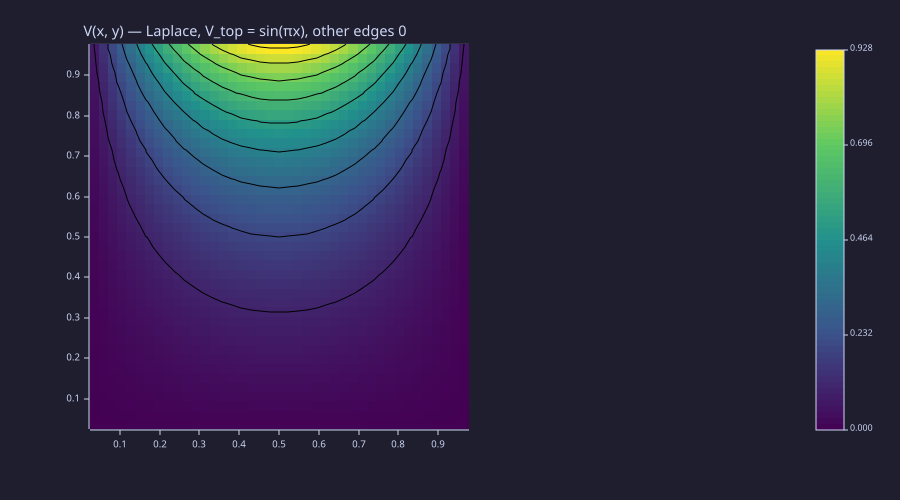
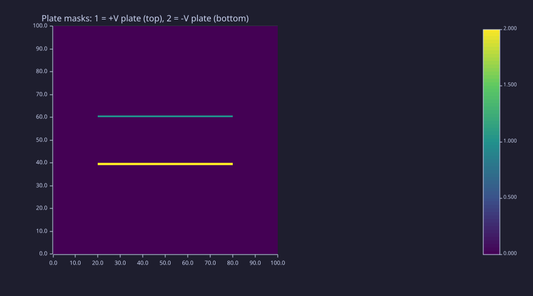
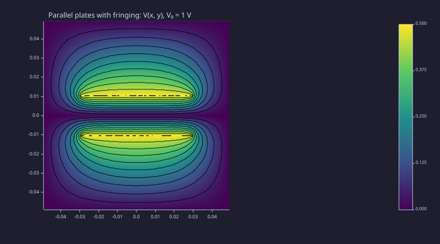
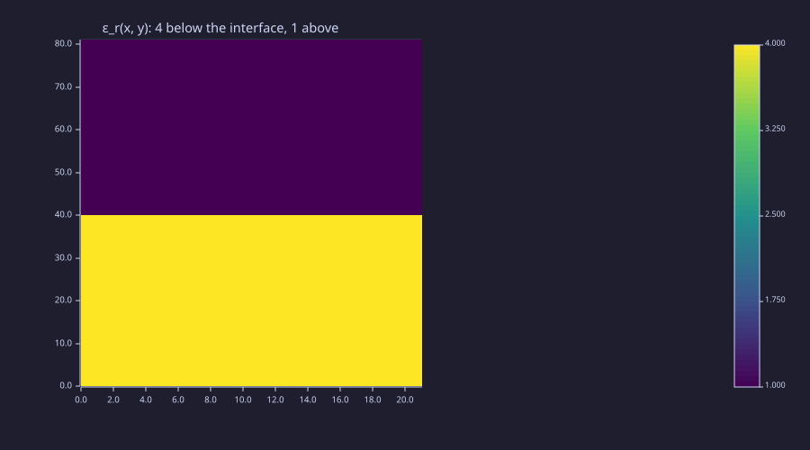
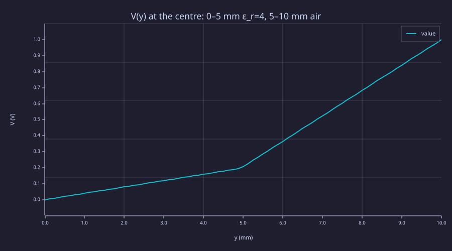
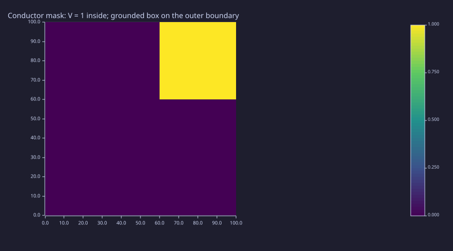
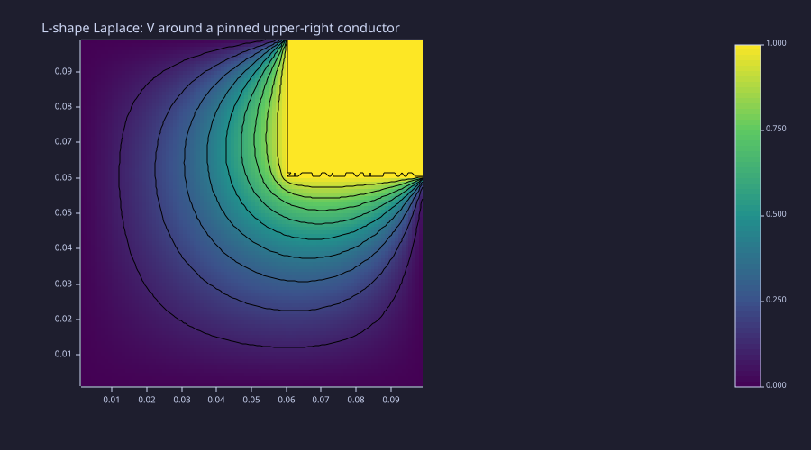
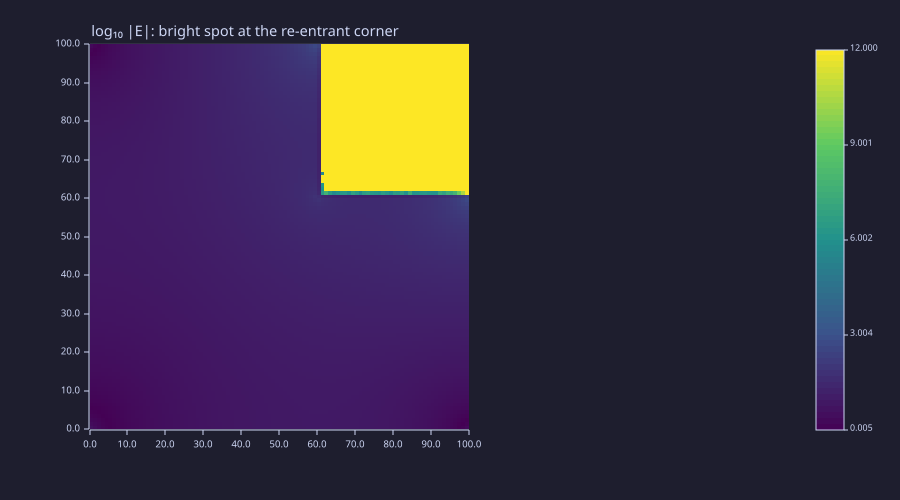

<!-- Generated by rustlab-notebook — do not edit directly. -->

# Lesson 05: Poisson & Laplace — Boundary Value Problems

The first numerical PDE in the curriculum. Lessons 01–03 evaluated closed-form formulas on a grid; Lesson 04 turned device drawings into spatial arrays. This lesson takes those arrays and *solves* a partial differential equation on them — Poisson's equation $\nabla^2 V = -\rho/\varepsilon_0$ in vacuum, and its variable-coefficient cousin $\nabla\cdot(\varepsilon\nabla V) = -\rho$ for piecewise-uniform media. Discretize, assemble a sparse matrix, hand it to `spsolve`. The same pattern returns in Lessons 06 (magnetostatics), 10 (FDFD), and 12 (modes) with different operators on top of identical machinery.

## Learning Objectives

- Derive the 5-point stencil for $\nabla^2$ from a Taylor expansion and read it as a matrix
- Set up a Poisson BVP as a sparse linear system and solve it with `spsolve`
- Encode Dirichlet boundary values and pinned-conductor cells via right-hand-side and row modifications, and use the `pin_dirichlet` builtin that packages the row-pinning
- Recognize iterative relaxation (Jacobi, Gauss-Seidel, SOR) as the historical alternative to direct solve, and the convergence-rate gap that motivates SOR
- Use `laplacian_eps_2d` to solve the variable-permittivity form on a Lesson-04 material map
- Recover capacitance from a numerical field by flux integration, and verify the series-dielectric formula
- Recognize the algebraic singularity $V \sim r^{2/3}$, $|\vec E| \sim r^{-1/3}$ at re-entrant conductor corners

## Background

Lessons 01 (gradient), 03 (potential, Gauss's law), 04 (material maps). Comfort with linear algebra — assembling and solving sparse $A\vec v = \vec b$ systems.

## The 5-Point Stencil

### Theory

The continuous Laplacian on a uniform 2-D grid spacing $h$ is approximated by central differences. Taylor-expanding $V(x \pm h, y)$ and $V(x, y \pm h)$ to fourth order and adding gives

$$\nabla^2 V(x_i, y_j) = \frac{V_{i+1,j} + V_{i-1,j} + V_{i,j+1} + V_{i,j-1} - 4\,V_{i,j}}{h^2} + O(h^2).$$

This is the **5-point stencil** — every grid cell couples only to its four nearest neighbours. The discretization error is $O(h^2)$ in the bulk, so doubling the grid resolution cuts the error by 4×.

Stacking every interior cell's equation into a system $L\vec V = \vec b$ produces a sparse $(N\!\cdot\!N)\times(N\!\cdot\!N)$ matrix with at most five non-zeros per row. The rustlab builtin `laplacian_2d(nx, ny, dx, dy)` returns exactly this $L$, with the sign convention $L \approx +\nabla^2$. For the Poisson form $\nabla^2 V = -\rho/\varepsilon_0$ the SPD-friendly assembly is $A = -L$, and the system is

$$A\vec V = \vec b, \qquad A = -L,\qquad b_{\rm flat} = \frac{\rho}{\varepsilon_0}.$$

For non-zero Dirichlet values $V=g$ on the outer boundary, the matrix as built treats the virtual cell outside the grid as $V=0$. The missing $g/h^2$ contribution moves to the right-hand side at every cell adjacent to the boundary — that's the *only* bookkeeping required.

### Example — Laplace on a unit square with $V_{\rm top} = \sin(\pi x)$

The textbook separation-of-variables problem on $[0, 1]^2$:

$$\nabla^2 V = 0, \qquad V(x, 0) = V(0, y) = V(1, y) = 0, \qquad V(x, 1) = \sin(\pi x).$$

The analytic solution is a single Fourier mode that transports the top boundary down through the box:

$$V_{\rm an}(x, y) = \sin(\pi x)\,\frac{\sinh(\pi y)}{\sinh \pi}.$$

Solve the same problem numerically with `laplacian_2d` + `spsolve`, then read off the relative error to the closed form. Use an interior-only grid: cell $(i, j)$ sits at $(x_j, y_i) = (j h, i h)$ with $h = 1/(N+1)$, so the physical boundary at $x = 0, 1$ and $y = 0, 1$ lies one cell *outside* the grid.

```rustlab
% Physics y-axis (row 0 at the bottom) for every imagesc panel in this
% notebook — matches the meshgrid layout and the contour overlays. One
% preamble call applies to every code block below.
set_default_axis("xy");

N  = 41;
h  = 1.0 / (N + 1);
xs = h * (1:N);                 % interior x positions, exclusive of boundary
ys = h * (1:N);
[X, Y] = meshgrid(xs, ys);

L = laplacian_2d(N, N, h, h);    % +∇² stencil
A = -1 * L;                      % SPD assembly for ∇²V = -ρ/ε₀

% Dirichlet RHS: only the top-row cells see a non-zero virtual neighbour.
% Each contributes +sin(πx)/h² to b (encoding the missing V_top entry).
b_bc = zeros(N, N);
for j = 1:N
  b_bc(N, j) = sin(pi * xs(j)) / (h * h);
end
b = b_bc(:).';                   % column-major flatten → row vector (.' = plain transpose)

V_flat = spsolve(A, b);
V      = reshape(V_flat, N, N);
```

```rustlab
% Compare to analytic sin(πx) sinh(πy) / sinh(π).
V_an = sin(pi * X) .* sinh(pi * Y) / sinh(pi);
err  = abs(V - V_an);
% Sample halfway down (i_mid = 20, x ≈ y ≈ 0.476)
i_mid = 20;
print(real(V(i_mid, i_mid)))         % ≈ 0.1832
print(V_an(i_mid, i_mid))            % ≈ 0.1830 — agrees to ~1 part in 10³
print(real(max(err(:))))             % ≈ 1.6e-4 — well below the (1/42)² ≈ 6e-4 bound
```

<!-- rustlab:output-start -->
```text
0.18317394238233684
0.18304604079678616
0.00016149246740576606
```

<!-- rustlab:output-end -->

The two values agree to about one part in $10^3$; the worst-case error sits comfortably under the $(1/(N+1))^2$ bound the second-order stencil promises.

```rustlab
clf;
hold on;
imagesc(real(V), "viridis");
contour(X, Y, V, 10, "k");
title("V(x, y) — Laplace, V_top = sin(πx), other edges 0");
hold off;
```

<!-- rustlab:output-start -->


<!-- rustlab:output-end -->

The contours bend smoothly from a sinusoid at the top to flat zero at the other three sides — the same picture you'd draw freehand from "harmonic functions interpolate their boundary values smoothly."

## From Iteration to Direct Solve

### Theory

Before sparse direct solvers were practical, the discrete Laplace problem was solved by iterative relaxation. Rewrite the stencil at $(i, j)$ as a fixed-point equation,

$$V_{i,j} = \tfrac14\bigl(V_{i+1,j} + V_{i-1,j} + V_{i,j+1} + V_{i,j-1}\bigr) + \tfrac{h^2}{4}\,\rho_{i,j}/\varepsilon_0,$$

and sweep across the grid updating each cell from its current neighbours. **Jacobi** uses the previous iterate's neighbours (synchronous update); **Gauss–Seidel** uses already-updated values where available (in-place update); **SOR** over-relaxes Gauss–Seidel by a factor $\omega \in (1, 2)$,

$$V_{i,j}^{(k+1)} = (1 - \omega)\,V_{i,j}^{(k)} + \omega\,V_{i,j}^{\rm GS}.$$

The convergence rate is set by the spectral radius of the iteration matrix. For a Dirichlet grid of $N$ interior cells per side (spacing $h = 1/(N+1)$):

| Method | Spectral radius | Iterations to $10^{-6}$ residual ($N=20$) |
|---|---|---|
| Jacobi | $\cos(\pi/(N+1)) \approx 1 - \tfrac{\pi^2}{2(N+1)^2}$ | $\approx 1200$ |
| Gauss–Seidel | $\cos^2(\pi/(N+1))$ | $\approx 600$ |
| SOR ($\omega_{\rm opt} = 2/(1 + \sin(\pi/(N+1)))$) | $(1-\sin(\pi/(N+1)))/(1+\sin(\pi/(N+1)))$ | $\approx 46$ |

SOR with the optimal $\omega$ is over an order of magnitude faster than Gauss–Seidel, and ~25× faster than Jacobi. But "faster" still means *iterating* until convergence; sparse direct solve via `spsolve` factors the matrix once and hands back the exact (up to round-off) answer in a single shot. For the grid sizes this lesson uses (under $200\times200$), direct solve wins outright. Iterative methods stay relevant for the truly huge problems (3-D FDTD time-stepping in Lesson 11; matrix-free Krylov methods on $10^7$-cell grids) where a full factorisation is unaffordable.

### Example — Gauss–Seidel convergence on the same Laplace problem

Run a small Gauss–Seidel solve on a 20-cell-edge problem and watch the residual against the analytic solution decay roughly geometrically.

```rustlab
M    = 20;                    % small grid for a quick demo
hM   = 1.0 / (M + 1);
xsM  = hM * (1:M);
[XM, YM] = meshgrid(xsM, xsM);
V_an_M   = sin(pi * XM) .* sinh(pi * YM) / sinh(pi);

% Use a *padded* grid so boundary values can be read like neighbours.
Vp = zeros(M + 2, M + 2);
for j = 1:M+2
  Vp(M + 2, j) = sin(pi * (j - 1) * hM);    % top boundary at y = 1
end

iters = [50, 200, 1000];
for target = iters
  Vp_run = Vp;
  for k = 1:target
    for i = 2:M+1
      for j = 2:M+1
        Vp_run(i, j) = 0.25 * (Vp_run(i+1, j) + Vp_run(i-1, j) ...
                             + Vp_run(i, j+1) + Vp_run(i, j-1));
      end
    end
  end
  % Compare against analytic on the interior.
  V_int = Vp_run(2:M+1, 2:M+1);
  err   = abs(V_int - V_an_M);
  print(real(max(err(:))))
end
```

<!-- rustlab:output-start -->
```text
0.11803579929357888
0.003492182470557742
0.0006430625831445047
```

<!-- rustlab:output-end -->

The three printed errors decay roughly an order of magnitude every ~100 iterations until the iteration floors out at the grid's $h^2$ truncation error around iteration 300: $\sim 10^{-1}$ after 50, $\sim 3\times10^{-3}$ after 200, $\sim 6\times10^{-4}$ after 1000. `spsolve` produced the same accuracy in one factorisation, taking less time than even the 50-iteration Gauss–Seidel pass. From here the rest of the lesson uses the direct solver exclusively.

## Parallel Plates with Fringing Fields

### Theory

A finite parallel-plate capacitor inside a grounded box is the simplest realistic geometry: two horizontal conducting plates of width $w$ and gap $d$, driven to fixed potentials $\pm V_0/2$, surrounded by a grounded boundary that is close enough that it still adds $\approx 10\%$ to the plate charge (a coupling term Exercise 3 separates from the genuine fringing). The 1-D limit (infinite plates) gives a uniform interior field $E_y = V_0/d$ and capacitance per unit depth $C' = \varepsilon_0 w/d$ — i.e. $\varepsilon_0/d$ per unit plate area. Real plates have **fringing** — field lines bowing outward beyond the plate edges — and the actual capacitance is always larger than the 1-D estimate.

Numerically the plates are treated as **pinned cells**: every grid cell inside a plate has its row of $A$ replaced by the identity row, with the right-hand side set to the plate's potential. The rest of the system stays untouched, and the linear solve fixes the conductor potential exactly while the surrounding Laplace problem solves around it.

### Example — Two finite plates inside a grounded box

A 100×100 grid covers a $0.10\,\text{m}\times 0.10\,\text{m}$ box. Two horizontal plates of width $w = 0.06$ m sit centred at $y = \pm d/2$ with $d = 0.02$ m, driven to $\pm 0.5$ V (so $V_0 = 1$ V).

```rustlab
clf;
nx = 100; ny = 100;
Lx = 0.10; Ly = 0.10;
dx = Lx / (nx + 1);
dy = Ly / (ny + 1);
xs = dx * (1:nx) - Lx/2;        % centred grid
ys = dy * (1:ny) - Ly/2;
[Xb, Yb] = meshgrid(xs, ys);

% Plate masks (Lesson 04 idiom)
w = 0.06; d = 0.02;
top_plate = rect_mask(Xb, Yb, -w/2,  d/2 - dy/2, w, dy);
bot_plate = rect_mask(Xb, Yb, -w/2, -d/2 - dy/2, w, dy);
imagesc(top_plate + 2 * bot_plate, "viridis");
title("Plate masks: 1 = +V plate (top), 2 = -V plate (bottom)")
```

<!-- rustlab:output-start -->


<!-- rustlab:output-end -->

Build the system, then pin the plate cells. For each plate cell at flat index $k$, zero out the four off-diagonal entries in row $k$ (one per stencil neighbour), set the diagonal to 1, and write the plate potential into $b$. The helper `ij2k(i, j, ny)` maps a grid cell $(i, j)$ to its column-major flat index $k = (j-1)\,n_y + i$ — the same layout `laplacian_2d` produces, so note the third argument is `ny`, the number of rows.

```rustlab
L = laplacian_2d(nx, ny, dx, dy);
A = -1 * L;
n = nx * ny;
b = zeros(1, n);

V_top_val =  0.5;
V_bot_val = -0.5;

% Pin every plate cell: zero its row's off-diagonals, set the diagonal
% to 1, and write the plate potential into b. Each row has at most five
% non-zero entries (4-stencil + diagonal), so the modification is local.
for i = 1:ny
  for j = 1:nx
    is_top = top_plate(i, j) > 0.5;
    is_bot = bot_plate(i, j) > 0.5;
    if is_top || is_bot
      k = ij2k(i, j, ny);
      A(k, k) = 1.0;
      if i > 1;  A(k, ij2k(i-1, j, ny)) = 0.0; end
      if i < ny; A(k, ij2k(i+1, j, ny)) = 0.0; end
      if j > 1;  A(k, ij2k(i, j-1, ny)) = 0.0; end
      if j < nx; A(k, ij2k(i, j+1, ny)) = 0.0; end
      if is_top
        b(1, k) = V_top_val;
      else
        b(1, k) = V_bot_val;
      end
    end
  end
end

V_flat = spsolve(A, b);
V      = reshape(V_flat, ny, nx);
```

That double loop is the mechanism laid bare — and it is common enough that rustlab ships it as a builtin: `[A, b] = pin_dirichlet(A, b, mask, value)` replaces every masked cell's matrix row with an identity row and writes the value into $b$, exactly what the loop above does. Having walked through the row surgery once by hand, the remaining examples in this lesson (and every later lesson) use the builtin.

```rustlab
clf;
hold on;
imagesc(real(V), "viridis");
contour(Xb, Yb, real(V), 16, "k");
title("Parallel plates with fringing: V(x, y), V₀ = 1 V");
hold off;
```

<!-- rustlab:output-start -->


<!-- rustlab:output-end -->

```rustlab
% Recover the field; the actual flux-integral C is Exercise 3.
[Vx, Vy] = gradient(real(V), dx, dy);
Ex = -Vx; Ey = -Vy;

% Mid-gap field on the plate axis (x = 0)
i_mid = ny / 2;
j_mid = nx / 2;
print(abs(real(Ey(i_mid, j_mid))))            % ≈ 48.1 V/m (snapped-gap V₀/gap; 1-D V₀/d = 50)

% Capacitance from the analytic infinite-plate formula
eps0 = 8.8541878128e-12;
C_1d = eps0 * w / d;                            % per metre depth
print(C_1d)                                     % ≈ 2.66e-11 F/m
```

<!-- rustlab:output-start -->
```text
48.08953558439116
0.0000000000265625634384
```

<!-- rustlab:output-end -->

The mid-gap field comes out near $V_0/d = 50$ V/m, but the ~4% shortfall is **plate-row grid snapping**, not physics: on this $100\times100$ grid the rows nearest $y = \pm d/2$ land at $y = \pm 0.01040$ m, so the pinned plates sit 0.02079 m apart rather than the nominal 0.02000 m, and $V_0/\text{gap} = 48.1$ V/m — exactly what the field prints. (Fringing *raises* the total capacitance; it does not lower the interior field.) The contour map shows the equipotentials curving sharply at the plate edges — that's the fringing, the visible signature of why finite plates have $C > \varepsilon_0 w/d$. (Exercise 3 walks through extracting the actual numerical $C$ via the flux integral and quantifying the fringing correction.)

## Variable Permittivity — Dielectric Slabs

### Theory

In a piecewise-uniform medium the right operator is *not* the constant-coefficient Laplacian but the flux-conservative form

$$\nabla\!\cdot\!\bigl(\varepsilon(x, y)\nabla V\bigr) = -\rho.$$

Discretising it needs an *effective* $\varepsilon$ on each half-cell face between two cells. *Any* flux-conservative choice — the arithmetic mean included — keeps the scheme conservative, so the discrete normal displacement $D_n = \varepsilon E_n$ stays continuous across the interface either way; the D-continuity check below would pass with an arithmetic mean too. What separates the choices is **accuracy**. The **harmonic mean** at half-cell faces,

$$\varepsilon_{i, j+1/2} = \frac{2\,\varepsilon_{i,j}\,\varepsilon_{i,j+1}}{\varepsilon_{i,j} + \varepsilon_{i,j+1}},$$

is the exact series composition of the two half-cells straddling the face, so it is exact for an interface that lands on a face; the arithmetic mean mis-weights the two materials and leaves an $O(h)$ error in the face flux (≈ 0.45% on this grid). The rustlab builtin `laplacian_eps_2d(eps_map, dx, dy)` uses this harmonic mean when it assembles the sparse matrix from a Lesson-04 material map. With $\varepsilon \equiv 1$ it reduces to `laplacian_2d`; with a piecewise $\varepsilon$ it produces the right operator without any user-side stencil bookkeeping.

A textbook check is the **series-dielectric capacitor**: a parallel-plate capacitor with two stacked dielectric layers (thicknesses $d_1$, $d_2$, permittivities $\varepsilon_{r1}$, $\varepsilon_{r2}$) has capacitance per unit area

$$\frac{C}{A} = \frac{\varepsilon_0}{d_1/\varepsilon_{r1} + d_2/\varepsilon_{r2}} = \varepsilon_0\,\bigl(d_1 + d_2/\varepsilon_{r2}\bigr)^{-1}\quad\text{(if $\varepsilon_{r1} = 1$)},$$

with field $E_1 / E_2 = \varepsilon_{r2}/\varepsilon_{r1}$ (stronger field in the lower-$\varepsilon$ layer) and $D_1 = D_2$ continuous across the interface.

### Example — Capacitor with $\varepsilon_r = 4$ slab filling half the gap

A 21-column × 81-row grid covers a 5 mm × 10 mm region. Bottom half ($y < 5$ mm) is filled with a dielectric of $\varepsilon_r = 4$; top half is vacuum. Plates at $y = 0$ and $y = 10$ mm are driven to $V = 0$ and $V = 1$. Side boundaries use **Neumann** ($\partial V/\partial x = 0$), which makes the bulk solution one-dimensional: the $\varepsilon_r$ map varies only with $y$, so the right physics is a pure $y$-dependence with no $x$-direction leakage. Unlike the interior-only grids earlier in this lesson, this grid *includes* the plate rows — `linspace` places nodes exactly on $y = 0$ and $y = 10$ mm — so the Dirichlet plate values are pinned as explicit matrix rows rather than folded into the right-hand side.

```rustlab
clf;
nxd = 21; nyd = 81;
Lxd = 0.005; Lyd = 0.010;             % 5 mm × 10 mm
dxd = Lxd / (nxd - 1);
dyd = Lyd / (nyd - 1);
xsd = linspace(0, Lxd, nxd);
ysd = linspace(0, Lyd, nyd);
[Xd, Yd] = meshgrid(xsd, ysd);
j_mid = (nxd + 1) / 2;                % centre column (x = 2.5 mm) — nxd = 21 → 11

% ε_r map: lower half = 4, upper half = 1.
eps_map = ones(nyd, nxd);
i_half  = sum(ysd < Lyd / 2);
eps_map(1:i_half, :) = 4.0;
imagesc(eps_map, "viridis");
title("ε_r(x, y): 4 below the interface, 1 above")
```

<!-- rustlab:output-start -->


<!-- rustlab:output-end -->

```rustlab
% Variable-coefficient stencil with Neumann sides
L_eps = laplacian_eps_2d(eps_map, dxd, dyd, "neumann");
A_d   = -1 * L_eps;
n_d   = nxd * nyd;
b_d   = zeros(1, n_d);

% Pin top row (i = nyd) to V = 1, bottom row (i = 1) to V = 0 — the same
% row-pinning the parallel-plate block spelled out by hand, now via the
% pin_dirichlet builtin.
top_row = zeros(nyd, nxd);
top_row(nyd, :) = 1.0;
bot_row = zeros(nyd, nxd);
bot_row(1, :) = 1.0;
[A_d, b_d] = pin_dirichlet(A_d, b_d, top_row, 1.0);
[A_d, b_d] = pin_dirichlet(A_d, b_d, bot_row, 0.0);

V_d_flat = spsolve(A_d, b_d);
V_d      = real(reshape(V_d_flat, nyd, nxd));
```

```rustlab
clf;
plot(ysd * 1000, V_d(:, j_mid), "V(y) at the centre: 0–5 mm ε_r=4, 5–10 mm air");
xlabel("y (mm)");
ylabel("V (V)")
```

<!-- rustlab:output-start -->


<!-- rustlab:output-end -->

The profile is piecewise linear: shallow slope through the dielectric (small $E$), four times steeper through the air (large $E$). The slopes differ by $\varepsilon_r$, exactly as the boundary condition $D_n^{\rm in} = D_n^{\rm out}$ requires.

```rustlab
% Field via -∇V on the centre column.
[Exd, Eyd] = gradient(V_d, dxd, dyd);
Eyd = -Eyd;

i_diel = 21;               % mid-dielectric (y = 2.5 mm exactly)
i_air  = 61;               % mid-air (y = 7.5 mm exactly)
print(abs(real(Eyd(i_diel, j_mid))))      % ≈ 39.7 V/m (low field in ε=4)
print(abs(real(Eyd(i_air,  j_mid))))      % ≈ 158.8 V/m (4× larger in ε=1)
print(real(Eyd(i_air, j_mid)) / real(Eyd(i_diel, j_mid)))   % → 4 exactly

% D = ε ε₀ E continuity across the interface
eps0 = 8.8541878128e-12;
D_diel = eps0 * 4.0 * real(Eyd(i_diel, j_mid));
D_air  = eps0 * 1.0 * real(Eyd(i_air,  j_mid));
print(real(D_diel))
print(real(D_air))         % same value to six+ digits → continuity verified
```

<!-- rustlab:output-start -->
```text
39.70223319860361
158.80893024390596
3.999999935759068
-0.0000000014061241173120785
-0.0000000014061240947293976
```

<!-- rustlab:output-end -->

The field jump-by-$\varepsilon_r$ and the displacement continuity both come out of the harmonic-mean stencil for free — no user-side bookkeeping at the interface. Now read off the capacitance per unit area and compare to the series-dielectric formula.

```rustlab
% Series capacitor: C/A = ε₀ / (d_air + d_diel/ε_r)
d_air  = Lyd / 2;
d_diel = Lyd / 2;
C_an   = eps0 / (d_air + d_diel / 4.0);
print(C_an)                                    % ≈ 1.42e-9 F/m²

% Numerical: surface charge at the top plate ≈ ε₀ E_air,
% total Q per unit area = σ; C/A = σ / V₀ with V₀ = 1.
sigma_top = -eps0 * real(Eyd(nyd - 1, j_mid));   % one cell below the top plate
C_num     = abs(sigma_top) / 1.0;
print(C_num)                                   % ≈ 1.406e-9 — 0.7% below C_an
```

<!-- rustlab:output-start -->
```text
0.000000001416670050048
0.0000000014061241749005557
```

<!-- rustlab:output-end -->

The 0.7% shortfall of $C_{\rm num}$ below the ideal $C_{\rm an}$ is not discretisation noise — it is the **half-cell interface offset**, and it is fully accounted for. On this 81-row grid the dielectric fills rows 1–40 (up to $y = 4.875$ mm) and air fills rows 41–81, so the harmonic-mean face that carries the interface sits at $y = 4.9375$ mm, midway between them. The *effective* dielectric layer is therefore 4.9375 mm, not the ideal 5.0 mm. Feed that thickness into the 1-D series formula and you get $E_{\rm diel} = 1/(0.0049375 + 4\times0.0050625) = 39.702$ V/m and $C/A = \varepsilon_0/(0.0050625 + 0.0049375/4) = 1.406\times10^{-9}$ F/m² — matching the printed $E_{\rm diel}$ and $C_{\rm num}$ to their full precision. Refining the grid (or landing the interface exactly on a face) shrinks the gap.

## Field Singularities at Sharp Corners

### Theory

A re-entrant conductor corner — one with interior dielectric angle $\beta > \pi$ as seen from the field side — produces a $V$ that is *not* analytic at the corner. Separation of variables in the wedge geometry gives

$$V(r, \theta) \sim r^{\pi/\beta}\,\sin\!\bigl(\pi\theta/\beta\bigr) \quad \text{as } r \to 0.$$

For $\beta = 3\pi/2$ (the L-shape's $270°$ interior corner) the leading term is $V \sim r^{2/3}$, and the field magnitude diverges as $|\vec E| = |\nabla V| \sim r^{-1/3}$. This is the textbook answer for why lightning likes lightning rods, and why high-voltage HV terminals are shaped to avoid sharp re-entrants. Numerically the singularity shows up as a fixed slope on a log-log plot of $|\vec E|$ versus distance from the corner along any ray that stays in the dielectric.

The discretisation does *not* resolve the singularity exactly — the stencil error degrades from $O(h^2)$ to $O(h^{2/3})$ near the corner — but the asymptotic exponent is still recoverable from a log-log fit, and the practical takeaway (avoid sharp re-entrants in real conductors) is robust.

### Example — Square conductor in a grounded box

Place a $40\times40$ pinned conductor at $V = 1$ in the upper-right quadrant of a $100\times100$ grounded $0.1\,\text{m}\times 0.1\,\text{m}$ box. The L-shaped Laplace domain wraps around the conductor; the inner corner of the L is the re-entrant.

```rustlab
clf;
nx2 = 100; ny2 = 100;
Lx2 = 0.10; Ly2 = 0.10;
dx2 = Lx2 / (nx2 + 1);
dy2 = Ly2 / (ny2 + 1);
xs2 = dx2 * (1:nx2);
ys2 = dy2 * (1:ny2);
[X2, Y2] = meshgrid(xs2, ys2);

% Conductor occupies the upper-right 0.04 × 0.04 m block, fixed at V=1.
% Inner corner of the L-shape sits at (x0, y0) = (0.06, 0.06).
x0 = 0.06; y0 = 0.06;
conductor = rect_mask(X2, Y2, x0, y0, 0.04, 0.04);
imagesc(conductor, "viridis");
title("Conductor mask: V = 1 inside; grounded box on the outer boundary")
```

<!-- rustlab:output-start -->


<!-- rustlab:output-end -->

```rustlab
L2 = laplacian_2d(nx2, ny2, dx2, dy2);
A2 = -1 * L2;
b2 = zeros(1, nx2 * ny2);
V_cond = 1.0;

% Pin the conductor cells to V_cond — the mask itself is the pin list.
[A2, b2] = pin_dirichlet(A2, b2, conductor, V_cond);

V2_flat = spsolve(A2, b2);
V2      = real(reshape(V2_flat, ny2, nx2));
```

```rustlab
clf;
hold on;
imagesc(V2, "viridis");
contour(X2, Y2, V2, 14, "k");
title("L-shape Laplace: V around a pinned upper-right conductor");
hold off;
```

<!-- rustlab:output-start -->


<!-- rustlab:output-end -->

```rustlab
% Field magnitude from -∇V
[Vx2, Vy2] = gradient(V2, dx2, dy2);
Emag       = sqrt(Vx2 .^ 2 + Vy2 .^ 2);

clf;
imagesc(log10(Emag + 1e-12), "viridis");
title("log₁₀ |E|: bright spot at the re-entrant corner")
```

<!-- rustlab:output-start -->


<!-- rustlab:output-end -->

The brightest pixel sits on the inner $(0.06, 0.06)$ corner — that's the singularity. To extract the exponent, sample $|\vec E|$ along the diagonal ray $r$ pointing outward from the corner into the L-shaped dielectric (lower-left direction here):

```rustlab
% Step out along the 225° diagonal (into the L-shape interior).
% The conductor's lower-left dielectric neighbour sits at (60, 60);
% step in (-1, -1) cells from there.
j0  = 60; i0 = 60;
M_r = 30;
rs = (1:M_r) * dx2 * sqrt(2.0);
Es = zeros(M_r);
for k = 1:M_r
  ic = i0 - k;
  jc = j0 - k;
  Es(k) = Emag(ic, jc);
end

% Fit log|E| vs log(r) over the small-r window (k = 2..8). At smaller k
% the central-difference gradient still feels the pinned conductor; at
% larger k the box's outer Dirichlet boundary starts to dominate.
% Hand-rolled least-squares slope: slope = (n·Σxy - Σx·Σy) / (n·Σx² - (Σx)²)
log_r = log10(rs(2:8));
log_E = log10(real(Es(2:8)));
nfit  = length(log_r);
sx    = sum(log_r);
sy    = sum(log_E);
sxy   = sum(log_r .* log_E);
sxx   = sum(log_r .^ 2);
slope = (nfit * sxy - sx * sy) / (nfit * sxx - sx * sx);
print(real(slope))                          % ≈ -0.38 (theory: -1/3 ≈ -0.333)
```

<!-- rustlab:output-start -->
```text
-0.37760395168279587
```

<!-- rustlab:output-end -->

```rustlab
clf;
loglog(rs, Es, "|E| vs r along the corner-diagonal ray");
xlabel("r (m)");
ylabel("|E| (V/m)")
```

<!-- rustlab:output-start -->


<!-- rustlab:output-end -->

The fitted slope sits in the neighbourhood of $-1/3$ — the asymptotic singularity exponent — but it is *not* a robust point estimate. It is sensitive both to the fit window and to the one-cell ambiguity in where $r = 0$ sits relative to the corner cell. Holding the cell-index window fixed, the fitted exponent actually drifts *away* from $-1/3$ as the grid refines ($\approx -0.38$ at $100^2$, $-0.32$ at $200^2$, $-0.29$ at $400^2$); holding a fixed *physical* window instead pulls it the other way (toward $\approx -0.42$), because on a finer grid that window covers a less-asymptotic range of $r$. Across $100^2$–$400^2$ grids the estimate scatters over roughly $-0.29$ to $-0.42$ around the true $-1/3$; recovering it sharply needs both $h \to 0$ *and* a window pushed to smaller physical $r$. The qualitative point — that $|\vec E|$ does diverge as $r \to 0$, with a power-law slope visible on log-log axes — is robust and is the only thing the lightning-rod argument actually needs.

## Standalone Scripts

| Script | What it solves |
|---|---|
| `laplace_2d.rlab` | Unit-square Laplace with $V_{\rm top} = \sin(\pi x)$; spsolve vs analytic |
| `iterative_solvers.rlab` | Jacobi / Gauss–Seidel / SOR convergence side by side on the same problem |
| `parallel_plate.rlab` | Two finite plates in a grounded box; pinned cells, fringing field |
| `dielectric_slab.rlab` | 1-D capacitor with $\varepsilon_r = 4$ slab; series-capacitor formula |
| `corner_singularity.rlab` | L-shape conductor; log-log fit recovers the $r^{-1/3}$ exponent |

Run all five with `make lesson-05`, or one at a time via `rustlab run lessons/05-poisson-laplace-bvp/<name>.rlab`. Each writes SVGs next to itself; artefacts are gitignored.

## Expected Numerical Outputs Summary

| Variable | Expected Value |
|---|---|
| `V(20, 20)` (Laplace, $N=41$) | $\approx 0.183$ |
| `V_an(20, 20)` | $\approx 0.183$ |
| Max error of spsolve vs analytic | $\approx 1.6\times10^{-4}$ (under $h^2$ bound) |
| Gauss–Seidel error after 50 iters | $\approx 0.12$ |
| Gauss–Seidel error after 200 iters | $\approx 3\times10^{-3}$ |
| Gauss–Seidel error after 1000 iters | $\approx 6\times10^{-4}$ (floors at $h^2$) |
| Mid-gap field (parallel plates) | $\approx 48.1$ V/m (1-D $V_0/d = 50$; the deficit is plate-row snapping, not fringing) |
| 1-D plate capacitance $C' = \varepsilon_0 w/d$ | $\approx 2.66\times10^{-11}$ F/m |
| Field in dielectric (slab problem) | $\approx 39.7$ V/m |
| Field in air (slab problem) | $\approx 158.8$ V/m (4× larger) |
| $E_{\rm air}/E_{\rm diel}$ | $4.0$ exactly (boundary condition) |
| $D = \varepsilon\varepsilon_0 E$ continuity | identical to seven digits across interface |
| Series-capacitor $C/A$ (analytic, ideal 5 mm layers) | $\approx 1.417\times10^{-9}$ F/m² |
| Numerical $C/A$ for the slab capacitor | $\approx 1.406\times10^{-9}$ F/m² — 0.7% below, set by the half-cell interface offset |
| Corner singularity slope (small-$r$ fit) | $\approx -0.38$ (theory: $-1/3$; window-sensitive) |

## Exercises

1. **Convergence study.** Solve the Laplace problem at $N \in \{20, 40, 80, 160\}$ and plot the maximum error vs $h$ on a log-log axis. Fit the slope and verify the predicted $O(h^2)$ rate of the 5-point stencil.
2. **SOR with optimal $\omega$.** Implement SOR on the 20-cell unit-square problem. Sweep $\omega$ from 1.0 to 1.95 in steps of 0.05 and plot iterations-to-$10^{-4}$ residual versus $\omega$. Verify the optimum sits near $2/(1 + \sin(\pi/(N+1)))$, where $N$ is the number of interior cells per side ($N = 20$ here, so $\omega_{\rm opt} \approx 1.741$).
3. **Capacitance of finite plates.** Take the parallel-plate result from this lesson and compute $C$ via the surface integral $C = (\varepsilon_0/V_0)\oint\!\vec E\!\cdot\!\hat n\,dA$ on a rectangle just outside the top plate. Compare to the 1-D estimate $\varepsilon_0 w/d$ and quantify the correction — expect $\approx 50$–$60\%$ above the 1-D value for this geometry, roughly $40\%$ genuine fringing (compare Palmer's formula, which gives $\approx 1.42\times$ at $w/d = 3$) plus $\approx 10\%$ from capacitive coupling to the nearby grounded box.
4. **Coaxial cable on a Cartesian grid.** Pin two concentric conductor rings at $V = 1$ and $V = 0$; verify $V(r) = \ln(b/r)/\ln(b/a)$ along a radial slice and compute the capacitance per unit length, comparing to $C' = 2\pi\varepsilon_0/\ln(b/a)$.
5. **Re-entrant angle sweep.** Modify the corner example to have an interior angle $\beta \in \{3\pi/2, 5\pi/4, 7\pi/4\}$ (the second gives slope $-1/5$ — near-flat, only weakly singular; the third gives $-3/7$ — the sharpest of the three, approaching a knife-edge). Verify the fitted slope of $|\vec E|$ vs $r$ is $\pi/\beta - 1$, and that an interior $\pi/2$ corner has $|E|$ regular (no singularity). *Hint:* the $5\pi/4$ and $7\pi/4$ wedges need 45° conductor edges, which exist on this axis-aligned grid only as a staircase — and each staircase step is locally its own 270° singular micro-corner. Build the wedge with `polygon_mask` on a finer grid, and expect noticeably noisier fits (especially the weak $-1/5$ exponent) than for the axis-aligned $3\pi/2$ case.

## What's next

Lesson 06 swaps electrostatics for magnetostatics: $\vec B = \nabla\!\times\!\vec A$ with $\nabla^2\vec A = -\mu_0\vec J$. In two dimensions with $\vec J = J_z(x,y)\hat z$ this is *the same scalar Poisson equation* solved here, with $V \to A_z$ and $\rho/\varepsilon_0 \to \mu_0 J_z$. Exactly the same `laplacian_2d` + `spsolve` pipeline reappears with a different right-hand side. For magnetic materials with piecewise $\mu_r$, the variable-coefficient form $\nabla\!\cdot\!(\mu^{-1}\nabla A_z)$ uses `laplacian_eps_2d` (passing $1/\mu$). This lesson built the machine; Lesson 06 is the first time a different physics walks through the same door.
