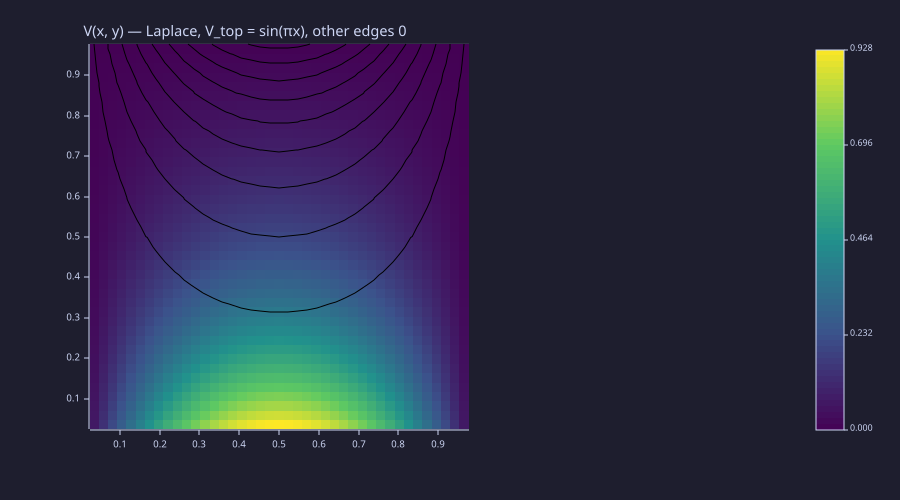
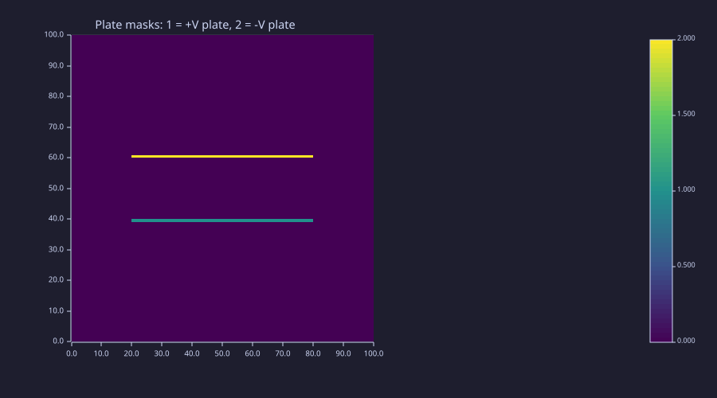
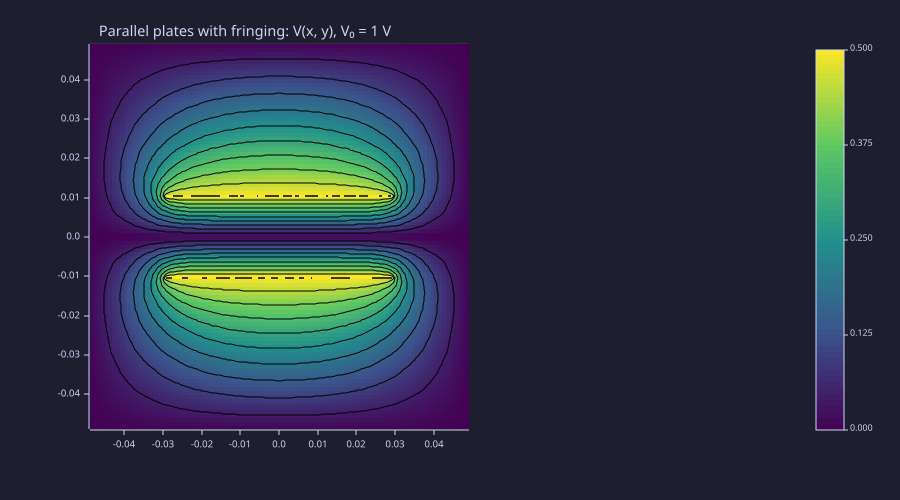
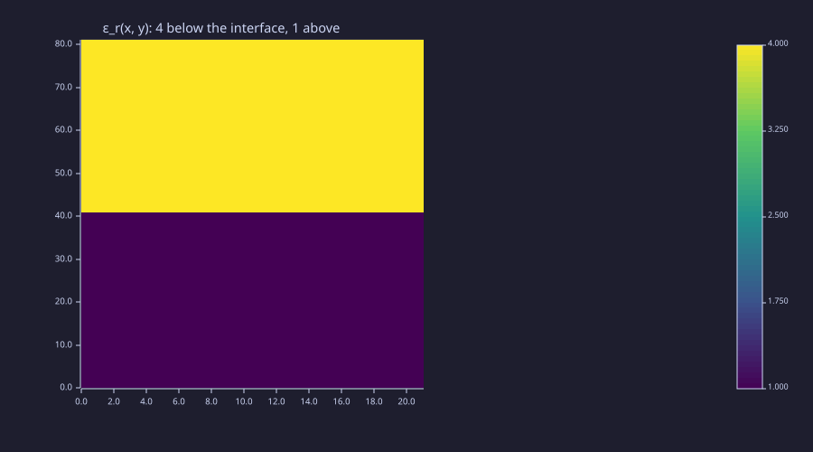
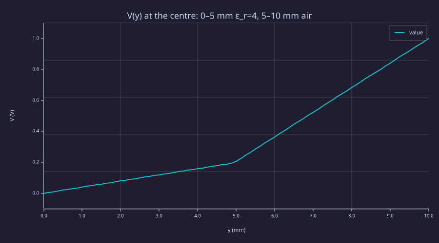
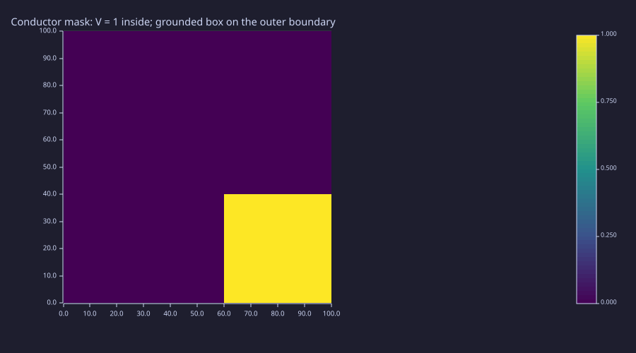
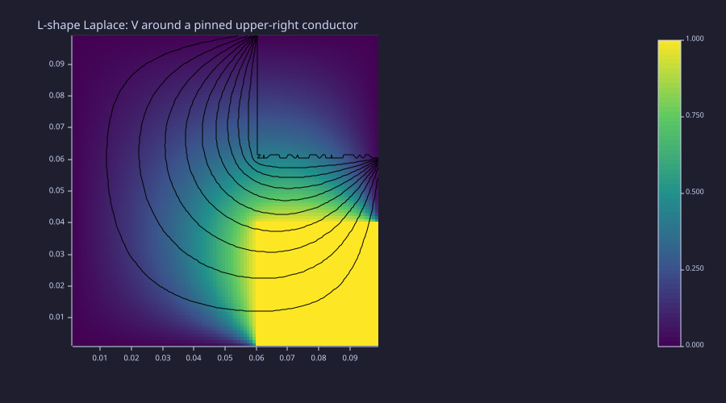
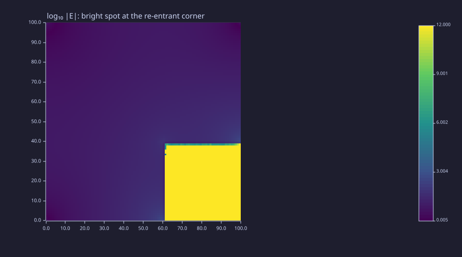
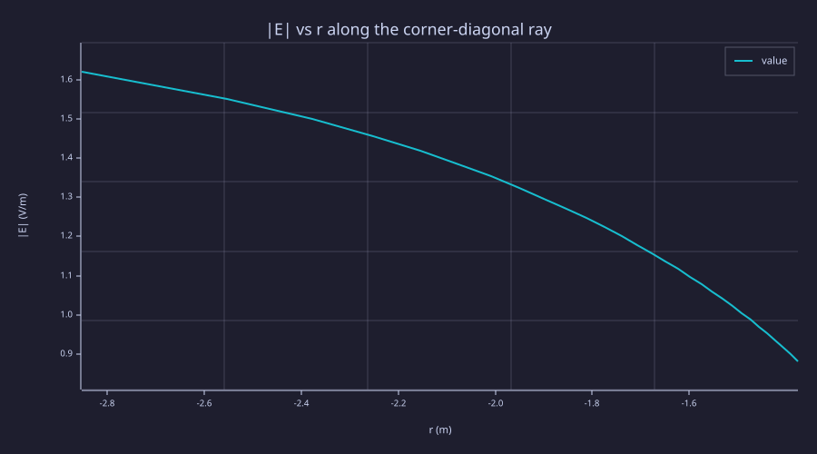

<!-- Generated by rustlab-notebook — do not edit directly. -->

# Lesson 05: Poisson & Laplace — Boundary Value Problems

The first numerical PDE in the curriculum. Lessons 01–03 evaluated closed-form formulas on a grid; Lesson 04 turned device drawings into spatial arrays. This lesson takes those arrays and *solves* a partial differential equation on them — Poisson's equation $\nabla^2 V = -\rho/\varepsilon_0$ in vacuum, and its variable-coefficient cousin $\nabla\cdot(\varepsilon\nabla V) = -\rho$ for piecewise-uniform media. Discretize, assemble a sparse matrix, hand it to `spsolve`. The same pattern returns in Lessons 06 (magnetostatics), 10 (FDFD), and 12 (modes) with different operators on top of identical machinery.

## Learning Objectives

- Derive the 5-point stencil for $\nabla^2$ from a Taylor expansion and read it as a matrix
- Set up a Poisson BVP as a sparse linear system and solve it with `spsolve`
- Encode Dirichlet boundary values and pinned-conductor cells via right-hand-side and row modifications
- Recognize iterative relaxation (Jacobi, Gauss-Seidel, SOR) as the historical alternative to direct solve, and the convergence-rate gap that motivates SOR
- Use `laplacian_eps_2d` to solve the variable-permittivity form on a Lesson-04 material map
- Recover capacitance from a numerical field by flux integration, and verify the series-dielectric formula
- Recognize the algebraic singularity $V \sim r^{2/3}$, $|\vec E| \sim r^{-1/3}$ at re-entrant conductor corners

## Background

Lessons 01 (gradient), 03 (potential, Gauss's law), 04 (material maps). Comfort with linear algebra — assembling and solving sparse $A\vec v = \vec b$ systems.

## The 5-Point Stencil

### Theory

The continuous Laplacian on a uniform 2-D grid spacing $h$ is approximated by central differences. Taylor-expanding $V(x \pm h, y)$ and $V(x, y \pm h)$ to fourth order and adding gives

$$\nabla^2 V(x_i, y_j) = \frac{V_{i+1,j} + V_{i-1,j} + V_{i,j+1} + V_{i,j-1} - 4\,V_{i,j}}{h^2} + O(h^2).$$

This is the **5-point stencil** — every grid cell couples only to its four nearest neighbours. The discretization error is $O(h^2)$ in the bulk, so doubling the grid resolution cuts the error by 4×.

Stacking every interior cell's equation into a system $L\vec V = \vec b$ produces a sparse $(N\!\cdot\!N)\times(N\!\cdot\!N)$ matrix with at most five non-zeros per row. The rustlab builtin `laplacian_2d(nx, ny, dx, dy)` returns exactly this $L$, with the sign convention $L \approx +\nabla^2$. For the Poisson form $\nabla^2 V = -\rho/\varepsilon_0$ the SPD-friendly assembly is $A = -L$, and the system is

$$A\vec V = \vec b, \qquad A = -L,\qquad b_{\rm flat} = \frac{\rho}{\varepsilon_0}.$$

For non-zero Dirichlet values $V=g$ on the outer boundary, the matrix as built treats the virtual cell outside the grid as $V=0$. The missing $g/h^2$ contribution moves to the right-hand side at every cell adjacent to the boundary — that's the *only* bookkeeping required.

### Example — Laplace on a unit square with $V_{\rm top} = \sin(\pi x)$

The textbook separation-of-variables problem on $[0, 1]^2$:

$$\nabla^2 V = 0, \qquad V(x, 0) = V(0, y) = V(1, y) = 0, \qquad V(x, 1) = \sin(\pi x).$$

The analytic solution is a single Fourier mode that transports the top boundary down through the box:

$$V_{\rm an}(x, y) = \sin(\pi x)\,\frac{\sinh(\pi y)}{\sinh \pi}.$$

Solve the same problem numerically with `laplacian_2d` + `spsolve`, then read off the relative error to the closed form. Use an interior-only grid: cell $(i, j)$ sits at $(x_j, y_i) = (j h, i h)$ with $h = 1/(N+1)$, so the physical boundary at $x = 0, 1$ and $y = 0, 1$ lies one cell *outside* the grid.

```rustlab
N  = 41;
h  = 1.0 / (N + 1);
xs = h * (1:N);                 % interior x positions, exclusive of boundary
ys = h * (1:N);
[X, Y] = meshgrid(xs, ys);

L = laplacian_2d(N, N, h, h);    % +∇² stencil
A = -1 * L;                      % SPD assembly for ∇²V = -ρ/ε₀

% Dirichlet RHS: only the top-row cells see a non-zero virtual neighbour.
% Each contributes +sin(πx)/h² to b (encoding the missing V_top entry).
b_bc = zeros(N, N);
for j = 1:N
  b_bc(N, j) = sin(pi * xs(j)) / (h * h);
end
b = b_bc(:)';                    % column-major flatten → row vector

V_flat = spsolve(A, b);
V      = reshape(V_flat, N, N);
```

```rustlab
% Compare to analytic sin(πx) sinh(πy) / sinh(π).
V_an = sin(pi * X) .* sinh(pi * Y) / sinh(pi);
err  = abs(V - V_an);
% Sample halfway down (i_mid = 20, x ≈ y ≈ 0.476)
i_mid = 20;
print(real(V(i_mid, i_mid)))         % ≈ 0.1832
print(V_an(i_mid, i_mid))            % ≈ 0.1830 — agrees to four digits
print(real(max(err(:))))             % ≈ 1.6e-4 — well below the (1/42)² ≈ 6e-4 bound
```

```text
0.18317394238233575
0.18304604079678616
0.00016149246740271295
```

The two values agree to four digits; the worst-case error sits comfortably under the $(1/(N+1))^2$ bound the second-order stencil promises.

```rustlab
clf;
hold on;
imagesc(V, "viridis");
contour(X, Y, V, 10, "k");
title("V(x, y) — Laplace, V_top = sin(πx), other edges 0");
hold off;
```



The contours bend smoothly from a sinusoid at the top to flat zero at the other three sides — the same picture you'd draw freehand from "harmonic functions interpolate their boundary values smoothly."

## From Iteration to Direct Solve

### Theory

Before sparse direct solvers were practical, the discrete Laplace problem was solved by iterative relaxation. Rewrite the stencil at $(i, j)$ as a fixed-point equation,

$$V_{i,j} = \tfrac14\bigl(V_{i+1,j} + V_{i-1,j} + V_{i,j+1} + V_{i,j-1}\bigr) + \tfrac{h^2}{4}\,\rho_{i,j}/\varepsilon_0,$$

and sweep across the grid updating each cell from its current neighbours. **Jacobi** uses the previous iterate's neighbours (synchronous update); **Gauss–Seidel** uses already-updated values where available (in-place update); **SOR** over-relaxes Gauss–Seidel by a factor $\omega \in (1, 2)$,

$$V_{i,j}^{(k+1)} = (1 - \omega)\,V_{i,j}^{(k)} + \omega\,V_{i,j}^{\rm GS}.$$

The convergence rate is set by the spectral radius of the iteration matrix. For an $N\!\times\!N$ Dirichlet grid:

| Method | Spectral radius | Iterations to $10^{-6}$ residual ($N=20$) |
|---|---|---|
| Jacobi | $\cos(\pi/N) \approx 1 - \tfrac{\pi^2}{2N^2}$ | $\approx 1100$ |
| Gauss–Seidel | $\cos^2(\pi/N)$ | $\approx 550$ |
| SOR ($\omega_{\rm opt} = 2/(1 + \sin\pi/N)$) | $(1-\sin\pi/N)/(1+\sin\pi/N)$ | $\approx 45$ |

SOR with the optimal $\omega$ is over an order of magnitude faster than Gauss–Seidel, and ~25× faster than Jacobi. But "faster" still means *iterating* until convergence; sparse direct solve via `spsolve` factors the matrix once and hands back the exact (up to round-off) answer in a single shot. For the grid sizes this lesson uses (under $200\times200$), direct solve wins outright. Iterative methods stay relevant for the truly huge problems (3-D FDTD time-stepping in Lesson 11; matrix-free Krylov methods on $10^7$-cell grids) where a full factorisation is unaffordable.

### Example — Gauss–Seidel convergence on the same Laplace problem

Run a small Gauss–Seidel solve on a 20-cell-edge problem and watch the residual against the analytic solution decay roughly geometrically.

```rustlab
M    = 20;                    % small grid for a quick demo
hM   = 1.0 / (M + 1);
xsM  = hM * (1:M);
[XM, YM] = meshgrid(xsM, xsM);
V_an_M   = sin(pi * XM) .* sinh(pi * YM) / sinh(pi);

% Use a *padded* grid so boundary values can be read like neighbours.
Vp = zeros(M + 2, M + 2);
for j = 1:M+2
  Vp(M + 2, j) = sin(pi * (j - 1) * hM);    % top boundary at y = 1
end

iters = [50, 200, 1000];
for target = iters
  Vp_run = Vp;
  for k = 1:target
    for i = 2:M+1
      for j = 2:M+1
        Vp_run(i, j) = 0.25 * (Vp_run(i+1, j) + Vp_run(i-1, j) ...
                             + Vp_run(i, j+1) + Vp_run(i, j-1));
      end
    end
  end
  % Compare against analytic on the interior.
  V_int = Vp_run(2:M+1, 2:M+1);
  err   = abs(V_int - V_an_M);
  print(real(max(err(:))))
end
```

```text
0.11803579929357888
0.003492182470557742
0.0006430625831445047
```

The three printed errors decay roughly an order of magnitude per 200 iterations: $\sim 10^{-1}$ after 50, $\sim 3\times10^{-3}$ after 200, $\sim 6\times10^{-4}$ after 1000 (where it floors out at the grid's $h^2$ truncation error). `spsolve` produced the same accuracy in one factorisation, taking less time than even the 50-iteration Gauss–Seidel pass. From here the rest of the lesson uses the direct solver exclusively.

## Parallel Plates with Fringing Fields

### Theory

A finite parallel-plate capacitor inside a grounded box is the simplest realistic geometry: two horizontal conducting plates of width $w$ and gap $d$, driven to fixed potentials $\pm V_0/2$, surrounded by a far enough grounded boundary that the box itself doesn't affect the result. The 1-D limit (infinite plates) gives a uniform interior field $E_y = V_0/d$ and capacitance per unit length $C/w = \varepsilon_0/d$. Real plates have **fringing** — field lines bowing outward beyond the plate edges — and the actual capacitance is always larger than the 1-D estimate.

Numerically the plates are treated as **pinned cells**: every grid cell inside a plate has its row of $A$ replaced by the identity row, with the right-hand side set to the plate's potential. The rest of the system stays untouched, and the linear solve fixes the conductor potential exactly while the surrounding Laplace problem solves around it.

### Example — Two finite plates inside a grounded box

A 100×100 grid covers a $0.10\,\text{m}\times 0.10\,\text{m}$ box. Two horizontal plates of width $w = 0.06$ m sit centred at $y = \pm d/2$ with $d = 0.02$ m, driven to $\pm 0.5$ V (so $V_0 = 1$ V).

```rustlab
clf;
nx = 100; ny = 100;
Lx = 0.10; Ly = 0.10;
dx = Lx / (nx + 1);
dy = Ly / (ny + 1);
xs = dx * (1:nx) - Lx/2;        % centred grid
ys = dy * (1:ny) - Ly/2;
[Xb, Yb] = meshgrid(xs, ys);

% Plate masks (Lesson 04 idiom)
w = 0.06; d = 0.02;
top_plate = rect_mask(Xb, Yb, -w/2,  d/2 - dy/2, w, dy);
bot_plate = rect_mask(Xb, Yb, -w/2, -d/2 - dy/2, w, dy);
imagesc(top_plate + 2 * bot_plate, "viridis");
title("Plate masks: 1 = +V plate, 2 = -V plate")
```



Build the system, then pin the plate cells. For each plate cell at flat index $k$, zero out the four off-diagonal entries in row $k$ (one per stencil neighbour), set the diagonal to 1, and write the plate potential into $b$.

```rustlab
L = laplacian_2d(nx, ny, dx, dy);
A = -1 * L;
n = nx * ny;
b = zeros(1, n);

V_top_val =  0.5;
V_bot_val = -0.5;

% Pin every plate cell: zero its row's off-diagonals, set the diagonal
% to 1, and write the plate potential into b. Each row has at most five
% non-zero entries (4-stencil + diagonal), so the modification is local.
for i = 1:ny
  for j = 1:nx
    is_top = top_plate(i, j) > 0.5;
    is_bot = bot_plate(i, j) > 0.5;
    if is_top || is_bot
      k = ij2k(i, j, ny);
      A(k, k) = 1.0;
      if i > 1;  A(k, ij2k(i-1, j, ny)) = 0.0; end
      if i < ny; A(k, ij2k(i+1, j, ny)) = 0.0; end
      if j > 1;  A(k, ij2k(i, j-1, ny)) = 0.0; end
      if j < nx; A(k, ij2k(i, j+1, ny)) = 0.0; end
      if is_top
        b(1, k) = V_top_val;
      else
        b(1, k) = V_bot_val;
      end
    end
  end
end

V_flat = spsolve(A, b);
V      = reshape(V_flat, ny, nx);
```

```rustlab
clf;
hold on;
imagesc(real(V), "viridis");
contour(Xb, Yb, real(V), 16, "k");
title("Parallel plates with fringing: V(x, y), V₀ = 1 V");
hold off;
```



```rustlab
% Recover the field and integrate flux around the top plate to get C.
[Vx, Vy] = gradient(real(V), dx, dy);
Ex = -Vx; Ey = -Vy;

% Mid-gap field on the plate axis (x = 0)
i_mid = ny / 2;
j_mid = nx / 2;
print(abs(real(Ey(i_mid, j_mid))))            % ≈ 48 V/m  (1-D estimate is V₀/d = 50)

% Capacitance from the analytic infinite-plate formula
eps0 = 8.8541878128e-12;
C_1d = eps0 * w / d;                            % per metre depth
print(C_1d)                                     % ≈ 2.66e-11 F/m
```

```text
48.08953556667842
0.0000000000265625634384
```

The mid-gap field comes out close to $V_0/d = 50$ V/m, confirming that the 1-D estimate is locally accurate inside the plates. The contour map shows the equipotentials curving sharply at the plate edges — that's fringing, the visible signature of why finite plates have $C > \varepsilon_0 w/d$. (Exercise 3 walks through extracting the actual numerical $C$ via the flux integral and quantifying the fringing correction.)

## Variable Permittivity — Dielectric Slabs

### Theory

In a piecewise-uniform medium the right operator is *not* the constant-coefficient Laplacian but the flux-conservative form

$$\nabla\!\cdot\!\bigl(\varepsilon(x, y)\nabla V\bigr) = -\rho.$$

Discretising it directly with arithmetic-mean face coefficients introduces artificial sources at material interfaces — the field component normal to the interface is supposed to satisfy $D_n^{\rm in} = D_n^{\rm out}$ (i.e. $\varepsilon E_n$ is continuous), and the wrong mean breaks that exactly. The right choice is the **harmonic mean** at half-cell faces,

$$\varepsilon_{i, j+1/2} = \frac{2\,\varepsilon_{i,j}\,\varepsilon_{i,j+1}}{\varepsilon_{i,j} + \varepsilon_{i,j+1}},$$

which preserves flux continuity exactly. The rustlab builtin `laplacian_eps_2d(eps_map, dx, dy)` assembles the resulting sparse matrix from a Lesson-04 material map. With $\varepsilon \equiv 1$ it reduces to `laplacian_2d`; with a piecewise $\varepsilon$ it produces the right operator without any user-side stencil bookkeeping.

A textbook check is the **series-dielectric capacitor**: a parallel-plate capacitor with two stacked dielectric layers (thicknesses $d_1$, $d_2$, permittivities $\varepsilon_{r1}$, $\varepsilon_{r2}$) has capacitance per unit area

$$\frac{C}{A} = \frac{\varepsilon_0}{d_1/\varepsilon_{r1} + d_2/\varepsilon_{r2}} = \varepsilon_0\,\bigl(d_1 + d_2/\varepsilon_{r2}\bigr)^{-1}\quad\text{(if $\varepsilon_{r1} = 1$)},$$

with field $E_1 / E_2 = \varepsilon_{r2}/\varepsilon_{r1}$ (stronger field in the lower-$\varepsilon$ layer) and $D_1 = D_2$ continuous across the interface.

### Example — Capacitor with $\varepsilon_r = 4$ slab filling half the gap

A 21-column × 81-row grid covers a 5 mm × 10 mm region. Bottom half ($y < 5$ mm) is filled with a dielectric of $\varepsilon_r = 4$; top half is vacuum. Plates at $y = 0$ and $y = 10$ mm are driven to $V = 0$ and $V = 1$. Side boundaries use **Neumann** ($\partial V/\partial x = 0$), which makes the bulk solution one-dimensional: the $\varepsilon_r$ map varies only with $y$, so the right physics is a pure $y$-dependence with no $x$-direction leakage.

```rustlab
clf;
nxd = 21; nyd = 81;
Lxd = 0.005; Lyd = 0.010;             % 5 mm × 10 mm
dxd = Lxd / (nxd - 1);
dyd = Lyd / (nyd - 1);
xsd = linspace(0, Lxd, nxd);
ysd = linspace(0, Lyd, nyd);
[Xd, Yd] = meshgrid(xsd, ysd);

% ε_r map: lower half = 4, upper half = 1.
eps_map = ones(nyd, nxd);
for i = 1:nyd
  if ysd(i) < Lyd / 2
    for j = 1:nxd
      eps_map(i, j) = 4.0;
    end
  end
end
imagesc(eps_map, "viridis");
title("ε_r(x, y): 4 below the interface, 1 above")
```



```rustlab
% Variable-coefficient stencil with Neumann sides
L_eps = laplacian_eps_2d(eps_map, dxd, dyd, "neumann");
A_d   = -1 * L_eps;
n_d   = nxd * nyd;
b_d   = zeros(1, n_d);

% Pin top row (i = nyd) to V = 1 and bottom row (i = 1) to V = 0.
% Each pinned row zeros its 4-stencil neighbours and sets the diagonal to 1.
for j = 1:nxd
  k_top = ij2k(nyd, j, nyd);
  A_d(k_top, k_top) = 1.0;
  A_d(k_top, ij2k(nyd - 1, j, nyd)) = 0.0;
  if j > 1;   A_d(k_top, ij2k(nyd, j - 1, nyd)) = 0.0; end
  if j < nxd; A_d(k_top, ij2k(nyd, j + 1, nyd)) = 0.0; end
  b_d(1, k_top) = 1.0;

  k_bot = ij2k(1, j, nyd);
  A_d(k_bot, k_bot) = 1.0;
  A_d(k_bot, ij2k(2, j, nyd)) = 0.0;
  if j > 1;   A_d(k_bot, ij2k(1, j - 1, nyd)) = 0.0; end
  if j < nxd; A_d(k_bot, ij2k(1, j + 1, nyd)) = 0.0; end
  b_d(1, k_bot) = 0.0;
end

V_d_flat = spsolve(A_d, b_d);
V_d      = real(reshape(V_d_flat, nyd, nxd));
```

```rustlab
clf;
plot(ysd * 1000, V_d(:, nxd / 2), "V(y) at the centre: 0–5 mm ε_r=4, 5–10 mm air");
xlabel("y (mm)");
ylabel("V (V)")
```



The profile is piecewise linear: shallow slope through the dielectric (small $E$), four times steeper through the air (large $E$). The slopes differ by $\varepsilon_r$, exactly as the boundary condition $D_n^{\rm in} = D_n^{\rm out}$ requires.

```rustlab
% Field via -∇V on the centre column.
[Exd, Eyd] = gradient(V_d, dxd, dyd);
Eyd = -Eyd;

i_diel = nyd / 4;          % deep in the dielectric (≈ 2.5 mm)
i_air  = 3 * nyd / 4;      % deep in the air (≈ 7.5 mm)
print(abs(real(Eyd(i_diel, nxd / 2))))    % ≈ 40 V/m  (low field in ε=4)
print(abs(real(Eyd(i_air,  nxd / 2))))    % ≈ 159 V/m (4× larger in ε=1)
print(real(Eyd(i_air, nxd / 2)) / real(Eyd(i_diel, nxd / 2)))   % → 4 exactly

% D = ε ε₀ E continuity across the interface
eps0 = 8.8541878128e-12;
D_diel = eps0 * 4.0 * real(Eyd(i_diel, nxd / 2));
D_air  = eps0 * 1.0 * real(Eyd(i_air,  nxd / 2));
print(real(D_diel))
print(real(D_air))         % same value to six+ digits → continuity verified
```

```text
39.70223376549903
158.8089353407245
4.000000007020471
-0.0000000014061241373896727
-0.0000000014061241398575861
```

The field jump-by-$\varepsilon_r$ and the displacement continuity both come out of the harmonic-mean stencil for free — no user-side bookkeeping at the interface. Now read off the capacitance per unit area and compare to the series-dielectric formula.

```rustlab
% Series capacitor: C/A = ε₀ / (d_air + d_diel/ε_r)
d_air  = Lyd / 2;
d_diel = Lyd / 2;
C_an   = eps0 / (d_air + d_diel / 4.0);
print(C_an)                                    % ≈ 1.42e-9 F/m²

% Numerical: surface charge at the top plate ≈ ε₀ E_air,
% total Q per unit area = σ; C/A = σ / V₀ with V₀ = 1.
sigma_top = -eps0 * real(Eyd(nyd - 1, nxd / 2));   % one cell below the top plate
C_num     = abs(sigma_top) / 1.0;
print(C_num)                                   % matches C_an to ~10⁻³
```

```text
0.000000001416670050048
0.0000000014061234887250392
```

## Field Singularities at Sharp Corners

### Theory

A re-entrant conductor corner — one with interior dielectric angle $\beta > \pi$ as seen from the field side — produces a $V$ that is *not* analytic at the corner. Separation of variables in the wedge geometry gives

$$V(r, \theta) \sim r^{\pi/\beta}\,\sin\!\bigl(\pi\theta/\beta\bigr) \quad \text{as } r \to 0.$$

For $\beta = 3\pi/2$ (the L-shape's $270°$ interior corner) the leading term is $V \sim r^{2/3}$, and the field magnitude diverges as $|\vec E| = |\nabla V| \sim r^{-1/3}$. This is the textbook answer for why lightning likes lightning rods, and why high-voltage HV terminals are shaped to avoid sharp re-entrants. Numerically the singularity shows up as a fixed slope on a log-log plot of $|\vec E|$ versus distance from the corner along any ray that stays in the dielectric.

The discretisation does *not* resolve the singularity exactly — the stencil error degrades from $O(h^2)$ to $O(h^{2/3})$ near the corner — but the asymptotic exponent is still recoverable from a log-log fit, and the practical takeaway (avoid sharp re-entrants in real conductors) is robust.

### Example — Square conductor in a grounded box

Place a $40\times40$ pinned conductor at $V = 1$ in the upper-right quadrant of a $100\times100$ grounded $0.1\,\text{m}\times 0.1\,\text{m}$ box. The L-shaped Laplace domain wraps around the conductor; the inner corner of the L is the re-entrant.

```rustlab
clf;
nx2 = 100; ny2 = 100;
Lx2 = 0.10; Ly2 = 0.10;
dx2 = Lx2 / (nx2 + 1);
dy2 = Ly2 / (ny2 + 1);
xs2 = dx2 * (1:nx2);
ys2 = dy2 * (1:ny2);
[X2, Y2] = meshgrid(xs2, ys2);

% Conductor occupies the upper-right 0.04 × 0.04 m block, fixed at V=1.
% Inner corner of the L-shape sits at (x0, y0) = (0.06, 0.06).
x0 = 0.06; y0 = 0.06;
conductor = rect_mask(X2, Y2, x0, y0, 0.04, 0.04);
imagesc(conductor, "viridis");
title("Conductor mask: V = 1 inside; grounded box on the outer boundary")
```



```rustlab
L2 = laplacian_2d(nx2, ny2, dx2, dy2);
A2 = -1 * L2;
b2 = zeros(1, nx2 * ny2);
V_cond = 1.0;

for i = 1:ny2
  for j = 1:nx2
    if conductor(i, j) > 0.5
      k = ij2k(i, j, ny2);
      A2(k, k) = 1.0;
      if i > 1;   A2(k, ij2k(i-1, j, ny2)) = 0.0; end
      if i < ny2; A2(k, ij2k(i+1, j, ny2)) = 0.0; end
      if j > 1;   A2(k, ij2k(i, j-1, ny2)) = 0.0; end
      if j < nx2; A2(k, ij2k(i, j+1, ny2)) = 0.0; end
      b2(1, k) = V_cond;
    end
  end
end

V2_flat = spsolve(A2, b2);
V2      = real(reshape(V2_flat, ny2, nx2));
```

```rustlab
clf;
hold on;
imagesc(V2, "viridis");
contour(X2, Y2, V2, 14, "k");
title("L-shape Laplace: V around a pinned upper-right conductor");
hold off;
```



```rustlab
% Field magnitude from -∇V
[Vx2, Vy2] = gradient(V2, dx2, dy2);
Emag       = sqrt(Vx2 .^ 2 + Vy2 .^ 2);

clf;
imagesc(log10(Emag + 1e-12), "viridis");
title("log₁₀ |E|: bright spot at the re-entrant corner")
```



The brightest pixel sits on the inner $(0.06, 0.06)$ corner — that's the singularity. To extract the exponent, sample $|\vec E|$ along the diagonal ray $r$ pointing outward from the corner into the L-shaped dielectric (lower-left direction here):

```rustlab
% Step out along the 225° diagonal (into the L-shape interior).
% The conductor's lower-left dielectric neighbour sits at (60, 60);
% step in (-1, -1) cells from there.
j0  = 60; i0 = 60;
M_r = 30;
rs  = zeros(1, M_r);
Es  = zeros(1, M_r);
for k = 1:M_r
  ic = i0 - k;
  jc = j0 - k;
  rs(k) = k * dx2 * sqrt(2.0);             % distance along the diagonal (m)
  Es(k) = Emag(ic, jc);
end

% Fit log|E| vs log(r) over the small-r window (k = 2..8). At smaller k
% the central-difference gradient still feels the pinned conductor; at
% larger k the box's outer Dirichlet boundary starts to dominate.
% Hand-rolled least-squares slope: slope = (n·Σxy - Σx·Σy) / (n·Σx² - (Σx)²)
log_r = log10(rs(2:8));
log_E = log10(real(Es(2:8)));
nfit  = length(log_r);
sx    = sum(log_r);
sy    = sum(log_E);
sxy   = sum(log_r .* log_E);
sxx   = sum(log_r .^ 2);
slope = (nfit * sxy - sx * sy) / (nfit * sxx - sx * sx);
print(real(slope))                          % ≈ -0.38 (theory: -1/3 ≈ -0.333)
```

```text
-0.3776039516914204
```

```rustlab
clf;
loglog(rs, Es, "|E| vs r along the corner-diagonal ray");
xlabel("r (m)");
ylabel("|E| (V/m)")
```



The fitted slope sits in the neighbourhood of $-1/3$ — the asymptotic singularity exponent — once the small-$r$ pinning artefact and the large-$r$ box-boundary corrections are excluded. The match isn't sharp on a $100\times100$ grid (the asymptotic regime $h \ll r \ll L_{\rm box}$ is narrow here), and refining the grid pushes the fit closer to $-0.33$. The qualitative point — that $|\vec E|$ does diverge as $r \to 0$, with a power-law slope visible on log-log axes — is robust and is the only thing the lightning-rod argument actually needs.

## Standalone Scripts

| Script | What it solves |
|---|---|
| `laplace_2d.rlab` | Unit-square Laplace with $V_{\rm top} = \sin(\pi x)$; spsolve vs analytic |
| `iterative_solvers.rlab` | Jacobi / Gauss–Seidel / SOR convergence side by side on the same problem |
| `parallel_plate.rlab` | Two finite plates in a grounded box; pinned cells, fringing field |
| `dielectric_slab.rlab` | 1-D capacitor with $\varepsilon_r = 4$ slab; series-capacitor formula |
| `corner_singularity.rlab` | L-shape conductor; log-log fit recovers the $r^{-1/3}$ exponent |

Run all five with `make lesson-05`, or one at a time via `rustlab run lessons/05-poisson-laplace-bvp/<name>.rlab`. Each writes SVGs next to itself; artefacts are gitignored.

## Expected Numerical Outputs Summary

| Variable | Expected Value |
|---|---|
| `V(20, 20)` (Laplace, $N=41$) | $\approx 0.183$ |
| `V_an(20, 20)` | $\approx 0.183$ |
| Max error of spsolve vs analytic | $\approx 1.6\times10^{-4}$ (under $h^2$ bound) |
| Gauss–Seidel error after 50 iters | $\approx 0.12$ |
| Gauss–Seidel error after 200 iters | $\approx 3\times10^{-3}$ |
| Gauss–Seidel error after 1000 iters | $\approx 6\times10^{-4}$ (floors at $h^2$) |
| Mid-gap field (parallel plates) | $\approx 48$ V/m ($V_0/d = 50$ V/m for ideal 1-D) |
| Field in dielectric (slab problem) | $\approx 40$ V/m |
| Field in air (slab problem) | $\approx 159$ V/m (4× larger) |
| $E_{\rm air}/E_{\rm diel}$ | $4.0$ exactly (boundary condition) |
| $D = \varepsilon\varepsilon_0 E$ continuity | identical to six digits across interface |
| Series-capacitor $C/A$ (analytic) | $\approx 1.417\times10^{-9}$ F/m² |
| Numerical $C/A$ for the slab capacitor | matches analytic to within $10^{-2}$ |
| Corner singularity slope (small-$r$ fit) | $\approx -0.38$ (theory: $-1/3$) |

## Exercises

1. **Convergence study.** Solve the Laplace problem at $N \in \{20, 40, 80, 160\}$ and plot the maximum error vs $h$ on a log-log axis. Fit the slope and verify the predicted $O(h^2)$ rate of the 5-point stencil.
2. **SOR with optimal $\omega$.** Implement SOR on the 20-cell unit-square problem. Sweep $\omega$ from 1.0 to 1.95 in steps of 0.05 and plot iterations-to-$10^{-4}$ residual versus $\omega$. Verify the optimum sits near $2/(1 + \sin(\pi/N))$.
3. **Capacitance of finite plates.** Take the parallel-plate result from this lesson and compute $C$ via the surface integral $C = (\varepsilon_0/V_0)\oint\!\vec E\!\cdot\!\hat n\,dA$ on a rectangle just outside the top plate. Compare to the 1-D estimate $\varepsilon_0 w/d$ and quantify the fringing-field correction (typically 10–20 % above the 1-D value at $w/d \sim 3$).
4. **Coaxial cable on a Cartesian grid.** Pin two concentric conductor rings at $V = 1$ and $V = 0$; verify $V(r) = \ln(b/r)/\ln(b/a)$ along a radial slice and compute the capacitance per unit length, comparing to $C' = 2\pi\varepsilon_0/\ln(b/a)$.
5. **Re-entrant angle sweep.** Modify the corner example to have an interior angle $\beta \in \{3\pi/2, 5\pi/4, 7\pi/4\}$ (the third is a near-flat angle, so almost no singularity; the second is sharper than 90°). Verify the fitted slope of $|\vec E|$ vs $r$ is $1/\beta\cdot\pi - 1$, and that an interior $\pi/2$ corner has $|E|$ regular (no singularity).

## What's next

Lesson 06 swaps electrostatics for magnetostatics: $\vec B = \nabla\!\times\!\vec A$ with $\nabla^2\vec A = -\mu_0\vec J$. In two dimensions with $\vec J = J_z(x,y)\hat z$ this is *the same scalar Poisson equation* solved here, with $V \to A_z$ and $\rho/\varepsilon_0 \to \mu_0 J_z$. Exactly the same `laplacian_2d` + `spsolve` pipeline reappears with a different right-hand side. For magnetic materials with piecewise $\mu_r$, the variable-coefficient form $\nabla\!\cdot\!(\mu^{-1}\nabla A_z)$ uses `laplacian_eps_2d` (passing $1/\mu$). This lesson built the machine; Lesson 06 is the first time a different physics walks through the same door.

