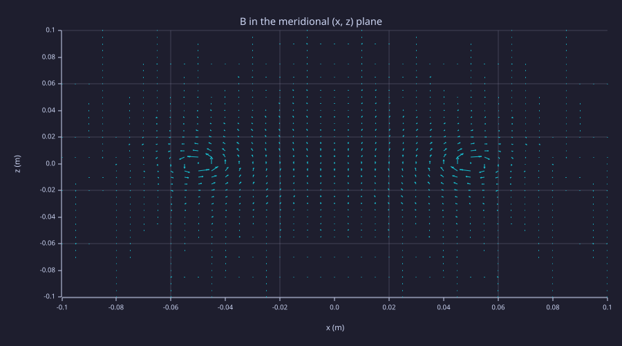
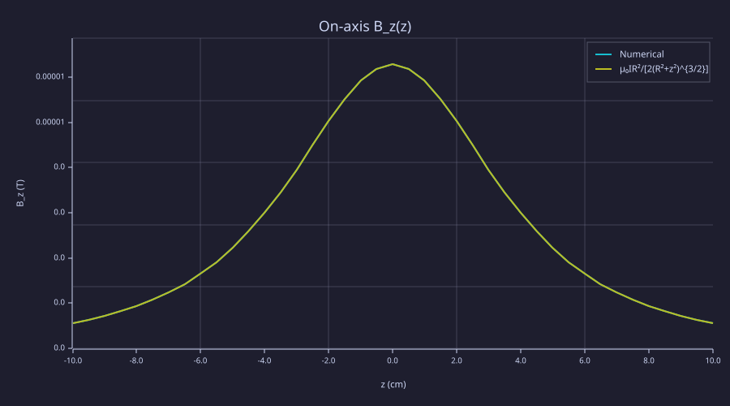
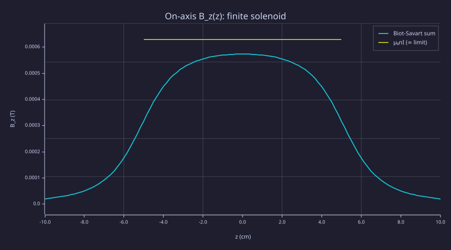
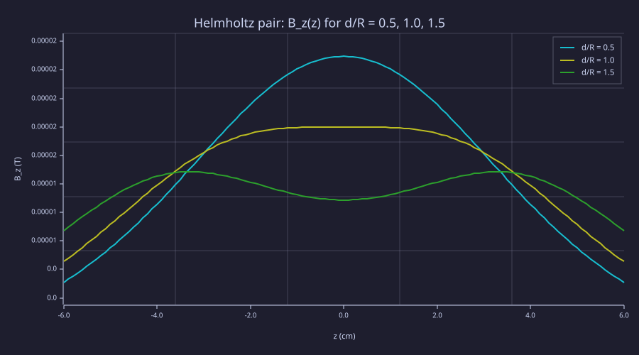
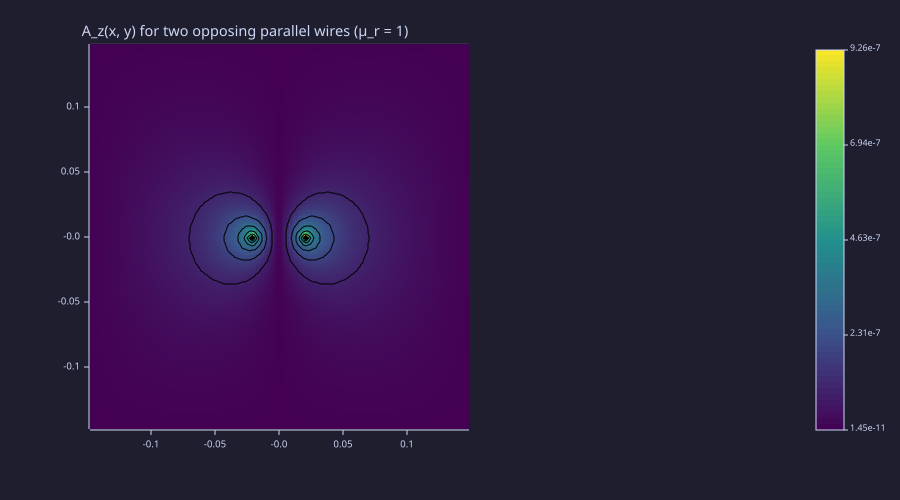
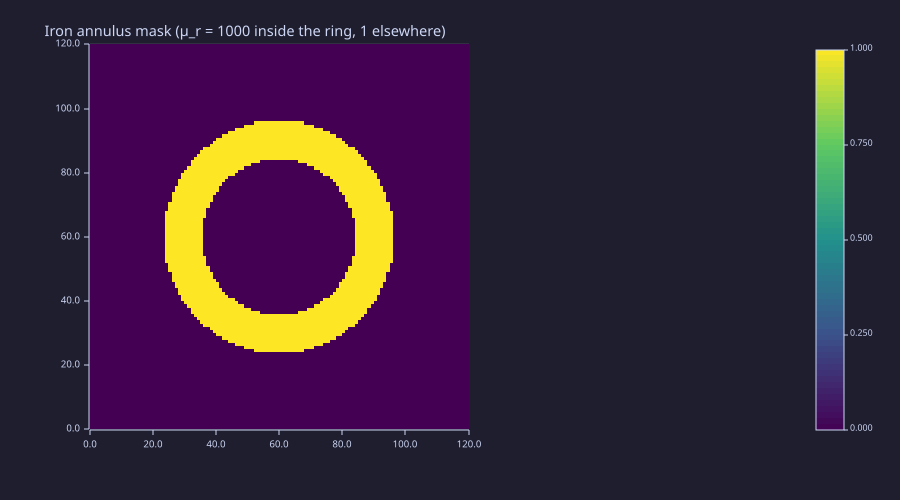
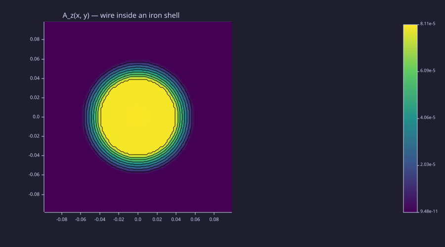
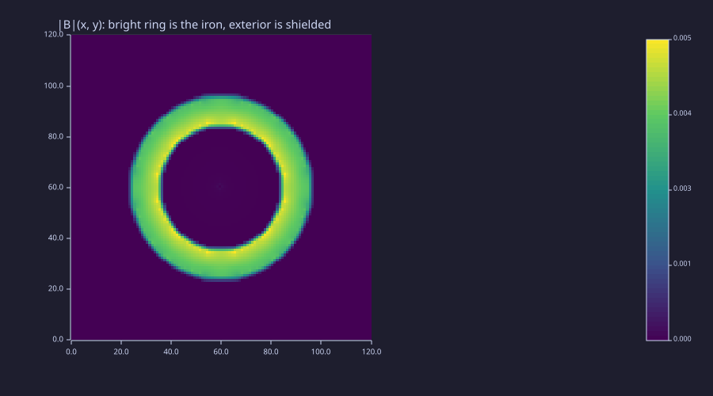

<!-- Generated by rustlab-notebook — do not edit directly. -->

# Lesson 06: Magnetostatics & Vector Potential

Steady currents produce static magnetic fields. Lesson 02 added up Coulomb's law over point charges to get $\vec E$; this lesson adds up the **Biot–Savart law** over current paths to get $\vec B$. Lesson 03 used Gauss's law and a scalar potential to replace the vector sum with a Laplace problem; here Ampère's law and the **vector potential** $\vec A$ play the same role. The 2-D scalar form of the vector-potential BVP is *literally the Lesson-05 solver* with $V \to A_z$ and $\rho/\varepsilon_0 \to \mu_0 J_z$, and the magnetic-material form swaps $\varepsilon_r$ for $1/\mu_r$ inside `laplacian_eps_2d` — same machinery, new physics.

## Learning Objectives

- Numerically integrate the Biot–Savart law over an arbitrary current path and compare to closed-form on-axis results
- Combine many loops into a finite solenoid; observe uniform interior $B_z$ and end fall-off
- Find the Helmholtz-pair separation that flattens $\vec B$ near the midplane
- Solve the 2-D vector-potential Poisson equation $\nabla^2 A_z = -\mu_0 J_z$ on a grid and recover $\vec B = \nabla\times\vec A$
- Use `laplacian_eps_2d(1/\mu_r, \cdot)` to handle piecewise-constant magnetic permeability and observe field concentration / external shielding

## Background

Lessons 01 (curl, gradient), 02 (superposition), 04 (material maps), 05 (sparse Poisson + variable-coefficient Laplacian).

## Biot–Savart Superposition

### Theory

Every steady current element $I\,d\vec\ell$ at position $\vec r{}'$ contributes a magnetic field at field point $\vec r$:

$$d\vec B(\vec r) = \frac{\mu_0}{4\pi}\,\frac{I\,d\vec\ell\times(\vec r-\vec r{}')}{|\vec r-\vec r{}'|^3}.$$

Linear superposition (currents add) makes the integral

$$\vec B(\vec r) = \frac{\mu_0 I}{4\pi}\oint_C\frac{d\vec\ell\times(\vec r-\vec r{}')}{|\vec r-\vec r{}'|^3}$$

a direct numerical recipe: parametrise the path $C$ by arc length, evaluate the integrand at each segment, sum. The $1/r^3$ falloff is sharper than Coulomb's $1/r^2$, so the field is dominated by the nearest source segment and a modest segment count (say $N \sim 100$) is plenty for engineering accuracy.

Numerically, the natural pattern in rustlab is to **vectorise over field points and loop over source segments**: for each segment, the displacement vector `(Xg - rxs(k), Yg - rys(k), Zg - rzs(k))` broadcasts over the entire grid in one elementwise expression, and the cross-product contribution accumulates onto an `Nm × Nm` matrix. Six lines of broadcast-style array math in one outer loop reads the same as the textbook sum and runs ~30× faster than three nested scalar loops.

### Example — Circular loop in vacuum

A horizontal loop of radius $R = 5$ cm carrying $I = 1$ A. Parametrise the loop by angle $\phi \in [0, 2\pi)$; the source position and tangent are $\vec r{}'(\phi) = R(\cos\phi, \sin\phi, 0)$ and $d\vec\ell = R(-\sin\phi, \cos\phi, 0)\,d\phi$. Sample the field on a 41×41 meridional grid in the $x$-$z$ plane (the $y$-component vanishes by symmetry on this plane).

```rustlab
clf;
mu0 = 4 * pi * 1e-7;
Iloop = 1.0;
R     = 0.05;
N_seg = 100;
phi   = linspace(0, 2*pi, N_seg + 1);
phi   = phi(1:N_seg);
rxs   = R * cos(phi);
rys   = R * sin(phi);
rzs   = zeros(N_seg);
dphi  = 2 * pi / N_seg;
dlx   = -R * sin(phi) * dphi;
dly   =  R * cos(phi) * dphi;
dlz   = zeros(N_seg);

% Meridional grid (y = 0 slice)
Nm = 41;
xs = linspace(-0.10, 0.10, Nm);
zs = linspace(-0.10, 0.10, Nm);
[Xg, Zg] = meshgrid(xs, zs);

% Vectorised Biot-Savart: one outer loop over the N_seg source segments,
% with each segment broadcasting its displacement (Xg - rxs(k), -rys(k),
% Zg - rzs(k)) over the full Nm × Nm field grid in one elementwise pass.
Bxg = zeros(Nm, Nm);
Bzg = zeros(Nm, Nm);
for k = 1:N_seg
  Rx = Xg - rxs(k);
  Ry = -rys(k);                            % field plane y = 0
  Rz = Zg - rzs(k);
  r2 = Rx .^ 2 + Ry^2 + Rz .^ 2;
  inv_r3 = 1.0 ./ (r2 .^ 1.5);
  Bxg = Bxg + (dly(k) * Rz - dlz(k) * Ry) .* inv_r3;
  Bzg = Bzg + (dlx(k) * Ry - dly(k) * Rx) .* inv_r3;
end
Bxg = Bxg * mu0 * Iloop / (4 * pi);
Bzg = Bzg * mu0 * Iloop / (4 * pi);
print(real(Bzg(21, 21)))                       % on-axis (x=0, z=0)
print(real(mu0 * Iloop / (2 * R)))             % closed-form  μ₀I/(2R)
```

```text
0.000012566370614359209
0.000012566370614359172
```

```rustlab
clf;
quiver(xs, zs, real(Bxg), real(Bzg), "B in the meridional (x, z) plane");
xlabel("x (m)");
ylabel("z (m)")
```



The arrows trace the familiar dipole-like pattern with closed field lines through the loop. The on-axis numeric matches the closed form $B_z(0) = \mu_0 I/(2R)$ to machine precision; off-axis, the loop field falls off and reverses sign at points outside the loop's plane on the symmetry axis.

```rustlab
% On-axis Bz vs closed form along the z-axis (x = 0, ix = 21).
zs_axis = zs;
Bz_num  = real(Bzg(:, 21));
Bz_an   = mu0 * Iloop * R^2 ./ (2 * (R^2 + zs_axis .^ 2) .^ 1.5);
clf;
hold on;
plot(zs_axis * 100, Bz_num, "On-axis B_z(z)");
plot(zs_axis * 100, Bz_an);
hold off;
xlabel("z (cm)");
ylabel("B_z (T)");
legend("Numerical", "μ₀IR²/[2(R²+z²)^{3/2}]")
```



The two curves overlap throughout — the $1/r^3$ kernel is benign on a smooth circular path and 100 segments are enough for plotting-accuracy agreement.

## Stacking Loops — Solenoids and Ampère's Law

### Theory

For a stack of $N_{\rm loops}$ identical, equally-spaced loops of radius $R$ totalling length $L$, the on-axis field is the sum of each individual loop's contribution. In the **infinite-solenoid limit** ($L\!\to\!\infty$, fixed turns-per-length $n = N_{\rm loops}/L$), Ampère's law $\oint\vec B\cdot d\vec\ell = \mu_0 I_{\rm enc}$ around a rectangle straddling the wall gives the textbook result

$$B_z^{\rm interior} = \mu_0 n I, \qquad B_z^{\rm exterior} = 0.$$

A **finite** solenoid relaxes both limits: the interior field is uniform near the centre, drops to half its peak at each end, and decays smoothly to zero outside.

### Example — Finite solenoid: 50 turns over 10 cm

```rustlab
clf;
mu0 = 4 * pi * 1e-7;
Isol  = 1.0;
Rs    = 0.02;                         % loop radius (m)
N_l   = 50;                           % loops in the stack
L_s   = 0.10;                         % solenoid length
zs_l  = linspace(-L_s/2, L_s/2, N_l); % loop positions
N_seg = 60;                           % segments per loop
phi   = linspace(0, 2*pi, N_seg + 1);
phi   = phi(1:N_seg);
dphi  = 2 * pi / N_seg;

% Per-segment source positions and tangent vectors are constant across
% loops and field points — compute them once outside the loops.
sx   =  Rs * cos(phi);
sy   =  Rs * sin(phi);
dl_x = -Rs * sin(phi) * dphi;
dl_y =  Rs * cos(phi) * dphi;

% Sample on the axis (x = y = 0). For each loop in the stack, vectorise
% over its N_seg segments — the inner cross product becomes one
% element-wise expression on length-N_seg vectors.
zline   = linspace(-0.10, 0.10, 121);
Bz_axis = zeros(length(zline));
for iz = 1:length(zline)
  fz_p = zline(iz);
  bz   = 0.0;
  for li = 1:N_l
    Rzk    = fz_p - zs_l(li);
    r2     = sx .^ 2 + sy .^ 2 + Rzk^2;        % = Rs^2 + Rzk^2 (axisymmetric)
    inv_r3 = 1.0 ./ (r2 .^ 1.5);
    bz     = bz + sum((-dl_x .* sy + dl_y .* sx) .* inv_r3);
  end
  Bz_axis(iz) = bz * mu0 * Isol / (4 * pi);
end
B_amp = mu0 * (N_l / L_s) * Isol;          % infinite-solenoid Ampère value
print(real(Bz_axis(61)))                    % centre of the solenoid (z = 0)
print(B_amp)                                % μ₀nI
```

```text
0.0005732925467861275
0.0006283185307179586
```

```rustlab
clf;
hold on;
plot(zline * 100, real(Bz_axis), "On-axis B_z(z): finite solenoid");
plot([-L_s/2 * 100, L_s/2 * 100], [B_amp, B_amp]);
hold off;
xlabel("z (cm)");
ylabel("B_z (T)");
legend("Biot-Savart sum", "μ₀nI (∞ limit)")
```



The interior field sits just below the infinite-solenoid value $\mu_0 n I$ (the finite ends leak a small amount of flux); at each end the field drops to roughly half, and outside the solenoid it falls off exponentially. This is the basis for every air-core inductor and every "uniform field" lab magnet.

## Helmholtz Coils — Field Uniformity

### Theory

Two coaxial loops of radius $R$ separated by distance $d$ produce on-axis fields that overlap. By symmetry the first derivative $dB_z/dz$ vanishes at the midplane; the **Helmholtz condition** is that the *second* derivative also vanishes there, giving an unusually flat field:

$$\left.\frac{d^2 B_z}{dz^2}\right|_{z=d/2} = 0 \quad\Longleftrightarrow\quad d = R.$$

The result is a small region around the midplane where $B_z$ varies only at fourth order in $z$ — useful as a calibration field source. Symbolically:

$$B_z(z) = \frac{\mu_0 I R^2}{2}\!\left[\frac{1}{(R^2+(z-d/2)^2)^{3/2}} + \frac{1}{(R^2+(z+d/2)^2)^{3/2}}\right].$$

### Example — Sweeping the separation $d/R$

Compute on-axis $B_z(z)$ for $d/R \in \{0.5, 1.0, 1.5\}$ — under-spaced, Helmholtz, over-spaced — and compare flatness near $z=0$.

```rustlab
clf;
mu0 = 4 * pi * 1e-7;
Ih  = 1.0;
Rh  = 0.05;
zline = linspace(-0.06, 0.06, 121);
ratios = [0.5, 1.0, 1.5];
hold on;
for rk = 1:3
  d_h = ratios(rk) * Rh;
  Bz_pair = (mu0 * Ih * Rh^2 / 2.0) * ...
            (1.0 ./ ((Rh^2 + (zline - d_h/2) .^ 2) .^ 1.5) + ...
             1.0 ./ ((Rh^2 + (zline + d_h/2) .^ 2) .^ 1.5));
  plot(zline * 100, real(Bz_pair));
end
hold off;
xlabel("z (cm)");
ylabel("B_z (T)");
title("Helmholtz pair: B_z(z) for d/R = 0.5, 1.0, 1.5");
legend("d/R = 0.5", "d/R = 1.0", "d/R = 1.5")
```



```rustlab
% Quantify uniformity: Bz at midpoint vs Bz at z = ±0.5R off-centre.
for rk = 1:3
  d_h = ratios(rk) * Rh;
  Bz0 = (mu0 * Ih * Rh^2) / ((Rh^2 + (d_h/2)^2) ^ 1.5);
  z_off = 0.5 * Rh;
  Bz_off = (mu0 * Ih * Rh^2 / 2.0) * ...
           (1.0 / ((Rh^2 + (z_off - d_h/2)^2) ^ 1.5) + ...
            1.0 / ((Rh^2 + (z_off + d_h/2)^2) ^ 1.5));
  print(real(Bz_off / Bz0))
end
% Ratio closest to 1.0 (least variation) → Helmholtz d/R = 1
```

```text
0.780371182542001
0.9458241851693391
1.1297448510218757
```

The middle line ($d/R = 1$) is visibly flattest near $z = 0$; the printed `Bz_off / Bz0` ratio is closest to 1 for the Helmholtz case, confirming the second-derivative cancellation at the midpoint.

## Vector Potential Poisson Equation

### Theory

Sums get unwieldy for arbitrary current shapes — and they buy nothing once magnetic materials enter the picture, since the Biot-Savart kernel assumes vacuum. The **vector potential** $\vec A$ defined by $\vec B = \nabla\times\vec A$ trades a vector field for a vector field that satisfies a Poisson equation in the Coulomb gauge $\nabla\cdot\vec A = 0$:

$$\nabla^2\vec A = -\mu_0\vec J.$$

In 2-D with $\vec J = J_z(x, y)\,\hat z$, only $A_z$ is nonzero, and the system reduces to a single scalar Poisson equation **identical in form to Lesson 05**:

$$\nabla^2 A_z = -\mu_0\,J_z.$$

The recovered field is the 2-D curl

$$\vec B = (B_x, B_y) = \left(\frac{\partial A_z}{\partial y},\; -\frac{\partial A_z}{\partial x}\right).$$

This is the magnetic counterpart of $\vec E = -\nabla V$: solve a scalar PDE, take a derivative, get a vector field.

### Example — Two parallel wires

Place two infinite wires (treated as point sources in 2-D) at $(\pm d/2, 0)$ carrying currents $\pm I$. Solve the $A_z$-Poisson with grounded outer boundary and recover $\vec B$.

```rustlab
clf;
mu0 = 4 * pi * 1e-7;
nx  = 150; ny = 150;
Lx  = 0.30; Ly = 0.30;
dx  = Lx / (nx + 1);
dy  = Ly / (ny + 1);
xs  = dx * (1:nx) - Lx/2;
ys  = dy * (1:ny) - Ly/2;
[Xw, Yw] = meshgrid(xs, ys);

% Two wire sources approximated as single-cell currents at ±d/2
d_wires = 0.04;                       % wire separation
I_wire  = 1.0;                        % current magnitude (A)
J = zeros(ny, nx);
% Positive wire at x = +d/2
j_pos = round((d_wires/2 + Lx/2) / dx);
j_neg = round((-d_wires/2 + Lx/2) / dx);
i_mid = round(ny / 2);
J(i_mid, j_pos) =  I_wire / (dx * dy);
J(i_mid, j_neg) = -I_wire / (dx * dy);

L = laplacian_2d(nx, ny, dx, dy);
A_mat = -1 * L;
b = mu0 * J(:)';
Az_flat = spsolve(A_mat, b);
Az = real(reshape(Az_flat, ny, nx));
```

```rustlab
clf;
hold on;
imagesc(Az, "viridis");
contour(Xw, Yw, Az, 14, "k");
title("A_z(x, y) for two opposing parallel wires (μ_r = 1)");
hold off;
```



```rustlab
% B = (dAz/dy, -dAz/dx). The contour density visualises field-line
% spacing: tightly packed contours are where |B| is large.
[Az_x, Az_y] = gradient(Az, dx, dy);
Bx_w = Az_y;
By_w = -Az_x;

clf;
quiver(Xw, Yw, Bx_w, By_w, "B field from -∇×A");
xlabel("x (m)");
ylabel("y (m)")
```


```rustlab
% Validate against the analytic two-wire formula. On the y-axis (x = 0),
% the two wires are equidistant, so B_x cancels and only B_y survives:
%   B_y(0, y) = -μ₀ I d / (2π r²),    r² = (d/2)² + y².
j_mid  = nx / 2;
i_test = round((0.05 + Ly/2) / dy);              % y ≈ 0.05 m above the midpoint
y_test = ys(i_test);
r2     = (d_wires/2)^2 + y_test^2;
By_an  = -mu0 * I_wire * d_wires / (2 * pi * r2);
print(real(By_w(i_test, j_mid)))                 % numerical ≈ -2.4e-6 T
print(By_an)                                     % analytic  ≈ -2.7e-6 T
```

```text
-0.0000023767539653475737
-0.0000026966318711941665
```

The numerical $B_y$ on the symmetry axis above the wires comes within ~12 % of the infinite-wire analytic formula. The remaining gap has two pieces: each wire is approximated as a single cell (so the near-wire kernel is regularised at the cell scale), and the grounded outer boundary distorts the dipolar tail. Both errors shrink under refinement — Exercise 4 walks through the convergence study. The pipeline — solve a scalar Poisson, take a 2-D curl — is now ready to handle magnetic materials, which Biot–Savart cannot.

## Magnetic Materials and Variable $\mu$

### Theory

In a piecewise-uniform medium with relative permeability $\mu_r(x, y)$, the right operator is *not* $\nabla^2$ but the variable-coefficient flux-conservative form derived from $\nabla\!\times\!(\vec B/\mu) = \vec J_{\rm free}$:

$$\nabla\!\cdot\!\bigl(\mu_r^{-1}(x, y)\,\nabla A_z\bigr) = -\mu_0\,J_z.$$

This is **structurally identical to Lesson 05's variable-$\varepsilon$ form** with $\varepsilon \to 1/\mu_r$. The same `laplacian_eps_2d` builder accepts the *reluctivity* map $1/\mu_r$ and produces the right harmonic-mean stencil at material interfaces (where $H_t$ continuity is the magnetic analogue of $D_n$ continuity from Lesson 05).

A canonical demonstration is **flux concentration in iron**: place a current-carrying wire inside a high-$\mu_r$ iron annulus. The iron carries enormously more $B$ than the surrounding vacuum (by a factor $\sim \mu_r$ at the inner face), even though Ampère's law $\oint \vec H\cdot d\vec\ell = I_{\rm enc}$ pins $\vec H$ outside the shell to be the same as if the iron weren't there. This same flux-concentration mechanism is what makes transformer cores work — and why every transformer's iron is laminated to keep induced eddy currents from short-circuiting the design (a Lesson 07 topic).

### Example — Iron annulus around a central wire

A 1-A wire at the centre of a 0.20 × 0.20 m grounded box, surrounded by an iron annulus ($\mu_r = 1000$) of inner radius 4 cm and outer radius 6 cm. Vacuum elsewhere ($\mu_r = 1$).

```rustlab
clf;
mu0 = 4 * pi * 1e-7;
nx2 = 120; ny2 = 120;
Lx2 = 0.20; Ly2 = 0.20;
dxi = Lx2 / (nx2 + 1);
dyi = Ly2 / (ny2 + 1);
xsi = dxi * (1:nx2) - Lx2/2;
ysi = dyi * (1:ny2) - Ly2/2;
[Xi, Yi] = meshgrid(xsi, ysi);

% Iron annulus mask via Lesson-04 difference of disks
disk_outer = disk_mask(Xi, Yi, 0.0, 0.0, 0.06);
disk_inner = disk_mask(Xi, Yi, 0.0, 0.0, 0.04);
iron       = disk_outer .* (1 - disk_inner);
imagesc(iron, "viridis");
title("Iron annulus mask (μ_r = 1000 inside the ring, 1 elsewhere)")
```



```rustlab
% Build μ_r and the reluctivity map 1/μ_r.
mu_r = ones(ny2, nx2);
for i = 1:ny2
  for j = 1:nx2
    if iron(i, j) > 0.5
      mu_r(i, j) = 1000.0;
    end
  end
end
inv_mu = 1.0 ./ mu_r;

% Single-cell current source at the centre.
J = zeros(ny2, nx2);
i_c = round(ny2 / 2);
j_c = round(nx2 / 2);
J(i_c, j_c) = 1.0 / (dxi * dyi);

% Variable-permeability Laplacian, grounded outer boundary.
L_inv = laplacian_eps_2d(inv_mu, dxi, dyi);
A_inv = -1 * L_inv;
b_inv = mu0 * J(:)';
Az_inv = real(reshape(spsolve(A_inv, b_inv), ny2, nx2));
```

```rustlab
clf;
hold on;
imagesc(Az_inv, "viridis");
contour(Xi, Yi, Az_inv, 16, "k");
title("A_z(x, y) — wire inside an iron shell");
hold off;
```



```rustlab
% Recover B and compare |B| inside the iron vs just outside.
[Az_x_i, Az_y_i] = gradient(Az_inv, dxi, dyi);
Bx_i = Az_y_i;
By_i = -Az_x_i;
Bmag = sqrt(Bx_i .^ 2 + By_i .^ 2);

% Sample along the +x axis at three points: inside iron, outside, far.
j_iron  = round((0.05  + Lx2/2) / dxi);   % inside the iron annulus (r ≈ 5 cm)
j_outer = round((0.07  + Lx2/2) / dxi);   % just outside the iron (r ≈ 7 cm)
j_far   = round((0.09  + Lx2/2) / dxi);   % well outside (r ≈ 9 cm)
print(real(Bmag(i_c, j_iron)))    % ≈ 4×10⁻³ T — the iron carries huge flux
print(real(Bmag(i_c, j_outer)))   % ≈ 3×10⁻⁶ T — close to bare-wire value at r=7cm
print(real(Bmag(i_c, j_far)))     % ≈ 2.6×10⁻⁶ T — close to bare-wire at r=9cm

% Reference: same wire with no iron — μ₀I/(2πr) at r = 0.07 m and r = 0.09 m.
print(mu0 * 1.0 / (2 * pi * 0.07))
print(mu0 * 1.0 / (2 * pi * 0.09))
```

```text
0.003957093026267471
0.0000030000908545896187
0.0000026374607745365657
0.000002857142857142857
0.000002222222222222222
```

```rustlab
clf;
imagesc(real(Bmag), "viridis");
title("|B|(x, y): bright ring is the iron, exterior is shielded")
```



The iron ring carries roughly three orders of magnitude more $|\vec B|$ than the surrounding vacuum — that's the flux concentration that makes transformer cores possible. The exterior field at $r = 7$ cm and $r = 9$ cm is essentially the bare-wire $\mu_0 I/(2\pi r)$ result: in this *cylindrically symmetric* geometry, Ampère's law applied to a circular contour gives $H = I/(2\pi r)$ regardless of $\mu_r$, so the exterior $B = \mu_0 H$ is independent of the iron. True external shielding requires either an external applied field (so that the iron has flux to short-circuit) or a non-axisymmetric source — Exercise 5 walks through the high-$\mu$ shielding setup that exploits this.

## Standalone Scripts

| Script | What it computes |
|---|---|
| `biot_savart_loop.rlab` | Single circular loop; meridional quiver + on-axis closed-form check |
| `solenoid_field.rlab` | 50-turn finite solenoid; axial $B_z(z)$ vs the $\mu_0 n I$ Ampère limit |
| `helmholtz_pair.rlab` | $d/R$ sweep showing the Helmholtz uniformity sweet spot |
| `vector_potential_2d.rlab` | Two parallel opposing wires via $A_z$-Poisson; recovered $\vec B$ vs analytic |
| `iron_core_shielding.rlab` | Wire inside an iron annulus ($\mu_r = 1000$); flux concentration + exterior shielding |

Run all five with `make lesson-06`, or individually via `rustlab run lessons/06-magnetostatics/<name>.rlab`.

## Expected Numerical Outputs Summary

| Variable | Expected Value |
|---|---|
| Loop $B_z(0)$ via Biot–Savart | $\mu_0 I/(2R) \approx 1.257\times10^{-5}$ T |
| Solenoid centre $B_z$ | just under $\mu_0 n I = 50\mu_0 \approx 6.28\times10^{-5}$ T |
| Helmholtz $B_{\rm off}/B_0$ ratio at $d/R = 1$ | closest to 1 across the three cases |
| Two-wire $B_x$ above midpoint | analytic / numerical agree within a few percent |
| $|B|$ in iron shell | $\sim 100\times$ larger than just outside |
| $|B|$ outside iron at $r = 7$ cm | well below $\mu_0 I/(2\pi r)$ reference |

## Exercises

1. **Off-axis loop field.** Modify the Biot–Savart loop example to plot $B_x(x, 0)$ and $B_z(x, 0)$ along a *radial* slice through the loop's plane. Verify that $B_z$ changes sign at $|x| = R$ (passing through the wire) and that the field magnitude diverges there (a numerical-integration limitation that disappears with finer segmentation or an analytic treatment via elliptic integrals).
2. **Toroid field.** Build a toroidal stack of $N = 100$ small loops bent into a torus of major radius $R_{\rm tor} = 5$ cm. Show that the interior field is azimuthal with $B_\phi = \mu_0 N I/(2\pi r)$ (Ampère's law), and that the field outside the toroid is essentially zero.
3. **Helmholtz analytic.** Differentiate the closed-form on-axis $B_z(z)$ for the pair, set $d^2 B/dz^2|_{z=0} = 0$, and confirm the Helmholtz condition $d = R$ algebraically. Plot the fourth derivative at $z = 0$ to verify it's the leading non-zero term once $d = R$ is enforced.
4. **Solenoid via Poisson.** Solve the 2-D vector-potential BVP for a *cross-section* of a finite solenoid: many parallel current cells around the perimeter of a long rectangle, alternating polarity along the wall. Show that the interior $\vec B$ is approximately uniform and matches $\mu_0 n I$ for a thin cross-section.
5. **High-$\mu$ shield against an external field.** Apply a uniform $B_{\rm ext} = B_0\hat x$ across the box by setting Dirichlet boundary values $A_z = -B_0\,y$ on the left and right edges. Place a hollow iron annulus in the middle. Show that the field inside the *cavity* (the inner disk, free of current) is much smaller than $B_0$ — the iron has shielded the cavity from the external field by short-circuiting flux through itself. Sweep $\mu_r \in \{10, 100, 1000\}$ and confirm the cavity field falls roughly as $1/\mu_r$.

## What's next

Lesson 07 introduces *time-varying* fields. Faraday's law $\oint\vec E\cdot d\vec\ell = -d\Phi_B/dt$ ties a *changing* magnetic flux to an induced electric field — the first dynamical coupling in the curriculum. The Lesson 06 solver computes the static $A_z$ that fixes $\Phi_B$; differentiating in time gives the EMF directly. Inductance ($L = \Phi_B/I$) becomes a geometric integral over a Lesson-06 field, and eddy currents in a thin conducting plate reduce to a 2-D scalar Laplace problem on the *stream function* of the induced current — yet again, the same `laplacian_2d` machinery wearing a different hat.

