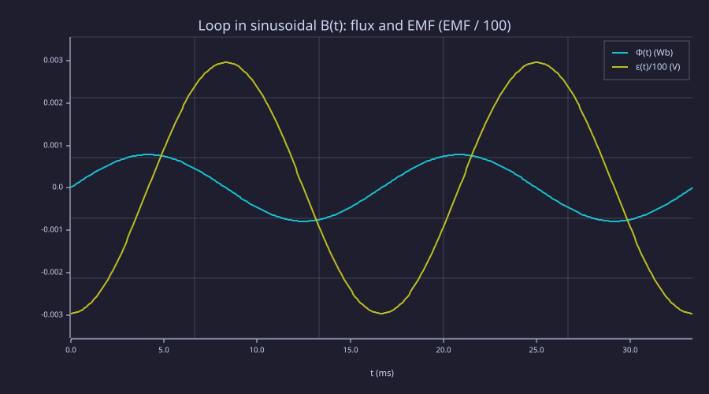
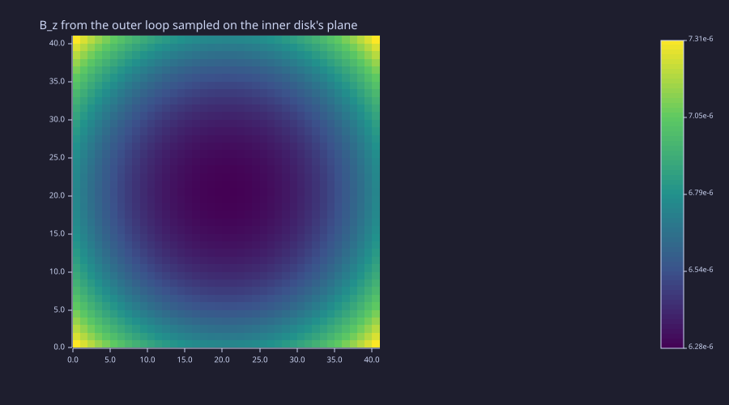
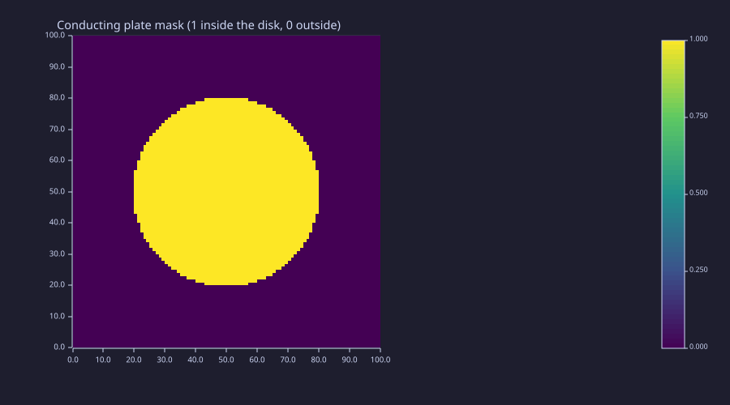
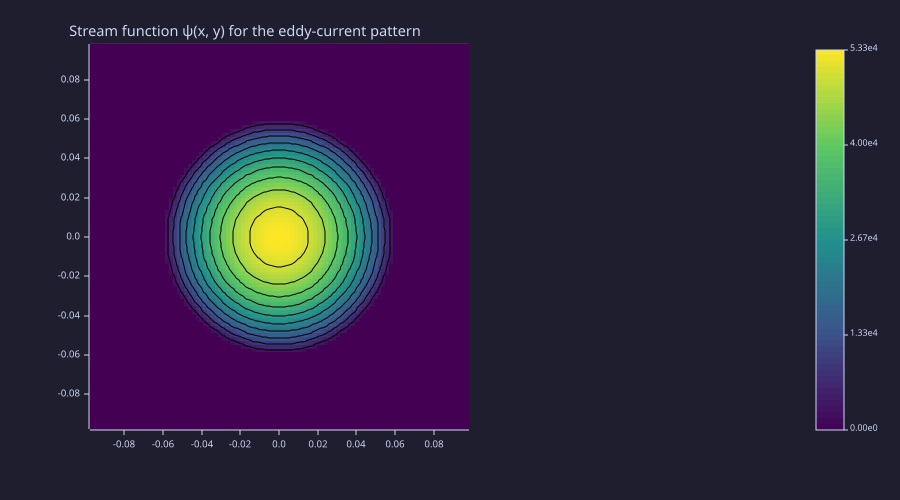
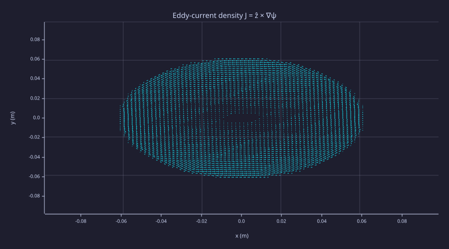

<!-- Generated by rustlab-notebook — do not edit directly. -->

# Lesson 07: Faraday's Law & Induction

The first lesson where time enters the picture. So far the curriculum has been *static*: charges sit, currents flow steadily, fields don't change. Faraday's law breaks the static frame by tying a time-varying magnetic flux $\Phi_B$ to an induced electric field, and through it an EMF that drives current in any closed loop. Inductance — both self and mutual — is a geometric coupling between two *static* magnetostatic problems made dynamical by Faraday. Eddy currents in a conducting plate reduce to a 2-D Poisson equation on a *stream function* — yet again the same `laplacian_2d` solver from Lessons 05 and 06, with a different physical interpretation of the field it produces.

## Learning Objectives

- State Faraday's law in both integral $\oint\vec E\cdot d\vec\ell = -d\Phi_B/dt$ and differential $\nabla\times\vec E = -\partial\vec B/\partial t$ forms
- Compute the induced EMF in a loop placed in a sinusoidal $\vec B(t)$
- Express mutual inductance $M = \Phi_2/I_1$ as a geometric integral and compute it numerically via the Lesson-06 Biot-Savart pipeline
- Derive the stream-function Laplace problem for eddy currents in a thin conducting plate, solve it on a disk, and observe Lenz's law in the recovered current pattern

## Background

Lessons 01 (curl), 03 (potential, Gauss's law), 05 (sparse Poisson + pinned-cell idiom), 06 (Biot-Savart, $A_z$-Poisson).

## Faraday's Law and the Induced EMF

### Theory

The integral form ties an EMF — the line integral of $\vec E$ around a closed loop $C$ — to the rate of change of magnetic flux through any surface $S$ bounded by $C$:

$$\varepsilon = \oint_C \vec E\cdot d\vec\ell = -\frac{d\Phi_B}{dt}, \qquad \Phi_B = \int_S \vec B\cdot d\vec A.$$

Stokes' theorem rewrites this as a local statement,

$$\nabla\times\vec E = -\frac{\partial\vec B}{\partial t},$$

valid at every point. The minus sign is **Lenz's law**: the induced current's direction is such that the magnetic flux *it* generates *opposes* the change in $\Phi_B$. Faraday is the key dynamical coupling — it lets a changing $\vec B$ drive a current, which then changes the surrounding field, which then induces still more EMF: every transformer, motor, generator, and inductive sensor runs on this loop.

### Example — Loop in a sinusoidal $\vec B(t)$

A circular loop of radius $R = 5$ cm sits with its axis along $\hat z$, in a uniform externally-imposed field $B_z(t) = B_0\sin(\omega t)$ at frequency $f = 60$ Hz, $B_0 = 0.1$ T. The flux is $\Phi(t) = \pi R^2 B_0 \sin(\omega t)$ and the EMF is the negative derivative:

$$\varepsilon(t) = -\pi R^2 B_0 \omega\,\cos(\omega t).$$

```rustlab
clf;
R       = 0.05;
B0      = 0.10;
freq    = 60.0;
omega   = 2 * pi * freq;
ts      = linspace(0, 2/freq, 401);          % two periods
Phi_t   = pi * R^2 * B0 * sin(omega * ts);
Eps_t   = -pi * R^2 * B0 * omega * cos(omega * ts);
hold on;
plot(ts * 1000, Phi_t,  "Φ(t)");
plot(ts * 1000, Eps_t / 100);                % scaled to share axis
hold off;
xlabel("t (ms)");
title("Loop in sinusoidal B(t): flux and EMF (EMF / 100)");
legend("Φ(t)  (Wb)", "ε(t)/100  (V)")
```

<!-- rustlab:output-start -->


<!-- rustlab:output-end -->

```rustlab
% Peak quantities
Phi_peak = pi * R^2 * B0;
Eps_peak = pi * R^2 * B0 * omega;
print(Phi_peak)        % ≈ 7.85e-4 Wb
print(Eps_peak)        % ≈ 0.296 V
```

<!-- rustlab:output-start -->
```text
0.0007853981633974484
0.29608813203268075
```

<!-- rustlab:output-end -->

The EMF leads the flux by $\pi/2$ (cosine vs sine) — the EMF is largest at the moments when the flux is changing fastest, and zero at the flux peaks where $d\Phi/dt = 0$. Flipping the sign of $B_0$ (or running the loop counter-clockwise) flips the sign of $\varepsilon$ — Lenz's law in action.

## Mutual Inductance

### Theory

When current $I_1$ in loop 1 produces a magnetic field, some of that flux threads loop 2. The **mutual inductance** $M_{12}$ is the geometric ratio

$$M_{12} = \frac{\Phi_{2 \leftarrow 1}}{I_1}, \qquad \Phi_{2 \leftarrow 1} = \int_{\text{disk}_2}\!\vec B_1\cdot d\vec A_2.$$

Reciprocity gives $M_{12} = M_{21}$ for any pair of loops. Once $M$ is known, Faraday's law on loop 2 gives the induced EMF:

$$\varepsilon_2 = -M\,\frac{dI_1}{dt}.$$

This is the entire physics of an air-core transformer at low frequency. The numerical recipe is to run a Lesson-06-style Biot-Savart calculation for $B_z$ from loop 1 on a meshgrid covering loop 2's disk, then sum cell areas to get $\Phi$. For two **concentric coplanar** loops in the $xy$-plane (radii $a < b$, current $I$ in the outer loop), the small-$a/b$ limit gives the analytic check

$$M \approx \frac{\mu_0\,\pi a^2}{2 b}, \qquad a \ll b,$$

since the central field of the outer loop is uniform over a small inner-loop disk at $B_z(0) = \mu_0 I/(2 b)$.

### Example — Concentric coplanar loops

Outer loop radius $b = 0.10$ m, inner loop radius $a = 0.02$ m, current $I_1 = 1$ A in the outer loop. Compute $B_z$ from the outer loop on a 41×41 grid covering the inner-loop area, integrate over cells inside the inner disk, and read off $M = \Phi/I_1$.

```rustlab
clf;
mu0  = 4 * pi * 1e-7;
I1   = 1.0;
b_o  = 0.10;             % outer radius
a_i  = 0.02;             % inner radius

% Outer-loop discretisation
N_seg = 200;
phi   = linspace(0, 2*pi, N_seg + 1);
phi   = phi(1:N_seg);
dphi  = 2 * pi / N_seg;
rxs   = b_o * cos(phi);
rys   = b_o * sin(phi);
rzs   = zeros(N_seg);
dlx   = -b_o * sin(phi) * dphi;
dly   =  b_o * cos(phi) * dphi;
dlz   = zeros(N_seg);

% Field grid covering the inner disk
Ng  = 41;
xs2 = linspace(-1.5 * a_i, 1.5 * a_i, Ng);
ys2 = linspace(-1.5 * a_i, 1.5 * a_i, Ng);
[Xg, Yg] = meshgrid(xs2, ys2);
dxg = xs2(2) - xs2(1);
dyg = ys2(2) - ys2(1);

% Vectorised Biot-Savart: one outer loop over the N_seg outer-loop
% segments, with each segment broadcasting (Xg - rxs(k), Yg - rys(k))
% across the entire (Ng × Ng) field grid. Both source and field sit
% in the z = 0 plane so the Rz term drops.
Bz_grid = zeros(Ng, Ng);
for k = 1:N_seg
  Rx = Xg - rxs(k);
  Ry = Yg - rys(k);
  r2 = Rx .^ 2 + Ry .^ 2;
  inv_r3 = 1.0 ./ (r2 .^ 1.5);
  Bz_grid = Bz_grid + (dlx(k) * Ry - dly(k) * Rx) .* inv_r3;
end
Bz_grid = Bz_grid * mu0 * I1 / (4 * pi);
```

```rustlab
clf;
imagesc(real(Bz_grid), "viridis");
title("B_z from the outer loop sampled on the inner disk's plane")
```

<!-- rustlab:output-start -->


<!-- rustlab:output-end -->

```rustlab
% Φ = ∫∫_{disk_a} Bz dA, picked out by Lesson-04's disk_mask. The
% mask × heatmap product is the same toolkit a device-level capacitance
% integral would use — the L04 primitives keep paying off downstream.
inner_disk = disk_mask(Xg, Yg, 0.0, 0.0, a_i);
Phi_inner  = sum(sum(real(Bz_grid) .* inner_disk)) * dxg * dyg;
M_num = Phi_inner / I1;

M_an  = mu0 * pi * a_i^2 / (2 * b_o);     % a ≪ b limit
print(M_num)                              % ≈ 7.94e-9 H
print(M_an)                               % ≈ 7.90e-9 H — within ~0.5 % for a/b = 0.2
```

<!-- rustlab:output-start -->
```text
0.000000007936917228094323
0.000000007895683520871486
```

<!-- rustlab:output-end -->

The two values agree to within a few percent at $a/b = 0.2$; refining the grid or shrinking $a/b$ tightens the match. Reciprocity ($M_{12} = M_{21}$) is built into the formula but worth checking by hand on Exercise 2 — flip which loop carries the current and recompute. The pipeline directly extends to non-concentric, non-coplanar, and non-circular loops where no closed form exists.

## Eddy Currents in a Conducting Plate

### Theory

A thin conducting plate (thickness $t \ll$ plate dimensions, conductivity $\sigma$) sitting in a time-varying axial field $B_z(t)$ develops **eddy currents** — circulating in-plane currents that oppose the change in flux. Three statements close the system in the quasi-static limit:

- Ohm's law in the plate: $\vec J = \sigma\vec E_{\rm in}$,
- Charge conservation: $\nabla\cdot\vec J = 0$,
- Faraday's law: $\nabla\times\vec E_{\rm in} = -\partial\vec B/\partial t = -\dot B_z\,\hat z$.

Because $\vec J$ is divergence-free in the plane, write it as the curl of a **stream function** $\psi(x, y)$,

$$\vec J = \hat z\times\nabla\psi = \left(\frac{\partial\psi}{\partial y},\;-\frac{\partial\psi}{\partial x}\right),$$

so the divergence-free condition is automatic. Substitute into $\nabla\times\vec E_{\rm in} = -\dot B_z\,\hat z$ via $\vec E_{\rm in} = \vec J/\sigma$:

$$\nabla^2\psi = -\sigma\,\dot B_z.$$

For a uniform $\dot B_z$ this is a **Poisson equation with constant source** — exactly the kind of problem Lessons 05 and 06 already solve. Boundary condition: no current crosses the plate edge ($\vec J\cdot\hat n = 0$), which translates to $\psi = $ const on the boundary; setting that constant to zero is conventional. Once $\psi$ is solved, $\vec J$ falls out as a 2-D curl.

For a circular plate of radius $R$, the radially symmetric solution is

$$\psi(r) = \frac{\sigma\dot B_z}{4}\bigl(R^2 - r^2\bigr),\qquad J_\varphi = -\frac{\sigma\dot B_z}{2}\,r,$$

so the induced current circulates in the *opposite sense* to $\dot B_z$ — Lenz's law literal: a positive $\dot B_z$ drives a clockwise current that produces a $-\hat z$ field, partially cancelling the imposed change.

### Example — Circular plate with $\dot B_z = 1$ T/s

Solve the Poisson problem on a $0.20\times0.20$ m grid with a 0.06 m–radius copper plate ($\sigma = 5.8\times10^7$ S/m), $\dot B_z = 1$ T/s. Pin every cell *outside* the plate to $\psi = 0$ and solve $\nabla^2\psi = -\sigma\dot B_z$ inside.

```rustlab
clf;
sigma_cu = 5.8e7;
Bdot     = 1.0;                   % T/s
nx3 = 100; ny3 = 100;
Lx3 = 0.20; Ly3 = 0.20;
dx3 = Lx3 / (nx3 + 1);
dy3 = Ly3 / (ny3 + 1);
xs3 = dx3 * (1:nx3) - Lx3/2;
ys3 = dy3 * (1:ny3) - Ly3/2;
[Xp, Yp] = meshgrid(xs3, ys3);

R_plate    = 0.06;
plate_mask = disk_mask(Xp, Yp, 0.0, 0.0, R_plate);
imagesc(plate_mask, "viridis");
title("Conducting plate mask (1 inside the disk, 0 outside)")
```

<!-- rustlab:output-start -->


<!-- rustlab:output-end -->

```rustlab
% Sparse Poisson with -∇²ψ = σ Ḃ inside the plate, ψ = 0 elsewhere.
L_p = laplacian_2d(nx3, ny3, dx3, dy3);
A_p = -1 * L_p;
n_p = nx3 * ny3;
b_p = zeros(1, n_p);
src = sigma_cu * Bdot;

for i = 1:ny3
  for j = 1:nx3
    k = ij2k(i, j, ny3);
    if plate_mask(i, j) > 0.5
      b_p(1, k) = src;                          % interior of plate
    else
      A_p(k, k) = 1.0;                          % pin ψ = 0 outside
      if i > 1;   A_p(k, ij2k(i-1, j, ny3)) = 0.0; end
      if i < ny3; A_p(k, ij2k(i+1, j, ny3)) = 0.0; end
      if j > 1;   A_p(k, ij2k(i, j-1, ny3)) = 0.0; end
      if j < nx3; A_p(k, ij2k(i, j+1, ny3)) = 0.0; end
      b_p(1, k) = 0.0;
    end
  end
end

psi = real(reshape(spsolve(A_p, b_p), ny3, nx3));
```

```rustlab
clf;
hold on;
imagesc(psi, "viridis");
contour(Xp, Yp, psi, 14, "k");
title("Stream function ψ(x, y) for the eddy-current pattern");
hold off;
```

<!-- rustlab:output-start -->


<!-- rustlab:output-end -->

```rustlab
% Recover J = ẑ × ∇ψ.   Jx = ∂ψ/∂y,   Jy = -∂ψ/∂x
[psi_x, psi_y] = gradient(psi, dx3, dy3);
Jx = psi_y;
Jy = -psi_x;

clf;
quiver(Xp, Yp, Jx, Jy, "Eddy-current density J = ẑ × ∇ψ");
xlabel("x (m)");
ylabel("y (m)")
```

<!-- rustlab:output-start -->


<!-- rustlab:output-end -->

The quiver field circulates clockwise inside the plate — consistent with Lenz's law for a positive $\dot B_z$. Sample the current magnitude along a radius and compare to the analytic $J_\varphi(r) = \sigma\dot B_z\,r/2$.

```rustlab
% Sample |J| along the +x axis at i = ny3/2; compare against the analytic
% J_φ(r) = σ Ḃ r / 2 (a linear ramp from 0 at the centre to σḂR/2 at r = R).
i_c = round(ny3 / 2);
Jmag = sqrt(Jx .^ 2 + Jy .^ 2);
J_an = sigma_cu * Bdot * abs(xs3) / 2.0;
print(real(Jmag(i_c, round(0.7 * R_plate / dx3) + nx3 / 2)))   % near-edge sample
print(sigma_cu * Bdot * 0.7 * R_plate / 2.0)                   % analytic at r = 0.7R
print(real(Jmag(i_c, nx3 / 2 + 1)))                            % near centre
```

<!-- rustlab:output-start -->
```text
1175649.633045984
1218000
40606.13198313814
```

<!-- rustlab:output-end -->

The numerical $|J|$ at $r = 0.7\,R$ matches the analytic $\sigma\dot B_z r/2$ within a few percent; near $r = 0$ both go to zero. The eddy-current pattern this produces — circular flow lines, current density growing linearly outward — is the same one industrial-induction-heating cookers exploit (a strong $\dot B$ from a coil drives huge $J$ in the steel pan, which dissipates as $\int|\vec J|^2/\sigma$). The drift of these eddies into a conductor is also why **transformer cores must be laminated**: replacing solid iron with thin insulated sheets confines the eddy stream-function support to each lamination's small disk, killing $\propto R^4$ eddy losses to a manageable level.

## Standalone Scripts

| Script | What it computes |
|---|---|
| `induced_emf.rlab` | Loop in $B_z(t) = B_0\sin(\omega t)$; flux and EMF traces over two periods |
| `mutual_inductance.rlab` | $M$ for concentric coplanar loops via Biot–Savart + flux integral |
| `eddy_current_plate.rlab` | Stream-function Poisson on a conducting disk; recovered $\vec J$ pattern |

Run all three with `make lesson-07`, or one at a time via `rustlab run lessons/07-faraday-induction/<name>.rlab`.

## Expected Numerical Outputs Summary

| Variable | Expected Value |
|---|---|
| Peak flux $\Phi_{\rm peak}$ (loop, $R = 5$ cm, $B_0 = 0.1$ T) | $\pi R^2 B_0 \approx 7.85\times10^{-4}$ Wb |
| Peak EMF $\varepsilon_{\rm peak}$ at 60 Hz | $\pi R^2 B_0\omega \approx 0.296$ V |
| Numerical $M$ (concentric loops, $a/b = 0.2$) | $\approx 7.94\times10^{-9}$ H |
| Analytic small-$a/b$ $M$ | $\mu_0\pi a^2/(2b) \approx 7.90\times10^{-9}$ H |
| Eddy $\lvert J\rvert$ at $r = 0.7R$ on Cu plate | $\approx \sigma\dot B_z R\cdot 0.35 \approx 1.2\times10^{6}$ A/m² |
| Eddy $\lvert J\rvert$ near $r = 0$ | $\approx 0$ |

## Exercises

1. **Slowly varying linear ramp.** Replace the sinusoidal $B(t)$ with a piecewise-linear ramp $B(t) = B_0\,t/\tau$ for $0 \le t \le \tau$, $B_0$ thereafter. Plot $\Phi(t)$ and $\varepsilon(t)$ and verify $\varepsilon$ is constant during the ramp and zero afterwards.
2. **Reciprocity check.** In the mutual-inductance example, swap the roles: drive the *inner* loop with $I_2 = 1$ A and integrate $B_z$ from it over the *outer* loop's disk. Verify $M_{21} = M_{12}$ to a few percent.
3. **Self-inductance via energy.** Compute the self-inductance of a single loop of radius $R$ via the energy formulation $L = 2 U_B/I^2$ where $U_B = (1/2\mu_0)\int|\vec B|^2\,dV$ and $\vec B$ is the loop's own field. The integral is logarithmically divergent at the wire's surface, so add a wire-radius cutoff $a \ll R$ and verify $L \approx \mu_0 R[\ln(8R/a) - 2]$ (the textbook formula).
4. **Square plate eddy currents.** Replace the circular plate with a square plate of side $L = 0.10$ m (use `rect_mask`) and re-solve. Verify the eddy stream lines now match the square's symmetry (four 45° symmetry axes), and that $J$ pinches at the corners — the same effect the corner singularity from Lesson 05 produced for $V$.
5. **Two-region plate.** Cut the circular plate into two halves with an insulating thin strip down the middle. Pin $\psi = 0$ on both the outer boundary *and* the strip. Show that the two halves develop independent eddy systems, and compute the total dissipated power as $P = (1/\sigma)\int|\vec J|^2\,dA$ for both the cut and uncut cases — quantifying the "lamination wins" intuition.

## What's next

Lesson 08 closes Maxwell's equations: the displacement-current correction $\partial\vec D/\partial t$ on the right-hand side of Ampère's law makes the four equations self-consistent and predicts electromagnetic waves. Faraday and Ampère together — both with time derivatives — are what the entire FDFD (Lesson 10) and FDTD (Lesson 11) machinery discretises. From Lesson 08 onward time is no longer an afterthought; it's a first-class coordinate that the solver steps through.
