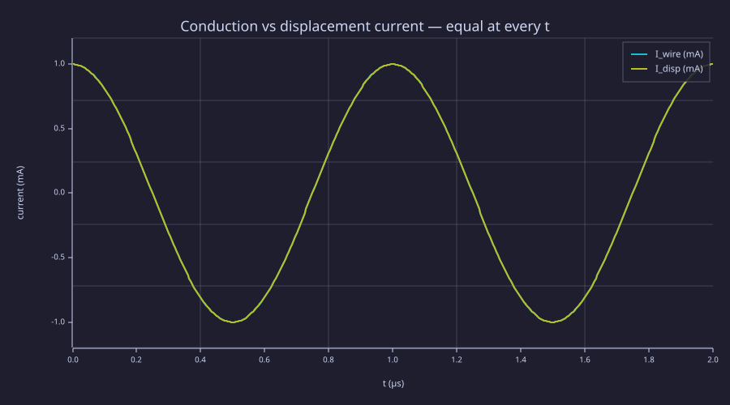
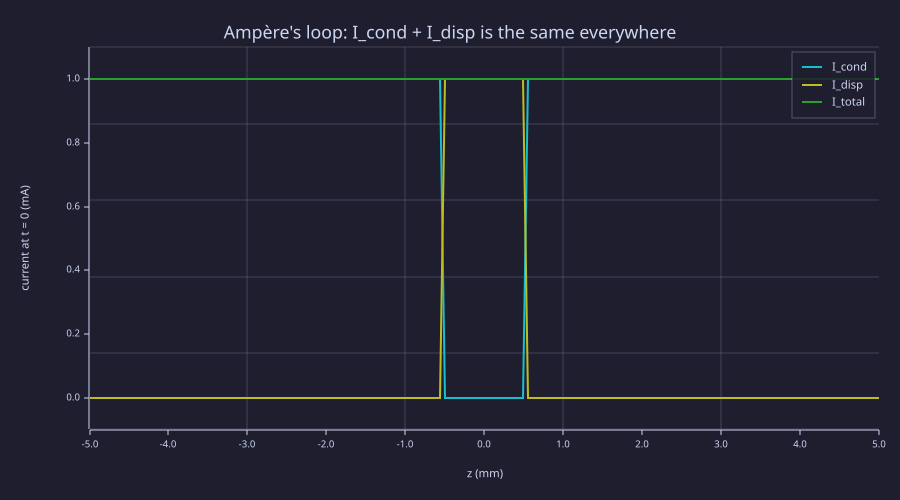
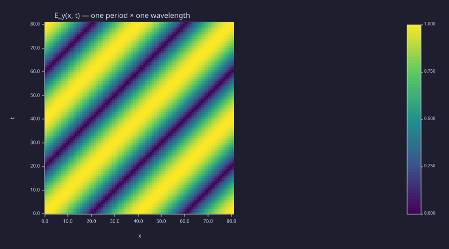
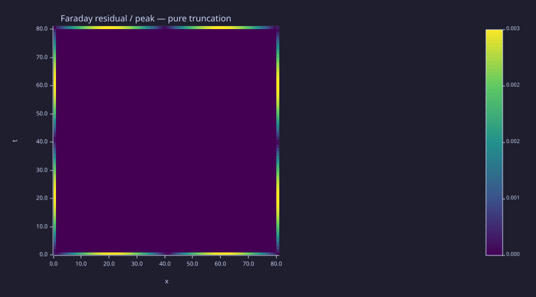
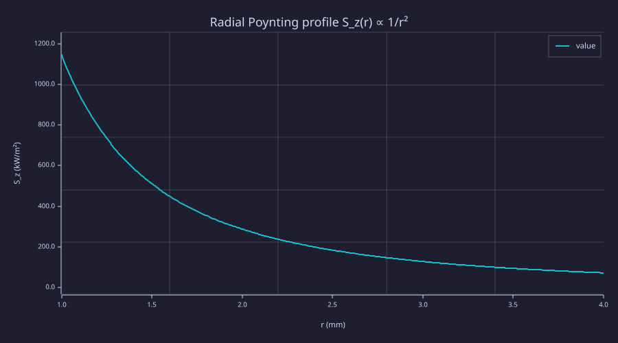

<!-- Generated by rustlab-notebook — do not edit directly. -->

# Lesson 08: Maxwell's Equations — The Complete Set

The first seven lessons assembled the four laws of classical electromagnetism one at a time: Coulomb (Lesson 02) gave $\nabla\cdot\vec E = \rho/\varepsilon_0$, Gauss for magnetism (Lesson 06) gave $\nabla\cdot\vec B = 0$, Faraday (Lesson 07) gave $\nabla\times\vec E = -\partial\vec B/\partial t$, and Ampère (Lesson 06) — *uncorrected* — gave $\nabla\times\vec B = \mu_0\vec J$. That last one is wrong, in a quietly catastrophic way: it is inconsistent with charge conservation the moment $\rho$ varies in time. Maxwell's fix was to add a single term — $\mu_0$ times the **displacement-current density** $\varepsilon_0\,\partial\vec E/\partial t$ — to Ampère's law. Once that term is in place the four equations become self-consistent, predict electromagnetic waves, and admit a clean energy-conservation theorem (Poynting's). This lesson verifies all three of those statements numerically.

## Learning Objectives

- State the four Maxwell equations in differential and integral form, in vacuum and in matter
- Explain why the displacement current is *required* — without it, Ampère's law contradicts charge conservation at any capacitor plate
- Numerically verify that an analytic plane-wave solution satisfies all four equations (residuals → 0 as the grid is refined, second-order)
- Derive Poynting's theorem, identify $\vec S = \vec E\times\vec H$ as the energy flux density, and compute the power flowing through the dielectric of a coaxial cable

## Background

Lessons 01 (curl, divergence theorem), 02–03 (Gauss's law, $\vec E$, $V$), 06 (Ampère, vector potential), 07 (Faraday). Familiarity with the centred-difference operators built in Lesson 01 — `gradient`, `divergence`, `curl` — is assumed throughout.

## The Four Equations

The differential form of Maxwell's equations, in SI units, in a medium with permittivity $\varepsilon$, permeability $\mu$, free charge density $\rho$, and free current density $\vec J$:

$$
\boxed{\;\;
\begin{aligned}
\nabla\cdot\vec D &= \rho        & \quad\text{(Gauss for }\vec E\text{)}\\
\nabla\cdot\vec B &= 0           & \quad\text{(Gauss for }\vec B\text{)}\\
\nabla\times\vec E &= -\frac{\partial\vec B}{\partial t} & \quad\text{(Faraday)}\\
\nabla\times\vec H &= \vec J + \frac{\partial\vec D}{\partial t} & \quad\text{(Ampère–Maxwell)}
\end{aligned}\;\;}
$$

with the constitutive relations $\vec D = \varepsilon\vec E$ and $\vec B = \mu\vec H$ (linear, isotropic, dispersionless materials). In vacuum $\varepsilon = \varepsilon_0$, $\mu = \mu_0$, and the integral form follows from the divergence theorem and Stokes' theorem applied to each:

$$
\oint_{\partial V}\vec D\cdot d\vec A = Q_{\rm enc}, \qquad
\oint_{\partial V}\vec B\cdot d\vec A = 0,
$$

$$
\oint_C \vec E\cdot d\vec\ell = -\frac{d}{dt}\!\int_S \vec B\cdot d\vec A, \qquad
\oint_C \vec H\cdot d\vec\ell = I_{\rm enc} + \frac{d}{dt}\!\int_S \vec D\cdot d\vec A.
$$

The single new piece relative to the static (Lessons 02, 06) and the slow-time (Lesson 07) curricula is the displacement current $\partial\vec D/\partial t$ in Ampère's law. Two lines of algebra show why it must be there.

## Why the Displacement Current Is Required

### Theory

Take the divergence of Ampère's law. The divergence of any curl is zero, so

$$0 = \nabla\cdot(\nabla\times\vec H) = \nabla\cdot\vec J + \frac{\partial}{\partial t}\nabla\cdot\vec D = \nabla\cdot\vec J + \frac{\partial\rho}{\partial t}.$$

This is the **continuity equation** — local charge conservation. If we drop the $\partial\vec D/\partial t$ term we are left with $\nabla\cdot\vec J = 0$, which says that current is everywhere divergence-free. That cannot be right: at a charging capacitor plate, $\vec J$ flows *into* the metal and stops, so $\nabla\cdot\vec J \ne 0$ and the bare-Ampère law fails. The displacement current is exactly the term that lets charge accumulate on the plate while keeping the curl equation consistent.

The cleanest way to see this is to think about the two Ampère-law surfaces one can attach to a single loop encircling the wire of a capacitor circuit. One surface slices the wire and reads out $\int\vec J\cdot d\vec A = I$ (the conduction current). The second surface bulges to one side and slices the *gap between the plates*, where there is no conduction current at all. Without the $\partial\vec D/\partial t$ term, the two surfaces give different answers — Ampère's law would depend on which surface we draw, which is absurd. With the term, both surfaces give the same enclosed current, because $\partial\vec D/\partial t$ in the gap exactly equals $\vec J$ in the wire that is depositing the charge.

### Example — Sinusoidally driven capacitor

Drive a parallel-plate capacitor (plate area $A = 1\,\text{cm}^2$, gap $d = 1\,\text{mm}$) with $I(t) = I_0\cos(\omega t)$, $I_0 = 1\,\text{mA}$, $f = 1\,\text{MHz}$. The accumulated charge is $Q(t) = (I_0/\omega)\sin(\omega t)$, and the gap field is $E(t) = Q(t)/(A\varepsilon_0)$. Compute the displacement current $I_{\rm disp}(t) = \varepsilon_0 A\,\partial E/\partial t$ and overlay it on the conduction current $I(t)$ — they must coincide at every instant.

```rustlab
clf;
eps0 = 8.854187817e-12;
A_cap = 1e-4;          % 1 cm² plate area
d_cap = 1e-3;          % 1 mm gap
freq  = 1.0e6;
omega = 2 * pi * freq;
I0    = 1e-3;

C_cap = eps0 * A_cap / d_cap;
print(C_cap)           % ≈ 8.85e-13 F — parallel-plate capacitance

ts    = linspace(0, 2 / freq, 401);          % two periods
I_t   = I0 * cos(omega * ts);
Q_t   = (I0 / omega) * sin(omega * ts);
E_t   = Q_t / (A_cap * eps0);

% Numerical ∂E/∂t via centred differences.
dt    = ts(2) - ts(1);
Nt    = length(ts);
dEdt  = zeros(Nt);
for i = 2:(Nt - 1)
  dEdt(i) = (E_t(i + 1) - E_t(i - 1)) / (2 * dt);
end
dEdt(1)  = (E_t(2)  - E_t(1))      / dt;
dEdt(Nt) = (E_t(Nt) - E_t(Nt - 1)) / dt;

I_disp_t = eps0 * A_cap * dEdt;

hold on;
plot(ts * 1e6, I_t * 1e3,      "I_wire(t)");
plot(ts * 1e6, I_disp_t * 1e3, "I_disp(t)");
hold off;
xlabel("t  (µs)");
ylabel("current  (mA)");
title("Conduction vs displacement current — equal at every t");
legend("I_wire (mA)", "I_disp (mA)")
```

<!-- rustlab:output-start -->
```text
0.0000000000008854187817000001
```



<!-- rustlab:output-end -->

The two traces lie on top of each other to within $1.6\times10^{-4}$ of $I_0$ — the residual is the centred-difference truncation error on $\partial E/\partial t$, scaling like $(\omega\Delta t)^2/6$. Halving $\Delta t$ would shrink it four-fold.

```rustlab
% Maximum relative discrepancy in the trace interior.
err_int = max(abs(I_t(2:Nt-1) - I_disp_t(2:Nt-1))) / I0;
print(err_int)        % ~ (ω dt)²/6
```

<!-- rustlab:output-start -->
```text
0.0001644852894568203
```

<!-- rustlab:output-end -->

To complete the picture we can plot $I_{\rm cond}(z) + I_{\rm disp}(z)$ along a 1-D axis through wire–plate–gap–plate–wire. In the wire $I_{\rm cond} = I(t)$ and $I_{\rm disp} = 0$; in the gap $I_{\rm cond} = 0$ and $I_{\rm disp} = I(t)$. The *sum* is constant in $z$ — Ampère's law is satisfied on every loop, because the loop's enclosed current is the same no matter which surface we attach.

```rustlab
clf;
% Snapshot at the moment of peak current, t = 0.
I_now   = I0;
J_d_gap = I_now / A_cap;

Nz = 161;
Lz = 5 * d_cap;
zs = linspace(-Lz, Lz, Nz);
I_cond = zeros(Nz);
I_disp = zeros(Nz);
for iz = 1:Nz
  z = zs(iz);
  if z < -d_cap / 2 || z > d_cap / 2
    I_cond(iz) = I_now;
  else
    I_disp(iz) = J_d_gap * A_cap;
  end
end
I_total = I_cond + I_disp;

hold on;
plot(zs * 1e3, I_cond  * 1e3, "I_cond(z)");
plot(zs * 1e3, I_disp  * 1e3, "I_disp(z)");
plot(zs * 1e3, I_total * 1e3, "I_total(z)");
hold off;
xlabel("z  (mm)");
ylabel("current at t = 0  (mA)");
title("Ampère's loop: I_cond + I_disp is the same everywhere");
legend("I_cond", "I_disp", "I_total")
```

<!-- rustlab:output-start -->


<!-- rustlab:output-end -->

The total-current trace is a horizontal line at $1\,\text{mA}$ across the entire stack — wire, gap, wire — independent of $z$. That horizontal line is what Ampère's law sees no matter which surface is attached to a loop around the circuit.

## Maxwell's Equations as a Closed System

### Theory

With the displacement current in place, the four equations form a closed first-order system in $\vec E$ and $\vec B$:

$$
\nabla\cdot\vec E = \rho/\varepsilon_0, \quad \nabla\cdot\vec B = 0, \quad \nabla\times\vec E = -\partial_t\vec B, \quad \nabla\times\vec B = \mu_0\vec J + \mu_0\varepsilon_0\,\partial_t\vec E.
$$

Two consequences fall out immediately. First, in source-free regions ($\rho = 0$, $\vec J = 0$) every Cartesian component of $\vec E$ and $\vec B$ satisfies the **wave equation**:

$$\nabla^2\vec E - \mu_0\varepsilon_0\,\frac{\partial^2\vec E}{\partial t^2} = 0,$$

with phase speed $c = 1/\sqrt{\mu_0\varepsilon_0} \approx 2.998\times10^8\,\text{m/s}$. Lesson 09 picks the wave equation up from here. Second, the simplest non-trivial solution is the linearly polarised plane wave

$$\vec E(\vec r, t) = E_0\,\hat y\cos(k x - \omega t), \qquad \vec B(\vec r, t) = (E_0/c)\,\hat z\cos(k x - \omega t),\qquad \omega = c k.$$

The two transverse components $E_y$ and $B_z$ are tied together: $\vec E\perp\vec B\perp\hat k$, $|E|/|B| = c$, and the two cosines share a phase. Substituting into the four Maxwell equations one verifies they are exactly satisfied. We do that *numerically* below by sampling the analytic solution on a discrete grid and computing the residual of each equation with centred differences — the residuals must vanish in the continuum limit, with second-order convergence.

### Example — Plane wave on an (x, t) grid

Build $E_y(x,t)$ and $B_z(x,t)$ on a 2-D grid covering one wavelength × one period, and compute $\partial/\partial x$ and $\partial/\partial t$ with `gradient`. The two non-trivial residuals (Faraday's $\partial E_y/\partial x + \partial B_z/\partial t$ and Ampère's $-\partial B_z/\partial x - \mu_0\varepsilon_0\,\partial E_y/\partial t$) should be small *and* of equal size — indeed they are, because the plane-wave dispersion relation $\omega = c k$ makes the truncation errors of the two equations identical at every grid point.

```rustlab
clf;
mu0  = 4 * pi * 1e-7;
eps0 = 8.854187817e-12;
c    = 1 / sqrt(mu0 * eps0);
f    = 1.0e9;            % 1 GHz
omega_pw = 2 * pi * f;
k_pw     = omega_pw / c;
lambda   = c / f;
Tper     = 1 / f;
E0_pw    = 1.0;

Nx = 81;
Nt = 81;
xs_pw = linspace(0, lambda, Nx);
ts_pw = linspace(0, Tper,   Nt);
[Xpw, Tpw] = meshgrid(xs_pw, ts_pw);
dx_pw = xs_pw(2) - xs_pw(1);
dt_pw = ts_pw(2) - ts_pw(1);

phase_pw = k_pw * Xpw - omega_pw * Tpw;
Ey       = E0_pw       * cos(phase_pw);
Bz       = (E0_pw / c) * cos(phase_pw);

% Field snapshot — the two diagonal stripes share the same phase.
imagesc(Ey, "viridis");
title("E_y(x, t) — one period × one wavelength");
xlabel("x");
ylabel("t")
```

<!-- rustlab:output-start -->


<!-- rustlab:output-end -->

```rustlab
% Discrete derivatives on the (x, t) grid.
[Ey_x, Ey_t] = gradient(Ey, dx_pw, dt_pw);
[Bz_x, Bz_t] = gradient(Bz, dx_pw, dt_pw);

% Faraday: (curl E)_z + ∂B_z/∂t  →  0
r_faraday = Ey_x + Bz_t;

% Ampère, J = 0:  -∂B_z/∂x - μ0 ε0 ∂E_y/∂t  →  0
r_ampere  = -Bz_x - mu0 * eps0 * Ey_t;

% Normalise by the analytic peak of either side of each equation.
peak_F = E0_pw * k_pw;
peak_A = (E0_pw / c) * k_pw;

print(max(max(abs(r_faraday))) / peak_F)   % ≈ 3 × 10⁻³ at N = 81
print(max(max(abs(r_ampere)))  / peak_A)
```

<!-- rustlab:output-start -->
```text
0.003079498005016296
0.003079498005016913
```

<!-- rustlab:output-end -->

```rustlab
clf;
imagesc(r_faraday / peak_F, "viridis");
title("Faraday residual / peak — pure truncation");
xlabel("x");
ylabel("t")
```

<!-- rustlab:output-start -->


<!-- rustlab:output-end -->

The residuals are not just small — they are *structured*, and the structure is worth reading. In the grid interior the two truncation errors nearly cancel: with $N_x = N_t = 81$ over one wavelength × one period, $k\Delta x = \omega\Delta t$, so the $O(h^2)$ centred-difference errors of $\partial E_y/\partial x$ and $\partial B_z/\partial t$ are identical cosine stripes that subtract away. The maximum residual instead lives on the grid edges, where `gradient` falls back to one-sided stencils: their error is larger but still $O(h^2)$, $\approx (k\Delta x)^2/2 \approx 3.1\times10^{-3}$ at $N = 81$ — exactly the printed value. Because the dominant edge error is still second order, halving the grid spacing drops the maximum residual by a factor of four; the convergence sweep at $N \in \{41, 81, 161\}$ in the standalone `maxwell_consistency.rlab` confirms it (that script produces `residual_convergence.svg`).

The two divergence equations $\nabla\cdot\vec E = 0$ and $\nabla\cdot\vec B = 0$ are satisfied *identically* for a plane wave that has only $E_y$ and $B_z$ — the relevant partial derivatives are zero in our 2-D layout. The plane wave is a self-checking solution: Faraday and Ampère imply $\omega^2 = c^2 k^2$, and the two divergence equations follow from the polarisation choice.

## The Poynting Vector and Energy Flow

### Theory

Take Faraday and Ampère, dot them with $\vec H$ and $\vec E$ respectively, and subtract. After one identity ($\nabla\cdot(\vec E\times\vec H) = \vec H\cdot(\nabla\times\vec E) - \vec E\cdot(\nabla\times\vec H)$) the result is **Poynting's theorem**:

$$\frac{\partial u}{\partial t} + \nabla\cdot\vec S = -\vec J\cdot\vec E, \qquad u = \tfrac12(\vec E\cdot\vec D + \vec B\cdot\vec H), \qquad \vec S = \vec E\times\vec H.$$

The interpretation is local energy conservation: the energy density $u$ in a region changes either because power $\vec J\cdot\vec E$ is being dissipated by free currents (right-hand side) or because the **Poynting vector** $\vec S$ carries energy across the boundary (the divergence on the left). $\vec S$ has units of W/m² — *power per unit area* — and its direction is the local energy flux. In vacuum the energy density reduces to $u = \tfrac12(\varepsilon_0 E^2 + B^2/\mu_0)$; the $\vec E\cdot\vec D$ and $\vec B\cdot\vec H$ form written above also counts the energy stored in a linear dielectric or magnetic medium — which is exactly what the coaxial-cable example below, with its dielectric annulus, requires.

The textbook example that first drove the point home historically is the **DC coaxial cable**: even at DC, where there is no time variation at all, energy flows from the source to the load through the *dielectric* between the conductors, not through the wires. The integrated Poynting flux through any cross-section of the dielectric annulus equals the circuit power $V I$. Setting up the geometry as inner radius $a$, outer radius $b$, voltage $V$ between conductors, current $I$ down the axis,

$$\vec E = \frac{V}{r\ln(b/a)}\,\hat r, \qquad \vec H = \frac{I}{2\pi r}\,\hat\varphi, \qquad \vec S = \frac{V I}{2\pi r^2\ln(b/a)}\,\hat z.$$

The integrated flux through any annular slice $a < r < b$ is

$$\int_a^b S_z(r)\,2\pi r\,dr = \frac{V I}{\ln(b/a)}\int_a^b \frac{dr}{r} = V I,$$

independent of where along the cable we slice. The energy is delivered from source to load by the field in the dielectric; the wires only *guide* the field. (Inside a real, non-superconducting wire there is a small inward radial $\vec S$ that feeds the resistive loss $I^2R$; in a perfect conductor that piece vanishes and 100% of the flux runs in the dielectric.)

### Example — Coaxial cable carrying DC power

Inner radius $a = 1\,\text{mm}$, outer $b = 4\,\text{mm}$, $V = 10\,\text{V}$, $I = 1\,\text{A}$. Predicted circuit power: $V I = 10\,\text{W}$. Compute $S_z(r)$ and check the integrated flux to a few parts per million.

```rustlab
clf;
mu0_c  = 4 * pi * 1e-7;
a_in  = 1.0e-3;
b_out = 4.0e-3;
V_co  = 10.0;
I_co  = 1.0;

% 2-D Cartesian heatmap of S_z.
N_co = 161;
xs_c = linspace(-1.2 * b_out, 1.2 * b_out, N_co);
ys_c = linspace(-1.2 * b_out, 1.2 * b_out, N_co);
[Xc, Yc] = meshgrid(xs_c, ys_c);
Rc = sqrt(Xc .* Xc + Yc .* Yc);

% Vectorised annulus mask via disk_mask difference, plus safe divide.
inner_c = disk_mask(Xc, Yc, 0, 0, a_in);
outer_c = disk_mask(Xc, Yc, 0, 0, b_out);
ann_c   = outer_c - inner_c;
Rc_safe = Rc + (1 - ann_c);
Sz = ann_c * (V_co * I_co / (2 * pi * log(b_out / a_in))) ./ (Rc_safe .^ 2);

imagesc(Sz, "viridis");
title("S_z(x, y) in the coax dielectric  (W/m²)");
xlabel("x");
ylabel("y")
```

<!-- rustlab:output-start -->


<!-- rustlab:output-end -->

```rustlab
% Radial profile + integrated flux over the annulus.
rs_c = linspace(a_in, b_out, 401);
Sz_r = V_co * I_co ./ (2 * pi * rs_c .* rs_c * log(b_out / a_in));
P_int = trapz(rs_c, Sz_r .* (2 * pi * rs_c));
print(P_int)                                  % → 10.000…
print(abs(P_int - V_co * I_co) / (V_co * I_co))   % → ~3 × 10⁻⁶
```

<!-- rustlab:output-start -->
```text
10.00003169965276
0.0000031699652760508457
```

<!-- rustlab:output-end -->

```rustlab
clf;
plot(rs_c * 1e3, Sz_r * 1e-3, "S_z(r)  (kW/m²)");
xlabel("r  (mm)");
ylabel("S_z  (kW/m²)");
title("Radial Poynting profile S_z(r) ∝ 1/r²")
```

<!-- rustlab:output-start -->


<!-- rustlab:output-end -->

The radial profile blows up at the inner conductor ($1/r^2$) and tails off at the outer; integrating against $2\pi r$ tames the inner singularity to a logarithm and gives exactly $V I$. The Poynting picture is what justifies, downstream, why we can compute antenna gain by integrating $\vec S\cdot d\vec A$ over a sphere in the far field (Lessons 12–13).

## Standalone Scripts

| Script | What it computes |
|---|---|
| `maxwell_consistency.rlab` | Plane-wave sample; Faraday and Ampère residuals on an (x,t) grid; second-order convergence sweep |
| `charge_conservation.rlab` | Capacitor I-vs-Q vs displacement current; 1-D snapshot of $I_{\rm cond} + I_{\rm disp}$ along the wire-gap-wire axis |
| `poynting_flow.rlab` | Coax DC: $S_z(x,y)$ heatmap, radial profile, $\int\vec S\cdot d\vec A = V I$ check |

Run all three with `make lesson-08`, or one at a time via `rustlab run lessons/08-maxwell-equations/<name>.rlab`.

## Expected Numerical Outputs Summary

| Quantity | Expected Value |
|---|---|
| Capacitor capacitance ($A=1\,\text{cm}^2$, $d=1\,\text{mm}$) | $\varepsilon_0 A/d \approx 8.85\times10^{-13}\,\text{F}$ |
| $\max\lvert I_{\rm wire}-I_{\rm disp}\rvert/I_0$ at $N_t = 401$, $f = 1\,\text{MHz}$ | $\sim 1.6\times10^{-4}$ (truncation only) |
| Faraday residual / peak at $N = 81$ | $\sim 3\times10^{-3}$ |
| Ampère residual / peak at $N = 81$ | identical to Faraday (plane-wave dispersion ties them) |
| Convergence ratio $N \to 2N$ | $\approx 4$ (second-order centred differences) |
| Coax integrated Poynting flux ($V=10\,\text{V}$, $I=1\,\text{A}$) | $V I = 10\,\text{W}$ |
| Numerical $P_{\rm int}$ vs $V I$ | $\sim 3\times10^{-6}$ relative error at $N_r = 401$ |

## Exercises

1. **Bare Ampère breaks down.** Re-run the capacitor example but compute only the conduction-current Ampère integral on a loop that links the wire — ignore the displacement current entirely. Show that the same loop, with a second surface drawn through the gap, gives zero enclosed current. Conclude that without $\partial\vec D/\partial t$ there is no consistent definition of "the current through this loop."
2. **Sourceless Maxwell residuals as a stencil benchmark.** In `maxwell_consistency.rlab` replace the analytic plane wave with a *standing* wave $E_y(x,t) = E_0\sin(k x)\cos(\omega t)$, $B_z = -(E_0/c)\cos(k x)\sin(\omega t)$. Verify the Faraday and Ampère residuals still vanish to truncation order, and that the standing wave is just the superposition of two counter-propagating plane waves.
3. **Energy conservation along the cable.** Cut the coaxial cable's dielectric into thin axial slabs; compute $\partial u/\partial t$ in each (zero, since DC) and the difference of $\int\vec S\cdot d\vec A$ on the two end caps. Verify the difference is zero — Poynting's theorem at DC reduces to $\nabla\cdot\vec S = 0$ in the dielectric.
4. **Lossy coax.** Add a small uniform conductivity $\sigma_d$ to the dielectric. Compute $\int\vec J\cdot\vec E\,dV$ in the annulus and verify it equals the *difference* between the input-end and output-end Poynting fluxes — the missing power dissipates as heat. (Numerical: pick $\sigma_d$ small enough that $E_r$ and $H_\varphi$ are still well approximated by their lossless forms, and integrate over a finite cable length.)
5. **Wave on a 2-D grid.** Build the same plane wave but on a 2-D $(x,y)$ snapshot at a fixed $t$, with $E_y(x,y) = E_0\cos(k_x x + k_y y)$ and propagation direction $\hat k = (k_x, k_y)/k$. Verify $\vec E\perp\vec k$ and $\vec B = \hat k\times\vec E/c$ component by component; then add a second plane wave with the *opposite* $\hat k$ and confirm the result is a 2-D standing wave with stationary nodal lines.

## What's next

Lesson 09 takes the curl-curl elimination one step further: $\nabla\times(\nabla\times\vec E) = -\partial_t\nabla\times\vec B$ feeds directly into the vector wave equation $\nabla^2\vec E = \mu_0\varepsilon_0\,\partial_t^2\vec E$ in source-free regions. Plane waves, polarisation states, dispersion relations in matter, and reflection from a perfect conductor all live there. The displacement-current term and the Poynting flux from this lesson are the two pieces of physics those derivations rest on; from Lesson 10 on, every full-wave solver discretises the same four equations on a Yee grid and time-steps them by the same logic we used here.
