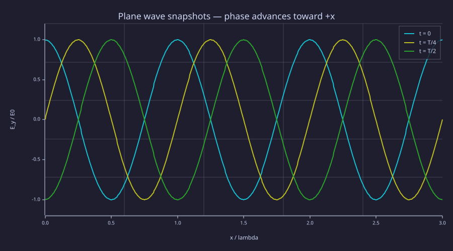
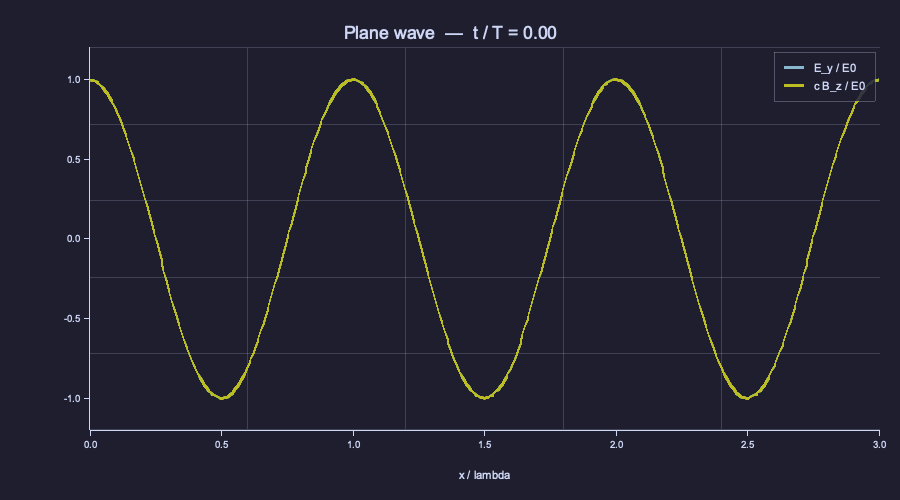
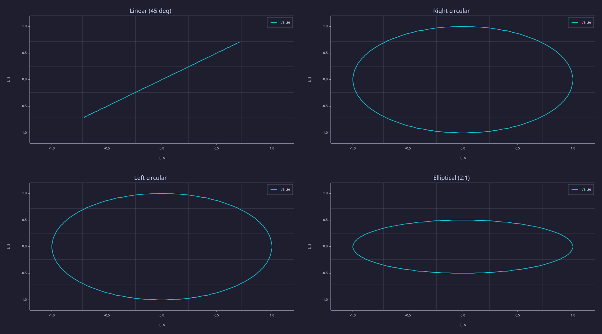
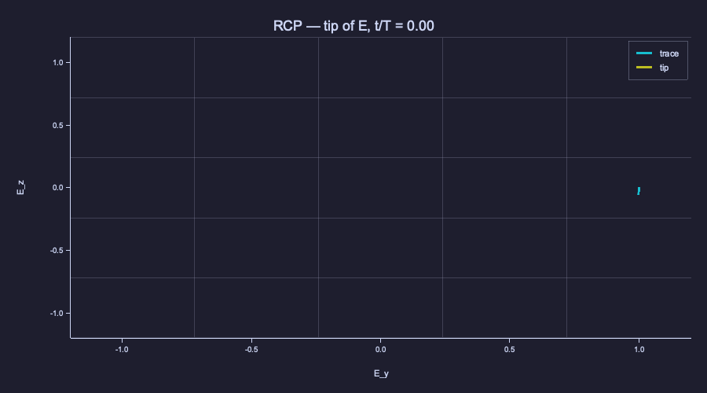
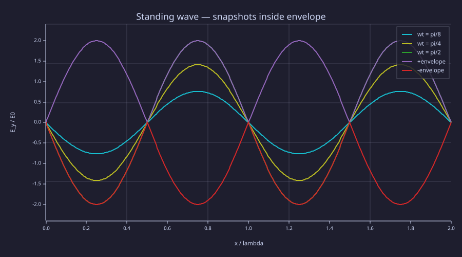
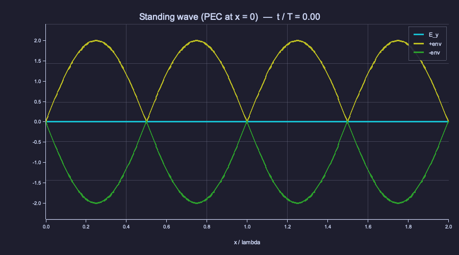

<!-- Generated by rustlab-notebook — do not edit directly. -->

# Lesson 09: EM Wave Equation & Plane Waves

Lesson 08 closed Maxwell's equations: with the displacement current in place, the four equations form a self-consistent first-order system in $\vec E$ and $\vec B$. Eliminating one of the two fields by taking another curl produces a **second-order wave equation** with finite phase speed $c = 1/\sqrt{\mu_0\varepsilon_0}$ — light, radio waves, microwaves, X-rays, and every other electromagnetic phenomenon at every scale all live in the same equation. The simplest solution is the plane wave, characterised by its propagation direction $\hat k$, frequency $\omega$, polarisation, and amplitude. Reflection from a perfect conductor superposes incident and reflected waves into a stationary **standing wave**, the building block of every cavity, transmission line, and optical fibre. This lesson assembles all four pieces — derivation, propagation, polarisation, reflection — and treats time as a first-class coordinate by emitting GIF animations of the propagating fields.

## Learning Objectives

- Derive $\nabla^2\vec E - \mu_0\varepsilon_0\,\partial_t^2\vec E = 0$ from Maxwell's equations in vacuum and read off the phase speed
- Write down a plane-wave solution and verify $\vec E\perp\vec B\perp\hat k$ and $|E|/|B| = c$ from a sampled grid
- Express polarisation states (linear, right- / left-circular, elliptical) as Jones vectors and read off the locus traced by the tip of $\vec E$ in the transverse plane
- Superpose an incident plane wave with its perfect-conductor reflection to build a standing wave; locate nodes and antinodes from the dispersion relation alone
- Produce time-domain animations with rustlab's `frame()` / `saveanim()` builtins

## Background

Lessons 01 (vector calculus, $\nabla^2$, $\nabla\times$), 07 (Faraday), 08 (Maxwell's equations as a closed system, Poynting flux). The animation builtins are documented in [`docs/functions.md`](../dev/rustlab/requests/animation-export.md) under `frame()` and `saveanim()`.

## From Maxwell to the Wave Equation

In a source-free region of vacuum, $\rho = 0$ and $\vec J = 0$, and Maxwell's equations reduce to

$$
\nabla\cdot\vec E = 0, \qquad
\nabla\cdot\vec B = 0, \qquad
\nabla\times\vec E = -\partial_t\vec B, \qquad
\nabla\times\vec B = \mu_0\varepsilon_0\,\partial_t\vec E.
$$

Take the curl of Faraday's law and substitute Ampère for $\nabla\times\vec B$:

$$\nabla\times(\nabla\times\vec E) = -\partial_t(\nabla\times\vec B) = -\mu_0\varepsilon_0\,\partial_t^2\vec E.$$

The vector-calculus identity $\nabla\times(\nabla\times\vec F) = \nabla(\nabla\cdot\vec F) - \nabla^2\vec F$ collapses the left-hand side: $\nabla\cdot\vec E = 0$ in source-free vacuum, so only the Laplacian survives:

$$\boxed{\;\;\nabla^2\vec E - \mu_0\varepsilon_0\,\frac{\partial^2\vec E}{\partial t^2} = 0\;\;}$$

with $c = 1/\sqrt{\mu_0\varepsilon_0} \approx 2.998\times10^8\,\text{m/s}$. The same manipulation on Ampère's law produces the identical equation for $\vec B$. Each Cartesian component of each field separately satisfies the scalar wave equation $(\partial_t^2 - c^2\nabla^2)u = 0$, which has the d'Alembert solutions $u(\vec r, t) = f(\hat k\cdot\vec r - c t) + g(\hat k\cdot\vec r + c t)$ — arbitrary shapes propagating at speed $c$ along $\pm\hat k$.

The simplest non-trivial solution is the monochromatic plane wave $\vec E_0\,e^{i(\vec k\cdot\vec r - \omega t)}$ with $\omega = c|\vec k|$. The two divergence equations force $\vec k\cdot\vec E_0 = 0$ — the field is **transverse**. Faraday's law then dictates $\vec B_0 = (\hat k\times\vec E_0)/c$, locking $\vec B$ perpendicular to *both* $\vec E$ and $\hat k$, with magnitude $|E|/c$. The three vectors $(\vec E,\,\vec B,\,\hat k)$ form a right-handed orthogonal triple at every point in space-time.

## Plane Waves and Phase Velocity

### Theory

Pick the propagation direction along $+\hat x$ and the polarisation along $\hat y$. The complex form is $\vec E = E_0\,\hat y\,e^{i(k x - \omega t)}$, and the real plane wave is

$$\vec E(\vec r, t) = E_0\,\hat y\,\cos(k x - \omega t), \qquad \vec B(\vec r, t) = (E_0/c)\,\hat z\,\cos(k x - \omega t).$$

Three properties to confirm numerically:

- **Transversality and orthogonal triple.** $\vec E\parallel\hat y$, $\vec B\parallel\hat z$, $\hat k = \hat x$, with $\hat y\times\hat z = \hat x$.
- **Amplitude ratio.** $|E_0|/|B_0| = c$ — and *not* the more common $\eta_0 = \sqrt{\mu_0/\varepsilon_0} \approx 376.7\,\Omega$, which is $|E_0|/|H_0|$. The two differ by a factor of $\mu_0$.
- **Phase coherence.** $E_y$ and $B_z$ share the same phase $kx - \omega t$ at every point: their zero crossings, peaks, and troughs coincide.

Phase velocity follows from $kx - \omega t = \text{const}$ ⟹ $dx/dt = \omega/k = c$. Group velocity equals phase velocity in vacuum (no dispersion); in matter the two split, with rich consequences (Lessons 11, 13).

### Example — Snapshots and a propagation animation

A 1 GHz plane wave in vacuum has $\lambda = c/f \approx 30\,\text{cm}$ and $T = 1/f = 1\,\text{ns}$. We sample $E_y(x, t)$ on a 1-D grid spanning three wavelengths and produce three deliverables: a static snapshot at $t = 0,\,T/4,\,T/2$ to visualise +x propagation, a static "$E_y$ vs $cB_z$ at $t = 0$" overlay confirming they coincide, and a GIF animation of both fields traced together over one full period.

```rustlab
clf;
mu0_v  = 4 * pi * 1e-7;
eps0_v = 8.854187817e-12;
c_v    = 1 / sqrt(mu0_v * eps0_v);
f_v    = 1.0e9;
omega_v  = 2 * pi * f_v;
k_v      = omega_v / c_v;
lambda_v = c_v / f_v;
T_v      = 1 / f_v;
E0_v     = 1.0;

Nx_v = 401;
xs_v = linspace(0, 3 * lambda_v, Nx_v);

% Three snapshots illustrating +x propagation.
Ey_t0 = E0_v * cos(k_v * xs_v);
Ey_t1 = E0_v * cos(k_v * xs_v - omega_v * T_v / 4);
Ey_t2 = E0_v * cos(k_v * xs_v - omega_v * T_v / 2);

hold on;
plot(xs_v / lambda_v, Ey_t0, "t = 0");
plot(xs_v / lambda_v, Ey_t1, "t = T/4");
plot(xs_v / lambda_v, Ey_t2, "t = T/2");
hold off;
xlabel("x / lambda");
ylabel("E_y / E0");
title("Plane wave snapshots — phase advances toward +x");
legend("t = 0", "t = T/4", "t = T/2")
```



The cosine envelope shifts to the right by $\lambda/4$ between $t = 0$ and $t = T/4$, and by $\lambda/2$ between $t = 0$ and $t = T/2$ — exactly $c\,\Delta t$ in each case. A trace at fixed $x$ would show pure $\cos(\omega t)$ with the same period as the spatial pattern.

```rustlab
% Verify |E_0|/|B_0| = c numerically.
B0_v   = E0_v / c_v;
print(E0_v / B0_v)               % → c ≈ 2.998e8
```

```text
299792458.0105029
```

```rustlab
% Animation: 60 frames over one full period.
N_frames_pw = 60;
clf;
for kf = 1:N_frames_pw
  t  = (kf - 1) / N_frames_pw * T_v;
  Ey = E0_v * cos(k_v * xs_v - omega_v * t);
  Bz = c_v * B0_v * cos(k_v * xs_v - omega_v * t);
  hold on;
  plot(xs_v / lambda_v, Ey, "E_y / E0");
  plot(xs_v / lambda_v, Bz, "c B_z / E0");
  hold off;
  xlim([0.0, 3.0]);
  ylim([-1.2, 1.2]);
  xlabel("x / lambda");
  title(sprintf("Plane wave  —  t / T = %.2f", t / T_v));
  legend("E_y / E0", "c B_z / E0");
  frame();
end
saveanim("plane_wave.gif", 24)
```



The two curves are identical in the animation — that is the visual statement of $E_y$ and $cB_z$ having equal amplitude and phase. Switching to the complex amplitude form $E_y = \mathrm{Re}(E_0\,e^{i(kx - \omega t)})$ would let us read both magnitude and phase off a single complex array, but for monochromatic vacuum propagation the real form is enough.

## Polarisation

### Theory

The polarisation of a plane wave is the time evolution of the transverse electric vector $(E_y, E_z)$ at a fixed point in space, conventionally $x = 0$. Writing the complex amplitude as a two-component **Jones vector** $\vec J = (J_y,\,J_z)$, the real field is

$$\vec E(0, t) = \mathrm{Re}\bigl[\vec J\,e^{-i\omega t}\bigr] = (\mathrm{Re}\,J_y\,\cos\omega t + \mathrm{Im}\,J_y\,\sin\omega t,\;\mathrm{Re}\,J_z\,\cos\omega t + \mathrm{Im}\,J_z\,\sin\omega t).$$

Four canonical states:

| State | Jones vector | Locus in $(E_y, E_z)$ |
|---|---|---|
| Linear, $45^\circ$ | $\tfrac{1}{\sqrt 2}(1,\,1)$ | line at $E_z = E_y$ |
| Right circular (RCP) | $\tfrac{1}{\sqrt 2}(1,\,-i)$ | unit circle, **clockwise** viewed from $+x$ toward source |
| Left circular (LCP) | $\tfrac{1}{\sqrt 2}(1,\,+i)$ | unit circle, counter-clockwise |
| Elliptical, axis ratio $2{:}1$ | $(1,\,0.5\,i)$ | $2{:}1$ ellipse, same handedness as LCP |

Handedness conventions vary — the IEEE/physics convention used here calls a wave **right-circular** if the tip rotates clockwise *as seen looking back toward the source* (i.e. against the propagation direction). Optics texts often use the opposite. Spelling out the time-step rule — "$E_y(0)=1$, then $E_z$ becomes negative for RCP" — leaves no room for ambiguity.

Two physical consequences. First, an unpolarised source (a thermal lamp, the Sun) is a stochastic mixture of polarisations and admits no fixed Jones vector — it is described instead by the $2\times 2$ coherency matrix or the four Stokes parameters. Second, a **polarising filter** projects $\vec J$ onto a one-dimensional subspace, attenuating by $|\hat J_{\rm pass}\cdot\vec J|^2$ (Malus's law for linear filters).

### Example — Four loci and a circular-polarisation animation

Sample one period of $\omega t \in [0, 2\pi)$ for each Jones vector, plot the four loci as a $2\times 2$ subplot, then animate the tip of $\vec E$ for the right-circular state.

```rustlab
clf;
N_p  = 200;
ts_p = linspace(0, 1, N_p + 1);
ts_p = ts_p(1:N_p);
phs_p = 2 * pi * ts_p;

% Linear at 45°
Ly_p = (1 / sqrt(2)) * cos(phs_p);
Lz_p = (1 / sqrt(2)) * cos(phs_p);

% RCP: E_y = cos(ωt), E_z = -sin(ωt) → CW viewed from +x toward source.
Ry_p =  cos(phs_p);
Rz_p = -sin(phs_p);

% LCP: opposite handedness.
Ly_circ = cos(phs_p);
Lz_circ = sin(phs_p);

% Elliptical (2:1, same handedness as LCP).
Ey_ell = cos(phs_p);
Ez_ell = 0.5 * sin(phs_p);

subplot(2, 2, 1);
plot(Ly_p, Lz_p, "linear");
xlim([-1.2, 1.2]); ylim([-1.2, 1.2]);
xlabel("E_y"); ylabel("E_z");
title("Linear (45 deg)");

subplot(2, 2, 2);
plot(Ry_p, Rz_p, "RCP");
xlim([-1.2, 1.2]); ylim([-1.2, 1.2]);
xlabel("E_y"); ylabel("E_z");
title("Right circular");

subplot(2, 2, 3);
plot(Ly_circ, Lz_circ, "LCP");
xlim([-1.2, 1.2]); ylim([-1.2, 1.2]);
xlabel("E_y"); ylabel("E_z");
title("Left circular");

subplot(2, 2, 4);
plot(Ey_ell, Ez_ell, "elliptical");
xlim([-1.2, 1.2]); ylim([-1.2, 1.2]);
xlabel("E_y"); ylabel("E_z");
title("Elliptical (2:1)")
```



The four loci are immediately readable: a diagonal line, two oppositely oriented circles, and an axis-aligned ellipse. The animation below sweeps a marker around the RCP circle in real time so the *direction* of rotation is unambiguous.

```rustlab
clf;
N_frames_pol = 60;
for kf = 1:N_frames_pol
  m = round(kf * N_p / N_frames_pol);
  if m < 2; m = 2; end
  trace_y = Ry_p(1:m);
  trace_z = Rz_p(1:m);
  tip_y   = [Ry_p(m)];
  tip_z   = [Rz_p(m)];
  hold on;
  plot(trace_y, trace_z, "trace");
  plot(tip_y,   tip_z,   "tip");
  hold off;
  xlim([-1.2, 1.2]);
  ylim([-1.2, 1.2]);
  xlabel("E_y");
  ylabel("E_z");
  title(sprintf("RCP — tip of E, t/T = %.2f", (kf - 1) / N_frames_pol));
  legend("trace", "tip");
  frame();
end
saveanim("polarization_rcp.gif", 24)
```



Every plane wave decomposes into RCP + LCP components at fixed amplitude and phase — the chiral basis $\{\hat e_+,\,\hat e_-\}$ is just as fundamental as the Cartesian basis $\{\hat y,\,\hat z\}$, and is preferred when discussing media that respond differently to the two handedness states (Faraday rotation, the quarter-wave plate).

## Standing Waves at a Perfect Conductor

### Theory

A perfect electric conductor (PEC) cannot sustain a tangential electric field, so the boundary condition at the conductor surface is $\vec E_{\rm tan} = 0$ at all times. An incident plane wave hitting a PEC at $x = 0$ from the $+x$ side must therefore generate a reflected wave with a $\pi$ phase flip on the tangential component:

$$\vec E_{\rm inc}(x, t) = E_0\,\hat y\,\cos(k x + \omega t), \qquad \vec E_{\rm refl}(x, t) = -E_0\,\hat y\,\cos(k x - \omega t).$$

Their sum is

$$\vec E(x, t) = E_0\,\hat y\bigl[\cos(k x + \omega t) - \cos(k x - \omega t)\bigr] = -2E_0\,\hat y\,\sin(k x)\sin(\omega t),$$

the **standing wave**: the spatial dependence $\sin(kx)$ and the temporal dependence $\sin(\omega t)$ are now factored. There is no propagation — the field oscillates in place between an envelope $\pm 2E_0|\sin kx|$, with **nodes** (permanent zeros) at $kx = n\pi$ ⟺ $x = n\lambda/2$ and **antinodes** (peak amplitude $2E_0$) at $kx = (n+\tfrac12)\pi$ ⟺ $x = (2n+1)\lambda/4$. The boundary condition $E_y(0, t) = 0$ is satisfied trivially because $\sin(0) = 0$ for any $t$.

The corresponding magnetic field, by Faraday, picks up a *cosine* spatial profile:

$$B_z(x, t) = -2(E_0/c)\,\cos(k x)\cos(\omega t),$$

which is *maximum* at $x = 0$ (the antinode of $B$ coincides with the node of $E$) — a $\lambda/4$ spatial offset. This is why the surface current on the conductor, $K_z = H_z\,(\text{tangential at the surface})$, is what dissipates the wave's energy in a real (lossy) reflector: the magnetic field plows into the metal at the same instant the electric field cancels.

### Example — Standing-wave field, envelope, animation

A 1 GHz wave reflects off a PEC at $x = 0$. We sample two wavelengths into the half-space $x > 0$ and produce four artefacts: numerical proof that $E(0, t) = 0$ for all $t$, three time snapshots showing the field oscillating inside the envelope, the envelope alone (so the node positions are unmistakable), and a GIF over one period.

```rustlab
clf;
mu0_s  = 4 * pi * 1e-7;
eps0_s = 8.854187817e-12;
c_s    = 1 / sqrt(mu0_s * eps0_s);
f_s    = 1.0e9;
omega_s  = 2 * pi * f_s;
k_s      = omega_s / c_s;
lambda_s = c_s / f_s;
T_s      = 1 / f_s;
E0_s     = 1.0;

Nx_s = 401;
xs_s = linspace(0, 2 * lambda_s, Nx_s);

% Verify E_y(x = 0, t) = 0 for a sweep of times.
ts_test = linspace(0, T_s, 21);
Ey_at_0 = -2 * E0_s * sin(0) * sin(omega_s * ts_test);
print(max(abs(Ey_at_0)))            % → 0 (analytic, machine-precision)

% Three time snapshots within (0, T/4).
phases = [pi / 8, pi / 4, pi / 2];
Ey1 = -2 * E0_s * sin(k_s * xs_s) * sin(phases(1));
Ey2 = -2 * E0_s * sin(k_s * xs_s) * sin(phases(2));
Ey3 = -2 * E0_s * sin(k_s * xs_s) * sin(phases(3));
envelope = 2 * E0_s * abs(sin(k_s * xs_s));

hold on;
plot(xs_s / lambda_s, Ey1, "wt = pi/8");
plot(xs_s / lambda_s, Ey2, "wt = pi/4");
plot(xs_s / lambda_s, Ey3, "wt = pi/2");
plot(xs_s / lambda_s,  envelope, "+envelope");
plot(xs_s / lambda_s, -envelope, "-envelope");
hold off;
xlabel("x / lambda");
ylabel("E_y / E0");
title("Standing wave — snapshots inside envelope");
legend("wt = pi/8", "wt = pi/4", "wt = pi/2", "+envelope", "-envelope")
```

```text
0
```



The three snapshots all lie inside the same envelope $\pm 2E_0|\sin kx|$, with the snapshot at $\omega t = \pi/2$ (i.e. $t = T/4$) coinciding with the upper envelope itself. Nodes at $x = 0,\,\lambda/2,\,\lambda,\,3\lambda/2,\,2\lambda$ show up as forced zeros every snapshot. The animation below sweeps over an entire period: the field "breathes" between the two envelopes without translating, and the boundary condition holds frame-by-frame.

```rustlab
clf;
N_frames_sw = 60;
for kf = 1:N_frames_sw
  t  = (kf - 1) / N_frames_sw * T_s;
  Ey = -2 * E0_s * sin(k_s * xs_s) * sin(omega_s * t);
  hold on;
  plot(xs_s / lambda_s, Ey, "E_y(x, t)");
  plot(xs_s / lambda_s,  envelope, "+env");
  plot(xs_s / lambda_s, -envelope, "-env");
  hold off;
  xlim([0.0, 2.0]);
  ylim([-2.4, 2.4]);
  xlabel("x / lambda");
  title(sprintf("Standing wave (PEC at x = 0)  —  t / T = %.2f", t / T_s));
  legend("E_y", "+env", "-env");
  frame();
end
saveanim("standing_wave.gif", 24)
```



The same pair of incident + reflected waves with a *non*-PEC reflector (finite impedance, dielectric, conductor with finite $\sigma$) produces a reflection coefficient $|\Gamma| < 1$ and a partial standing-wave pattern with non-zero minima — the **VSWR** that Lesson 13 quantifies on transmission lines, and that every microwave engineer's network analyser measures.

## Standalone Scripts

| Script | What it computes |
|---|---|
| `plane_wave.rlab` | Three-snapshot SVG, $E_y$-vs-$cB_z$ overlay, animated GIF over one period |
| `polarization.rlab` | $2\times 2$ subplot of the four canonical loci, GIF of the RCP tip rotating |
| `standing_wave.rlab` | Three time snapshots inside the envelope, envelope-only SVG, GIF |

Run all three with `make lesson-09`, or one at a time via `rustlab run lessons/09-em-waves/<name>.rlab`.

## Expected Numerical Outputs Summary

| Quantity | Expected Value |
|---|---|
| Phase speed $c = 1/\sqrt{\mu_0\varepsilon_0}$ | $2.998\times10^8\,\text{m/s}$ |
| Wavelength at $f = 1\,\text{GHz}$ | $\lambda = c/f \approx 0.2998\,\text{m}$ |
| $\|E_0\|/\|B_0\|$ | $c$ (printed) |
| $\|E_0\|/\|H_0\| = \mu_0 c$ | $\eta_0 \approx 376.73\,\Omega$ |
| Standing-wave node positions | $x = n\lambda/2$ |
| Standing-wave antinode positions | $x = (2n+1)\lambda/4$ |
| Peak standing-wave amplitude | $2 E_0$ |
| $\max\lvert E_y(x=0,t)\rvert$ over $t$ | $0$ (PEC boundary, exact) |

## Exercises

1. **Phase velocity from a single grid sample.** From the propagation-animation snapshots, fit a straight line to the position of the leading zero crossing of $E_y$ vs $t$. Verify the slope equals $c$ to within the grid spacing $\Delta x$.
2. **$\eta_0$ from the wave.** Compute $|E|/|H|$ at any point; you should get $\eta_0 = \mu_0 c \approx 376.73\,\Omega$. This is the **impedance of free space**, the value that every antenna, waveguide, and transmission line is matched against (Lesson 13).
3. **Add an RCP plus LCP.** Combine equal-amplitude RCP and LCP plane waves in `polarization.rlab` and verify that the tip of $\vec E$ traces a *line* in the $(E_y, E_z)$ plane — circular polarisation is just two equal-and-opposite chiralities of linear polarisation. This is the basis for quarter-wave-plate polarisation conversion in optics.
4. **Phase mismatch standing wave.** In `standing_wave.rlab`, replace the perfect $-1$ reflection with $\Gamma = -0.7$ (a finite-impedance reflector). Measure the VSWR $= (1+|\Gamma|)/(1-|\Gamma|)$ from the ratio of $|E|_{\max}$ to $|E|_{\min}$ along the line and compare to the analytic value.
5. **Transverse standing wave.** Replace the PEC at $x = 0$ with two PECs at $x = 0$ and $x = L$, supporting only modes with $kL = n\pi$. Plot the first three transverse modes ($n = 1, 2, 3$) and verify their resonant frequencies $f_n = n c/(2L)$. This is the 1-D version of the rectangular cavity in Lesson 12.

## What's next

Lesson 10 turns the single-frequency wave equation into a numerical solver: the **frequency-domain finite-difference (FDFD)** method discretises the curl-curl operator on a Yee grid, swaps $\partial_t \to -i\omega$, and hands a single sparse complex linear system to `spsolve`. Lesson 11 takes the dual route: keep time as a coordinate and march the Yee staggered fields forward via leapfrog updates — the **finite-difference time-domain (FDTD)** algorithm that powers most of commercial electromagnetic simulation. Both pick up where this lesson leaves off: Lesson 09's analytic plane wave is the test source they validate against, and the standing wave is the simplest geometry whose numerical reflection coefficient must come out right before tackling anything bigger.

