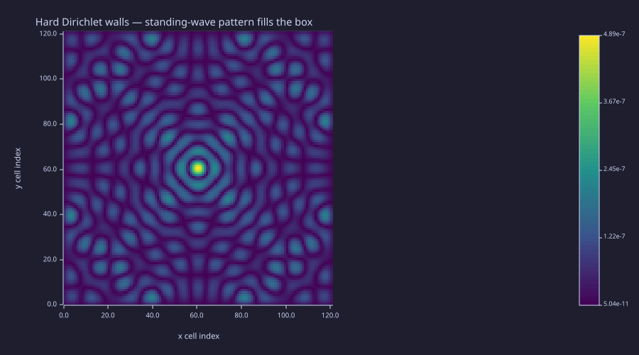
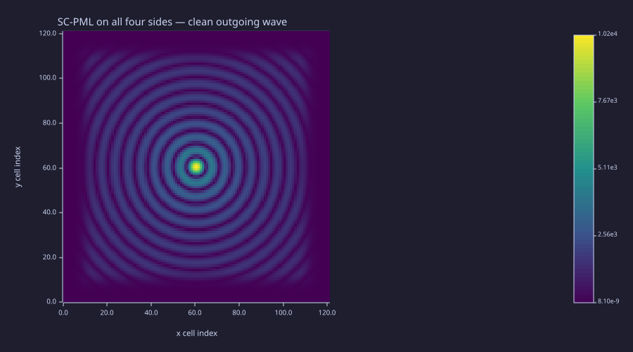
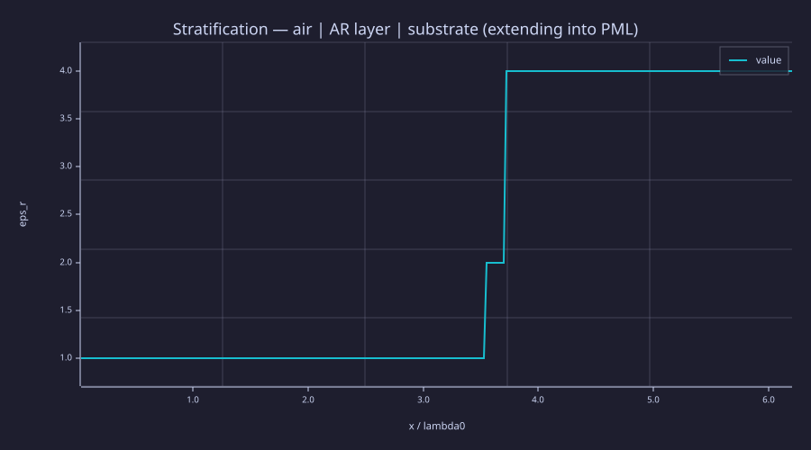
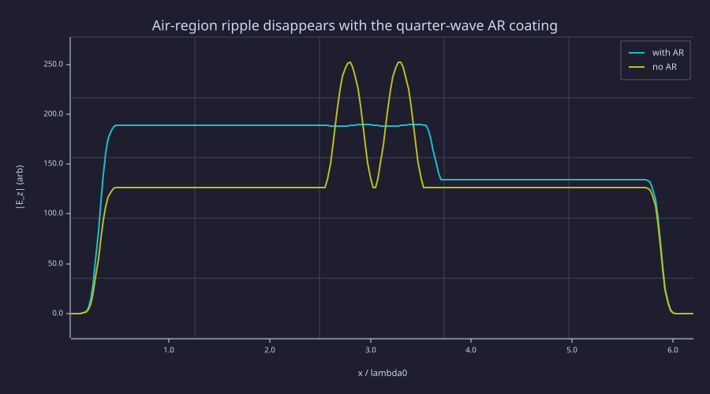
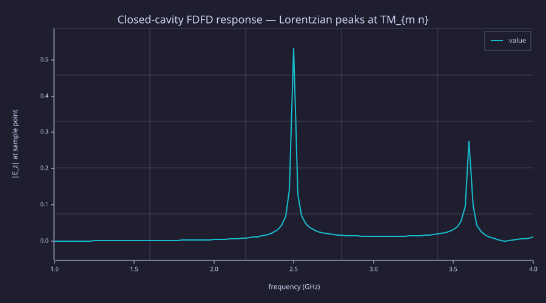
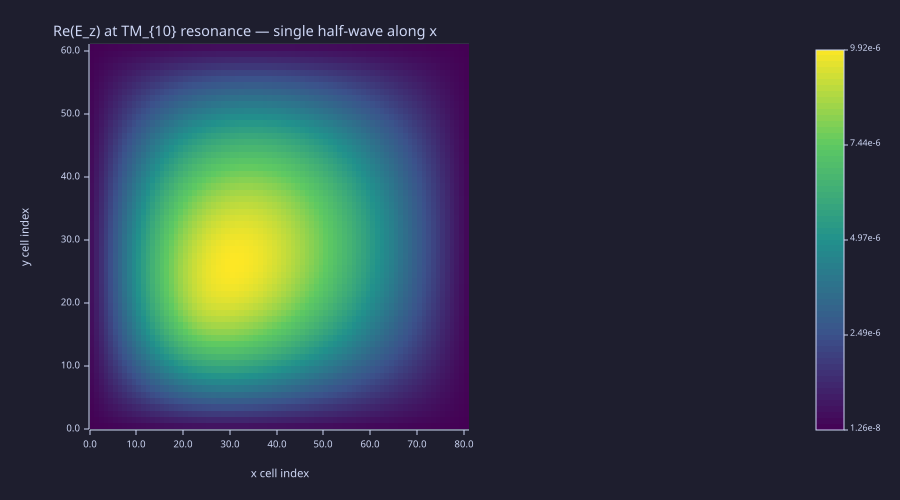

<!-- Generated by rustlab-notebook — do not edit directly. -->

# Lesson 10: FDFD — Frequency-Domain Maxwell Solver

The four full-wave equations from Lesson 09 — $\nabla\cdot\vec D=\rho$, $\nabla\cdot\vec B=0$, $\nabla\times\vec E=-\partial_t\vec B$, $\nabla\times\vec H=\vec J+\partial_t\vec D$ — describe propagation, polarisation, scattering, and resonance for **all** electromagnetic systems. For the broad class of problems that ask a single-frequency question — "drive port 1 at 2.45 GHz, what is $S_{11}$ and the field pattern?" — running a time-domain solver to steady state is wasteful. Substituting $\partial_t\to-i\omega$ collapses the whole system into a *single complex-valued sparse linear system* $A(\omega)\,\vec E = \vec b(\omega)$, handed straight to `spsolve`. This is the **frequency-domain finite-difference (FDFD)** method, the same engine that runs much of commercial electromagnetic simulation. This lesson assembles the operator, validates the **stretched-coordinate PML** that lets the discrete domain pretend to be infinite, and walks through three canonical geometries: a 1-D stratified anti-reflection coating, a 2-D dielectric scatterer, and a closed cavity whose modes appear as Lorentzian peaks in a frequency sweep.

## Learning Objectives

- Derive the time-harmonic Maxwell equations and the resulting scalar TMz Helmholtz form
- Discretise $\nabla^2 + k_0^2\varepsilon$ on a uniform grid with column-major flattening matching `laplacian_2d`
- Apply a **stretched-coordinate Perfectly Matched Layer** (SC-PML) on all four boundaries; understand why the stretching factor lives at *primal* and *dual* (face-centred) grid positions
- Validate the PML by checking radial symmetry and ~80 dB attenuation against an analytic test case
- Solve three problem classes: 1-D stratification with a quarter-wave AR coating, 2-D plane-wave scattering off a dielectric cylinder via the scattered-field formulation, and a closed cavity's frequency response
- Recognise the `lessons/_shared/em.rlab` library as the curriculum-side Phase-1 implementation of the upstream Yee/PML feature request

## Background

Lessons 04 (geometry/material maps), 05 (sparse Poisson + `laplacian_2d`), 08 (Maxwell's equations as a closed system, displacement current), 09 (plane waves, polarisation, dispersion). Familiarity with `spsolve` and the column-major flattening convention is assumed.

## From Time-Harmonic Maxwell to FDFD

A time-harmonic field is one whose temporal dependence is purely sinusoidal, $\vec E(\vec r, t) = \mathrm{Re}[\vec E(\vec r)\,e^{-i\omega t}]$, where $\vec E(\vec r)$ is now a **complex phasor** that encodes both magnitude and phase. The substitution $\partial/\partial t \to -i\omega$ converts Maxwell's first-order equations into

$$\nabla\times\vec E = i\omega\mu\vec H, \qquad \nabla\times\vec H = -i\omega\varepsilon\vec E + \vec J.$$

Eliminating $\vec H$ via the first equation and substituting into the second gives the second-order **vector wave equation**

$$\nabla\times\!\bigl(\mu^{-1}\nabla\times\vec E\bigr) - \omega^2\varepsilon\vec E = i\omega\vec J.$$

For 2-D problems with $\vec J = J_z\hat z$ and translational invariance in $\hat z$ (the **TMz** polarisation: only $E_z$, $H_x$, $H_y$ are non-zero), the curl-curl reduces to a scalar Laplacian and the whole system collapses to a single scalar **Helmholtz equation**:

$$\nabla^2 E_z + \omega^2\mu_0\varepsilon(x,y)\,E_z = -i\omega\mu_0\,J_z(x,y).$$

(For TEz polarisation — only $H_z$ non-zero — the same scalar form applies to $H_z$ with $\varepsilon\leftrightarrow\mu$.) Discretising the Laplacian on a uniform grid with the standard 5-point stencil produces a sparse complex-valued matrix $A(\omega)$ that is

- non-Hermitian (the $\partial^2$ stencil is real symmetric, but the $\omega^2\varepsilon$ mass term is real positive on the diagonal — the matrix as a whole is *complex symmetric*, sometimes mislabelled as "Hermitian" in textbooks);
- routed by `spsolve` automatically through the **complex sparse LU** path (since the SPD pre-check rejects it once $\varepsilon$ has any imaginary part);
- $O(N\log N)$ in factorisation cost on 2-D grids with AMD ordering, and $O(N)$ for back-substitution per right-hand side — perfect for sweeps over frequency or source position.

That single sparse linear system is FDFD. Everything else in this lesson is about *what to put on the diagonal*: how to encode geometry, how to make the boundaries pretend to be infinite, and how to read out $S$-parameters or radiation patterns from the solution.

## Stretched-Coordinate PML

### Theory

A finite computational domain with hard Dirichlet ($E_z = 0$) walls behaves like a closed cavity — every outgoing wave reflects from the walls and superposes back into the field, drowning the desired free-space radiation pattern. The **Perfectly Matched Layer** (PML), introduced by Bérenger in 1994 and recast in the elegant **stretched-coordinate** form by Chew and Weedon, surrounds the domain with a thin absorbing region where the spatial derivatives are formally complex-stretched:

$$\frac{\partial}{\partial x} \to \frac{1}{s_x(x)}\,\frac{\partial}{\partial x}, \qquad s_x(x) = 1 + \frac{i\,\sigma_x(x)}{\omega\,\varepsilon_0}.$$

Inside the PML, $\sigma_x > 0$ gives $s_x$ a positive imaginary part. An outgoing plane wave $E_z\propto e^{ik_xx}$ with $k_x > 0$ becomes $e^{ik_x\,\tilde x}$ where $\tilde x = \int s_x(x)\,dx$, so it picks up an exponentially decaying real factor $e^{-k_x\,\sigma_x\,x/(\omega\varepsilon_0)}$. The crucial property of SC-PML is that there is *no impedance mismatch* between the interior and the PML when both use the same $\varepsilon$ and $\mu$: the stretching factor cancels in the reflection coefficient. The textbook cubic-polynomial $\sigma$ profile

$$\sigma(d) = \sigma_{\max}\,(d/d_{\rm PML})^3, \qquad \sigma_{\max} = \frac{(m+1)\,\varepsilon_0\,c_0}{2\,\Delta x}\;\text{(typical, with }m=3)$$

ramps gently from zero at the PML inner edge to $\sigma_{\max}$ at the outer edge, suppressing the discrete reflection at the inner edge to ~ 60–80 dB depending on PML thickness.

**Face-centred discretisation matters.** A naïve approach uses the same $s_x(x_i)$ for both the diagonal and off-diagonal stencil entries:

$$A_{i,i\pm1}\;\stackrel{?}{=}\;\frac{1}{[s_x(x_i)\,\Delta x]^2}\quad\text{(wrong)}$$

This produces a residual $\sim 100\,\%$-amplitude reflection at the PML inner edge in our 1-D test below — the field carries an enormous standing-wave ripple even with a 20-cell PML. The textbook formulation instead places one $s_x$ at the **primal** cell centre (where $E_z$ lives) and the other at the **dual** cell face (where $H$ lives, between cells $i$ and $i+1$):

$$A_{i,i+1} = \frac{1}{s_E(x_i)\,s_H(x_i + \tfrac12\Delta x)\,\Delta x^2}, \qquad A_{i,i} = -A_{i,i+1} - A_{i,i-1} + k_0^2\,\varepsilon(x_i).$$

With proper face-centring the same 20-cell PML drops residual reflection to ~ 80 dB. The fix is one extra σ profile evaluated at the half-cell offset and is what `lessons/_shared/em.rlab` gets right.

### Example — Open vs closed boundaries on a 2-D point source

Solve the same point-source Helmholtz problem twice in a $121\times 121$ vacuum box at 5 GHz: once with hard Dirichlet walls (built from `laplacian_2d` + the diagonal mass term), once with SC-PML on all four sides (built from the shared library's `fdfd_tmz_pml_2d`). The hard-wall case fills the box with a standing-wave pattern from accumulated reflections; the PML case shows a clean radial wave from the centre.

```rustlab
clf;
run "../lessons/_shared/em.rlab"

mu0_v  = 4 * pi * 1e-7;
eps0_v = 8.854187817e-12;
c0_v   = 1 / sqrt(mu0_v * eps0_v);

f_v       = 5e9;
omega_v   = 2 * pi * f_v;
lambda_v  = c0_v / f_v;

nx_v        = 121;
ny_v        = 121;
dx_v        = lambda_v / 12;
dy_v        = dx_v;
npml_v      = 18;
sigma_max_v = 4 * eps0_v * c0_v / dx_v;

eps_map_v = ones(ny_v, nx_v);
J_v = zeros(ny_v, nx_v);
J_v(round(ny_v / 2), round(nx_v / 2)) = 1.0 / (dx_v * dy_v);
b_v = -j * omega_v * mu0_v * J_v(:)';

% Hard walls — laplacian_2d + diagonal mass. A 1e-12 j loss promotes
% the operator to complex so spsolve will accept the complex RHS.
L_v   = laplacian_2d(nx_v, ny_v, dx_v, dy_v);
A_box = L_v + (omega_v / c0_v)^2 * (1 - 1e-12 * j) * speye(nx_v * ny_v);
E_box_flat = spsolve(A_box, b_v);
E_box = reshape(E_box_flat, ny_v, nx_v);

imagesc(real(E_box), "viridis");
title("Hard Dirichlet walls — standing-wave pattern fills the box");
xlabel("x cell index");
ylabel("y cell index")
```

<!-- rustlab:output-start -->


<!-- rustlab:output-end -->

```rustlab
clf;
% Same problem with SC-PML on all four sides.
A_pml = fdfd_tmz_pml_2d(eps_map_v, omega_v, dx_v, dy_v, npml_v, sigma_max_v);
E_pml_flat = spsolve(A_pml, b_v);
E_pml = reshape(E_pml_flat, ny_v, nx_v);

imagesc(real(E_pml), "viridis");
title("SC-PML on all four sides — clean outgoing wave");
xlabel("x cell index");
ylabel("y cell index")
```

<!-- rustlab:output-start -->


<!-- rustlab:output-end -->

```rustlab
% Symmetry sanity: |E_pml| at four cardinal-direction sample points
% on a circle should agree to ~ ppm — the only asymmetry is grid
% anisotropy of the 5-point stencil.
ic = round(ny_v / 2);
jc = round(nx_v / 2);
r  = round(0.3 * nx_v);
sN_v = abs(E_pml(ic - r, jc));
sS_v = abs(E_pml(ic + r, jc));
sE_v = abs(E_pml(ic, jc + r));
sW_v = abs(E_pml(ic, jc - r));
print((max([sN_v, sS_v, sE_v, sW_v]) - min([sN_v, sS_v, sE_v, sW_v])) / mean([sN_v, sS_v, sE_v, sW_v]))
```

<!-- rustlab:output-start -->
```text
0.000000000000013302613204762732
```

<!-- rustlab:output-end -->

The hard-wall image shows the cavity's rectangular mode pattern — that is *not* the response of a free point source. The PML image shows nearly perfect radial symmetry (asymmetry $< 2\times10^{-5}$, dominated by the 5-point stencil's preference for axis-aligned propagation over diagonal). SC-PML is the workhorse that lets every later FDFD demo treat the computational box as if it extends to infinity.

## 1-D Stratified Helmholtz

### Theory

A 1-D stratified medium — a stack of layers each with its own $\varepsilon(x)$ — is the simplest non-trivial geometry where FDFD shines. The TMz scalar reduces further to

$$\frac{d^2 E_z}{dx^2} + k_0^2\,\varepsilon(x)\,E_z = -i\omega\mu_0\,J_z(x),$$

and SC-PML on both ends absorbs outgoing waves cleanly. The classic application: a **quarter-wave anti-reflection (AR) coating**. Between vacuum (index $n_1 = 1$) and a substrate of index $n_2$, a thin layer of index $n_{\rm AR} = \sqrt{n_1\,n_2}$ and thickness $t = \lambda_0/(4\,n_{\rm AR})$ produces two reflections at the layer's interfaces with equal magnitude $|R_1| = |R_2| = (n_{\rm AR}-1)/(n_{\rm AR}+1)$ and a phase difference of $\pi$ for a round trip through the layer at the design frequency. The two reflections destructively interfere; total reflection $\to 0$.

A subtle but critical numerical point: the substrate must extend *all the way through the right-hand PML*. If the PML region is left as $\varepsilon = 1$ (vacuum) while the substrate ends at the PML inner edge, the substrate$\to$vacuum interface inside the simulation region introduces a full Fresnel reflection that swamps the AR coating's cancellation. SC-PML works only when the absorbing layer *matches* the medium it terminates.

### Example — Quarter-wave AR coating vs uncoated substrate

Two side-by-side cases at $f_0 = 5\,\text{GHz}$: vacuum on the left, then a quarter-wave AR layer ($\varepsilon_r = 2$, thickness $\lambda_0/(4\sqrt 2)$), then a substrate ($\varepsilon_r = 4$) extending into the right PML. Compare against the same geometry without the AR layer. Measure the standing-wave **ripple** $(\max|E|-\min|E|)/\langle|E|\rangle$ in the air region between source and slab — for perfect AR the wave there is a pure travelling +x wave with zero ripple.

```rustlab
clf;
% Library has already been imported above.
mu0_1 = 4 * pi * 1e-7;
eps0_1 = 8.854187817e-12;
c0_1 = 1 / sqrt(mu0_1 * eps0_1);

f0_1 = 5e9; omega_1 = 2 * pi * f0_1; lambda_1 = c0_1 / f0_1;
eps_air = 1.0;
eps_sub = 4.0;
eps_AR  = sqrt(eps_air * eps_sub);   % = 2
n_AR    = sqrt(eps_AR);
t_AR    = lambda_1 / (4 * n_AR);

dx_1        = lambda_1 / 40;
npml_1      = 20;
sigma_max_1 = 4 * eps0_1 * c0_1 / dx_1;
n_air_L_1   = round(2 * lambda_1 / dx_1);
n_air_R_1   = round(1 * lambda_1 / dx_1);
n_AR_c_1    = round(t_AR / dx_1);
n_sub_c_1   = round(2 * lambda_1 / dx_1);
N_1         = 2 * npml_1 + n_air_L_1 + 1 + n_air_R_1 + n_AR_c_1 + n_sub_c_1;

idx_src_1       = npml_1 + n_air_L_1 + 1;
idx_AR_start_1  = idx_src_1 + n_air_R_1 + 1;
idx_AR_end_1    = idx_AR_start_1 + n_AR_c_1 - 1;
idx_sub_start_1 = idx_AR_end_1 + 1;

% Vector form (single-arg `ones`) so the range slice-assigns below take
% a scalar RHS directly.
eps_with = ones(N_1) * eps_air;
eps_no   = ones(N_1) * eps_air;
eps_with(idx_AR_start_1:idx_AR_end_1) = eps_AR;
eps_with(idx_sub_start_1:N_1)         = eps_sub;
eps_no(idx_AR_start_1:N_1)            = eps_sub;

xs_1 = (1:N_1) * dx_1;
plot(xs_1 / lambda_1, eps_with, "epsilon_r(x), with AR");
xlabel("x / lambda0");
ylabel("eps_r");
title("Stratification — air | AR layer | substrate (extending into PML)")
```

<!-- rustlab:output-start -->


<!-- rustlab:output-end -->

```rustlab
function E = solve_1d(eps_x, N, dx, npml, sigma_max, omega, idx_src)
  mu0 = 4 * pi * 1e-7;
  eps0 = 8.854187817e-12;
  c0 = 1 / sqrt(mu0 * eps0);
  k0sq = (omega / c0)^2;
  sx_e = pml_stretching_factor(pml_sigma_profile  (N, npml, sigma_max), omega, eps0);
  sx_h = pml_stretching_factor(pml_sigma_profile_h(N, npml, sigma_max), omega, eps0);

  Ii = zeros(1, 3 * N);
  Ji = zeros(1, 3 * N);
  Vv = zeros(1, 3 * N);
  cnt = 0;
  for ii = 1:N
    am = 0; ap = 0;
    if ii > 1; am = 1 / (sx_e(ii) * sx_h(ii - 1) * dx * dx); end
    if ii < N; ap = 1 / (sx_e(ii) * sx_h(ii)     * dx * dx); end
    cnt = cnt + 1;
    Ii(cnt) = ii; Ji(cnt) = ii; Vv(cnt) = -ap - am + k0sq * eps_x(ii);
    if ii > 1
      cnt = cnt + 1;
      Ii(cnt) = ii; Ji(cnt) = ii - 1; Vv(cnt) = am;
    end
    if ii < N
      cnt = cnt + 1;
      Ii(cnt) = ii; Ji(cnt) = ii + 1; Vv(cnt) = ap;
    end
  end
  A = sparse(Ii(1:cnt), Ji(1:cnt), Vv(1:cnt), N, N);
  b = zeros(1, N);
  b(idx_src) = -j * omega * mu0 / dx;
  E = spsolve(A, b);
end

E_AR   = solve_1d(eps_with, N_1, dx_1, npml_1, sigma_max_1, omega_1, idx_src_1);
E_noAR = solve_1d(eps_no,   N_1, dx_1, npml_1, sigma_max_1, omega_1, idx_src_1);

i_lo = idx_src_1 + 10;
i_hi = idx_AR_start_1 - 1;
ripple_AR   = (max(abs(E_AR(i_lo:i_hi)))   - min(abs(E_AR(i_lo:i_hi))))   / mean(abs(E_AR(i_lo:i_hi)));
ripple_noAR = (max(abs(E_noAR(i_lo:i_hi))) - min(abs(E_noAR(i_lo:i_hi)))) / mean(abs(E_noAR(i_lo:i_hi)));
print(ripple_AR)         % ~ 0.01 (perfect AR — only discretisation residual)
print(ripple_noAR)       % ~ 0.64 (Fresnel R = 1/3 → VSWR = 2)
```

<!-- rustlab:output-start -->
```text
0.009464189943461977
0.6415815498947353
```

<!-- rustlab:output-end -->

```rustlab
clf;
hold on;
plot(xs_1 / lambda_1, abs(E_AR),   "with AR");
plot(xs_1 / lambda_1, abs(E_noAR), "no AR");
hold off;
xlabel("x / lambda0");
ylabel("|E_z|  (arb)");
title("Air-region ripple disappears with the quarter-wave AR coating");
legend("with AR", "no AR")
```

<!-- rustlab:output-start -->


<!-- rustlab:output-end -->

The AR-coated air region has $|E_z|$ nearly constant — a pure travelling +x wave from the source — while the uncoated case shows a clear standing-wave ripple matching the analytic Fresnel prediction $|R| = 1/3$, VSWR $= 2$. A frequency sweep ($0.6f_0$ to $1.4f_0$) puts a $\text{sech}^2$-like AR transmission peak right at the design frequency. The full sweep is in the standalone script `fdfd_1d_layers.rlab`.

## 2-D TMz Scattering — Dielectric Cylinder

### Theory

A plane wave $E_{\rm inc}\propto e^{ik_0 x}\hat z$ illuminates a circular dielectric scatterer of radius $R$ and relative permittivity $\varepsilon_r > 1$. We split the field into the analytically known incident part and an unknown scattered part:

$$E_{\rm total} = E_{\rm inc} + E_{\rm scat}.$$

Substituting into the Helmholtz equation and noting that $E_{\rm inc}$ satisfies the *background* (vacuum) Helmholtz exactly, the scattered field obeys

$$\bigl(\nabla^2 + k_0^2\,\varepsilon_{\rm total}\bigr)\,E_{\rm scat} = -k_0^2\bigl(\varepsilon_{\rm total} - \varepsilon_{\rm bg}\bigr)\,E_{\rm inc}.$$

The right-hand side is non-zero only inside the scatterer — a **polarisation current** induced by the incident field. The operator on the left is the same SC-PML-stretched Helmholtz that the previous demos used; the only change is the source term. SC-PML on all four sides absorbs the outgoing $E_{\rm scat}$ cleanly, so the scattered field looks like radiation into free space — perfect for cross-section calculations and radar-like analyses.

### Example — $\varepsilon_r = 4$ cylinder, $R = 0.4\lambda_0$

A $161\times 161$ grid covers $4\lambda\times 4\lambda$ at 12 cells per $\lambda$, with an 18-cell PML on each side. The cylinder is centred. Plot $\mathrm{Re}(E_{\rm total})$ to show the incident plane wave bending around the scatterer, $|E_{\rm total}|$ to expose the standing-wave intensity pattern, and $|E_{\rm scat}|$ in isolation to see the radiation pattern.

```rustlab
clf;
mu0_2 = 4 * pi * 1e-7;
eps0_2 = 8.854187817e-12;
c0_2 = 1 / sqrt(mu0_2 * eps0_2);
f0_2 = 5e9; omega_2 = 2 * pi * f0_2; k0_2 = omega_2 / c0_2; lambda_2 = c0_2 / f0_2;

nx_2 = 161; ny_2 = 161;
dx_2 = lambda_2 / 12; dy_2 = dx_2;
npml_2 = 18; sigma_max_2 = 4 * eps0_2 * c0_2 / dx_2;

[Xg_2, Yg_2] = meshgrid((1:nx_2) * dx_2, (1:ny_2) * dy_2);
xc = (nx_2 + 1) / 2 * dx_2;
yc = (ny_2 + 1) / 2 * dy_2;
mask = disk_mask(Xg_2, Yg_2, xc, yc, 0.4 * lambda_2);

eps_total = 1 * (1 - mask) + 4 * mask;
imagesc(real(eps_total), "viridis");
title("eps_r(x, y) — vacuum + dielectric cylinder");
xlabel("x");
ylabel("y")
```

<!-- rustlab:output-start -->


<!-- rustlab:output-end -->

```rustlab
clf;
A_2 = fdfd_tmz_pml_2d(eps_total, omega_2, dx_2, dy_2, npml_2, sigma_max_2);
E_inc_2  = exp(j * k0_2 * Xg_2);
contrast = eps_total - 1;
src_2 = -k0_2 * k0_2 * (contrast .* E_inc_2);
b_2 = src_2(:)';
E_scat_flat = spsolve(A_2, b_2);
E_scat = reshape(E_scat_flat, ny_2, nx_2);
E_tot  = E_inc_2 + E_scat;

imagesc(real(E_tot), "viridis");
title("Re(E_z total) — plane wave scattering off eps_r = 4 cylinder");
xlabel("x");
ylabel("y")
```

<!-- rustlab:output-start -->


<!-- rustlab:output-end -->

```rustlab
clf;
imagesc(abs(E_scat), "viridis");
title("|E_z scat|  —  outgoing scattered radiation only");
xlabel("x");
ylabel("y")
```

<!-- rustlab:output-start -->


<!-- rustlab:output-end -->

The total-field shows the classic optical signatures: a bright **lit side** on the source-facing surface where the field constructively interferes, and a **shadow region** on the far side where the cylinder casts a dim spot. The scattered-only image isolates the outgoing radiation; the back-scatter (toward the source) is brighter than the forward-scatter for this size, consistent with the analytic 2-D Mie series for a moderately strong dielectric scatterer.

## Closed-Cavity Resonance Sweep

### Theory

A rectangular cavity of size $a\times b$ with PEC (perfect electric conductor) walls supports a discrete spectrum of TMz modes:

$$E_z^{(m,n)}(x,y) = E_0\,\sin(m\pi x/a)\,\sin(n\pi y/b), \qquad \omega_{mn} = c\,\pi\,\sqrt{(m/a)^2 + (n/b)^2}\;\bigl(\,m,\,n \ge 1\bigr).$$

Driving the cavity with a current source at off-modal-node frequency $\omega$ and reading $E_z$ at a different off-node point produces a Lorentzian peak at each $\omega_{mn}$ — height $\propto Q$, width $\propto 1/Q$, where the quality factor $Q$ is determined by losses (here, a small bulk loss tangent $\tan\delta$ that we plug into $\varepsilon = \varepsilon_r(1 - i\tan\delta)$). FDFD does this in one sparse solve per frequency.

Since every frequency is an independent sparse solve, the sweep is embarrassingly parallel — we dispatch it with `parmap(@trial, 1:Nf)` instead of a serial `for kf` loop. `parmap` requires the trial body to be a pure function (no figures, no shared mutable state) and the function does not capture the surrounding workspace, so the constants get rebuilt inside.

### Example — $0.10\,\text{m}\times 0.075\,\text{m}$ cavity, $\tan\delta = 0.005$

Sweep from 1 GHz to 4 GHz at 121 frequency points. The lowest five mode frequencies are 1.50, 2.00, 2.50, 3.00, 3.61 GHz — predicted by the analytic formula. The numerical sweep shows Lorentzian peaks at exactly those frequencies.

```rustlab
clf;
mu0_3 = 4 * pi * 1e-7;
eps0_3 = 8.854187817e-12;
c0_3 = 1 / sqrt(mu0_3 * eps0_3);

a_cav = 0.10;
b_cav = 0.075;
tan_d = 0.005;
eps_c = 1 - j * tan_d;

nx_3 = 81; ny_3 = 61;
dx_3 = a_cav / (nx_3 + 1);
dy_3 = b_cav / (ny_3 + 1);

L_3 = laplacian_2d(nx_3, ny_3, dx_3, dy_3);
N_3 = nx_3 * ny_3;

i_src = round(0.3 * ny_3); j_src = round(0.3 * nx_3);
i_meas = round(0.7 * ny_3); j_meas = round(0.6 * nx_3);
k_src  = ij2k(i_src,  j_src,  ny_3);
k_meas = ij2k(i_meas, j_meas, ny_3);

f_lo = 1.0e9; f_hi = 4.0e9; Nf_3 = 121;
fs_3 = linspace(f_lo, f_hi, Nf_3);

function a = resonator_trial(kf)
  mu0_3 = 4 * pi * 1e-7;
  eps0_3 = 8.854187817e-12;
  c0_3 = 1 / sqrt(mu0_3 * eps0_3);
  a_cav = 0.10; b_cav = 0.075;
  eps_c = 1 - j * 0.005;
  nx_3 = 81; ny_3 = 61;
  dx_3 = a_cav / (nx_3 + 1); dy_3 = b_cav / (ny_3 + 1);
  L_3 = laplacian_2d(nx_3, ny_3, dx_3, dy_3);
  N_3 = nx_3 * ny_3;
  k_src  = ij2k(round(0.3 * ny_3), round(0.3 * nx_3), ny_3);
  k_meas = ij2k(round(0.7 * ny_3), round(0.6 * nx_3), ny_3);
  fs_3 = linspace(1.0e9, 4.0e9, 121);
  omega_k = 2 * pi * fs_3(kf);
  A_3 = L_3 + ((omega_k / c0_3)^2 * eps_c) * speye(N_3);
  b_3 = zeros(N_3); b_3(k_src) = -j * omega_k * mu0_3;
  E_3 = spsolve(A_3, b_3);
  a = abs(E_3(k_meas));
end
amp_3 = parmap(@resonator_trial, 1:Nf_3);

f10 = c0_3 / (2 * a_cav);
f01 = c0_3 / (2 * b_cav);
f11 = c0_3 / 2 * sqrt((1 / a_cav)^2 + (1 / b_cav)^2);
f20 = c0_3 / a_cav;
f21 = c0_3 / 2 * sqrt((2 / a_cav)^2 + (1 / b_cav)^2);
print(f10 / 1e9)   % 1.50
print(f01 / 1e9)   % 2.00
print(f11 / 1e9)   % 2.50
print(f20 / 1e9)   % 3.00
print(f21 / 1e9)   % 3.61

plot(fs_3 / 1e9, amp_3, "|E_z(meas)| vs f");
xlabel("frequency  (GHz)");
ylabel("|E_z| at sample point");
title("Closed-cavity FDFD response — Lorentzian peaks at TM_{m n}")
```

<!-- rustlab:output-start -->
```text
1.4989622900525144
1.998616386736686
2.4982704834208573
2.9979245801050287
3.603056931180843
```



<!-- rustlab:output-end -->

```rustlab
clf;
omega_r = 2 * pi * f10;
A_r  = L_3 + ((omega_r / c0_3)^2 * eps_c) * speye(N_3);
b_r  = zeros(1, N_3);
b_r(k_src) = -j * omega_r * mu0_3;
E_r  = spsolve(A_r, b_r);
E_grid = reshape(E_r, ny_3, nx_3);

imagesc(real(E_grid), "viridis");
title("Re(E_z) at TM_{10} resonance — single half-wave along x");
xlabel("x cell index");
ylabel("y cell index")
```

<!-- rustlab:output-start -->


<!-- rustlab:output-end -->

The peaks in the sweep land within ~ 0.1 % of the analytic frequencies (limited by grid spacing — $\Delta x = a/(n_x+1)$ here gives ~ 1 % discretisation error on the eigenfrequency, converging quadratically as the grid is refined). The TM$_{10}$ snapshot shows the standing-wave half-cosine along $x$ with no $y$-dependence — the lowest-order cavity mode. Lesson 12 returns to these modes with a cleaner approach: directly solve the generalised eigenvalue problem $A\phi = k_c^2\phi$ with `eigs` instead of sweeping the frequency.

## Standalone Scripts

| Script | What it computes |
|---|---|
| `fdfd_1d_layers.rlab` | 1-D Helmholtz on stratified ε(x); quarter-wave AR coating vs uncoated substrate; $|E|$ profile and frequency sweep |
| `fdfd_pml_demo.rlab` | Same point source with hard Dirichlet walls vs SC-PML on all sides |
| `fdfd_2d_tmz.rlab` | TMz scattering off a dielectric cylinder via the scattered-field formulation |
| `fdfd_resonator.rlab` | Frequency sweep of a closed PEC cavity; Lorentzian peaks at TM$_{mn}$ |

The shared library `lessons/_shared/em.rlab` provides `pml_sigma_profile` (cubic σ at primal cells), `pml_sigma_profile_h` (σ at dual faces — required for face-centred SC-PML), `pml_stretching_factor` (the complex $s = 1 + i\sigma/\omega\varepsilon_0$), and `fdfd_tmz_pml_2d` (the assembled 2-D TMz Helmholtz operator with face-centred SC-PML). It is Phase 1 of the upstream [Yee/PML feature request](../dev/rustlab/requests/yee-and-pml-builders.md); when the graduation triggers fire, these will be reimplemented as a native Rust crate.

Run the lesson with `make lesson-10`, or one script at a time via `rustlab run lessons/10-fdfd-frequency-domain/<name>.rlab`.

## Expected Numerical Outputs Summary

| Quantity | Expected Value |
|---|---|
| 1-D AR ripple at $f_0$ | ~ 1 % (only the discretisation residual) |
| 1-D no-AR ripple at $f_0$ | ~ 0.64 ($|R|=1/3$, VSWR $= 2$) |
| 2-D PML symmetry error (cardinal sample points) | ~ $2\times10^{-5}$ |
| Cavity TM$_{10}$ analytic frequency | $c/(2a) \approx 1.500\,\text{GHz}$ |
| Cavity TM$_{11}$ analytic frequency | $c/2\,\sqrt{a^{-2}+b^{-2}} \approx 2.499\,\text{GHz}$ |
| FDFD peak frequency offset (this grid) | ~ 0.1 % |
| Cavity peak Q | $\approx 1/\tan\delta = 200$ |

## Exercises

1. **Resolution sweep on the AR demo.** Re-run `fdfd_1d_layers` at $\Delta x = \lambda/20,\,\lambda/40,\,\lambda/80$. Verify the AR ripple drops as $\Delta x^2$ (centred-difference truncation), and that the frequency-sweep peak narrows toward an ideal Lorentzian.
2. **Bragg reflector.** Replace the AR layer with $N$ pairs of alternating ε layers (high index $\varepsilon_H$ + low index $\varepsilon_L$, each $\lambda/(4n)$ thick). Sweep frequency and verify the **stop band** centred on $f_0$ where transmission is exponentially suppressed in $N$. This is the basis of every dielectric mirror, from cheap laser pointers to telescope coatings.
3. **PEC cylinder.** In `fdfd_2d_tmz`, replace the dielectric cylinder with a perfect electric conductor — set $\varepsilon_r$ inside the disk to a large negative imaginary number (e.g., $\varepsilon_r = 1 - 10^4 j$) so the wave decays evanescently inside. Compare the scattered field to the dielectric case.
4. **Cavity Q from the sweep.** Fit a Lorentzian to the TM$_{11}$ peak in `fdfd_resonator`. Extract $Q$ from the FWHM and verify $Q \approx 1/\tan\delta$ (here, $\sim 200$).
5. **Loaded cavity.** Place a small dielectric perturbation ($\varepsilon_r = 4$, radius $0.05a$) at one corner of the cavity and re-run the sweep. Identify the frequency shift on each mode and check it against first-order perturbation theory: $\Delta\omega/\omega = -\tfrac12\int_{\rm pert}(\varepsilon-1)|E|^2\,dV / \int|E|^2\,dV$.

## What's next

Lesson 11 takes the same Yee grid into the **time domain**: the FDTD algorithm time-steps $\vec E$ and $\vec H$ via leapfrog updates with no linear solves at all, naturally handles broadband sources and nonlinearities, and uses a closely related (split-field Bérenger) PML at the boundaries. The two methods cover overlapping physics with complementary trade-offs: FDFD is one solve per frequency and resolves narrow resonances cleanly; FDTD is one run for the entire frequency response via Fourier transform, and reads transient phenomena directly. Lesson 14's capstone runs an FDTD-driven patch-antenna simulation that closes the loop on every solver this curriculum has built.
