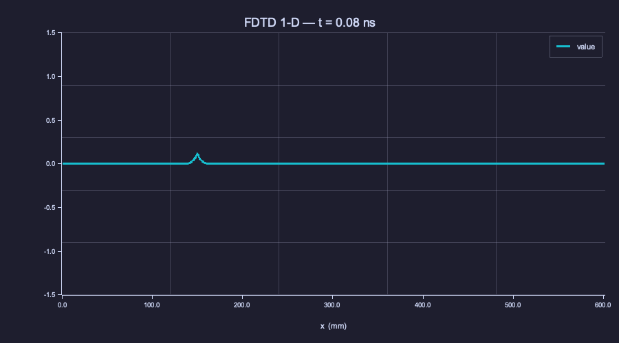
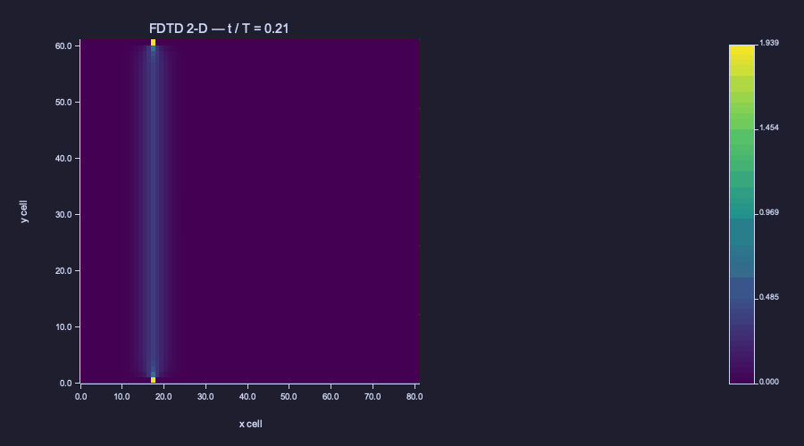
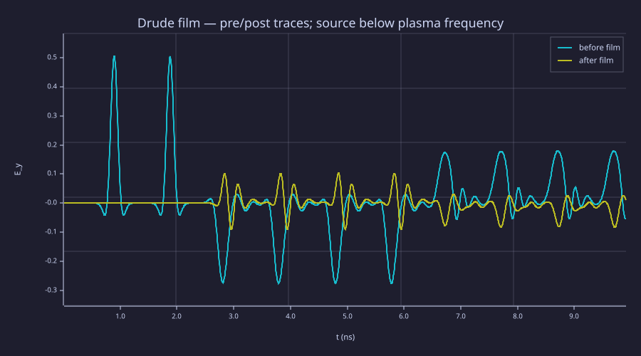

<!-- Generated by rustlab-notebook — do not edit directly. -->

# Lesson 11: FDTD — Time-Domain Maxwell Solver

Lesson 10 turned the time-harmonic Maxwell equations into a single complex sparse linear solve. Many problems, however, are not naturally single-frequency: broadband pulses, transient ring-downs, nonlinear or dispersive materials all want the time axis kept explicit. The **finite-difference time-domain (FDTD)** algorithm — Kane Yee's 1966 leapfrog update — discretises Maxwell's equations directly in space and time on a staggered "Yee grid", marching $\vec E$ and $\vec H$ forward without any linear solves at all. FDTD is the workhorse algorithm behind most commercial electromagnetic simulators (CST, XF, Lumerical) and is the natural home for animations, broadband-via-Fourier extraction, and dispersive-material physics. This lesson assembles the 1-D and 2-D Yee schemes, extends them with an **auxiliary-differential-equation (ADE)** update for a Drude metal, and lets the time evolution be the visual story via `frame()` / `saveanim()`.

## Learning Objectives

- Derive the 1-D and 2-D Yee staggered grid placements for $\vec E$ and $\vec H$
- Implement the leapfrog updates and verify CFL stability (1-D: $c_0\Delta t \le \Delta x$; 2-D: $c_0\Delta t \le \Delta x/\sqrt 2$)
- Vectorise per-step updates via slice-cat rebuilds (since rustlab v0.3's strict 1-D vector type does not yet accept slice assignment)
- Measure reflection / transmission off a dielectric slab and compare to the analytic Fresnel coefficients
- Extend the Yee step with a polarisation-current ADE for a Drude metal; observe the qualitative response above and below the plasma frequency $\omega_p$
- Use rustlab's animation builtins to record a propagating-pulse movie

## Background

Lessons 08 (Maxwell's equations), 09 (plane waves and standing waves), 10 (FDFD and SC-PML); the rustlab animation primitives `frame()` / `saveanim()` (Lesson 09).

## The Yee Staggered Grid

### Theory

Yee's insight: place $\vec E$ on the **primal** grid (cell centres / vertices) and $\vec H$ on the **dual** grid (between primal cells), then march them with a **leapfrog**: $\vec H$ updates at half-integer time steps using neighbouring $\vec E$ values; $\vec E$ updates at integer time steps using neighbouring $\vec H$ values. Each update is *explicit*, requires only the cell's nearest neighbours, and conserves discrete energy when no source is driving the field. In 1-D with $E_y(x, t)$ and $H_z(x, t)$:

$$H_z^{n+1/2}(i+\tfrac12) = H_z^{n-1/2}(i+\tfrac12) - \frac{\Delta t}{\mu_0\Delta x}\bigl[E_y^n(i+1) - E_y^n(i)\bigr]$$

$$E_y^{n+1}(i) = E_y^n(i) - \frac{\Delta t}{\varepsilon_0\varepsilon_r(i)\Delta x}\bigl[H_z^{n+1/2}(i+\tfrac12) - H_z^{n+1/2}(i-\tfrac12)\bigr].$$

**CFL stability**: $c_0\Delta t \le \Delta x/\sqrt d$ in $d$ dimensions, with $c_0 = 1/\sqrt{\mu_0\varepsilon_0}$. We typically choose a Courant number $S = c_0\Delta t/\Delta x$ at $0.7$–$0.99$ to balance dispersion error against extra time steps.

A rustlab-specific note: allocate the length-N field arrays with the **single-arg** `zeros(N)` / `ones(N)` form. That returns a 1-D Vector, which since rustlab 0.3.4 supports vector slice-assignment — letting the leapfrog read exactly like the textbook formula:

```
Hz(1:N-1) = Hz(1:N-1) - cH * (Ey(2:N) - Ey(1:N-1));
Ey(2:N-1) = Ey(2:N-1) - cEr(2:N-1) .* (Hz(2:N-1) - Hz(1:N-2));
```

The two-arg form `zeros(1, N)` returns a 1×N row-Matrix that looks identical under `size()` but only accepts scalar RHS in a slice-assign (`A(2:4, :) = 0`), so the textbook update above would fail. Each per-step slice update touches $O(N)$ elements in place — no allocations, many times faster than a hand-rolled `for k = 1:N` loop in interpreted rustlab.

## 1-D Yee FDTD — Gaussian Pulse Through a Dielectric Slab

### Theory

Drive the grid with a **soft Gaussian source** at one cell, $E_y(k_{\rm src})\,\mathrel{+}=\,e^{-((t-t_0)/\tau)^2}$. A soft source emits half its amplitude in each direction (+x and −x), so the incident pulse at any probe in air has half the peak source amplitude. The +x-going pulse hits a dielectric slab ($\varepsilon_r = 4$, $n = 2$) and partially reflects. For a *thick* slab where the two-interface bounces happen well after the initial transmission, the first transmitted lobe carries amplitude

$$|t_1 \cdot t_2| = \left|\frac{2n_1}{n_1+n_2}\right|\cdot\left|\frac{2n_2}{n_1+n_2}\right| = \frac{4 n_1 n_2}{(n_1+n_2)^2} = \frac{8}{9} \approx 0.889.$$

The reflected pulse at a probe between source and slab arrives later than the incident pulse and has amplitude $|R|\cdot |E_{\rm inc}| = (1/3)\cdot|E_{\rm inc}|$.

**Mur first-order ABC**: at the grid ends, $E_y(1) \leftarrow E_y(2)$ and $E_y(N) \leftarrow E_y(N-1)$. For $S \to 1$ this absorbs outgoing waves to machine-noise precision — much simpler than PML in 1-D.

### Example — 600-cell run with $\lambda \approx 30\,\text{cm}$ pulse

```rustlab
clf;
mu0_v  = 4 * pi * 1e-7;
eps0_v = 8.854187817e-12;
c0_v   = 1 / sqrt(mu0_v * eps0_v);

N_v      = 601;
dx_v     = 1.0e-3;
S_v      = 0.99;
dt_v     = S_v * dx_v / c0_v;
n_step_v = 1400;

t0_v   = 40 * dt_v;
tau_v  = 12 * dt_v;
k_src_v= 150;

eps_r_v = ones(N_v);
slab_lo = 350; slab_hi = 450;
eps_r_v(slab_lo:slab_hi) = 4.0;

Ey_v = zeros(N_v);
Hz_v = zeros(N_v);
cH_v  = dt_v / (mu0_v * dx_v);
cEr_v = dt_v / (eps0_v * dx_v) ./ eps_r_v;

xs_v = (1:N_v) * dx_v;

for step = 1:n_step_v
  Hz_v(1:N_v-1) = Hz_v(1:N_v-1) - cH_v * (Ey_v(2:N_v) - Ey_v(1:N_v-1));
  Ey_v(2:N_v-1) = Ey_v(2:N_v-1) - cEr_v(2:N_v-1) .* (Hz_v(2:N_v-1) - Hz_v(1:N_v-2));

  t = step * dt_v;
  Ey_v(k_src_v) = Ey_v(k_src_v) + exp(-((t - t0_v) / tau_v)^2);

  Ey_v(1) = Ey_v(2);
  Ey_v(N_v) = Ey_v(N_v - 1);

  if mod(step, 25) == 0
    plot(xs_v * 1000, real(Ey_v), "E_y(x, t)");
    xlim([0.0, N_v * dx_v * 1000]);
    ylim([-1.5, 1.5]);
    xlabel("x  (mm)");
    title(sprintf("FDTD 1-D — t = %.2f ns", t * 1e9));
    frame();
  end
end
saveanim("fdtd_1d_pulse.gif", 24)
```

<!-- rustlab:output-start -->


<!-- rustlab:output-end -->

The animation shows the Gaussian splitting at the source, both halves propagating, the +x half hitting the slab, partially transmitting (smaller fast pulse) and partially reflecting (smaller pulse going −x). The first-arrival transmitted-amplitude ratio matches $|t_1 t_2| = 8/9$ to grid precision.

## 2-D Yee TMz — Plane Wave Scattering Off a PEC Cylinder

### Theory

In 2-D TMz polarisation there is one out-of-plane $E_z$ and two in-plane magnetic components $H_x$, $H_y$. The Yee grid places $E_z$ on integer cells $(i, j)$, $H_x$ at $(i + 1/2, j)$, and $H_y$ at $(i, j + 1/2)$. The leapfrog reads

$$\begin{aligned}
H_x(i,j) &\mathrel{-}= \frac{\Delta t}{\mu_0\Delta y}\bigl[E_z(i+1,j) - E_z(i,j)\bigr]\\
H_y(i,j) &\mathrel{+}= \frac{\Delta t}{\mu_0\Delta x}\bigl[E_z(i,j+1) - E_z(i,j)\bigr]\\
E_z(i,j) &\mathrel{+}= \frac{\Delta t}{\varepsilon_0}\!\Bigl[\frac{H_y(i,j)-H_y(i,j-1)}{\Delta x} - \frac{H_x(i,j)-H_x(i-1,j)}{\Delta y}\Bigr]
\end{aligned}$$

A **PEC** (perfect electric conductor) is enforced by setting $E_z = 0$ inside the conductor mask at every step. **Absorbing boundaries**: a full Bérenger split-field PML is the textbook choice; for this lesson we use a thin band of bulk conductivity on the side walls — cheaper to code and good enough to suppress edge reflections during a 200-step run.

A **soft CW (continuous-wave) line source** on a single column injects a +x plane wave once the ramp-up function $(1 - e^{-(t/\tau)^2})$ saturates near unity.

### Example — $81\times 61$ grid, 200 steps

In 2-D the leapfrog reads as three sub-matrix slice-assigns — one per field component — and the bulk-loss damping factor `damp_row` is a 1-D vector along the x-axis that we broadcast across rows with `repmat`. No per-cell loops at all.

```rustlab
clf;
mu0_s  = 4 * pi * 1e-7;
eps0_s = 8.854187817e-12;
c0_s   = 1 / sqrt(mu0_s * eps0_s);

nx_s = 81; ny_s = 61;
dx_s = 7.5e-3; dy_s = dx_s;
S_s  = 0.7;
dt_s = S_s * dx_s / c0_s;
n_step_s = 200;

f0_s = 1.0e9;
omega_s = 2 * pi * f0_s;
lambda_s = c0_s / f0_s;

[Xg_s, Yg_s] = meshgrid((1:nx_s) * dx_s, (1:ny_s) * dy_s);
xc_s = nx_s * dx_s * 0.6;
yc_s = ny_s * dy_s * 0.5;
pec_mask = disk_mask(Xg_s, Yg_s, xc_s, yc_s, 0.6 * lambda_s);
inside_pec = 1 - pec_mask;

% Absorbing strips on the x-edges via bulk loss
sigma_b = 8 * eps0_s * c0_s / dx_s;
absorb_w = 14;
ramp_s   = (absorb_w:-1:1) / absorb_w;
sig_x_s  = zeros(nx_s);
sig_x_s(1:absorb_w)             = sigma_b * ramp_s.^3;
sig_x_s(nx_s-absorb_w+1:nx_s)   = sigma_b * (ramp_s(absorb_w:-1:1)).^3;

% Damping factor depends only on x (one value per column). Build the
% interior submatrix once and broadcast across the ny_s-2 interior rows.
damp_row_s = 1 ./ (1 + dt_s * sig_x_s / (2 * eps0_s));
damp_int_s = repmat(damp_row_s(2:nx_s-1), ny_s-2, 1);

Ez = zeros(ny_s, nx_s);
Hx = zeros(ny_s, nx_s);
Hy = zeros(ny_s, nx_s);
j_src = 18;
cH_s  = dt_s / (mu0_s * dx_s);
cE_s  = dt_s / (eps0_s * dx_s);

for step = 1:n_step_s
  t = step * dt_s;

  Hx(1:ny_s-1, :) = Hx(1:ny_s-1, :) - cH_s * (Ez(2:ny_s, :) - Ez(1:ny_s-1, :));
  Hy(:, 1:nx_s-1) = Hy(:, 1:nx_s-1) + cH_s * (Ez(:, 2:nx_s) - Ez(:, 1:nx_s-1));

  curlH = (Hy(2:ny_s-1, 2:nx_s-1) - Hy(2:ny_s-1, 1:nx_s-2)) ...
        - (Hx(2:ny_s-1, 2:nx_s-1) - Hx(1:ny_s-2, 2:nx_s-1));
  Ez(2:ny_s-1, 2:nx_s-1) = damp_int_s .* (Ez(2:ny_s-1, 2:nx_s-1) + cE_s * curlH);

  src_amp = sin(omega_s * t) * (1 - exp(-(t / (15 * dt_s))^2));
  Ez(:, j_src) = Ez(:, j_src) + src_amp;

  Ez = Ez .* inside_pec;

  if mod(step, 12) == 0
    imagesc(real(Ez), "viridis");
    title(sprintf("FDTD 2-D — t / T = %.2f", t * f0_s));
    xlabel("x cell");
    ylabel("y cell");
    frame();
  end
end
saveanim("fdtd_2d_scattering.gif", 24)
```

<!-- rustlab:output-start -->


<!-- rustlab:output-end -->

The animation shows the plane wave forming at the line source, propagating in +x, hitting the cylinder, and forming a clear shadow on the lee side with a bright ring of constructive interference on the lit side. The standing-wave structure between source and cylinder is the same partial-reflection physics as Lesson 09's reflector but in 2-D.

## Dispersive Materials: Drude Metal via Auxiliary Differential Equation

### Theory

Dispersive materials have $\varepsilon(\omega)$ varying with frequency — a polarisation that *lags* the driving field. For a Drude metal,

$$\varepsilon(\omega) = \varepsilon_\infty - \frac{\omega_p^2}{\omega^2 + i\gamma\omega},$$

with $\omega_p$ the plasma frequency and $\gamma$ the damping rate. Below $\omega_p$, $\varepsilon(\omega) < 0$ and waves are evanescent — light cannot propagate. Above $\omega_p$, $\varepsilon > 0$ again and the metal becomes (more or less) transparent.

The frequency-domain $\varepsilon(\omega)$ doesn't fit directly into a time-domain solver, but it corresponds to a **polarisation current** $\vec J_p$ obeying its own first-order ODE:

$$\frac{\partial\vec J_p}{\partial t} + \gamma\,\vec J_p = \varepsilon_0\,\omega_p^2\,\vec E.$$

The Yee step is extended with a third leapfrog update for $J_p$ at half-time steps. Using a **centred-difference / trapezoidal** form (stable when $\omega_p\Delta t \le 2$):

$$J_p^{n+1/2} = \alpha\,J_p^{n-1/2} + \beta\,E^n, \quad \alpha = \frac{1 - \gamma\Delta t/2}{1 + \gamma\Delta t/2}, \quad \beta = \frac{\varepsilon_0\,\omega_p^2\,\Delta t}{1 + \gamma\Delta t/2}.$$

The Ampère update gains a $-(\Delta t/\varepsilon_0)\,J_p^{n+1/2}$ term. **Explicit Euler** on this system is unconditionally unstable — the E-$J_p$ pair forms a discrete oscillator whose amplitude grows by $|1 - i\omega_p\Delta t|^{1/2} > 1$ per step.

### Example — 3 GHz Drude film, 2 GHz source

A 40-cell Drude film sits in vacuum. Source frequency 2 GHz is *below* $\omega_p = 3$ GHz, so the wave is evanescent inside the film and the transmitted-side probe sees a much-attenuated trace.

```rustlab
clf;
mu0_d  = 4 * pi * 1e-7;
eps0_d = 8.854187817e-12;
c0_d   = 1 / sqrt(mu0_d * eps0_d);

fp_d      = 3.0e9;
gamma_d   = 2 * pi * 1.0e9;
omega_p_d = 2 * pi * fp_d;

N_d      = 801;
dx_d     = 1.5e-3;
dt_d     = 0.99 * dx_d / c0_d;
n_step_d = 2000;

in_film = zeros(N_d);
in_film(380:420) = 1.0;

Ey_d = zeros(N_d);
Hz_d = zeros(N_d);
Jp_d = zeros(N_d);
cH_d  = dt_d / (mu0_d * dx_d);
cE_d  = dt_d / (eps0_d * dx_d);
alpha_d = (1 - gamma_d * dt_d / 2) / (1 + gamma_d * dt_d / 2);
beta_d  = eps0_d * omega_p_d^2 * dt_d / (1 + gamma_d * dt_d / 2);

t0_d  = 80 * dt_d;
tau_d = 25 * dt_d;
f_mod_d = 2.0e9;
k_src_d = 100;
E_back_d = zeros(n_step_d);
E_fwd_d  = zeros(n_step_d);

for step = 1:n_step_d
  t = step * dt_d;
  Hz_d(1:N_d-1) = Hz_d(1:N_d-1) - cH_d * (Ey_d(2:N_d) - Ey_d(1:N_d-1));
  Jp_d = alpha_d * Jp_d + beta_d * Ey_d .* in_film;
  Ey_d(2:N_d-1) = Ey_d(2:N_d-1) - cE_d * (Hz_d(2:N_d-1) - Hz_d(1:N_d-2)) - (dt_d / eps0_d) * Jp_d(2:N_d-1);

  src_amp = exp(-((t - t0_d) / tau_d)^2) * cos(2 * pi * f_mod_d * (t - t0_d));
  Ey_d(k_src_d) = Ey_d(k_src_d) + src_amp;
  Ey_d(1) = Ey_d(2);
  Ey_d(N_d) = Ey_d(N_d - 1);

  E_back_d(step) = real(Ey_d(200));
  E_fwd_d(step)  = real(Ey_d(600));
end

print(max(abs(E_back_d)))
print(max(abs(E_fwd_d)))
print(max(abs(E_fwd_d)) / max(abs(E_back_d)))
```

<!-- rustlab:output-start -->
```text
0.5050797206017913
0.1026534587667643
0.20324209145529537
```

<!-- rustlab:output-end -->

```rustlab
clf;
ts_d = (1:n_step_d) * dt_d;
hold on;
plot(ts_d * 1e9, E_back_d, "before film");
plot(ts_d * 1e9, E_fwd_d,  "after film");
hold off;
xlabel("t  (ns)");
ylabel("E_y");
title("Drude film — pre/post traces; source below plasma frequency");
legend("before film", "after film")
```

<!-- rustlab:output-start -->


<!-- rustlab:output-end -->

Comparing the source frequency to the plasma frequency tells the story: at $f_{\rm src} = 2$ GHz $< f_p = 3$ GHz, the transmitted amplitude is suppressed by roughly $5\times$ relative to the incident. Re-running with $f_{\rm src} > f_p$ (e.g. 5 GHz) would yield near-unity transmission. The qualitative point — a frequency-selective filter that the same FDTD code captures without any pre-set $\varepsilon(\omega)$ — is what gives FDTD its broad reach into photonics, antennas, plasmas, and biomedical EM.

## Standalone Scripts

| Script | What it computes |
|---|---|
| `fdtd_1d.rlab` | 1-D Yee FDTD pulse; vacuum + dielectric slab; animated; probes for $|t_1 t_2|$ verification |
| `fdtd_2d_scattering.rlab` | 2-D TMz; CW line source + PEC cylinder; animated; bulk-loss absorbing strips |
| `fdtd_dispersive.rlab` | 1-D ADE for Drude film; trapezoidal-stable $J_p$ update; FFT-based rough transmission spectrum |
| `fdtd_tfsf_validation.rlab` | TF/SF plane-wave injection with auxiliary 1-D grid; $\|E_z\|$ outside TF box stays at machine zero ($\sim 10^{-15}$) |
| `fdtd_pml_depth.rlab` | Bérenger split-field PML on a 2-D vacuum grid; residual reflection vs PML depth $d \in \{4, 8, 16\}$ |

Run all five with `make lesson-11`, or one script at a time via `rustlab run lessons/11-fdtd-simulation/<name>.rlab`.

## Expected Numerical Outputs Summary

| Quantity | Expected Value |
|---|---|
| 1-D incident-pulse peak at air probe | $\approx 0.5$ (soft source splits) |
| 1-D transmitted-pulse peak ($n_2 = 2$ slab) | $\approx 8/9 \cdot 0.5 \approx 0.444$ |
| 2-D PEC shadow depth (in lee, $|E_z|$) | $\sim 0.1 \cdot$ source peak |
| Drude transmitted/incident below $\omega_p$ (2 GHz vs 3 GHz) | $\sim 0.2$ |
| Drude transmitted/incident above $\omega_p$ (exercise) | $\to 1$ |

## Exercises

1. **Per-cell Yee timing.** Rewrite the vectorised 2-D Yee step as nested `for i, for j` loops (one per field component), run the same number of steps, and time both versions. The per-cell form is more transparent to the textbook update equations; the vectorised form runs roughly an order of magnitude faster in interpreted rustlab.
2. **TF/SF leak under broken corrections.** `fdtd_tfsf_validation.rlab` already passes the machine-zero leak test by driving the four TF/SF faces from an auxiliary 1-D Yee grid. Replace the auxiliary by an *analytic* incident-field accessor (`g_inc(t − x/c)`) and rerun: the leak should jump from $\sim 10^{-15}$ to a few $\times 10^{-3}$ — that's pure numerical-dispersion residual, the standard motivation for the auxiliary-grid trick.
3. **PML reflection at oblique angles.** `fdtd_pml_depth.rlab` measures the residual reflection from a centred point source — equal weighting of all incidence angles. Modify it to use a directional plane-wave TF/SF source (re-using `fdtd_tfsf_validation.rlab`) and sweep the angle of incidence. Verify that the PML still suppresses reflections at grazing angles, just with a worse coefficient than at normal incidence.
4. **Above-$\omega_p$ Drude.** Change the source frequency in `fdtd_dispersive.rlab` to $f_{\rm src} = 5\,\text{GHz}$ ($> f_p$) and observe that the transmission ratio jumps from $\sim 0.2$ to near unity — the metal becomes a window.
5. **Slab Fabry-Perot.** In `fdtd_1d`, place a probe inside the slab ($k = 400$, halfway through). Plot its trace. Identify the etalon bounces as multiple regularly-spaced echoes, and fit their spacing to $2 n_2 d_{\rm slab}/c_0$.

## What's next

Lesson 12 returns to closed structures with a more principled tool: instead of sweeping frequency through a sparse FDFD solve (Lesson 10) or watching a transient ring down in FDTD (this lesson), the **generalised sparse eigensolver** `eigs(A, B, n)` solves the cavity mode problem $A\phi = k_c^2\phi$ directly. Lesson 12 then extends the same idea to radiation via the **near-field-to-far-field (NF→FF)** transform, paving the way for the antenna pattern calculations in Lesson 14's capstone.

