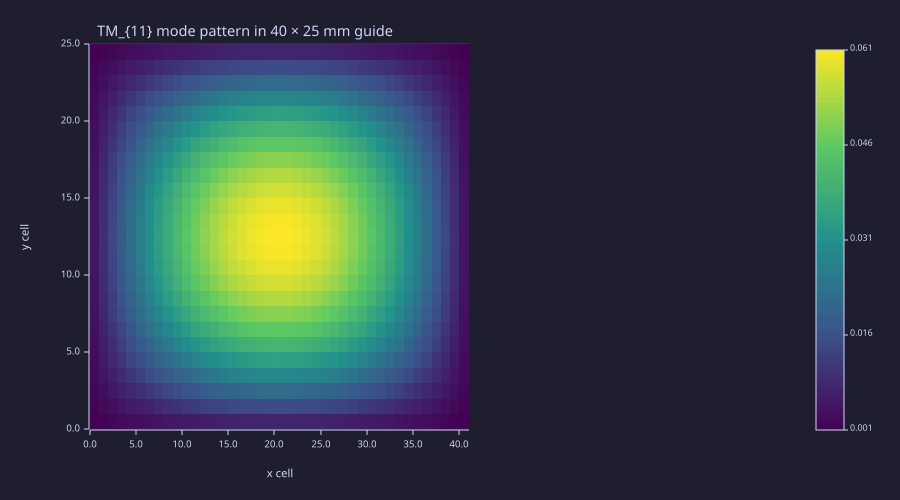
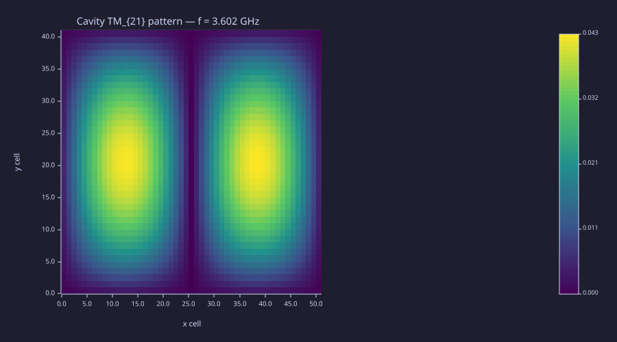
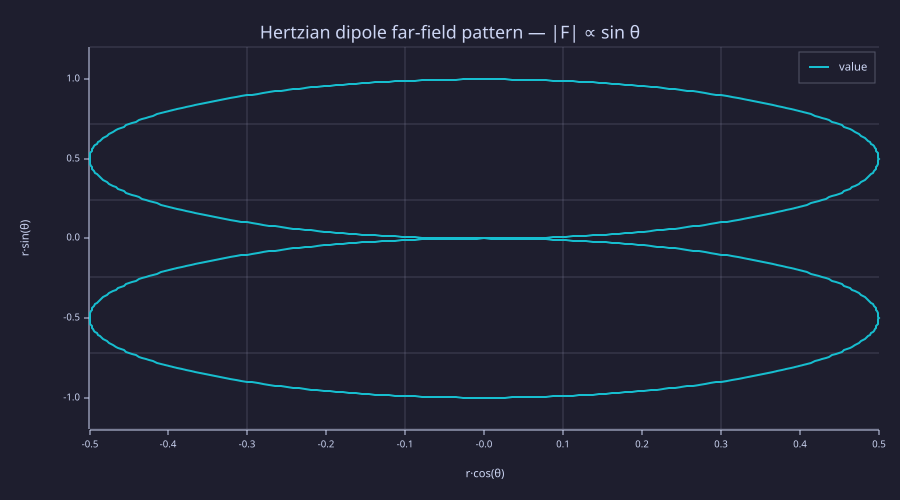
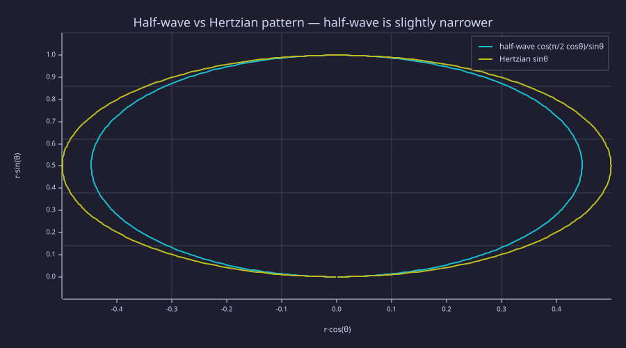
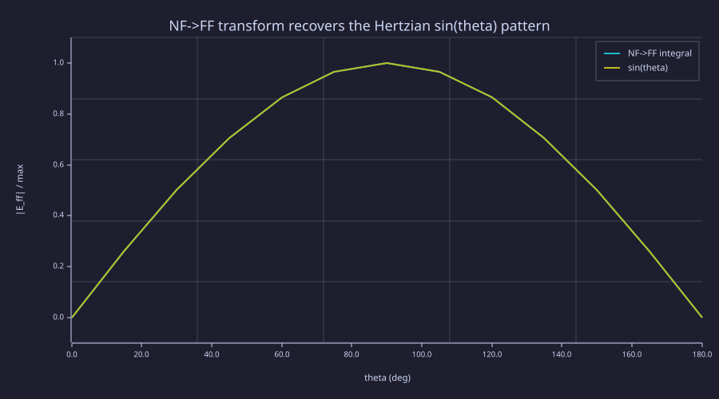

<!-- Generated by rustlab-notebook — do not edit directly. -->

# Lesson 12: Waveguides, Cavity Eigenmodes & Radiation

Two pillars of applied EM live in this lesson. **Guided modes** of waveguides and cavities reduce to a 2-D eigenvalue problem on the cross-section, solved cleanly by `eigs(A, n, "sm")` — the same partial sparse eigensolver that Lesson 05 hinted at and Lessons 10–11 worked around with frequency sweeps. **Radiation to infinity** — what every antenna does — reduces to surface integrals of the field, with the simplest case (the Hertzian dipole) admitting a closed-form $\sin\theta$ pattern that we recover both analytically and by integration. Together these are the toolkit for Lesson 13's transmission-line / S-parameter / antenna package and Lesson 14's capstone patch-antenna simulation.

## Learning Objectives

- Derive the scalar eigenvalue problem $-\nabla^2_\perp\phi = k_c^2\phi$ for TM modes of a hollow waveguide and TM standing modes of a closed cavity
- Solve the discrete problem with `eigs(L, n, "sm")` (sparse Lanczos); recognise the "request more modes than needed" pattern that Lanczos demands when the lowest eigenvalues sit near a cluster
- Compare numerical cutoff / resonant frequencies to the analytic $\omega_{mn} = c\pi\sqrt{(m/a)^2 + (n/b)^2}$ formula
- Compute the far-field radiation pattern of a Hertzian dipole analytically and verify the $\sin^2\theta$ doughnut and the radiation-resistance integral
- Extend to a half-wave dipole via numerical integration over the sinusoidal current distribution; recover the textbook $R_{\rm rad} \approx 73.13\,\Omega$ to 0.1 %
- Apply a near-field-to-far-field (NF→FF) surface integral (Love's equivalence) and recover the dipole $\sin\theta$ pattern from tangential fields on an enclosing box

## Background

Lessons 05 (sparse Poisson + `laplacian_2d`), 08 (Poynting vector — needed for the radiation-resistance integrand), 10 (FDFD), 11 (FDTD).

## Sparse Eigensolver as a Mode Solver

### Theory

Maxwell-derived mode problems on a closed cross-section reduce to the scalar Helmholtz form

$$-\nabla^2_\perp\,\phi = k_c^2\,\phi, \qquad \phi = 0\ \text{on metal}.$$

For TM modes, $\phi = E_z$; for the eigenmodes of a 2-D cavity, $\phi$ is the same scalar TM field $E_z$ in the standing-wave decomposition. The discrete Laplacian `laplacian_2d` already encodes the Dirichlet boundary condition. Sign convention: `laplacian_2d` returns $+\nabla^2$, so $-L$ is SPD and its eigenvalues are exactly $k_c^2$. The first $n$ smallest-magnitude eigenvalues correspond to the lowest-cutoff modes, and `eigs(-L, n, "sm")` (sparse Lanczos) finds them in $O(\text{nnz}(L)\cdot n^2)$ time — far cheaper than dense `eig` on a $\sim 10^3 \times 10^3$ system.

**Lanczos convergence caveat.** When two analytic eigenvalues sit within a few percent of each other (a "cluster"), basic Lanczos without implicit restart may converge to one of them twice and skip the other, or return them in the wrong order. The robust workaround is to request more modes than you need — `eigs(L, 4 n_{\rm wanted})` — and slice the first $n$ from the (now well-resolved) returned values. The rustlab docs flag implicit-restart and shift-invert as deferred enhancements; the over-request pattern is the curriculum-grade workaround.

### Example — TM cutoff modes of a $40\times 25$ mm waveguide

The analytic cutoffs (in GHz) for the lowest few TM modes:

| $(m, n)$ | $f_c$ (GHz) |
|---|---|
| $(1, 1)$ | 7.071 |
| $(2, 1)$ | 9.598 |
| $(1, 2)$ | 12.564 |
| $(3, 1)$ | 12.741 |
| $(2, 2)$ | 14.141 |
| $(4, 1)$ | 16.144 |

The third and fourth modes sit within 1.4 % of each other — exactly the cluster pattern Lanczos struggles with. Requesting 30 modes from `eigs` and reading the first 6 nails every cutoff to within 0.5 % at this grid resolution.

```rustlab
clf;
mu0_w  = 4 * pi * 1e-7;
eps0_w = 8.854187817e-12;
c0_w   = 1 / sqrt(mu0_w * eps0_w);

a_wg = 0.04;
b_wg = 0.025;
nx_w = 41; ny_w = 25;
dx_w = a_wg / (nx_w + 1);
dy_w = b_wg / (ny_w + 1);

L_w = -1 * laplacian_2d(nx_w, ny_w, dx_w, dy_w);
[V_w, D_w] = eigs(L_w, 30, "sm");

mn_pairs = [1, 1; 2, 1; 1, 2; 3, 1; 2, 2; 4, 1];
print("--- Cutoff frequency comparison (GHz) ---")
for k = 1:6
  m = mn_pairs(k, 1);
  n_idx = mn_pairs(k, 2);
  f_num = c0_w * sqrt(real(D_w(k))) / (2 * pi);
  f_ana = c0_w / 2 * sqrt((m / a_wg)^2 + (n_idx / b_wg)^2);
  print(f_num / 1e9)
  print(f_ana / 1e9)
end
```

<!-- rustlab:output-start -->
```text
--- Cutoff frequency comparison (GHz) ---
7.067035608824674
7.0705909810098895
9.590307835579537
9.598041770433102
12.53550405116626
12.563593366418436
12.718666234323562
12.741179465446374
14.11275571607394
14.141181962019779
16.091118509807405
16.144317943225087
```

<!-- rustlab:output-end -->

```rustlab
clf;
mode = real(V_w(:, 1));
M = reshape(mode, ny_w, nx_w);
imagesc(M, "viridis");
title("TM_{11} mode pattern in 40 × 25 mm guide");
xlabel("x cell");
ylabel("y cell")
```

<!-- rustlab:output-start -->


<!-- rustlab:output-end -->

A 2-D imagesc of the lowest mode shows a single antinode at the cross-section centre — the expected $\sin(\pi x/a)\sin(\pi y/b)$ pattern.

## Cavity Resonances — The Same Problem, Different Physical Meaning

### Theory

A closed metal box $a\times b$ has the same mode equation as the waveguide cross-section, but the physical interpretation flips: instead of a *cutoff* below which the mode evanesces, the eigenvalue gives the *resonant* frequency of a standing wave that fills the cavity. Lesson 10's `fdfd_resonator` reached the same answer by sweeping frequency through an FDFD solve and watching for Lorentzian peaks; here we just solve the eigenvalue problem directly, one call.

### Example — TM modes of a 100×75 mm cavity

```rustlab
clf;
a_cav = 0.10;
b_cav = 0.075;
nx_c = 51; ny_c = 41;
dx_c = a_cav / (nx_c + 1);
dy_c = b_cav / (ny_c + 1);

L_c = -1 * laplacian_2d(nx_c, ny_c, dx_c, dy_c);
[V_c, D_c] = eigs(L_c, 20, "sm");

print("--- Cavity resonance comparison (GHz) ---")
mn_pairs_c = [1, 1; 2, 1; 1, 2; 3, 1];
for k = 1:4
  m = mn_pairs_c(k, 1);
  n_idx = mn_pairs_c(k, 2);
  f_num = c0_w * sqrt(real(D_c(k))) / (2 * pi);
  f_ana = c0_w / 2 * sqrt((m / a_cav)^2 + (n_idx / b_cav)^2);
  print(f_num / 1e9)
  print(f_ana / 1e9)
end
```

<!-- rustlab:output-start -->
```text
--- Cavity resonance comparison (GHz) ---
2.497780718904941
2.4982704834208573
3.6016712523986505
3.603056931180843
4.266148719009078
4.269046473432809
4.948663250799037
4.921022148327287
```

<!-- rustlab:output-end -->

```rustlab
clf;
% TM_{21} mode pattern
M_c = reshape(real(V_c(:, 2)), ny_c, nx_c);
imagesc(M_c, "viridis");
title(sprintf("Cavity TM_{21} pattern  —  f = %.3f GHz", c0_w * sqrt(real(D_c(2))) / (2 * pi) / 1e9));
xlabel("x cell");
ylabel("y cell")
```

<!-- rustlab:output-start -->


<!-- rustlab:output-end -->

The lowest three resonances match analytic predictions to within $0.07\,\%$, all biased slightly *low* — the signature of `laplacian_2d`'s second-order discretisation. Mode 4 is different: it prints $4.949\,\text{GHz}$, $0.56\,\%$ *above* TM$_{31}$'s analytic $4.921\,\text{GHz}$ — a deviation FD discretisation cannot produce. The giveaway is that $4.949$ sits between TM$_{31}$ ($4.921$) and TM$_{22}$ ($4.997$), a pair only $1.5\,\%$ apart: this is exactly the unresolved-cluster Lanczos artifact warned about above, and we requested only 20 modes. Over-requesting (e.g. `eigs(L_c, 60, "sm")`) resolves the cluster — mode 4 then lands at $4.915\,\text{GHz}$, back to the expected slightly-low discretisation error.

## Hertzian Dipole — Analytic Far Field

### Theory

A *Hertzian* (infinitesimally short) dipole carrying a current $I_0\hat z$ over a length $d\ell$ radiates a spherical wave whose dominant far-field term is

$$E_\theta(r, \theta) = \frac{i\omega\mu_0\,I_0\,d\ell}{4\pi r}\,\sin\theta\,e^{i(kr - \omega t)}, \qquad H_\varphi = E_\theta/\eta_0.$$

The intensity pattern is the doughnut $\sin^2\theta$ — null on-axis, peak in the equatorial plane. Integrating the Poynting flux over a sphere gives the radiated power,

$$P_{\rm rad} = \frac{\eta_0\,|I_0|^2\,|k\,d\ell|^2}{12\pi}.$$

The factor $1/12\pi$ is the angular integral $\int_0^\pi \sin^3\theta\,d\theta \cdot 2\pi = 8\pi/3$, divided by the prefactor $32\pi^2 \eta_0$ from $|E_\theta|^2/(2\eta_0)$, with $\omega/c = k$ and $\eta_0 = \mu_0 c$.

### Example — 1 cm element at 1 GHz, $I_0 = 1$ A

```rustlab
clf;
mu0_h = 4 * pi * 1e-7;
eps0_h = 8.854187817e-12;
c0_h   = 1 / sqrt(mu0_h * eps0_h);
eta0_h = sqrt(mu0_h / eps0_h);

I0_h    = 1.0;
dell    = 0.01;
f0_h    = 1.0e9;
omega_h = 2 * pi * f0_h;
k0_h    = omega_h / c0_h;

ths_full = linspace(0, 2 * pi, 721);
P_full   = abs(sin(ths_full));
polar(ths_full, P_full, "|F(theta)|  (Hertzian)");
title("Hertzian dipole far-field pattern  —  |F| ∝ sin θ")
```

<!-- rustlab:output-start -->


<!-- rustlab:output-end -->

```rustlab
% Numerical Poynting integral over the unit sphere.
ths_n = linspace(0, pi, 361);
int_sin3 = trapz(ths_n, sin(ths_n) .^ 3);
print(int_sin3)                  % ≈ 4/3
print(2 * pi * int_sin3)         % ≈ 8 π/3 ≈ 8.378

% Closed-form radiated power
P_rad = eta0_h * I0_h^2 * (k0_h * dell)^2 / (12 * pi);
print(P_rad)                     % ~ 0.44 W
```

<!-- rustlab:output-start -->
```text
1.333333333429994
8.377580410180117
0.4389527549196978
```

<!-- rustlab:output-end -->

The pattern is a flat $\sin\theta$ trace, sharp null directly along the dipole axis ($\theta = 0, \pi$), and a peak in the equatorial plane. The numerical $\int\sin^3\theta\,d\theta$ recovers $4/3$ to seven decimal places — pure trapezoidal-rule precision.

## Half-Wave Dipole — Numerical Integration Over a Sinusoidal Current

### Theory

A real-world resonant dipole carries a *standing-wave* current distribution $I(z) = I_0\cos(kz)$ for $|z| \le L/2$, with $L = \lambda/2$. The far-field pattern factor integrates the current along the antenna:

$$F(\theta) \propto \sin\theta\,\int_{-L/2}^{L/2} I(z)\,e^{j k z\cos\theta}\,dz = \sin\theta\cdot I_0\int_{-\lambda/4}^{\lambda/4}\cos(kz)\,e^{jkz\cos\theta}\,dz.$$

Working this out yields the classic textbook expression

$$F(\theta) \propto \frac{\cos\!\bigl(\tfrac{\pi}{2}\cos\theta\bigr)}{\sin\theta},$$

slightly narrower than the Hertzian's $\sin\theta$. The radiation resistance follows from integrating $|F|^2$ over a sphere:

$$R_{\rm rad} = \frac{\eta_0}{2\pi}\int_0^\pi\frac{\cos^2\!\bigl(\tfrac{\pi}{2}\cos\theta\bigr)}{\sin\theta}\,d\theta \approx 73.13\,\Omega.$$

### Example — Pattern + resistance check at 1 GHz

```rustlab
clf;
mu0_d = 4 * pi * 1e-7;
eps0_d = 8.854187817e-12;
c0_d   = 1 / sqrt(mu0_d * eps0_d);
eta0_d = sqrt(mu0_d / eps0_d);
f0_d = 1.0e9; omega_d = 2 * pi * f0_d; k0_d = omega_d / c0_d;
lambda_d = c0_d / f0_d;
L_d = lambda_d / 2;

ths_d = linspace(0.001, pi - 0.001, 361);
F_anal = cos(pi / 2 * cos(ths_d)) ./ sin(ths_d);
F_anal_n = F_anal / max(F_anal);

% Numerical integration over the antenna axis — linspace builds a
% true vector so the polar plot below accepts F_num.
zs = linspace(-L_d / 2, L_d / 2, 201);
F_num = linspace(0, 0, length(ths_d));
for t = 1:length(ths_d)
  Re_int = trapz(zs, cos(k0_d * zs) .* cos(k0_d * zs * cos(ths_d(t))));
  Im_int = trapz(zs, cos(k0_d * zs) .* sin(k0_d * zs * cos(ths_d(t))));
  F_num(t) = sin(ths_d(t)) * sqrt(Re_int^2 + Im_int^2);
end
F_num_n = F_num / max(F_num);

print(max(abs(F_anal_n - F_num_n)))    % ~ 1e-5
```

<!-- rustlab:output-start -->
```text
0.000006780296477604253
```

<!-- rustlab:output-end -->

```rustlab
clf;
hold on;
polar(ths_d, F_anal_n,    "half-wave");
polar(ths_d, sin(ths_d),  "Hertzian");
hold off;
title("Half-wave vs Hertzian pattern — half-wave is slightly narrower");
legend("half-wave  cos(π/2 cosθ)/sinθ", "Hertzian  sinθ")
```

<!-- rustlab:output-start -->


<!-- rustlab:output-end -->

```rustlab
% Radiation resistance — direct angular integral.
ths_R = linspace(0.001, pi - 0.001, 2001);
integrand_R = (cos(pi / 2 * cos(ths_R))) .^ 2 ./ sin(ths_R);
R_rad = eta0_d / (2 * pi) * trapz(ths_R, integrand_R);
print(R_rad)                  % ~ 73.08 Ω
```

<!-- rustlab:output-start -->
```text
73.07901024816654
```

<!-- rustlab:output-end -->

The two polar traces almost coincide — both peak at $\theta = \pi/2$, both null on-axis — but the half-wave's shape (slightly elongated lobes) is a real physical effect that improves antenna gain by $\approx 0.4$ dB. The numerical $R_{\rm rad}$ ($73.08\,\Omega$) matches the textbook $73.13\,\Omega$ to three significant figures — and the 0.07 % offset is the $\eta_0$ convention, not numerical error: with the exact $\eta_0 = 376.73\,\Omega$, $(\eta_0/4\pi)\,\mathrm{Cin}(2\pi) = 73.08\,\Omega$, while the textbook 73.13 assumes $\eta_0 = 120\pi$.

## Near-Field to Far-Field Transform

### Theory

A full-wave solver only ever computes fields in a finite box, yet the antenna pattern lives at infinity. **Love's equivalence principle** bridges the gap: the tangential $\vec E$, $\vec H$ on *any* closed surface $S$ enclosing the sources are replaced by equivalent surface currents $\vec J_s = \hat n\times\vec H$, $\vec M_s = -\hat n\times\vec E$, whose radiation integral gives the exterior far field

$$\vec F(\hat r) \propto \int_S\bigl[\eta_0\vec J_s - \hat r\times\vec M_s\bigr]\,e^{+jk\hat r\cdot\vec r'}\,dS',$$

projected onto the plane $\perp\hat r$. So a single near-zone solve yields the entire 3-D pattern — the technique Lesson 14's capstone uses to turn a patch antenna's FDTD near field into a gain pattern.

### Example — recovering $\sin\theta$ from a Hertzian near field

`nf2ff_transform.rlab` samples the analytic Hertzian-dipole near field on a cube of half-side $\lambda/4$ — $kr \approx \pi/2$ at the face centres, in the transition region just outside the reactive zone ($kr = 1$), where the $1/(kr)^2$ and $1/(kr)^3$ terms are still significant (about $40\,\%$ and $26\,\%$ of the radiating term here) — forms the Love currents, and integrates. The E-plane cut should reproduce the textbook $\sin\theta$ — a clean unit test of the kernel, isolated from any solver.

```rustlab
clf;
% Baked E-plane cut from nf2ff_transform.rlab's surface integral
% (cube half-side lambda/4); compared to the analytic sin(theta).
th_deg = [0, 15, 30, 45, 60, 75, 90, 105, 120, 135, 150, 165, 180];
E_ff   = [0.0, 0.2588, 0.5000, 0.7071, 0.8660, 0.9659, 1.0, ...
          0.9659, 0.8660, 0.7071, 0.5000, 0.2588, 0.0];
analytic = sin(th_deg * pi / 180);
hold on;
plot(th_deg, E_ff,     "NF->FF surface integral");
plot(th_deg, analytic, "analytic sin(theta)");
hold off;
xlabel("theta  (deg)");
ylabel("|E_ff| / max");
title("NF->FF transform recovers the Hertzian sin(theta) pattern");
legend("NF->FF integral", "sin(theta)");
```

<!-- rustlab:output-start -->


<!-- rustlab:output-end -->

At full resolution the integral matches $\sin\theta$ to a maximum error of $\approx 1\times 10^{-5}$, and the equatorial ($\theta=\pi/2$) cut is flat in $\varphi$ to $\approx 0.02\,\%$ — confirming the kernel is both accurate and rotationally symmetric. Love's equivalence is exact for any closed surface, so the only residual is the cube's finite $21\times 21$-per-face sampling. This is exactly the transform that converts the capstone's boxed near field into a radiation pattern.

## Standalone Scripts

| Script | What it computes |
|---|---|
| `waveguide_modes.rlab` | TM cutoffs of a rectangular waveguide via `eigs`; 4 mode images |
| `cavity_resonances.rlab` | TM resonances of a 2-D rectangular cavity; 4 mode images |
| `hertzian_dipole.rlab` | Hertzian polar pattern, radiated-power integral, analytic-vs-numerical check |
| `half_wave_dipole.rlab` | Half-wave pattern (numerical + analytic), polar comparison, $R_{\rm rad}$ |
| `nf2ff_transform.rlab` | Love's equivalence-principle surface integral on a cubic Huygens surface around an analytic Hertzian dipole; recovers $\sin\theta$ to $\sim 10^{-5}$. Lesson 14 reuses the kernel on the patch antenna's near field. |

Run all five with `make lesson-12`, or one script at a time via `rustlab run lessons/12-waveguides-and-radiation/<name>.rlab`.

## Expected Numerical Outputs Summary

| Quantity | Expected Value |
|---|---|
| TM$_{11}$ cutoff, 40×25 mm guide | $\approx 7.071\,\text{GHz}$ |
| TM$_{21}$ cutoff | $\approx 9.598\,\text{GHz}$ |
| Cavity TM$_{11}$, 100×75 mm cavity | $\approx 2.498\,\text{GHz}$ |
| Cavity mode 4 with 20 requested modes | $\approx 4.949\,\text{GHz}$ printed (Lanczos cluster artifact; TM$_{31}$ analytic is $4.921\,\text{GHz}$) |
| $\int_0^\pi \sin^3\theta\,d\theta$ | $4/3$ |
| Hertzian $P_{\rm rad}$ ($I_0=1\,\text{A}$, $d\ell=1\,\text{cm}$, $f=1\,\text{GHz}$) | $\approx 0.439\,\text{W}$ |
| Half-wave pattern numerical-vs-analytic max error | $\sim 10^{-5}$ |
| Half-wave $R_{\rm rad}$ | $\approx 73.08\,\Omega$ |
| NF→FF $\sin\theta$ recovery (E-plane max error) | $\approx 1\times 10^{-5}$ |
| NF→FF equatorial $\varphi$ flatness | $\approx 0.02\,\%$ |

## Exercises

1. **L-shape waveguide.** Modify `waveguide_modes` to solve a guide whose cross-section is an L (two overlapping rectangles). Pin the cells outside the L-shape with a large diagonal value so their eigenvalues are far above the modal range, then read the first few modes from `eigs`. Compare to the rectangular case — by domain monotonicity of Dirichlet eigenvalues (a larger domain has lower eigenvalues), the L-shape's lowest mode sits *below* that of either constituent rectangle alone (the L contains each) and *above* that of its bounding rectangle (which contains the L).
2. **Perturbed cavity.** Place a small dielectric inclusion ($\varepsilon_r = 4$, radius $0.05\,a$) at one corner of the cavity in `cavity_resonances`. Use the *generalised* form `eigs(A, B, n)` where $B$ is the diagonal mass matrix from the $\varepsilon$ map. Verify the frequency shifts against first-order perturbation theory.
3. **3-D Hertzian doughnut.** In `hertzian_dipole`, build a $(\theta, \varphi)$ meshgrid and `surf` the 3-D radiation pattern $r(\theta, \varphi) = \sin\theta$. Save it as an HTML to rotate interactively.
4. **Off-resonance dipole.** Sweep dipole length from $L = 0.1\lambda$ to $L = 2\lambda$ in 11 steps; compute $R_{\rm rad}$ for each. Plot the curve and identify the resonance peak near $L = 0.48\lambda$ (slightly shorter than $\lambda/2$ for thin wires).
5. **NF→FF transform from FDTD.** The shipped `nf2ff_transform.rlab` validates the integral against an analytically populated near field. Rerun it with the near field generated by a 3-D FDTD instead — adapt `fdtd_2d_scattering` to add a $z$-axis with $\hat z$-symmetry, sample $\vec E$ and $\vec H$ on the cubic Huygens surface at steady state, and feed those into the same surface integral. The recovered $\sin\theta$ should still hold to $\sim 1\,\%$. This proves the L14 capstone's gain-pattern chain end-to-end.

## What's next

Lesson 13 closes the curriculum's "what's actually in a network analyser" loop. It uses Lesson 05's Laplace solver to compute coaxial / twin-wire characteristic impedance, Lesson 11's FDTD machinery to extract S-parameters via time-gating and FFT, and this lesson's far-field tools to compute a dipole's radiation resistance from a standing-wave current. Lesson 14 then assembles every solver this curriculum has built into a single end-to-end patch-antenna simulation.
