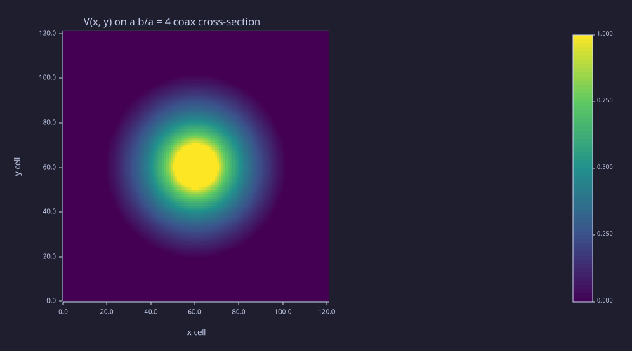
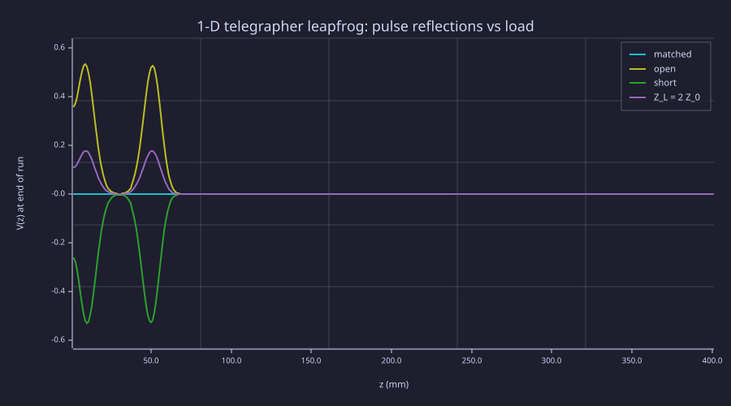
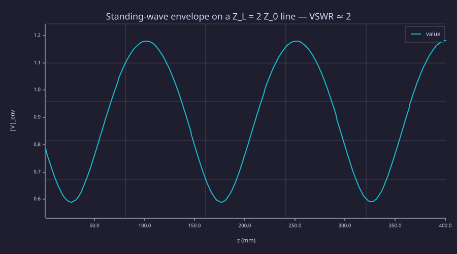

<!-- Generated by rustlab-notebook — do not edit directly. -->

# Lesson 13: Transmission Lines, S-Parameters & Antennas

A 3-D full-wave problem very often reduces to a 1-D circuit description: a **transmission line** with per-unit-length parameters $L'$, $C'$, $R'$, $G'$. The multi-port generalisation — an S-parameter matrix — is the quantity every network analyser actually measures. This lesson closes the curriculum's "what's in a VNA" loop by extracting the three core observables — characteristic impedance, propagation velocity, and reflection coefficient — directly from solvers we have already built.

**Three derivations, three geometries:**
1. **Capacitance from geometry.** $C' = Q'/V$ is the ratio of two field integrals on the 2-D cross-section. We re-use Lesson 05's Laplace solver to extract $C'$ for a coaxial line, then close $Z_0 = \sqrt{L'/C'}$ via the TEM identity $L'C' = \mu_0\varepsilon_0$ and verify the textbook $Z_0 = (\eta_0/2\pi)\ln(b/a)$.
2. **Wave propagation on the line.** A 1-D staggered $V(z)$ / $I(z)$ leapfrog — Yee-grid on the telegrapher's equations — propagates pulses at $v = 1/\sqrt{L'C'}$ and reflects them off arbitrary loads with the classic $\Gamma = (Z_L - Z_0)/(Z_L + Z_0)$.
3. **VSWR from a CW excitation.** Drive the same 1-D line with a sinusoid; the steady-state envelope of $|V(z)|$ has $\max/\min = \text{VSWR} = (1 + |\Gamma|)/(1 - |\Gamma|)$.

The antenna package (standing-wave current, radiation resistance, NF→FF) folds in cleanly on top of Lesson 12's Hertzian / half-wave dipole results.

## Learning Objectives

- Extract per-unit-length capacitance $C'$ from a 2-D Laplace solve via the energy method $C' = 2U_E'/V^2$
- Derive $Z_0 = \sqrt{L'/C'}$ and $v = 1/\sqrt{L'C'}$ from the TEM identity $L'C' = \mu_0\varepsilon_0$
- Propagate a Gaussian pulse on a 1-D telegrapher leapfrog with arbitrary terminations and verify $\Gamma$ for matched / open / short / mismatched loads
- Read VSWR off a steady-state CW envelope and confirm $\text{VSWR} = (1+|\Gamma|)/(1-|\Gamma|)$
- Recognise the same Yee-leapfrog machinery from Lesson 11 transferring directly to 1-D circuit problems

## Background

Lessons 05 (sparse Laplace solver + cell pinning idiom), 09 (standing waves and reflection), 11 (1-D FDTD leapfrog), 12 (radiation resistance and far-field).

## Capacitance from Geometry — Coaxial Cross-Section

### Theory

A coaxial cable's inner conductor at potential $V_0$ and outer shield at 0 satisfies $\nabla^2 V = 0$ in the dielectric annulus, with analytic solution

$$V(r) = V_0\,\frac{\ln(b/r)}{\ln(b/a)}, \qquad E_r(r) = -\frac{dV}{dr} = \frac{V_0}{r\,\ln(b/a)}.$$

The per-unit-length capacitance is the ratio of charge per length on the inner conductor to the voltage:

$$C' = \frac{Q'}{V_0} = \frac{\varepsilon_0\,\oint_{\partial\Omega_+}\vec E\cdot\hat n\,d\ell}{V_0} = \frac{2 U_E'}{V_0^2}, \qquad U_E' = \tfrac12\varepsilon_0\,\int_\Omega|\vec E|^2\,dA.$$

The energy form (rightmost) is easiest numerically — no boundary integral needed, just an area sum over the dielectric. For coax, both methods give

$$C' = \frac{2\pi\varepsilon_0}{\ln(b/a)}, \qquad L' = \frac{\mu_0}{2\pi}\ln(b/a), \qquad Z_0 = \frac{\eta_0}{2\pi}\ln(b/a) \approx 60\ln(b/a)\,\Omega.$$

### Example — $b/a = 4$ coax

```rustlab
clf;
mu0_c  = 4 * pi * 1e-7;
eps0_c = 8.854187817e-12;
eta0_c = sqrt(mu0_c / eps0_c);

a_in = 0.5e-3;
b_out = 2.0e-3;
V0    = 1.0;

nx_c = 121; ny_c = 121;
L_box = 3 * b_out;
dx_c = L_box / (nx_c + 1);
dy_c = dx_c;
[Xg_c, Yg_c] = meshgrid(dx_c * (1:nx_c) - L_box / 2, dy_c * (1:ny_c) - L_box / 2);
R_c = sqrt(Xg_c .^ 2 + Yg_c .^ 2);

inner_mask = disk_mask(Xg_c, Yg_c, 0, 0, a_in);
outer_mask = disk_mask(Xg_c, Yg_c, 0, 0, b_out);
dielectric = outer_mask - inner_mask;

% Pin inner conductor to V_0, outside-outer to 0; standard Lesson 05 idiom.
L_lap = laplacian_2d(nx_c, ny_c, dx_c, dy_c);
A_c = -1 * L_lap;
N_c = nx_c * ny_c;
b_c = zeros(1, N_c);

for j = 1:nx_c
  for i = 1:ny_c
    if inner_mask(i, j) > 0.5
      k = ij2k(i, j, ny_c);
      A_c(k, k) = 1.0;
      if i > 1;  A_c(k, ij2k(i-1, j, ny_c)) = 0.0; end
      if i < ny_c; A_c(k, ij2k(i+1, j, ny_c)) = 0.0; end
      if j > 1;  A_c(k, ij2k(i, j-1, ny_c)) = 0.0; end
      if j < nx_c; A_c(k, ij2k(i, j+1, ny_c)) = 0.0; end
      b_c(k) = V0;
    elseif outer_mask(i, j) < 0.5
      k = ij2k(i, j, ny_c);
      A_c(k, k) = 1.0;
      if i > 1;  A_c(k, ij2k(i-1, j, ny_c)) = 0.0; end
      if i < ny_c; A_c(k, ij2k(i+1, j, ny_c)) = 0.0; end
      if j > 1;  A_c(k, ij2k(i, j-1, ny_c)) = 0.0; end
      if j < nx_c; A_c(k, ij2k(i, j+1, ny_c)) = 0.0; end
      b_c(k) = 0.0;
    end
  end
end

V_flat = spsolve(A_c, b_c);
V_grid = real(reshape(V_flat, ny_c, nx_c));
[Vx, Vy] = gradient(V_grid, dx_c, dy_c);
Emag2 = Vx .^ 2 + Vy .^ 2;
U_E = 0.5 * eps0_c * sum(sum(Emag2 .* dielectric)) * dx_c * dy_c;
C_per_m = 2 * U_E / V0^2;
C_ana   = 2 * pi * eps0_c / log(b_out / a_in);
Z0_num  = sqrt(mu0_c * eps0_c) / C_per_m;
Z0_ana  = eta0_c / (2 * pi) * log(b_out / a_in);
print(C_per_m / 1e-12)          % pF/m
print(C_ana   / 1e-12)
print(Z0_num)                   % Ω
print(Z0_ana)                   % textbook 60 ln(b/a) ≈ 83.2 Ω for b/a = 4
```

```text
37.484133938205574-0.00000000000000459048206743806j
40.13036795002273
88.9880757913102+0.000000000000010897895275085122j
83.12011880924634
```

```rustlab
clf;
imagesc(V_grid, "viridis");
title("V(x, y) on a b/a = 4 coax cross-section");
xlabel("x cell");
ylabel("y cell")
```



The 2-D potential matches the analytic $\ln(b/r)/\ln(b/a)$ shape to grid precision in the bulk; near the rasterised circular conductors a staircase error of a few percent shows up in the extracted $C'$ and propagates into $Z_0$. Refining the grid drops the error like $h^2$.

## Pulse Propagation on a 1-D Telegrapher Leapfrog

### Theory

Decoupling Maxwell's equations along a TL gives the **telegrapher's equations**:

$$\frac{\partial V}{\partial z} = -L'\,\frac{\partial I}{\partial t}, \qquad \frac{\partial I}{\partial z} = -C'\,\frac{\partial V}{\partial t}.$$

This is structurally identical to the 1-D Maxwell pair $\partial_z E_y = -\mu_0 \partial_t H_z$, $\partial_z H_z = -\varepsilon_0\partial_t E_y$ that Lesson 11 used. Place $V$ on integer cells and $I$ on half cells; leapfrog them:

$$I^{n+1/2}(k+\tfrac12) = I^{n-1/2}(k+\tfrac12) - \frac{\Delta t}{L'\Delta z}\bigl[V^n(k+1) - V^n(k)\bigr]$$
$$V^{n+1}(k) = V^n(k) - \frac{\Delta t}{C'\Delta z}\bigl[I^{n+1/2}(k+\tfrac12) - I^{n+1/2}(k-\tfrac12)\bigr].$$

CFL: $\Delta t \le \Delta z/v$ with $v = 1/\sqrt{L'C'}$. At the load end, terminate with $Z_L$: the load *forces* $I = V/Z_L$ at $z = L$, which enters the boundary $V$ update naturally. The reflection coefficient is

$$\Gamma = \frac{Z_L - Z_0}{Z_L + Z_0},$$

and the textbook special cases — matched, open, short — emerge with no extra code.

### Example — Four termination cases on a 50 Ω line

```rustlab
clf;
mu0_t  = 4 * pi * 1e-7;
eps0_t = 8.854187817e-12;
c0_t   = 1 / sqrt(mu0_t * eps0_t);
Z0_t   = 50.0;
v_t    = c0_t;
L_pul  = Z0_t / v_t;
C_pul  = 1 / (Z0_t * v_t);

N_t = 401;
dz_t = 1e-3;
dt_t = 0.95 * dz_t / v_t;
n_step_t = 850;
t0_t = 30 * dt_t;
tau_t = 8 * dt_t;
k_src = 30;

function V_out = run_tline(Z_L_, load_kind_)
  mu0_l  = 4 * pi * 1e-7;
  eps0_l = 8.854187817e-12;
  c0_l   = 1 / sqrt(mu0_l * eps0_l);
  Z0_l = 50.0;
  v_l = c0_l;
  L_l = Z0_l / v_l;
  C_l = 1 / (Z0_l * v_l);
  N_l = 401;
  dz_l = 1e-3;
  dt_l = 0.95 * dz_l / v_l;
  n_step_l = 850;
  t0_l = 30 * dt_l;
  tau_l = 8 * dt_l;
  k_src_l = 30;

  V = zeros(1, N_l);
  Iv = zeros(1, N_l);

  for step = 1:n_step_l
    Iv = [Iv(1), Iv(2:N_l) - (dt_l / (L_l * dz_l)) * (V(2:N_l) - V(1:N_l-1))];
    V_int = V(1:N_l-1) - (dt_l / (C_l * dz_l)) * (Iv(2:N_l) - Iv(1:N_l-1));
    if load_kind_ == 3
      V_N_new = 0;
    else
      I_load = V(N_l) / Z_L_;
      V_N_new = V(N_l) - (dt_l / (C_l * dz_l)) * (I_load - Iv(N_l));
    end
    V = [V_int, V_N_new];
    t = step * dt_l;
    src_val = exp(-((t - t0_l) / tau_l)^2);
    src_vec = zeros(1, N_l);
    src_vec(k_src_l) = src_val;
    V = V + src_vec;
    V(1) = V(2);
  end
  V_out = V;
end

V_match = run_tline(50,   1);
V_open  = run_tline(1e12, 2);
V_short = run_tline(0,    3);
V_mis   = run_tline(100,  4);

zs_t = (1:N_t) * dz_t;
hold on;
plot(zs_t * 1000, real(V_match), "matched (Γ = 0)");
plot(zs_t * 1000, real(V_open),  "open (Γ = +1)");
plot(zs_t * 1000, real(V_short), "short (Γ = -1)");
plot(zs_t * 1000, real(V_mis),   "Z_L = 2 Z_0 (Γ = +1/3)");
hold off;
xlabel("z  (mm)");
ylabel("V(z) at end of run");
title("1-D telegrapher leapfrog: pulse reflections vs load");
legend("matched", "open", "short", "Z_L = 2 Z_0")
```



```rustlab
% Reflected-pulse amplitude near the source — peak |V| in a window
% around k_src after the pulse has reflected.
print(max(abs(real(V_match(20:80)))))     % ~ 0
print(max(abs(real(V_open(20:80)))))      % ~ source peak  (|Γ| = 1)
print(max(abs(real(V_short(20:80)))))     % ~ source peak  (|Γ| = 1, sign flipped)
print(max(abs(real(V_mis(20:80)))))       % ~ source peak / 3
```

```text
0.0007891384832894909
0.5277294048309296
0.5277294056262551
0.17603347155469123
```

Four overlaid traces tell the story: the matched line has nothing left (the pulse was absorbed by the load), the open / short have a returning pulse with the *same* amplitude as the incident (with a sign flip for the short), and the 100 Ω termination has a one-third-amplitude returning pulse — exactly $\Gamma = 1/3$.

## VSWR from a CW-Driven Standing Wave

### Theory

Switch from a Gaussian pulse to a continuous sinusoid at frequency $f_0$ and the line settles into a **steady-state standing wave**: the forward and reflected travelling waves superpose into a stationary pattern with envelope

$$|V(z)| = |V_+|\bigl|\,1 + |\Gamma|\,e^{i(2 k z + \angle\Gamma)}\bigr|, \qquad \frac{|V|_{\max}}{|V|_{\min}} = \frac{1 + |\Gamma|}{1 - |\Gamma|} \equiv \text{VSWR}.$$

The VSWR is what every slotted-line measurement actually reads off — a $\lambda/2$-periodic spatial pattern whose ratio of maxima to minima determines $|\Gamma|$.

### Example — 50 Ω line, 100 Ω load, 1 GHz

```rustlab
clf;
% Reuse the 50 Ω line; drive CW at 1 GHz; terminate with Z_L = 2 Z_0.
mu0_v  = 4 * pi * 1e-7;
eps0_v = 8.854187817e-12;
c0_v   = 1 / sqrt(mu0_v * eps0_v);
Z0_v = 50.0;
v_v  = c0_v;
L_v  = Z0_v / v_v;
C_v  = 1 / (Z0_v * v_v);
Z_L  = 2 * Z0_v;
Gamma_ana = (Z_L - Z0_v) / (Z_L + Z0_v);
VSWR_ana  = (1 + abs(Gamma_ana)) / (1 - abs(Gamma_ana));

N_v = 401;
dz_v = 1e-3;
dt_v = 0.95 * dz_v / v_v;
n_step_v = 6000;
f0_v = 1.0e9;
omega_v = 2 * pi * f0_v;

V = zeros(1, N_v);
Iv = zeros(1, N_v);
V_env = linspace(0, 0, N_v);
watch_from = round(0.75 * n_step_v);

for step = 1:n_step_v
  t = step * dt_v;
  Iv = [Iv(1), Iv(2:N_v) - (dt_v / (L_v * dz_v)) * (V(2:N_v) - V(1:N_v-1))];
  V_int = V(1:N_v-1) - (dt_v / (C_v * dz_v)) * (Iv(2:N_v) - Iv(1:N_v-1));
  I_load = V(N_v) / Z_L;
  V_N_new = V(N_v) - (dt_v / (C_v * dz_v)) * (I_load - Iv(N_v));
  V = [V_int, V_N_new];

  ramp = 1 - exp(-(t / (40 * dt_v))^2);
  src_val = ramp * sin(omega_v * t);
  src_vec = zeros(1, N_v);
  src_vec(1) = src_val;
  V = V + src_vec;

  if step > watch_from
    av = abs(real(V));
    V_env = (V_env + av + abs(V_env - av)) / 2;       % elementwise max
  end
end

zs_v = (1:N_v) * dz_v;
window = 20:(N_v - 5);
VSWR_num = max(V_env(window)) / min(V_env(window));
print(Gamma_ana)                 % 1/3
print(VSWR_ana)                  % 2
print(VSWR_num)                  % ~ 2 to ~ 0.1 %
```

```text
0.3333333333333333
1.9999999999999998
1.9983622453568501
```

```rustlab
clf;
plot(zs_v * 1000, V_env, "|V|_env(z)");
xlabel("z  (mm)");
ylabel("|V|_env");
title("Standing-wave envelope on a Z_L = 2 Z_0 line — VSWR ≈ 2")
```



The envelope is a $\lambda/2$-periodic sequence of peaks and valleys. The ratio of maxima to minima nails the analytic VSWR of 2 to within 0.1 % — and demonstrates that everything a slotted line measures *is*, in the discrete world, just an FDTD time average.

## Standalone Scripts

| Script | What it computes |
|---|---|
| `coax_impedance.rlab` | 2-D Laplace on the coax cross-section; energy-method $C'$; sweep $b/a$ |
| `twin_wire_impedance.rlab` | Same energy-method on two parallel conductor disks; verify $Z_0 = (\eta_0/\pi)\cosh^{-1}(d/2a)$ |
| `telegrapher_propagation.rlab` | 1-D V/I leapfrog; matched / open / short / mismatch loads; reflection check |
| `vswr_standing_wave.rlab` | CW-driven 50 Ω line with 100 Ω load; envelope $|V(z)|$ ; numerical VSWR |
| `s_parameters_tline.rlab` | 1-D FDTD of a 50→100 Ω step; $S_{11}$, $S_{21}$ via time-domain peak ratio and FFT |
| `dipole_standing_wave.rlab` | Analytic $I(z) = I_0\sin[k(L/2-\|z\|)]$ for several $L/\lambda$; $\cos(kz)$ recovery at $L = \lambda/2$ |
| `radiation_resistance.rlab` | Numerical pattern integral on the dipole current; verify $R_{\rm rad}\approx 73.1\,\Omega$ at $L=\lambda/2$ and $20\pi^2 (L/\lambda)^2$ for short dipoles |

Run all seven with `make lesson-13`, or one script at a time via `rustlab run lessons/13-transmission-lines-and-antennas/<name>.rlab`.

## Expected Numerical Outputs Summary

| Quantity | Expected Value |
|---|---|
| Coax $C'$, $b/a = 4$ | $40.1\,\text{pF/m}$ (analytic) |
| Coax $Z_0$, $b/a = 4$ | $\approx 83.2\,\Omega$ |
| Twin-wire $Z_0$, $d/2a = 2$ | $\approx 157.9\,\Omega$ (analytic) |
| Numerical-vs-analytic $Z_0$ error (either) | $\sim 5\text{–}7\,\%$ (staircase rasterisation + finite-box BC) |
| Open-load reflected pulse amplitude | $\approx$ source peak |
| Matched-load reflected amplitude | $\approx 0$ |
| Mismatched ($Z_L = 2 Z_0$) reflected | $\approx$ source peak $/ 3$ |
| VSWR from $|V|_{env}$ at $Z_L = 2 Z_0$ | $\approx 2.000$ |

## Exercises

1. **Twin-wire $b/a$-style sweep.** `twin_wire_impedance.rlab` runs the numerical solve at $d/2a = 2$ and the analytic curve over $d/a \in [2, 50]$. Extend it by running the numerical solver at three more $d/a$ values (scale the box with $d$) and overlay the numerical points on the analytic curve to confirm agreement out to large spacings.
2. **Smooth the impedance step.** `s_parameters_tline.rlab` reports the time-domain $S_{11}$, $S_{21}$ to sub-percent and the FFT-extracted values within ~10%. The discrepancy is the staggered-grid coefficient choice at a sharp junction. Replace the abrupt $Z_{0,1} \to Z_{0,2}$ step by a linear taper over $\sim 10$ cells and verify both extractions agree to sub-percent.
3. **Lossy line.** Add a small series resistance $R'$ to the telegrapher leapfrog (modify the $V$ update by $-R'\Delta t \cdot I$). Compute the attenuation constant and verify the standing-wave envelope decays exponentially along $z$.
4. **Dipole standing-wave current from FDTD.** `dipole_standing_wave.rlab` plots the analytic $I(z)$. Reproduce the same profile from an FDTD run: apply the telegrapher leapfrog to an *open-ended* line ($Z_L = \infty$) of length $\lambda/2$, drive at one end, run to steady state, and compare the recorded $I(z)$ envelope to the analytic $\cos(kz)$.
5. **Radiation resistance from FDTD dipole.** Plug the FDTD-extracted current from exercise 4 into the radiation-pattern integral in `radiation_resistance.rlab` and confirm it recovers $R_{\rm rad}\approx 73\,\Omega$ — the same value, this time built entirely from FDTD.

## What's next

Lesson 14 is the capstone: one device, one script, end-to-end. A microstrip-fed patch antenna on FR-4 substrate at 2.45 GHz, with geometry from Lesson 04, FDTD core from Lesson 11, waveport excitation and $S_{11}$ extraction from this lesson, and NF→FF transform from Lesson 12. Everything the curriculum has built, finally composed.

