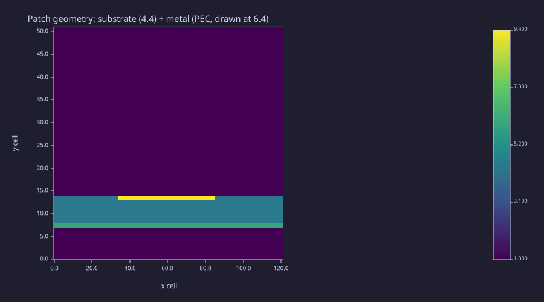

<!-- Generated by rustlab-notebook — do not edit directly. -->

# Lesson 14: Capstone — End-to-End Device Simulation

Every prior lesson built one piece of a mini-Ansys pipeline: geometry primitives (Lesson 04), static and frequency-domain solvers (Lessons 05, 10), full-wave time domain (Lesson 11), modal and far-field analysis (Lesson 12), transmission lines and ports (Lesson 13). This capstone composes all of them into a single end-to-end script that takes a layered antenna geometry, runs FDTD with a pulsed feed, and reads the response spectrum and field pattern off a single time-series.

The classic 3-D device target — a rectangular patch antenna on FR-4 at 2.45 GHz — is sized for a desktop CST run, not for an interpreted-rustlab demo. We instead build the **2-D side-view cross-section** of a related device: an air half-space above a substrate-on-ground-plane stack with a metal patch on top, driven by a pulsed feed in the substrate. (The patch we simulate is deliberately oversized to 50 mm rather than the $\approx 30\,\text{mm}$ a 2.45 GHz design would use — the caveat under *The Capstone Loop* explains why.) The 2-D problem captures every algorithmic step (geometry → ε map → PEC mask → FDTD → port-trace → FFT) while staying under a minute of run time. The *From 2-D to 3-D* section at the end of this lesson explains exactly which lines would grow into 3-D Tensor3 calls for a production simulation.

## Learning Objectives

- Compose a layered geometry as a stack of $\varepsilon_r$, $\mu_r$, and PEC masks on a single (ny, nx) grid
- Run a 2-D Yee FDTD with a Gaussian-modulated pulse feed and absorbing strips
- Record a port-probe time trace and FFT it — and know why a short driven window exposes the drive spectrum, while resonances need a post-drive ring-down window
- Recognise the natural extension to 3-D Tensor3 arrays, TF/SF + Bérenger PML, and NF→FF — all curriculum tools, applied once more

## Background

Lessons 04 (geometry / material maps), 09 (animations via `frame()`/`saveanim()`), 11 (FDTD core), 12 (radiation), 13 (transmission-line port and the probe-trace FFT pattern). The 2-D Yee step is reused verbatim from `fdtd_2d_scattering.rlab` with `ε_r(x, y)` from a layered material map.

## Device Under Test

A side-view of a microstrip patch antenna:

| Layer | y cells | Material |
|---|---|---|
| Air above patch | $y \in (y_{\rm top}, n_y]$ | $\varepsilon_r = 1$ |
| Patch (top metal) | row $y_{\rm top}$, columns $x_{\rm lo}..x_{\rm hi}$ | PEC ($E_z = 0$) |
| Substrate | $y \in (y_g, y_{\rm top}]$ | $\varepsilon_r = 4.4$ (FR-4) |
| Ground plane | row $y_g$ | PEC, full-width |
| Air below | $y \in [1, y_g)$ | $\varepsilon_r = 1$ |

A 1-column **feed** sits at $x = x_{\rm lo}$ (the left edge of the patch), driving $E_z$ between the ground plane and the patch underside with a Gaussian-modulated CW pulse centred at 2.5 GHz. The cross-section is bounded laterally by absorbing strips (cubic-σ bulk loss); the top and bottom rows of the grid are hard (PEC-like) boundaries, so radiated leakage *does* reflect within the simulation window — weak compared with the energy the feed pumps under the patch, but enough that the truncation shapes the driven-response spectrum the probe records (see the discussion under Expected Numerical Outputs).

## The Capstone Loop

### Theory

The four pieces compose like this:

1. **Material map.** Lesson 04's recipe: start with $\varepsilon_r(i, j) = 1$, fill a band of cells with $4.4$ for the FR-4 substrate, and set a `pec_mask(i, j) = 1` on the ground row and patch row. The Yee step multiplies $E_z$ by $(1 - \text{pec\_mask})$ after each E update — a one-line enforcement of the perfect-conductor condition.

2. **Yee FDTD core.** Lesson 11's leapfrog updates $H_x$, $H_y$, $E_z$ on a staggered grid. The per-cell $\varepsilon_r$ coefficient enters as a precomputed `cE_map(i, j) = \Delta t / (\varepsilon_0\varepsilon_r(i,j)\Delta x)`. Bulk-loss absorbing strips at the lateral edges suppress reflection without a full Bérenger PML — adequate for a 900-step run.

3. **Pulsed feed.** A Gaussian-modulated $\sin(\omega_0 t)$ in a 1-column column of the substrate. The pulse's frequency content roughly covers 1–4 GHz (a $\tau = 0.4$ ns Gaussian envelope on a 2.5 GHz carrier) so a single run probes the patch across its operating band.

4. **Port-trace FFT.** A probe a few cells off the feed column, just above the ground plane, records $E_z(t)$. Over this 900-step run the source is still driving the structure for most of the window, so the trace is the **driven response** of the truncated 2-D box, not a clean free decay (a true ring-down needs a longer run windowed well after the drive ends — Exercise 1 does exactly that). Its Fourier transform is the drive spectrum shaped by the box's response, and over this source-dominated window it peaks at the drive carrier — *not*, as the caveat below the script walkthrough explains, at any resonance of the structure.

### Example — Microstrip patch on FR-4

```rustlab
clf;
set_default_axis("xy");        % physics y-axis: ground at the bottom of the panel
mu0_c  = 4 * pi * 1e-7;
eps0_c = 8.854187817e-12;
c0_c   = 1 / sqrt(mu0_c * eps0_c);

nx_c = 121; ny_c = 51;
dx_c = 1.0e-3; dy_c = dx_c;
S_c  = 0.7;
dt_c = S_c * dx_c / c0_c;

% Geometry rows — same grid as patch_antenna.rlab
y_g_c   = 8;
y_top_c = 14;
x_lo_c  = 35;
x_hi_c  = 85;

% ε map (FR-4 substrate)
eps_r = ones(ny_c, nx_c);
for j = 1:nx_c
  for i = y_g_c+1:y_top_c
    eps_r(i, j) = 4.4;
  end
end

% PEC mask (ground + patch rows)
pec_mask = zeros(ny_c, nx_c);
for j = 1:nx_c
  pec_mask(y_g_c, j) = 1;
end
for j = x_lo_c:x_hi_c
  pec_mask(y_top_c, j) = 1;
end

imagesc(eps_r + 5 * pec_mask, "viridis");
title("Patch geometry: substrate (4.4) + metal (PEC, drawn at 6.4)");
xlabel("x cell");
ylabel("y cell")
```

<!-- rustlab:output-start -->


<!-- rustlab:output-end -->

The geometry snapshot shows the substrate band (mid-yellow) sandwiched between the full-width ground plane below it and the shorter patch stripe on top — with `set_default_axis("xy")` the y axis points up, so row 1 is the bottom of the panel, exactly as in the standalone script. The colour scale stacks the PEC value on top of the dielectric ε so both regions stay visible.

The remaining cells of the loop — the Yee update, the source injection, the PEC enforcement, the probe storage, the animation frame, and the post-FFT peak finding — together form the script `patch_antenna.rlab`. Rather than embed the whole 100-line loop here, we walk through its block structure:

```text
1. Initialise zero E_z, H_x, H_y matrices.
2. Precompute cE_map = dt / (eps0 * eps_r * dx)         ← Lesson 04 material map
3. Build absorbing-strip σ_x(j) for x ∈ [1..absorb_w] ∪ [nx-absorb_w+1..nx]
4. For each time step:
     a. H_x, H_y leapfrog updates                       ← Lesson 11 Yee
     b. E_z leapfrog with damp = 1/(1 + dt σ_x/(2 ε0))
     c. Add Gaussian-modulated pulse at feed column     ← Lesson 13 feed
     d. Enforce E_z = 0 on ground + patch via mask
     e. Record probe E_z(t) a few cells off the feed column ← Lesson 11 + 13 trace
     f. Every 40 steps, frame() the field for animation ← Lesson 09 animation
5. saveanim("patch_antenna_animation.gif")
6. FFT the driven probe trace (steps 200–900) → spectrum           ← Lesson 13 FFT pattern
7. Identify the dominant peak in the spectrum (see caveat below).
8. Plot the spectrum, the time trace, and the final |E_z| heatmap.
```

The standalone script that implements this pattern is `patch_antenna.rlab`. Run it with `make lesson-14`; its 900-step animation lands in well under a minute of interpreted-rustlab wall time. **One honest caveat about reading the result.** The patch here is deliberately oversized: at 50 mm its textbook $\lambda/2$ design frequency $f_{\rm res} = c_0 / (2 L_{\rm patch}\sqrt{\varepsilon_{\rm eff}})$ sits near $1.43\,\text{GHz}$, well below the 2.5 GHz feed band (a 2.45 GHz design patch would be the $\approx 30\,\text{mm}$ of the table above) — so a peak at the feed frequency cannot be mistaken for the design mode. The dominant peak the script prints is $\approx 2.44\,\text{GHz}$ — the **drive carrier itself** ($f_0 = 2.5\,\text{GHz}$, within one spectral bin): a broad, low-$Q$ feature of the **driven** response, not a resonance of the structure. The tell-tale is that it does not shift when you sweep the patch length or the substrate $\varepsilon_r$ — Exercises 1–2 run exactly that diagnostic. Nor is the textbook 1.43 GHz mode hiding beneath it: in this 2-D TM$_z$ cross-section $E_z$ is pinned to zero on *both* the patch and the ground plane, so the region between them supports no TEM-like patch mode at all — its lowest resonance is the **vertical** half-wave across the substrate, $f \approx c_0/(2h\sqrt{\varepsilon_r}) \approx 11.9\,\text{GHz}$ for the 6 mm FR-4 gap (Exercise 2 finds it). The patch-mode physics a real antenna lives on belongs to the other polarisation, which is one more reason the table above marks $S_{11}$ and the far field as 3-D extensions. (An earlier revision of this lesson quoted "3.6657 GHz" here — that number was this same carrier peak read off a mislabeled frequency axis, from back when rustlab's `fft` silently zero-padded its input; the axis built from `length(trace)` was stretched by 1024/701. rustlab's `fft` is length-preserving now, so the axis in the script is correct as written.)

## From 2-D to 3-D — What Would Change

The 2-D capstone is a faithful reduction of the 3-D problem to its essentials. To grow it into a real patch-antenna simulation:

| Step | 2-D this script | 3-D production |
|---|---|---|
| Grid | `Ez(ny, nx)` matrices | `Ez(ny, nx, nz)` Tensor3, same for $H_x, H_y, H_z$ |
| Material map | `eps_r(i, j)` matrix | `eps_r(i, j, k)` Tensor3 with `rect_mask` slabs |
| Feed | 1-column source between ground and patch | TF/SF box on a coax-feed port plane |
| Boundary | absorbing strips on $x$ edges | full Bérenger split-field PML on all six faces |
| $S_{11}$ | probe-trace FFT (informal) | mode-filtered waveport + time-gating + FFT |
| Far field | probe field above the patch | NF→FF surface integral on a closed box ([Lesson 12 Ex. 5](12-waveguides-and-radiation.md#exercises)) |

Every element on the right is a tool the curriculum already covered. The 3-D step is a *scale-up*, not a new physics or algorithm.

## Standalone Script

| Script | What it computes |
|---|---|
| `patch_antenna.rlab` | 2-D side-view FDTD of an FR-4 microstrip patch with a pulsed feed; animated; spectrum of the feed-probe trace |

Run it with `make lesson-14`, or directly via `rustlab run lessons/14-capstone-device-simulation/patch_antenna.rlab`.

## Expected Numerical Outputs Summary

| Quantity | Expected Value |
|---|---|
| Substrate $\varepsilon_r$ (FR-4) | 4.4 |
| Patch length $L$ for a 2.45 GHz design | $\lambda_0/(2\sqrt{\varepsilon_{\rm eff}}) \sim 30\,\text{mm}$ |
| Simulated patch length (this script) | $50\,\text{mm}$ — deliberately oversized so the textbook $\lambda/2$ design frequency ($\approx 1.43\,\text{GHz}$) is well separated from the 2.5 GHz feed band; see the caveat below |
| 2-D dominant spectral peak, this geometry | $\approx 2.44\,\text{GHz}$ (printed 2.4438 GHz) — the drive carrier ($f_0 = 2.5$ GHz, within one bin): a broad, low-$Q$ feature of the **driven** response, *not* the patch's $\lambda/2$ mode ($\approx 1.43\,\text{GHz}$). It stays fixed under patch-length and $\varepsilon_r$ sweeps (Exercises 1–2) — the diagnostic that it is not a patch resonance |
| Pulse half-width $\tau$ | $\approx 0.4\,\text{ns}$ |
| Time-step ($S = 0.7$ Courant) | $\sim 2.34\,\text{ps}$ ($\Delta x = 1$ mm) |
| Total simulation time | $\sim 2.1\,\text{ns}$ (900 steps × $\Delta t$) |

## Exercises

1. **Patch length sweep — is the dominant peak a patch mode?** Rerun the script for $L_{\rm patch} \in \{20, 30, 40, 50\}\,\text{mm}$ (change `x_hi - x_lo`) and record the dominant FFT-peak frequency and amplitude. Both refuse to move: at 30 vs 50 mm the peak sits in the same 2.4438 GHz bin with the same amplitude to five digits, and no secondary local maximum above 1 % of it appears anywhere in 0.5–8 GHz — direct evidence the dominant peak is the drive, not a patch mode (a $\lambda/2$ mode would scale as $1/L_{\rm patch}$). To see something that *does* depend on the patch, listen to the box *after* the drive stops: raise `n_step` to 6000 (skip the animation — the run is still a few seconds), and FFT only the post-drive tail `Ez_probe(1300:n_step)` (by step 1300 the source envelope is below $10^{-9}$ of its peak). A ring-down peak survives at $4.10\,\text{GHz}$ for the 50 mm patch, moving to $3.92\,\text{GHz}$ at 30 mm and $3.55\,\text{GHz}$ with the patch deleted. It is patch-dependent — but it shifts the *wrong way* for a patch mode (up with length, not down as $1/L$): it is the vertical half-wave of the **air gap between the patch and the hard top wall** of the truncated box ($c_0/2d \approx 4.05\,\text{GHz}$ for the $d = 37\,\text{mm}$ gap); a shorter patch lets the mode leak around its edges into the taller ground-to-top-wall gap and sag in frequency. A probe 6 cells *above* the patch (`Ez(y_top+6, 60)`) records this ring-down about 100× stronger than the substrate probe.
2. **Substrate sweep — same diagnostic, and where the substrate really shows up.** Repeat with $\varepsilon_r \in \{2.2, 4.4, 9.8\}$ (Rogers / FR-4 / alumina). The driven-window dominant peak again stays pinned at 2.4438 GHz for all three; only its amplitude grows (2.05 / 4.27 / 10.6) as a denser substrate stores more feed energy — confirming a driven-response feature, not a material resonance. (Do not bother subtracting a no-patch reference run: the no-patch box is anything but a quiet background — it rings at its own $\approx 3.55\,\text{GHz}$ mode orders of magnitude harder than any patch feature, and the difference spectrum comes out patch-independent.) Instead reuse Exercise 1's ring-down window and look *above* the feed band at the substrate probe: the cluster of sub-patch modes near $c_0/(2h\sqrt{\varepsilon_r})$ — the vertical half-wave between ground and patch promised in the caveat — lands at $16.8 / 11.8 / 8.1\,\text{GHz}$ for $\varepsilon_r = 2.2 / 4.4 / 9.8$, scaling as $1/\sqrt{\varepsilon_r}$ to within a few percent ($16.8/11.8 = 1.42 \approx \sqrt 2$). That cluster is the closest thing this 2-D polarisation has to a patch cavity — resonating near 12 GHz on FR-4, not 1.43 GHz.
3. **Inset feed.** Move the feed column from the patch's left edge inward by a few cells. Track the probe spectrum's amplitude at the drive-carrier bin (the printed $\approx 2.44\,\text{GHz}$ peak) as a function of inset distance — a proxy for how strongly the feed couples energy into the space under the patch. In a real 3-D design the analogous dial — inset depth against the patch mode's impedance profile — is how patches get matched to 50 Ω; here it reshapes only the driven response, since this polarisation has no patch mode to match into.
4. **3-D port-trace.** Build a 3-D Tensor3 version of the material map using `rect_mask` slabs (Lesson 04). Don't run the full FDTD — just verify the geometry slices look correct in three orthogonal `imagesc` views (xz, xy, yz).
5. **NF→FF on the 2-D run.** Near the end of the run — the field is a carrier-driven quasi-steady state; there is no structural resonance to select — take the late-time $E_z$ on a horizontal line just above the patch, FFT it along $x$ (the aperture), and interpret the resulting $|\tilde E_z(k_x)|$ as the angular pattern $|F(\theta)|$ via $k_x = k_0\sin\theta$. Plot in polar; compare to a textbook patch radiation pattern.

## Looking Back

The first fourteen lessons span:

- **Lessons 01–03**: vector calculus on grids, electrostatic superposition, Gauss / potential
- **Lesson 04**: geometry primitives — the CAD layer every later solver consumes
- **Lessons 05–07**: numerical PDEs (Poisson, magnetostatics, Faraday)
- **Lesson 08**: Maxwell's equations as a closed self-consistent system
- **Lesson 09**: plane waves, polarisation, standing waves
- **Lessons 10–11**: the two full-wave solvers (FDFD and FDTD)
- **Lesson 12**: modal eigenproblems and far-field radiation
- **Lesson 13**: transmission lines and S-parameters
- **Lesson 14**: composition — this capstone

Beyond the capstone, Lessons 15–17 extend the arc from fields to circuits: lumped capacitance extraction (Lesson 15), Smith-chart impedance matching (Lesson 16), and lumped inductance extraction (Lesson 17).

Every script in this curriculum sits in `lessons/<id>-<name>/` as a runnable artefact; every notebook in `notebooks/<id>-<name>.md` documents the physics with interleaved theory and example. The rendered curriculum is at `book/`. The two upstream-feature requests we filed and saw landed — animation export (`frame()`/`saveanim()`) and the SC-PML helpers in `lessons/_shared/em.rlab` — close the loop on the original "what rustlab needs to support the curriculum" survey from `dev/rustlab/requests/em_requests.md`. The remaining 3-D Yee + SC-PML graduation to native Rust waits on the triggers documented in [`yee-and-pml-builders.md`](../dev/rustlab/requests/yee-and-pml-builders.md); until then, the scripted library is the curriculum-side answer.
