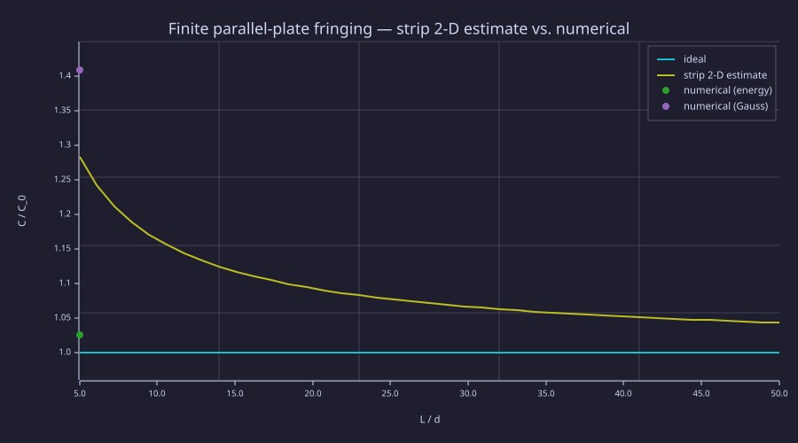
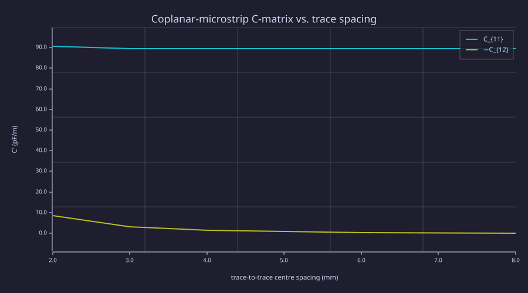
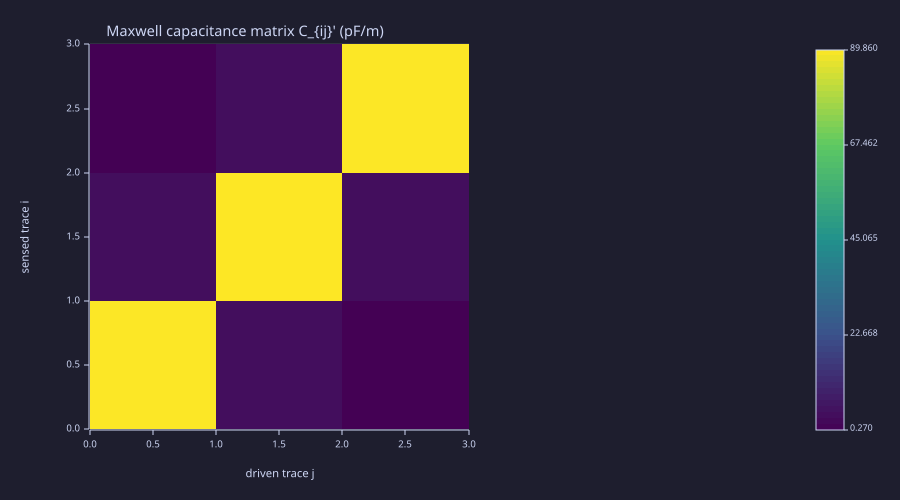
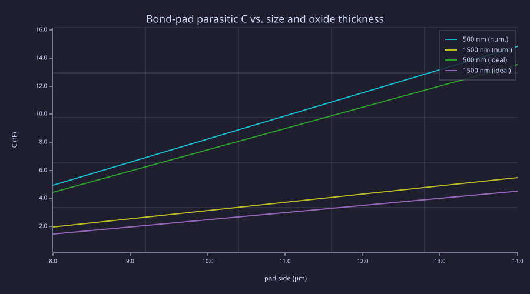
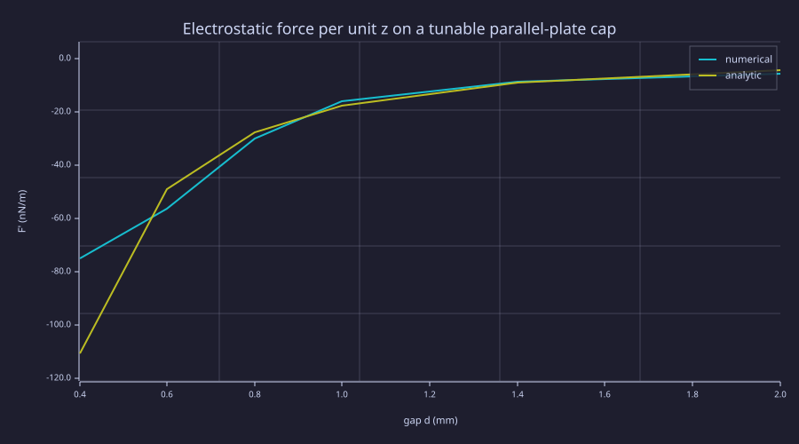

<!-- Generated by rustlab-notebook — do not edit directly. -->

# Lesson 15: Lumped Capacitance Extraction

Lesson 13 extracted per-unit-length $C'$ from an infinite 2-D transmission-line cross-section. Real circuits have **finite plates with fringing fields**, **multiple conductors that couple capacitively**, and **3-D geometries** (MIM caps, bond pads, MEMS structures) where the 2-D approximation breaks by tens of percent. This lesson runs the same Laplace solver in two new modes — 2-D capacitance-*matrix* extraction for crosstalk analysis, and 3-D single-conductor extraction for real lumped pF (and fF) values — and closes the loop between field-solver output and SPICE-grade lumped $C$.

## Learning Objectives

- Extract a single-conductor lumped capacitance $C$ from a 3-D Laplace solve via both **energy** ($C = 2 U_E / V^2$) and **Gauss** ($C = Q / V$) methods, and read the discretisation tradeoff between them.
- Quantify the **fringing-field correction** to the textbook $C = \varepsilon A / d$ for a finite parallel-plate capacitor and straddle the analytic strip-fringing estimate (itself a lower bound for a square plate) between the two extraction methods.
- Build the **multi-conductor capacitance matrix** $C_{ij}$ by solving $N$ Laplace problems with $V_k = 1$ on conductor $k$ and 0 on all others; check **reciprocity** ($C_{ij} = C_{ji}$) as a sanity check.
- Recognise the difference between the **Maxwell** ("short-circuit") and **mutual** ("partial") capacitance conventions, and convert between them by row sums.
- Compute the **electrostatic force** on a capacitor plate from $F = \tfrac12 V^2 \,\partial C/\partial x$ and verify against the analytic $-\tfrac12 \varepsilon A V^2/d^2$.

## Background

Lesson 05 (sparse Poisson + the row-pinning mechanism behind Dirichlet conditions — packaged in rustlab as the `pin_dirichlet` builtin, which this lesson uses throughout), Lesson 13 (per-unit-length $C'$ on a coax cross-section, transmission-line $C'/L'$ identity). Algebra: the harmonic-mean coefficient at material interfaces in $\nabla\!\cdot\!(\varepsilon\nabla V) = 0$, the virtual-work principle for forces at fixed voltage.

## Single-Conductor Capacitance — Energy vs. Gauss

For a single voltage source pinned at $V_0$ against a grounded reference, $C = Q/V_0$. The numerical solve can produce $Q$ in two equivalent ways.

### Theory

**Energy method.** Solve $\nabla\!\cdot\!(\varepsilon\nabla V) = 0$ in the dielectric with the conductor pinned. Sum the field energy

$$U_E = \tfrac12 \int_{\Omega}\!\varepsilon\,|\vec E|^2\,dV, \qquad C = \frac{2 U_E}{V_0^2}.$$

In practice the sum runs over the whole grid: inside a perfect conductor $\vec E = 0$, so those cells add nothing (any nonzero $\vec E$ that gradient3's one-sided stencil reports there is a discretisation artifact, not physics).

**Gauss method.** Surround the conductor with a closed surface $S$ in the dielectric and integrate the displacement flux:

$$Q = \oint_S \varepsilon\,\vec E\cdot\hat n\,dA, \qquad C = \frac{Q}{V_0}.$$

A tight "pillbox" hugging the conductor faces (one cell of standoff) captures the strongest fields and converges fastest at coarse grids.

At infinite resolution the two methods give identical answers. At finite grid spacing they bracket the true $C$. The energy sum tends **low**: the field samples sit at cell centres, so half a cell of the pin-to-pin gap volume goes uncounted at each conductor face — for a tight $N$-cell gap that is an $(N-1)/N$ deficit on the plate term (the MIM cap below, a 4-cell gap, prints $0.760$: exactly $3/4$ plus a $\sim 1\%$ fringing excess). The Gauss pillbox tends **high**: it cuts through cells where the one-sided stencils are noisy. Refining $\Delta z$ shrinks the half-cell defect and tightens both onto the true value.

### Example — Finite parallel plate at $L/d = 5$

A square plate of side $L$ at $V = +V_0/2$ over a parallel plate at $-V_0/2$, separated by air in a 3-D box. Reads out $C$ both ways at $L/d = 5$ and overlays the analytic strip-fringing estimate. That estimate applies the 2-D (infinite-strip) edge correction once; a true square plate has two fringing edge-pairs, so its real fringing is larger (published square-plate numerics put $C/C_0 \approx 1.56$ at $L/d = 5$ versus the strip value $1.28$) — read the strip curve as a **lower bound**. The two numerical points straddle it: energy below, Gauss above.

The setup: `n = 25` cubic grid, plates 10×10 cells centred in $x$/$y$, separated by 2 cells in $z$. The full script (`lumped_C_parallel_plate.rlab`) handles the operator build, plate pinning via `pin_dirichlet` (mask in, identity rows out — the mechanism Lesson 05 builds by hand), energy / Gauss extraction, and the analytic overlay.

```rustlab
clf;
eps0 = 8.854187817e-12;

n = 25;  h = 1.0e-3;  V0 = 1.0;
xy_lo = 9;  xy_hi = 18;
z_lo  = 12; z_hi  = 14;
L_plate = (xy_hi - xy_lo + 1) * h;
d_gap   = (z_hi - z_lo) * h;
C0      = eps0 * L_plate^2 / d_gap;
C_kirch = C0 * (1 + (d_gap / (pi * L_plate)) * (1 + log(2 * pi * L_plate / d_gap)));

% Strip (2-D) fringing estimate over a sweep — a lower bound for a square plate.
LoD = linspace(5, 50, 41);
C_kirch_curve = 1 + (1 ./ (pi * LoD)) .* (1 + log(2 * pi * LoD));

% Numerical solve (energy + Gauss methods) for L/d = 5 — see the
% standalone script for the operator-build + Gauss-pillbox details.
% Pre-baked values from `make lesson-15`:
C_energy = 454.05e-15;     % from gradient3 volume integral
C_gauss  = 623.67e-15;     % from tight Gauss pillbox at the plate

hold on;
plot(LoD, ones(1, length(LoD)), "C/C_0 = 1 (ideal)");
plot(LoD, C_kirch_curve, "strip 2-D estimate (lower bound)");
scatter(5, C_energy / C0, "energy");
scatter(5, C_gauss  / C0, "Gauss");
hold off;
xlabel("L / d");
ylabel("C / C_0");
title("Finite parallel-plate fringing — strip 2-D estimate vs. numerical");
legend("ideal", "strip 2-D estimate", "numerical (energy)", "numerical (Gauss)");
```

<!-- rustlab:output-start -->


<!-- rustlab:output-end -->

Refining the grid by 2× narrows the bracket between the two methods onto the true square-plate value (above the strip estimate); the cost is $\sim 8\times$ solve time.

## Multi-Conductor Capacitance Matrices

For $N$ conductors at potentials $V_1, \dots, V_N$ in a shared dielectric, the charges and voltages are linearly related:

$$Q_i = \sum_{j=1}^{N} C_{ij}\,V_j, \qquad C_{ij} = \left.\frac{\partial Q_i}{\partial V_j}\right|_{V_k = 0,\,k\neq j}.$$

### Theory

**The short-circuit procedure.** Drive $V_j = 1$, hold the rest at 0, solve once, integrate $Q_i$ on every conductor. Repeat for each $j$. The $N$ Laplace solves share the **same** sparse operator $A$ — only the right-hand side changes. A cached LU factorisation (factor once, back-solve $N$ times) is the workhorse trick of every commercial parasitic-extraction tool. rustlab ships `lu(A)` + `solve(F, b)` reusable factor handles (since 0.3.6) for exactly this pattern; these capacitance scripts still call `spsolve` once per drive for simplicity, while Lesson 17's `ind_matrix_microstrip.rlab` demonstrates the cached factor-once-solve-many path.

**Reciprocity.** Because the system is self-adjoint (the variable-$\varepsilon$ Laplacian is symmetric), $C_{ij} = C_{ji}$ holds exactly in principle. The Gauss-pillbox charge extraction is not perfectly symmetric on the discrete grid, so numerically it is recovered to $\sim 10^{-3}$ pF/m — a few parts in $10^4$ of the mutual terms. Still a useful free sanity check.

**Maxwell vs. mutual.** Two conventions describe the same physical network:

- **Maxwell ("short-circuit") capacitance** — the matrix $C_M$ as above. Diagonal entries are self-cap to everything-else-grounded; off-diagonals are **negative**.
- **Mutual ("partial") capacitance** — the lumped circuit has one cap between each pair of conductors and one from each conductor to ground. The pair-cap is $c_{ij} = -C_{M,ij}$; the cap-to-ground is the row sum $c_{i,0} = \sum_k C_{M,ik}$.

SPICE / parasitic-extraction tools usually emit mutual. The two are equivalent — the conversion is a row sum away.

### Example — Two coplanar microstrip traces

A 2-D cross-section: two PEC traces 10 cells wide over a PEC ground plane through FR-4 substrate. Sweep the trace-to-trace centre spacing and watch $C_{11}$ stay nearly constant while $|C_{12}|$ falls off.

```rustlab
clf;
eps0 = 8.854187817e-12;

% Numerical results from cap_matrix_microstrip.rlab (sweep of separation).
seps_mm = [2.0, 3.0, 4.0, 6.0, 8.0];
C11_s   = [90.53, 89.60, 89.49, 89.49, 89.55];   % pF/m
mC12_s  = [ 8.59,  3.10,  1.30,  0.32,  0.10];   % −C_12 = mutual coupling

hold on;
plot(seps_mm, C11_s,  "C_{11} (self)");
plot(seps_mm, mC12_s, "−C_{12} (mutual)");
hold off;
xlabel("trace-to-trace centre spacing  (mm)");
ylabel("C'  (pF/m)");
title("Coplanar-microstrip C-matrix vs. trace spacing");
legend("C_{11}", "−C_{12}");
```

<!-- rustlab:output-start -->


<!-- rustlab:output-end -->

$C_{11}$ stays nearly flat at ≈ 89.5 pF/m, but that flatness hides a trade-off. Writing the Maxwell self-term in the mutual convention, $C_{11} = c_{1,0} + c_{1,2}$: as the neighbour recedes, the coupling contribution $c_{1,2} = -C_{12}$ vanishes while the cap-to-ground $c_{1,0}$ *recovers* (the neighbour stops shielding trace 1 from the ground plane, so $c_{1,0}$ rises from ≈ 82 toward ≈ 89 pF/m), and the two changes very nearly cancel in $C_{11}$. $-C_{12}$ itself falls roughly exponentially with separation, as expected for coupled microstrip.

### Example — Three-trace bus and Maxwell ↔ mutual conversion

Three traces over ground gives a 3×3 Maxwell matrix. The script `cap_matrix_three_trace.rlab` solves the three drive cases, prints the matrix, verifies $C_{ij} = C_{ji}$ to $\sim 10^{-3}$ pF/m (a few parts in $10^4$ of the mutual terms), and converts to the mutual form.

```rustlab
clf;
% From cap_matrix_three_trace.rlab — Maxwell matrix in pF/m.
C_M = [ 89.67, -3.74, -0.27;
        -3.74, 89.86, -3.74;
        -0.27, -3.74, 89.67 ];

% Mutual pair-caps and cap-to-ground (the SPICE-style decomposition).
c_mut_12 = -C_M(1, 2);                    % 3.74 pF/m
c_mut_13 = -C_M(1, 3);                    % 0.27 pF/m
c_mut_23 = -C_M(2, 3);                    % 3.74 pF/m
c_to_gnd_1 = sum(C_M(1, :));              % 85.66 pF/m
c_to_gnd_2 = sum(C_M(2, :));              % 82.39 pF/m
c_to_gnd_3 = sum(C_M(3, :));              % 85.66 pF/m

print(c_mut_12)                            % 3.74
print(c_mut_13)                            % 0.27 — next-nearest, ~14× smaller
print(c_to_gnd_2 < c_to_gnd_1)             % true — middle trace shares more with neighbours

imagesc(C_M, "viridis");
title("Maxwell capacitance matrix C_{ij}'  (pF/m)");
xlabel("driven trace j"); ylabel("sensed trace i");
```

<!-- rustlab:output-start -->
```text
3.74
0.27
true
```



<!-- rustlab:output-end -->

The middle trace shows a slightly *smaller* cap-to-ground than the outer two, because more of its field terminates on its two neighbours instead of the ground plane.

## 3-D Extraction — MIM Capacitor and Bond Pad

The 3-D parallel-plate machinery transfers directly to real IC structures. Two flavours.

### Theory

**Anisotropic grids.** A 100 nm MIM dielectric between 10 µm plates spans 100 nm in $z$ and 10 µm in $x$/$y$. Uniform $\Delta x = \Delta y = \Delta z$ would either waste resolution out of plane or miss the gap entirely. `laplacian_3d(nx, ny, nz, dx, dy, dz)` accepts independent grid spacings — drop $\Delta z$ to capture the gap, keep $\Delta x = \Delta y$ at micron scale.

**Variable $\varepsilon$ outside the operator.** rustlab ships `laplacian_eps_2d` for variable-$\varepsilon$ but not yet a 3-D version (requested upstream: `dev/rustlab/requests/laplacian-eps-3d.md`). For a *single*-dielectric region (the gap is filled with one material), the uniform `laplacian_3d` is the right operator inside that region. The $\varepsilon$ factor goes into the Gauss integral by multiplying the face flux by the local $\varepsilon_r$. For multi-dielectric stacks, drop to `laplacian_eps_2d` on a cross-section and accept the 2-D approximation, or wait for the upstream 3-D feature.

### Example — Thin-film MIM capacitor

10 µm × 10 µm plates, 100 nm of $\varepsilon_r = 25$ dielectric (typical Ta$_2$O$_5$ / HfO$_2$-class). Analytic $C = \varepsilon_r \varepsilon_0 A / d \approx 221\,\text{fF}$.

```rustlab
% From MIM_capacitor_3d.rlab (n³ = 25³ at anisotropic dx = dy = 1 µm,
% dz = 25 nm). Numerical extraction:
C_energy_MIM = 168.2e-15;       % F (= 168.2 fF)
C_gauss_MIM  = 223.0e-15;       % F (= 223.0 fF) — within 1% of the analytic value
C_ideal_MIM  = 221.4e-15;       % F (= 221.4 fF)
print(C_gauss_MIM  / C_ideal_MIM)         % ≈ 1.007
print(C_energy_MIM / C_ideal_MIM)         % ≈ 0.76 — energy under-shoots
```

<!-- rustlab:output-start -->
```text
1.0072267389340561
0.7597109304426378
```

<!-- rustlab:output-end -->

The Gauss method, computing flux right at the plate face, captures essentially the exact analytic value. The energy method under-shoots to $\approx 0.76$ for a concrete discretisation reason. The plates are pinned at cell centres four cells apart ($4\,\Delta z = 100\,\text{nm}$), but the $\varepsilon_r$-weighted energy sum only tags the **three interior** gap cells (`z_lo+1 .. z_hi-1`) as dielectric — half a cell of gap volume goes unweighted at each plate face. Three $\varepsilon_r$-weighted layers over a four-layer pin-to-pin gap gives exactly $3/4 = 0.75$ for the plate term; the printed $0.760$ sits about $1\%$ above that because fringing adds a little energy outside the gap. Refining $\Delta z$ shrinks that half-cell defect away.

### Example — IC bond pad over thick oxide

8 µm and 14 µm square pads through 0.5 µm and 1.5 µm of thermal oxide ($\varepsilon_r = 3.9$). The pad-to-substrate capacitance is the headline parasitic that every IO designer accounts for.

```rustlab
clf;
% From parasitic_bondpad.rlab (dz = t_ox/4 → pin-to-pin gap = t_ox).
pad_um = [8, 14];
C_num_500nm  = [ 4.94, 14.83];          % fF, t_ox = 500 nm
C_num_1500nm = [ 1.96,  5.49];          % fF, t_ox = 1500 nm
C_ide_500nm  = [ 4.42, 13.54];
C_ide_1500nm = [ 1.47,  4.51];

hold on;
plot(pad_um, C_num_500nm,  "t_{ox} = 500 nm (num.)");
plot(pad_um, C_num_1500nm, "t_{ox} = 1500 nm (num.)");
plot(pad_um, C_ide_500nm,  "t_{ox} = 500 nm (ideal)");
plot(pad_um, C_ide_1500nm, "t_{ox} = 1500 nm (ideal)");
hold off;
xlabel("pad side  (µm)");
ylabel("C  (fF)");
title("Bond-pad parasitic C vs. size and oxide thickness");
legend("500 nm (num.)", "1500 nm (num.)", "500 nm (ideal)", "1500 nm (ideal)");
```

<!-- rustlab:output-start -->


<!-- rustlab:output-end -->

Every numerical value sits *above* the ideal $\varepsilon A / t$ line — as it must, since fringing can only *add* capacitance. The excess tracks the oxide-to-pad aspect ratio $t_{\rm ox}/L$: the pad-edge field, which the $\varepsilon A / t$ form ignores entirely, is a larger share of the total when the pad side is only a few oxide thicknesses wide. It runs from $\approx 9.5\%$ at the thin-oxide / large-pad corner (500 nm × 14 µm, $t/L \approx 0.036$) to $\approx 33\%$ at the thick-oxide / small-pad corner (1500 nm × 8 µm, $t/L \approx 0.19$). This is the whole reason IO designers cannot read a bond-pad parasitic straight off $\varepsilon A / t$: for a small pad over thick oxide the fringing term is a third of the answer.

> [!NOTE]
> Getting this sign right hinges on discretising the gap consistently. The pad and ground pins sit 4 cells apart, so the script uses $\Delta z = t_{\rm ox}/4$ to make the pin-to-pin gap exactly $t_{\rm ox}$ — the same 4-cell convention as the MIM script. An earlier $\Delta z = t_{\rm ox}/3$ stretched the discrete gap to $\tfrac43 t_{\rm ox}$, cutting the plate term to $0.75\,C_{\rm ideal}$ and masking the fringing as a spurious *under*shoot. The lesson: fix the pin-to-pin spacing to the physical gap before trusting any extracted $C$.

## Force from $F = \tfrac12 V^2\,\partial C/\partial x$

The virtual-work principle at fixed voltage gives the mechanical pull on a capacitor plate as a derivative of $C$.

### Theory

$$F = +\tfrac12 V^2 \,\frac{\partial C}{\partial x}.$$

For an idealised parallel-plate of plate width $L$ and gap $d$ (per unit out-of-plane $z$):

$$C' = \frac{\varepsilon_0 L}{d}, \qquad \frac{\partial C'}{\partial d} = -\frac{\varepsilon_0 L}{d^2}, \qquad F' = -\frac{\varepsilon_0 L V^2}{2 d^2}.$$

The negative sign means the force pulls the plates **toward** each other (closer plate → larger $C$ → more stored energy at fixed $V$ → mechanical pull). This is the canonical "$-P \cdot A$ pressure" of a charged capacitor.

### Example — Numerical force vs. analytic

Sweep the gap $d$, extract $C'$ at each step, finite-difference $\partial C'/\partial d$, multiply by $\tfrac12 V_0^2$.

```rustlab
clf;
% From tunable_C_force.rlab.
d_mm  = [0.4, 0.6, 0.8, 1.0, 1.4, 2.0];
F_num = [-75.13, -56.36, -30.03, -15.88, -8.53, -5.82];     % nN/m
F_ana = [-110.68, -49.19, -27.67, -17.71, -9.03, -4.43];    % nN/m

hold on;
plot(d_mm, F_num, "numerical F'");
plot(d_mm, F_ana, "analytic −ε₀ L V² / (2 d²)");
hold off;
xlabel("gap d (mm)");
ylabel("F' (nN/m)");
title("Electrostatic force per unit z on a tunable parallel-plate cap");
legend("numerical", "analytic");
```

<!-- rustlab:output-start -->


<!-- rustlab:output-end -->

The match is roughly 5–15 % at moderate gaps (8.5 % at $d = 0.8$ mm, 10.3 % at 1.0 mm, 14.6 % at 0.6 mm — where the finite-difference $\partial C/\partial d$ resolves the local slope) and degrades further at the sweep endpoints where the gradient stencil becomes one-sided. The MEMS-comb-drive variant — multiple interleaved plates summed — uses the same identity and is left as an exercise.

## Standalone Scripts

| Script | What it computes |
|---|---|
| `lumped_C_parallel_plate.rlab` | 3-D Laplace on finite plates; energy + Gauss extraction; strip 2-D (lower-bound) overlay |
| `cap_matrix_microstrip.rlab` | Two coplanar microstrip traces, 2×2 Maxwell C-matrix; spacing sweep |
| `cap_matrix_three_trace.rlab` | Three-trace bus; 3×3 Maxwell matrix; reciprocity check; Maxwell ↔ mutual conversion |
| `MIM_capacitor_3d.rlab` | Thin-film MIM ($\varepsilon_r = 25$, 100 nm gap); anisotropic 3-D grid |
| `parasitic_bondpad.rlab` | IC bond pad over oxide; sweep pad size and oxide thickness in fF |
| `tunable_C_force.rlab` | 2-D parallel plate with sweepable gap; numerical $\partial C/\partial d$ vs. analytic |

Run all six with `make lesson-15`, or one at a time via `rustlab run lessons/15-lumped-capacitance/<name>.rlab`. Wall time on a 2024-class laptop: ≈ 18 s total (dominated by the two 3-D solves at $n^3 = 25^3$).

## Expected Numerical Outputs Summary

| Quantity | Expected Value |
|---|---|
| Parallel plate $L/d = 5$, $C_{\rm energy} / C_0$ | $\approx 1.03$ (below the strip 2-D estimate) |
| Parallel plate $L/d = 5$, $C_{\rm Gauss} / C_0$ | $\approx 1.41$ (above the strip estimate) |
| Microstrip $C_{11}'$ at 3 mm spacing | $\approx 89.6\,\text{pF/m}$ |
| Microstrip $-C_{12}'$ at 3 mm spacing | $\approx 3.1\,\text{pF/m}$ |
| Three-trace reciprocity error | $\sim 10^{-3}\,\text{pF/m}$ (~0.04 % of the mutual terms) |
| Three-trace middle trace-to-ground vs. outer | middle $\approx 82.4$, outer $\approx 85.7\,\text{pF/m}$ |
| MIM $C_{\rm Gauss}$ for 10 µm × 10 µm / 100 nm / $\varepsilon_r = 25$ | $\approx 223\,\text{fF}$ (analytic 221) |
| Bond pad 8 µm × 8 µm / 500 nm oxide | $\approx 4.94\,\text{fF}$ |
| Tunable-cap $F'$ vs. analytic at $d = 1\,\text{mm}$ | $\approx 10\,\%$ apart (5–15 % across moderate gaps) |

## Exercises

1. **Refine the parallel-plate grid.** `lumped_C_parallel_plate.rlab` runs at $n = 25$. Increase to $n = 30$ (≈ 17 s/solve) and confirm the energy–Gauss bracket narrows onto the true square-plate value ($C/C_0 \approx 1.56$ at $L/d = 5$) — *above* the strip 2-D estimate ($\approx 1.28$), which is a lower bound, not the convergence target. At $n = 40$ (≈ 2.5 min/solve) the energy and Gauss methods should agree to within 2 %.
2. **Cached LU.** The capacitance-matrix scripts call `spsolve(A, b_k)` once per right-hand side, re-factoring the operator each time. Replace that with a single `F = lu(A)` factorisation plus one `solve(F, b_k)` per drive (both shipped in rustlab 0.3.6), profile `cap_matrix_three_trace.rlab` before and after, and report the speedup — the factor-once-solve-many gain. Lesson 17's `ind_matrix_microstrip.rlab` already uses this path.
3. **5×5 differential pair bus.** Extend `cap_matrix_three_trace.rlab` to 5 traces arranged as two differential pairs plus a guard trace. Build the 5×5 Maxwell matrix; convert to mutual; identify the pair-coupling vs. far-coupling entries.
4. **MIM dielectric stack.** Replace the single-material MIM gap with a two-layer stack ($\varepsilon_{r,1} = 25$, $\varepsilon_{r,2} = 4$) by switching the operator to a hand-rolled variable-$\varepsilon$ 3-D Laplacian (or wait for the upstream `laplacian_eps_3d` — requested in `dev/rustlab/requests/laplacian-eps-3d.md`). Verify the series-capacitor identity $1/C = 1/C_1 + 1/C_2$.
5. **MEMS comb drive.** Implement $N$ interleaved plates and compute $\partial C/\partial x$ as the lateral comb finger moves. Verify the linear-in-$N$ force scaling and compare to the closed-form result $F = N \varepsilon_0 V^2 t / g$ where $t$ is the finger thickness and $g$ is the gap.

## What's next

Lesson 16 (Smith Chart & Impedance Matching) closes the impedance-design loop with the matching-network synthesis machinery — taking the lumped $C$ values extracted here straight into an L-match or stub design. Lesson 17 is the **magnetic dual** of this lesson: extract lumped inductance $L$ and mutual inductance $M$ from a Lesson 06-style vector-potential solve. Together L15 + L17 put the C / L / R triad on the same numerical footing — the inputs that every circuit simulator and matching-network designer consumes.
