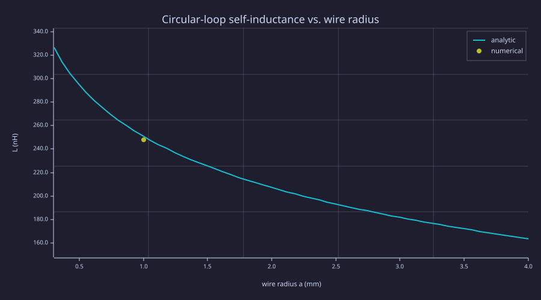
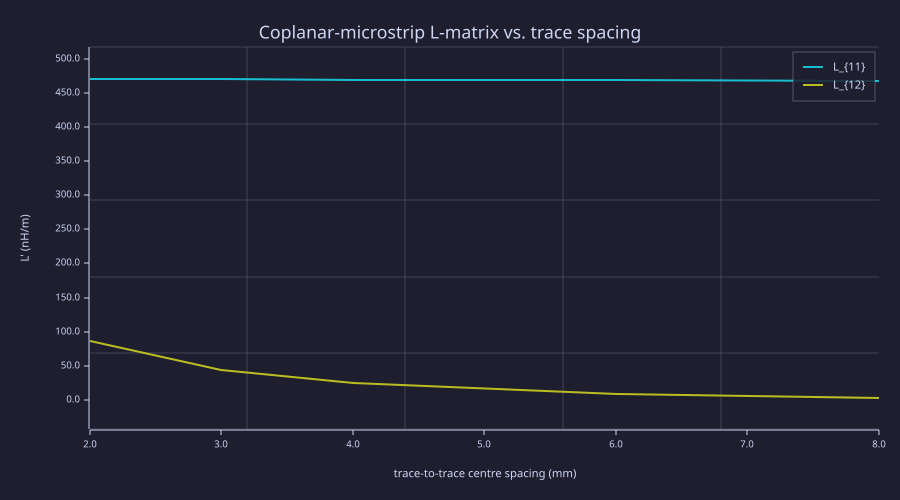
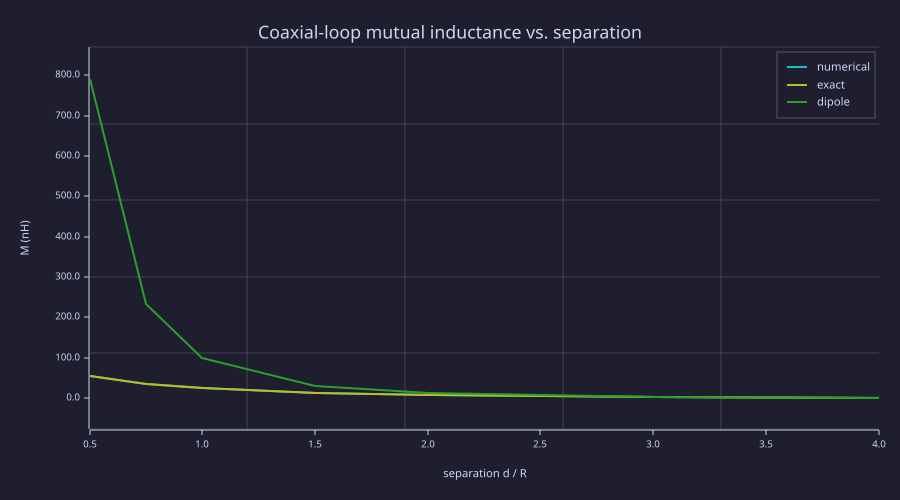
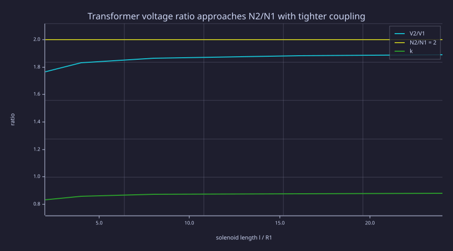
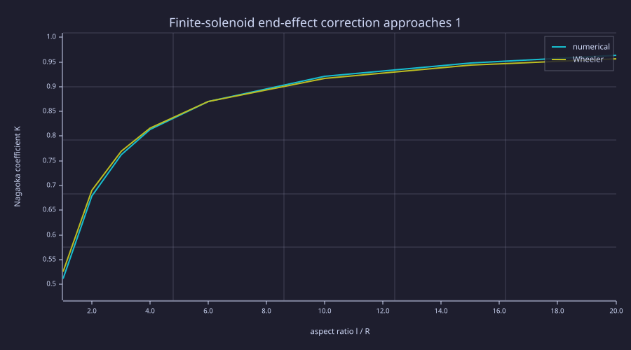
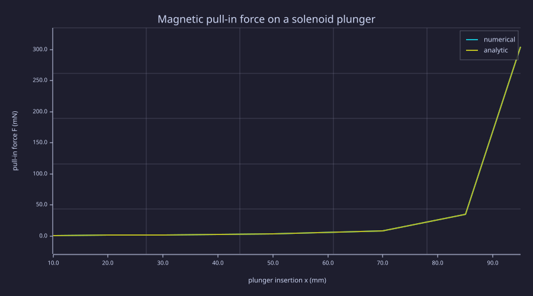

<!-- Generated by rustlab-notebook — do not edit directly. -->

# Lesson 17: Lumped Inductance Extraction

Lesson 15 extracted lumped **capacitance** from a Laplace solve — the electric circuit element pulled out of a static field. This lesson is the magnetic dual: extract lumped **inductance** $L$ and **mutual inductance** $M$ (both in henries) from a [Lesson 06](06-magnetostatics.md)-style vector-potential picture. The math is structurally identical to L15 under the swaps $\varepsilon \to 1/\mu$, $V \to A_z$, charge $\to$ flux; the engineering is complementary. Together L15 + L17 put the circuit triad $C$ / $L$ / $R$ on one numerical footing — the inputs every circuit simulator and matching-network designer consumes.

## Learning Objectives

- Extract a single-loop **self-inductance** from the Biot-Savart flux through the loop interior, regularising the filament singularity by cutting the flux at the inner wire edge $r = R - a$, and verify against $L = \mu_0 R[\ln(8R/a) - 2]$.
- Build the **per-unit-length inductance matrix** $L'_{ij}$ of coupled conductors with a factor-once-solve-many cached LU — the natural fit for a *current* drive, which enters purely as a right-hand-side source term (the capacitance matrix admits the same fixed-operator trick; see L15 Exercise 2).
- Compute the **mutual inductance** of coaxial loops by flux integration and validate it against the exact complete-elliptic-integral formula to $\lesssim 10^{-6}$.
- Assemble multi-turn coils into a **transformer**, read off $L_1$, $L_2$, $M$, and the coupling $k = M/\sqrt{L_1 L_2}$, and watch the open-circuit ratio $V_2/V_1 \to N_2/N_1$ in the dense long-solenoid limit.
- Quantify the **finite-solenoid end effect** (Nagaoka coefficient) and the **virtual-work force** $F = \tfrac12 I^2\,\partial L/\partial x$ on a movable core.

## Background

[Lesson 06](06-magnetostatics.md) (the $\nabla^2 A_z = -\mu_0 J_z$ Poisson solve, the variable-permeability form $\nabla\!\cdot\!(\mu_r^{-1}\nabla A_z) = -\mu_0 J_z$ via `laplacian_eps_2d`, and Biot-Savart on a parameterised path). [Lesson 15](15-lumped-capacitance.md) (the short-circuit matrix procedure, energy vs. surface-integral extraction, the cached-LU sweep idiom, and the virtual-work force). The recurring duality table:

| Electric (L15) | Magnetic (L17) |
|---|---|
| potential $V$ | vector potential $A_z$ |
| permittivity $\varepsilon$ | reluctivity $1/\mu$ |
| $\nabla\!\cdot\!(\varepsilon\nabla V) = -\rho$ | $\nabla\!\cdot\!(\mu_r^{-1}\nabla A_z) = -\mu_0 J_z$ |
| charge $Q = \oint \varepsilon\vec E\cdot d\vec A$ | flux linkage $\lambda = \oint \vec B \cdot d\vec A$ |
| $C = Q/V = 2U_E/V^2$ | $L = \lambda/I = 2U_M/I^2$ |
| $F = \tfrac12 V^2\,\partial C/\partial x$ | $F = \tfrac12 I^2\,\partial L/\partial x$ |

Convention used throughout this lesson: the magnetic operator carries the *dimensionless* relative reluctivity $1/\mu_r$ (the coefficient map that `laplacian_eps_2d` consumes), so $\mu_0$ stays on the source side of $\nabla\!\cdot\!(\mu_r^{-1}\nabla A_z) = -\mu_0 J_z$.

## Single-Loop Self-Inductance — Regularising the Filament

A single circular loop is the "hello world" of inductance, and it already exposes the central subtlety: the self-flux of an infinitely thin filament **diverges**.

### Theory

The flux that a loop's own field threads through its interior is
$$\lambda = \int_S \vec B\cdot d\vec A, \qquad L = \lambda / I.$$
For a filamentary loop the integrand $B_z(r)$ blows up like $1/(R-r)$ as the sample radius $r$ approaches the wire at $r = R$, so $\lambda$ is logarithmically infinite. A real wire of radius $a$ cures this: the interior over which flux is counted stops at the *inner edge* of the conductor, $r = R - a$. Integrating the on-plane axial field to that cutoff,
$$\lambda = \int_0^{R-a} B_z(r)\,2\pi r\,dr,$$
recovers the textbook thin-wire result (external/high-frequency limit)
$$L = \mu_0 R\,[\ln(8R/a) - 2].$$
The $\ln(8R/a)$ is exactly the logarithm that the cutoff tames — self-inductance is a quantity that *cannot* be defined without a conductor thickness.

### Example — Loop self-inductance and the $\ln(8R/a)$ signature

For $R = 5$ cm and wire radius $a = 1$ mm ($a/R = 0.02$), `lumped_L_loop.rlab` computes $B_z(r)$ from the exact azimuthal Biot-Savart integral, integrates the flux to $R-a$, and lands within 1.3 % of the analytic formula. The chart shows how $L$ tracks the wire radius through the logarithm.

```rustlab
clf;
mu0 = 4 * pi * 1e-7;
R = 0.05;

% Numerical result from lumped_L_loop.rlab at a = 1 mm.
L_num = 247.67e-9;                 % H (flux cut at r = R - a)
L_ana_at_1mm = 250.79e-9;          % mu0 R [ln(8R/a) - 2]

% Analytic L(a) over a span of wire radii — the ln signature.
a_sweep = linspace(0.3e-3, 4.0e-3, 60);
L_curve = mu0 * R * (log(8 * R ./ a_sweep) - 2);

hold on;
plot(a_sweep * 1e3, L_curve * 1e9, "mu0 R[ln(8R/a) - 2]");
scatter(1.0, L_num * 1e9, "numerical (flux to R-a)");
hold off;
xlabel("wire radius a (mm)");
ylabel("L (nH)");
title("Circular-loop self-inductance vs. wire radius");
legend("analytic", "numerical");
```

<!-- rustlab:output-start -->


<!-- rustlab:output-end -->

The lone numerical point sits right on the analytic curve. The ratio $L_{\rm num}/L_{\rm analytic} = 0.988$ — the small shortfall is the finite radial/azimuthal resolution of the near-singular integrand.

## Per-Unit-Length Inductance Matrix — Cached LU Done Right

The coupled-conductor matrix is the magnetic twin of L15's capacitance matrix, and it is where the factor-once-solve-many pattern finally shines.

### Theory

For $N$ parallel conductors above a return plane, the flux linkages and currents are linearly related:
$$\lambda_i = \sum_{j=1}^N L_{ij}\,I_j, \qquad L_{ij} = \left.\frac{\lambda_i}{I_j}\right|_{I_k = 0,\,k\neq j}.$$
Drive conductor $j$ with a unit current, leave the others **open** ($I_k = 0$), solve $\nabla\!\cdot\!(\mu_r^{-1}\nabla A_z) = -\mu_0 J_z$ with $A_z = 0$ on the PEC ground plane and outer box. In 2-D the flux per unit length linking conductor $i$ against the ground return is simply the mean of $A_z$ over its cross-section, so $L_{ij} = \overline{A_z}^{\,(i)}$ for a unit drive in $j$.

> [!TIP]
> The capacitance extraction admits the same trick: in the short-circuit procedure **every** conductor cell is Dirichlet-pinned in **every** solve, so the pinned operator $A$ is byte-for-byte identical across all $N$ drives and only the right-hand-side *values* change (L15 Exercise 2 retrofits exactly this). The inductance case is simply the more natural fit — the current drive lives entirely in the right-hand side as a source term, with no boundary values to manage. Either way: one `lu(A)` factorisation, $N$ cheap `solve(F, b)` back-substitutions — the textbook parasitic-extraction fast path.

Because the variable-reluctivity Laplacian is symmetric, $L_{ij} = L_{ji}$ — a free reciprocity check.

### Example — Two coplanar microstrip traces

`ind_matrix_microstrip.rlab` uses the same cross-section as L15's capacitance script (1 mm traces, 1.2 mm above the ground plane) but injects current instead of pinning voltage. The self term lands at $L'_{11} \approx 469$ nH/m — within 3 % of the air-microstrip formula $L' = Z_{0,\rm air}/c$ — and reciprocity holds to $\sim 10^{-7}$.

```rustlab
clf;
% From ind_matrix_microstrip.rlab — spacing sweep (centre-to-centre).
sep_mm = [2.0, 3.0, 4.0, 6.0, 8.0];
L11_s  = [469.65, 469.53, 469.34, 468.58, 466.75];   % nH/m (self)
L12_s  = [ 85.93,  43.44,  24.16,   8.71,   3.41];   % nH/m (mutual)

hold on;
plot(sep_mm, L11_s, "L_{11} (self)");
plot(sep_mm, L12_s, "L_{12} (mutual)");
hold off;
xlabel("trace-to-trace centre spacing (mm)");
ylabel("L'  (nH/m)");
title("Coplanar-microstrip L-matrix vs. trace spacing");
legend("L_{11}", "L_{12}");
```

<!-- rustlab:output-start -->


<!-- rustlab:output-end -->

$L'_{11}$ is essentially flat — a trace's self-inductance to the ground return barely notices the neighbour — while the mutual $L'_{12}$ falls steeply with separation, the magnetic crosstalk that pairs with the capacitive crosstalk of L15.

## Mutual Inductance of Coaxial Loops

Stepping from parallel lines to coaxial rings gives a problem with an exact closed form, so the numerical flux integration can be validated to the last digit.

### Theory

Loop 1 carries $I_1$; the flux it pushes through coaxial loop 2 at axial separation $d$ is $\Phi_2 = \int_0^{R_2} B_z(r)\,2\pi r\,dr$, and $M = \Phi_2/I_1$. The exact result is a pair of complete elliptic integrals,
$$M = \mu_0\sqrt{R_1 R_2}\left[\left(\tfrac{2}{k} - k\right)K(k) - \tfrac{2}{k}E(k)\right], \qquad k^2 = \frac{4 R_1 R_2}{(R_1+R_2)^2 + d^2},$$
which the script evaluates from scratch via the arithmetic-geometric mean. At large $d$ it collapses to the magnetic-dipole asymptote $M_{\rm dip} = \mu_0\pi R^4/(2 d^3)$, but only slowly.

### Example — $M(d)$ and the coupling coefficient

```rustlab
clf;
% From mutual_inductance_coil_pair.rlab (R = 5 cm, identical loops).
dR    = [0.5, 0.75, 1.0, 1.5, 2.0, 3.0, 4.0];
M_num = [55.63, 36.18, 24.70, 12.64, 7.09, 2.75, 1.30];   % nH (flux integral)
M_ex  = [55.63, 36.18, 24.70, 12.64, 7.09, 2.75, 1.30];   % nH (exact elliptic)
M_dip = [789.6, 233.9, 98.70, 29.24, 12.34, 3.66, 1.54];  % nH (dipole asymptote)

hold on;
plot(dR, M_num, "numerical flux");
plot(dR, M_ex,  "exact elliptic");
plot(dR, M_dip, "dipole asymptote");
hold off;
xlabel("separation  d / R");
ylabel("M (nH)");
title("Coaxial-loop mutual inductance vs. separation");
legend("numerical", "exact", "dipole");
```

<!-- rustlab:output-start -->


<!-- rustlab:output-end -->

Numerical and exact overlap to $\lesssim 10^{-6}$ — the flux integration is essentially perfect. The dipole asymptote is wildly off near $d/R = 0.5$ and is still ~18 % high at $d/R = 4$ (1.54 vs. 1.30 nH), a reminder that "far field" arrives later than intuition suggests. The coupling coefficient $k_c = M/\sqrt{L_1 L_2}$ stays modest (peak $\approx 0.22$ at $d/R = 0.5$): thin single-turn filaments self-link a *lot* of flux, so two of them couple weakly.

## Transformer — Where the Turns Ratio Comes From

Stacking loops into two concentric windings turns the mutual-inductance kernel into a transformer model and shows the famous voltage ratio emerging from pure geometry.

### Theory

Sum the coaxial-loop kernel over every turn pair: $L_1 = \sum_{i,k} M(\text{turn}_i,\text{turn}_k)$ over the primary stack (diagonal = single-turn self), $L_2$ likewise over the secondary, and $M = \sum_{i,j} M(\text{turn}_i^{(1)},\text{turn}_j^{(2)})$ across the stacks. The open-circuit voltage ratio is
$$\frac{V_2}{V_1} = \frac{M}{L_1} = k\sqrt{\frac{L_2}{L_1}}.$$
In the long, densely wound limit both $M$ and $L_1$ scale with the *inner* radius squared, so the radius gap cancels and $V_2/V_1 \to N_2/N_1$ — the ideal turns ratio — even though the coupling itself saturates at $k \to R_1/R_2 < 1$ set by the winding gap.

### Example — voltage ratio approaching $N_2/N_1$

`inductance_transformer.rlab` winds $N_1 = 96$, $N_2 = 192$ turns ($R_2 = 1.1 R_1$) and sweeps the aspect ratio at fixed winding density.

```rustlab
clf;
% From inductance_transformer.rlab (N2/N1 = 2, R1/R2 = 0.909).
ellR = [2.0, 4.0, 8.0, 16.0, 24.0];
Vr   = [1.767, 1.833, 1.867, 1.885, 1.890];   % V2/V1 = M/L1
kc   = [0.833, 0.858, 0.871, 0.877, 0.879];   % coupling coefficient

hold on;
plot(ellR, Vr, "V2/V1 = M/L1");
plot(ellR, 2.0 * ones(1, 5), "ideal N2/N1");
plot(ellR, kc, "k = M / sqrt(L1 L2)");
hold off;
xlabel("solenoid length  l / R1");
ylabel("ratio");
title("Transformer voltage ratio approaches N2/N1 with tighter coupling");
legend("V2/V1", "N2/N1 = 2", "k");
```

<!-- rustlab:output-start -->


<!-- rustlab:output-end -->

As the windings lengthen, $V_2/V_1$ climbs monotonically toward the ideal $2$ (reaching $1.89$, within 6 %), while $k$ saturates near its $R_1/R_2 = 0.909$ ceiling. The shortfall in $V_2/V_1$ is precisely the leakage flux that an ideal transformer ($k=1$) would eliminate.

## Finite Solenoid and the Nagaoka End Effect

A finite solenoid stores less flux per amp-turn than the infinite-length ideal — the classic end-effect correction.

### Theory

The infinite-solenoid inductance is $L_\infty = \mu_0 n^2 \pi R^2 \ell$ with $n = N/\ell$ turns per metre. A finite coil falls short by the **Nagaoka coefficient** $K \le 1$,
$$L = K\,\mu_0 n^2 \pi R^2 \ell, \qquad K \approx \frac{1}{1 + 0.9\,R/\ell}\quad\text{(Wheeler's current-sheet form)},$$
which rises toward 1 as the coil grows long and thin.

### Example — $K$ vs. aspect ratio

`finite_solenoid.rlab` sums the turn-pair kernel for a densely wound coil and divides by $L_\infty$.

```rustlab
clf;
% From finite_solenoid.rlab (dense single-layer winding).
ellR   = [1.0, 2.0, 3.0, 4.0, 6.0, 10.0, 15.0, 20.0];
K_num  = [0.512, 0.678, 0.762, 0.813, 0.870, 0.921, 0.948, 0.963];
K_whee = [0.526, 0.690, 0.769, 0.816, 0.870, 0.917, 0.943, 0.957];

hold on;
plot(ellR, K_num,  "numerical  L / L_inf");
plot(ellR, K_whee, "Wheeler 1/(1 + 0.9 R/l)");
hold off;
xlabel("aspect ratio  l / R");
ylabel("Nagaoka coefficient K");
title("Finite-solenoid end-effect correction approaches 1");
legend("numerical", "Wheeler");
```

<!-- rustlab:output-start -->


<!-- rustlab:output-end -->

The turn-stack result tracks Wheeler's current-sheet coefficient to better than ~3 % at $\ell/R = 1$, improving to under 1 % beyond $\ell/R \approx 3$, and reaches $K = 0.96$ for a coil twenty radii long. (Wheeler's $1/(1 + 0.9 R/\ell)$ form itself carries roughly 1 % error against the exact Nagaoka coefficient at small $\ell/R$, so part of the residual belongs to the benchmark.) The agreement is non-trivial — it confirms that a sum over discrete round-wire turns reproduces the continuous current-sheet idealisation once the winding is dense.

## Force on a Movable Core — Virtual Work

The mechanical pull on a magnetic plunger is the exact dual of L15's capacitor-plate force.

### Theory

Virtual work at fixed current gives
$$F = +\tfrac12 I^2\,\frac{\partial L}{\partial x},$$
positive because inserting a high-$\mu$ core *raises* $L$, so the plunger is pulled in. For a solenoid plunger of cross-section $A$ in a bore of length $\ell$, the inserted core (length $x$) and the remaining air ($\ell - x$) are reluctances in series:
$$L(x) = \frac{N^2}{R_{\rm air} + R_{\rm core}}, \quad R_{\rm air} = \frac{\ell - x}{\mu_0 A}, \quad R_{\rm core} = \frac{x}{\mu_0 \mu_r A},$$
and the closed-form force is $F = \tfrac12 I^2 N^2 \mu_0 A\,(1 - 1/\mu_r)\,/\,[(\ell-x)+x/\mu_r]^2$.

### Example — pull-in force vs. insertion

`tunable_L_force.rlab` computes $L(x)$ by both the reluctance model and the field-energy method (they agree to machine precision), then finite-differences for the force.

```rustlab
clf;
% From tunable_L_force.rlab (R = 1 cm, l = 10 cm, N = 200, mu_r = 1000).
x_mm  = [10, 20, 30, 50, 70, 85, 95];
F_num = [0.974, 1.232, 1.608, 3.149, 8.724, 34.66, 303.97];   % mN
F_ana = [0.974, 1.232, 1.608, 3.149, 8.723, 34.66, 303.86];   % mN

hold on;
plot(x_mm, F_num, "numerical  (1/2) I^2 dL/dx");
plot(x_mm, F_ana, "closed form");
hold off;
xlabel("plunger insertion x (mm)");
ylabel("pull-in force F (mN)");
title("Magnetic pull-in force on a solenoid plunger");
legend("numerical", "analytic");
```

<!-- rustlab:output-start -->


<!-- rustlab:output-end -->

Numerical and analytic agree to better than $4\times10^{-4}$. The force grows sharply as the plunger nears full insertion — the air reluctance $\propto (\ell - x)$ vanishes, the inductance diverges, and a solenoid valve "snaps" shut, exactly the runaway every actuator designer accounts for.

## Standalone Scripts

| Script | What it computes |
|---|---|
| `lumped_L_loop.rlab` | Single-loop self-inductance via Biot-Savart flux cut at $R-a$; check vs. $\mu_0 R[\ln(8R/a)-2]$ |
| `ind_matrix_microstrip.rlab` | Two-trace per-unit-length $L'$ matrix via cached LU; spacing sweep; reciprocity |
| `mutual_inductance_coil_pair.rlab` | Coaxial-loop $M(d)$ vs. exact elliptic integrals and the dipole asymptote; coupling $k$ |
| `inductance_transformer.rlab` | Concentric multi-turn coils; $L_1$, $L_2$, $M$, $k$; voltage ratio $\to N_2/N_1$ |
| `finite_solenoid.rlab` | Finite-solenoid $L$ vs. $\ell/R$; Nagaoka end-effect vs. Wheeler |
| `tunable_L_force.rlab` | Movable plunger $L(x)$ (reluctance and energy); virtual-work force vs. closed form |

Run all six with `make lesson-17`, or one at a time via `rustlab run lessons/17-lumped-inductance/<name>.rlab`. Wall time on a 2024-class laptop: $\approx 9$ s total (dominated by the $O(N^2)$ turn-pair sums in the transformer and solenoid scripts).

## Expected Numerical Outputs Summary

| Quantity | Expected Value |
|---|---|
| Loop $L$, $R = 5$ cm, $a = 1$ mm | $\approx 248$ nH ($L_{\rm num}/L_{\rm analytic} = 0.988$) |
| Microstrip $L'_{11}$ at 3 mm spacing | $\approx 469$ nH/m |
| Microstrip $L'_{12}$ at 3 mm spacing | $\approx 43$ nH/m |
| Microstrip reciprocity error | $\lesssim 10^{-7}$ |
| Coaxial $M$ at $d/R = 1$ | $\approx 24.7$ nH (numerical vs. exact, rel. err. $\lesssim 10^{-6}$) |
| Coil-pair coupling $k_c$ at $d/R = 0.5$ | $\approx 0.22$ |
| Transformer $V_2/V_1$ at $\ell/R = 16$ | $\approx 1.89$ (ideal $N_2/N_1 = 2$), $k \approx 0.88$ |
| Solenoid Nagaoka $K$ at $\ell/R = 20$ | $\approx 0.96$ (Wheeler 0.957) |
| Plunger force vs. analytic | rel. err. $\lesssim 4\times10^{-4}$ |

## Exercises

1. **Internal inductance.** The loop script uses the external form $L = \mu_0 R[\ln(8R/a)-2]$. Add the internal contribution of a uniform-current round wire ($\mu_0 R/4$, giving the $-7/4$ low-frequency constant) and confirm which the numerical flux-cut value is closer to as $a/R$ grows.
2. **Cached-LU profiling.** `ind_matrix_microstrip.rlab` factors once with `lu(A)` and back-solves per drive. Replace `solve(F, b)` with a fresh `spsolve(A, b)` in the loop, time both, and report the speedup — the factor-once-solve-many gain. The capacitance matrix admits exactly the same gain (its pinned operator is also identical across drives, with only right-hand-side values changing); L15 Exercise 2 retrofits it there.
3. **Three-trace $L$ bus.** Extend the matrix script to three coplanar traces; build the $3\times3$ $L'$ matrix, verify $L'_{ij} = L'_{ji}$, and compare the magnetic crosstalk pattern to the capacitance matrix of L15's `cap_matrix_three_trace.rlab`.
4. **Off-axis / tilted coils.** Generalise `mutual_inductance_coil_pair.rlab` to laterally offset or tilted loops by summing the filament Neumann double integral $M = \tfrac{\mu_0}{4\pi}\oint\oint d\vec\ell_1\cdot d\vec\ell_2/r_{12}$, and map $M$ as coupling degrades with misalignment.
5. **Iron-cored solenoid.** Add a uniform high-$\mu_r$ core to `finite_solenoid.rlab` and show $L$ scales by roughly $\mu_r$ in the long-coil limit, while the *end-effect* coefficient $K$ shifts because the core changes the demagnetising geometry.

## What's next

This closes the C / L / R extraction arc the curriculum set out to build. With [Lesson 15](15-lumped-capacitance.md)'s capacitance matrices and this lesson's inductance matrices in hand, a transmission line, coupled bus, or resonator can be reduced to the lumped elements that [Lesson 16](16-smith-chart.md)'s matching machinery and any SPICE-class circuit simulator consume — the field-to-circuit bridge that every "mini-Ansys" workflow ultimately crosses.
